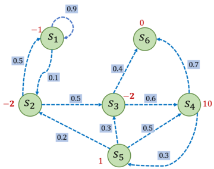
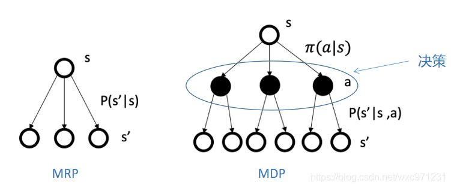
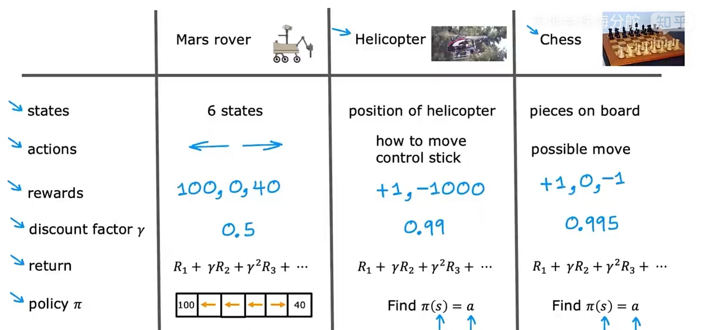
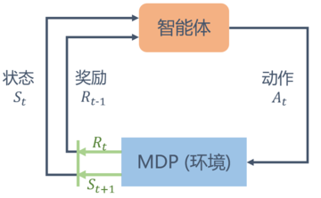
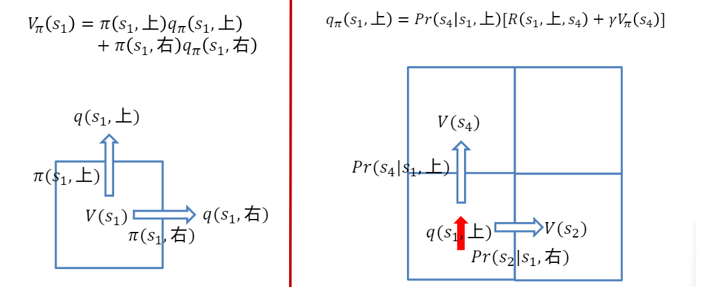
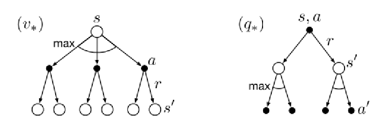
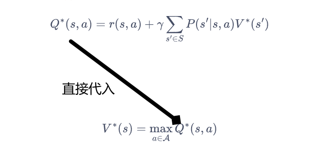
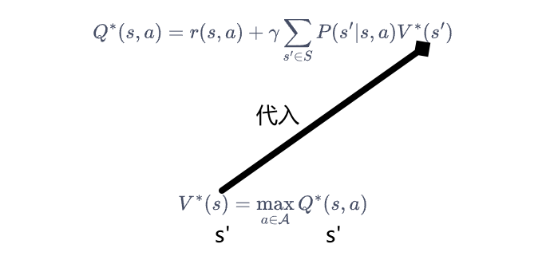

<!--
 * @version:
 * @Author:  StevenJokess（蔡舒起） https://github.com/StevenJokess
 * @Date: 2023-02-23 18:51:31
 * @LastEditors:  StevenJokess（蔡舒起） https://github.com/StevenJokess
 * @LastEditTime: 2023-09-14 02:59:00
 * @Description:
 * @Help me: make friends by a867907127@gmail.com and help me get some “foreign” things or service I need in life; 如有帮助，请赞助，失业3年了。
 * @TODO::
 * @Reference:
-->

# 马尔可夫决策过程

## 简介

**马尔可夫决策过程**（Markov decision process，MDP）是强化学习的重要概念。要学好强化学习，我们首先要掌握马尔可夫决策过程的基础知识。前两章所说的强化学习中的环境一般就是一个马尔可夫决策过程。与多臂老虎机问题不同，马尔可夫决策过程包含状态信息以及状态之间的转移机制。如果要用强化学习去解决一个实际问题，第一步要做的事情就是把这个实际问题*抽象为一个马尔可夫决策过程*，所以我们首先要去明确马尔可夫决策过程的各个组成要素。本章将从马尔可夫过程出发，一步一步地进行介绍，最后引出马尔可夫决策过程。[1]

## 马尔可夫过程

### 随机过程

**随机过程**（stochastic process）是概率论的“动力学”部分。概率论的研究对象是静态的随机现象，而随机过程的研究对象是随时间演变的随机现象（例如天气随时间的变化、城市交通随时间的变化）。在随机过程中，随机现象在某时刻 $t$ 的取值是一个向量随机变量 ，用 $S_t$ 表示，所有可能的状态组成状态集合。随机现象便是状态的变化过程。在某时刻的状态通常取决于时刻之前的状态。我们将已知历史信息 $(S_1, \dots ,S_t)$ 时下一个时刻状态为的概率表示成 $P\left[S_{t+1} \mid S_1, \dots ,S_t \right]$。

### 马尔可夫性质

当且仅当某时刻的状态只取决于上一时刻的状态时，一个随机过程被称为具有**马尔可夫性质**（Markov property），用公式表示为 $P\left[S_{t+1} \mid S_{t}\right]=P\left[S_{t+1} \mid S_{1}, \ldots, S_{t}\right]$ 。也就是说，当前状态是未来的充分统计量，即下一个状态只取决于当前状态，而不会受到过去状态的影响。需要明确的是，具有马尔可夫性并不代表这个随机过程就和历史完全没有关系。因为虽然时刻的状态只与时刻的状态有关，但是时刻的状态其实包含了 $t-1$ 时刻的状态的信息，通过这种链式的关系，历史的信息被传递到了现在。马尔可夫性可以大大简化运算，因为只要当前状态可知，所有的历史信息都不再需要了，利用当前状态信息就可以决定未来。

> 问：如果数据流不满足马尔科夫性怎么办？应该如何处理?
> 答：如果不具备马尔可夫性，即下一个状态与之前的状态也有关，若仅用当前的状态来求解决策过程，势必导致决策的泛化能力变差。为了解决这个问题，可以利用循环神经网络(RNN)对历史信息建模，获得包含历史信息的状态表征，表征过程也可以使用注意力机制等手段，最后在表征状态空间求解马尔可夫决策过程问题。[2]
>
> 一些违背马尔可夫性的例子：
>
>1. 大气污染问题。大气污染的浓度受到许多因素的影响，如天气、地形、交通等等。这些因素不仅与当前状态有关，还与过去状态有关，因此大气污染问题是一个非马尔可夫过程。
>1. 股票价格变动问题。股票价格的变动不仅受到当前市场情况的影响，还受到过去的价格变动、公司的业绩等因素的影响，因此股票价格变动问题也是一个非马尔可夫过程。
>1. 自然语言处理问题。在自然语言处理中，词语的出现通常是依赖于前面的词语的，因此自然语言处理问题也是一个非马尔可夫过程。

### 马尔可夫过程

马尔可夫过程 (Markov process) 指具有马尔可夫性质的随机过程，也被称为**马尔可夫链** (Markov chain)，国内将其简称为马氏链 。

我们通常用二元组 $\langle\mathcal{S}, \mathcal{P}\rangle$ 描述一个马尔可夫过程，其中，

- $\mathcal{S}$ 是有限数量的状态的集合，
- $\mathcal{P}$ 是**状态转移矩阵** (state transition matrix)。假设一共有 $n$ 个状态， 此时 $\mathcal{S}=\left\{s_1, s_2, \ldots, s_n\right\}$ 。状态转移矩阵 $\mathcal{P}$ 定义了所有状态对之间的转移概率，即

$$
\mathcal{P}=\left[\begin{array}{ccc}
P\left(s_1 \mid s_1\right) & \cdots & P\left(s_n \mid s_1\right) \\
\vdots & \ddots & \vdots \\
P\left(s_1 \mid s_n\right) & \cdots & P\left(s_n \mid s_n\right)
\end{array}\right]
$$

矩阵 $\mathcal{P}$ 中第 $i$ 行第 $j$ 列元素 $P\left(s_j \mid s_i\right)=P\left(S_{t+1}=s_j \mid S_t=s_i\right)$ 表示从状态 $s_i$ 转移到 状态 $s_j$ 的概率，我们称 $P\left(s^{\prime} \mid s\right)$ 为状态转移函数。从某个状态出发，到达其他状 态的概率和必须为 1 ，即状态转移矩阵 $\mathcal{P}$ 的每一行的和为 1 。

图 3-1 是一个具有 6 个状态的马尔可夫过程的简单例子。其中每个绿色圆圈表 示一个状态，每个状态都有一定概率（包括概率为 0 ) 转移到其他状态，其中 $s_6$ 通常被称为**终止状态**（terminal state)，因为它不会再转移到其他状态，可以理解为它永远以概率 1 转移到自己。状态之间的虚线箭头表示状态的转移，箭头旁的数字表示该状态转移发生的概率。从每个状态出发转移到其他状态的概率总 和为 1 。例如， $s_1$ 有 $90 \%$ 概率保持不变，有 $10 \%$ 概率转移到 $s_2$ ，而在 $s_2$ 又有 $50 \%$ 概率回到 $s_1$ ，有 $50 \%$ 概率转移到 $s_3$ 。

我们可以写出这个马尔可夫过程的状态转移矩阵:

$$
\mathcal{P} = \left[\begin{array}{cccccc}
0.9 & 0.1 & 0 & 0 & 0 & 0 \\
0.5 & 0 & 0.5 & 0 & 0 & 0 \\
0 & 0 & 0 & 0.6 & 0 & 0.4 \\
0 & 0 & 0 & 0 & 0.3 & 0.7 \\
0 & 0.2 & 0.3 & 0.5 & 0 & 0 \\
0 & 0 & 0 & 0 & 0 & 1
\end{array}\right]
$$

其中第 $i$ 行 $j$ 列的值 $\mathcal{P}_{i, j}$ 则代表从状态 $s_i$ 转移到 $s_j$ 的概率。

给定一个马尔可夫过程，我们就可以从某个状态出发，根据它的状态转移矩阵生成一个状态**序列** (episode)，这个步骤也被叫做**采样**（sampling）。例如，从 $s_1$ 出发，可以生成序列 $s_1 \rightarrow s_2 \rightarrow s_3 \rightarrow s_6$ 或序列 $s_1 \rightarrow s_1 \rightarrow s_2 \rightarrow s_3 \rightarrow s_4 \rightarrow s_5 \rightarrow s_3 \rightarrow s_6$ 等。生成这些序列的概率和状态转移矩阵有关。

> 马尔科夫链与回合（Episode）的关系：
>
> 在回合制任务（有结束）中，将状态，动作，奖励直到状态结束的序列（sequence）命名为回合（Episode），即$(s_0, a_0. r_1, s_1, a_1, r_2, ..., s_T)$
> 在常见的强化学习问题中，一个Episode就是一条马尔科夫链。根据状态转移矩阵可以得到许多不同的Episode，也就是多条马尔科夫链。

### 马尔可夫奖励过程（MRP）

在马尔可夫过程的基础上加入奖励函数 $r$ 和折扣因子 $\gamma$ ，就可以得到马尔可夫奖励过程 (Markov reward process) 。一个马尔可夫奖励过程由 $\langle\mathcal{S}, \mathcal{P}, r, \gamma\rangle$ 构成，各个组成元素的含义如下所示。

- $\mathcal{S}$ 是有限状态的集合。
- $\mathcal{P}$ 是状态转移矩阵。
- $r$ 是奖励函数，某个状态 $s$ 的奖励 $r(s)$ 指转移到该状态时可以获得奖励的期望。
- $\gamma$ 是折扣因子 (discount factor)， $\gamma$ 的取值范围为 $[0,1]$ 。引入折扣因子的理由因为远期利益具有一定不确定性，有时我们更希望能够尽快获得一些奖励，所以我们需要对远期利益打一些折扣。接近 1 的 $\gamma$ 更关注长期的累计奖励，接近 0 的 $\gamma$ 更考虑短期奖励。

性质：

- 时间不变性（转移矩阵会趋于稳定、价值函数时间无关）
- 时间无关性（只依赖上一时刻状态）

### 回报  $G_t$ (Return)

在一个马尔可夫奖励过程中，从第 $t$ 时刻状态 $S_t$ 开始，直到终止状态时，所有奖励的衰减之和称为回报 $G_t$ (Return)，公式如下:

$$
G_t=R_t+\gamma R_{t+1}+\gamma^2 R_{t+2}+\cdots=\sum_{k=0}^{\infty} \gamma^k R_{t+k}
$$

其中， $R_t$ 表示在时刻 $t$ 获得的奖励。在图 3-2 中，我们继续沿用图 3-1 马尔可夫 过程的例子，并在其基础上添加奖励函数，构建成一个马尔可夫奖励过程。例如，进入状态 $s_2$ 可以得到奖励 $-2$ ，表明我们不希望进入 $s_2$ ，进入 $s_4$ 可以获得最 高的奖励 10 ，但是进入 $s_6$ 之后奖励为零，并且此时序列也终止了。

比如选取 $s_1$ 为起始状态，设置 $\gamma=0.5$ ，采样到一条状态序列为  $s_1 \rightarrow s_2 \rightarrow s_3 \rightarrow s_6$ ，就可以计算 $s_1$ 的回报 $G_1$ ，得到 $G_1=-1+0.5 \times(-2)+0.5^2 \times(-2)=-2.5 $。

接下来我们用代码表示图 3-2 中的马尔可夫奖励过程，并且定义计算回报的函数。

code

## 价值函数

在马尔可夫奖励过程中，一个状态的期望回报（即从这个状态出发的未来累积奖励的期望） 被称为这个状态的价值 (value)。所有状态的价值就组成了价值 函数 (value function)，价值函数的输入为某个状态，输出为这个状态的价 值。我们将价值函数写成 $V(s)=\mathbb{E}\left[G_t \mid S_t=s\right]$ ，展开为

$$
\begin{aligned}
V(s) & =\mathbb{E}\left[G_t \mid S_t=s\right] \\
& =\mathbb{E}\left[R_t+\gamma R_{t+1}+\gamma^2 R_{t+2}+\ldots \mid S_t=s\right] \\
& =\mathbb{E}\left[R_t+\gamma\left(R_{t+1}+\gamma R_{t+2}+\ldots\right) \mid S_t=s\right] \\
& =\mathbb{E}\left[R_t+\gamma G_{t+1} \mid S_t=s\right] \\
& =\mathbb{E}\left[R_t+\gamma V\left(S_{t+1}\right) \mid S_t=s\right]
\end{aligned}
$$

在上式的最后一个等号中，一方面，即时奖励的期望正是奖励函数的输出，即 $\mathbb{E}\left[R_t \mid S_t=s\right]=r(s)$ ；另一方面，等式中剩余部分 $\mathbb{E}\left[\gamma V\left(S_{t+1}\right) \mid S_t=s\right]$ 可以根据从状态 $s$ 出发的**转移概率**作为权重，来计算所有可能的下一状态 $s^{\prime}$ 对应的价值 $V\left(s^{\prime}\right)$ 的加权平均值，从而得到当前状态 $s$ 的价值 $V(s)$。

$$
V(s)=r(s)+\gamma \sum_{s^{\prime} \in S} p\left(s^{\prime} \mid s\right) V\left(s^{\prime}\right)
$$

上式就是马尔可夫奖励过程中非常有名的贝尔曼方程 (Bellman equation)，对每一个状态都成立。

> 状态价值函数的贝尔曼方程的具体推导[14]：
>
> $\begin{aligned} V(s) & =\mathbb{E}\left[G_t \mid S_t=s\right] \\ & =\mathbb{E}\left[R_{t+1}+\gamma R_{t+2}+\cdots \mid S_t=s\right] \\
> & =\mathbb{E}\left[R_{t+1} \mid S_t=s\right]+\gamma \mathbb{E}\left[R_{t+2}+\gamma R_{t+3}+\cdots \mid S_t=s\right] \\ & =\mathcal{R}_s+\gamma \mathbb{E}\left[G_{t+1} \mid S_t=s\right] \\ & =\mathcal{R}_s+\gamma \int g_{t+1} p\left(G_{t+1}=g_{t+1} \mid S_t=s\right) \mathrm{d} g_{t+1} \\
> & =r(s)+\gamma \int g_{t+1}\left(\int p\left(G_{t+1}=g_{t+1} \mid S_{t+1}=s^{\prime}, S_t=s\right) P\left(S_{t+1}=s^{\prime} \mid S_t=s\right) \mathrm{d} s^{\prime}\right) \mathrm{d} g_{t+1} \\
> & =r(s)+\gamma \int g_{t+1}\left(\int p\left(G_{t+1}=g_{t+1} \mid S_{t+1}=s^{\prime}\right) P\left(s^{\prime} \mid s, a\right) \mathrm{d} s^{\prime}\right) \mathrm{d} g_{t+1} \\
> & =r(s)+\gamma \int\left(\int g_{t+1} p\left(G_{t+1}=g_{t+1} \mid S_{t+1}=s^{\prime}\right) \mathrm{d} g_{t+1}\right) P\left(s^{\prime} \mid s, a\right) \mathrm{d} s^{\prime} \\
> & =r(s)+\gamma \int \mathbb{E}\left[G_{t+1} \mid S_{t+1}=s^{\prime}\right] P\left(s^{\prime} \mid s, a\right) \mathrm{d} s^{\prime} \\
> & =r(s)+\gamma \int V\left(s^{\prime}\right) P\left(s^{\prime} \mid s, a\right) \mathrm{d} s^{\prime} \\
> & =r(s)+\gamma \sum_{s^{\prime} \in \mathcal{S}} V\left(s^{\prime}\right) P\left(s^{\prime} \mid s, a\right) .
> \end{aligned}$
>

若一个马尔可夫奖励过程一共有 $|S| = n$ 个状态，即 $\mathcal{S}=\left\{s_1, s_2, \ldots, s_n\right\}$ 。并将所有状态的价值表示成一个列向量 $\mathcal{V}=\left[V\left(s_1\right), V\left(s_2\right), \ldots, V\left(s_n\right)\right]^T$ ，同理，将奖励函数写成一个列向量 $\mathcal{R} = \left[r\left(s_1\right), r\left(s_2\right), \ldots, r\left(s_n\right)\right]^T$ 。

于是我们可以将贝尔曼方程写成矩阵的形式:

$$
\begin{gathered}
\mathcal{V}=\mathcal{R}+\gamma \mathcal{P} \mathcal{V} \\
{\left[\begin{array}{c}
V\left(s_1\right) \\
V\left(s_2\right) \\
\ldots \\
V\left(s_n\right)
\end{array}\right]=\left[\begin{array}{c}
r\left(s_1\right) \\
r\left(s_2\right) \\
\ldots \\
r\left(s_n\right)
\end{array}\right]+\gamma\left[\begin{array}{cccc}
P\left(s_1 \mid s_1\right) & p\left(s_2 \mid s_1\right) & \ldots & P\left(s_n \mid s_1\right) \\
P\left(s_1 \mid s_2\right) & P\left(s_2 \mid s_2\right) & \ldots & P\left(s_n \mid s_2\right) \\
\ldots & & & \\
P\left(s_1 \mid s_n\right) & P\left(s_2 \mid s_n\right) & \ldots & P\left(s_n \mid s_n\right)
\end{array}\right]\left[\begin{array}{c}
V\left(s_1\right) \\
V\left(s_2\right) \\
\ldots \\
V\left(s_n\right)
\end{array}\right]}
\end{gathered}
$$

我们可以直接根据矩阵运算求解，得到以下解析解:

$$
\begin{aligned}
\mathcal{V} & =\mathcal{R}+\gamma \mathcal{P} \mathcal{V} \\
(I-\gamma \mathcal{P}) \mathcal{V} & =\mathcal{R} \\
\mathcal{V} & =(I-\gamma \mathcal{P})^{-1} \mathcal{R}
\end{aligned}
$$

以上解析解的计算复杂度是 $O(n^{3})$ ，其中 $n$ 是状态个数，因此这种方法只适用很小的马尔可夫奖励过程。求解较大规模的马尔可夫奖励过程中的价值函数时，可以使用**动态规划**（dynamic programming）算法、**蒙特卡洛方法**（Monte-Carlo method）和**时序差分**（temporal difference），这些方法将在之后的章节介绍。

接下来编写代码来实现求解价值函数的解析解方法，并据此计算该马尔可夫奖励过程中所有状态的价值。

code

根据以上代码，求解得到各个状态的价值 $V(s)$ ，具体如下:

$$
\left[\begin{array}{l}
V\left(s_1\right) \\
V\left(s_2\right) \\
V\left(s_3\right) \\
V\left(s_4\right) \\
V\left(s_5\right) \\
V\left(s_6\right)
\end{array}\right]=\left[\begin{array}{c}
-2.02 \\
-2.21 \\
1.16 \\
10.54 \\
3.59 \\
0
\end{array}\right]
$$

我们现在用贝尔曼方程来进行简单的验证。例如，对于状态 $s_4$ 来说，当 $\gamma=0.5$ 时，有

$$
\begin{aligned}
V\left(s_4\right) & =r\left(s_4\right)+\gamma \sum_{s^{\prime} \in \mathcal{S}} P\left(s^{\prime} \mid s_4\right) V\left(s^{\prime}\right) \\
10.54 & =10+0.5 \times(0.7 \times 0+0.3 \times 3.59)
\end{aligned}
$$

可以发现左右两边的值几乎是相等的，说明我们求解得到的价值函数是满足状态为时的贝尔曼方程。读者可以自行验证在其他状态时贝尔曼方程是否也成立。若贝尔曼方程对于所有状态都成立，就可以说明我们求解得到的价值函数是正确的。除了使用动态规划算法，马尔可夫奖励过程中的价值函数也可以通过蒙特卡洛方法估计得到，我们将在 3.5 节中介绍该方法。

## 马尔可夫决策过程

3.2 节和 3.3 节讨论到的马尔可夫过程和马尔可夫奖励过程都是自发改变的随机过程；而如果有一个外界（对于该随机过程来说，智能体才是外界）的“刺激”来共同改变这个随机过程，就有了**马尔可夫决策过程**（Markov decision process，MDP）。我们将这个来自外界的刺激称为智能体（agent）的动作，在马尔可夫奖励过程（MRP）的基础上加入动作，就得到了马尔可夫决策过程（MDP）。

马尔可夫决策过程由 $\langle\mathcal{S}, \mathcal{P}, \mathcal{A}, r, \gamma\rangle$ 构成，其中

- $\mathcal{S}$ 是有限状态的集合。
- $\mathcal{P}$ 是状态转移矩阵。
- $\mathcal{A}$ 是所有动作的集合。
- $r$ 是奖励函数，某个状态 $s$ 的奖励 $r(s)$ 指转移到该状态时可以获得奖励的期望。
- $\gamma$ 是折扣因子 (discount factor)， $\gamma$ 的取值范围为 $[0,1)$ 。引入折扣因子的理由因为远期利益具有一定不确定性，有时我们更希望能够尽快获得一些奖励，所以我们需要对远期利益打一些折扣。接近 1 的 $\gamma$ 更关注长期的累计奖励，接近 0 的 $\gamma$ 更考虑短期奖励。
> 有的没有$\gamma$，而是$\rho_0$，它是开始状态的分布。[6]

### MRP VS MDP

### MDP的几个例子

>更多分类：[3]
>
> |      |       不考虑动作  |      考虑动作     |
> | ---- | ---------------- | ---------------- |
> | 状态完全可见 | 马尔科夫链(MC)| 马尔可夫决策过程(MDP) --当给定策略$\pi$即退化为[4]-->马尔可夫奖励过程（MRP） |
> | 状态不完全可见 | 隐马尔可夫模型(HMM)  | 部分可观察马尔可夫决策过程(POMDP)  |

我们发现 MDP 与 MRP 非常相像，主要区别为 MDP 中的状态转移函数和奖励函数都比 MRP 多了动作作为自变量。注意，在上面 MDP 的定义中，我们不再使用类似 MRP 定义中的状态转移矩阵方式，而是直接表示成了状态转移函数。这样做一是因为此时状态转移与动作也有关，变成了一个三维数组，而不再是一个矩阵（二维数组）；二是因为状态转移函数更具有一般意义，例如，如果状态集合不是有限的，就无法用数组表示，但仍然可以用状态转移函数表示。我们在之后的课程学习中会遇到连续状态的 MDP 环境，那时状态集合都不是有限的。现在我们主要关注于离散状态的 MDP 环境，此时状态集合是有限的。

不同于马尔可夫奖励过程，在马尔可夫决策过程中，通常存在一个智能体来执行动作。例如，一艘小船在大海中随着水流自由飘荡的过程就是一个马尔可夫奖励过程，它如果凭借运气漂到了一个目的地，就能获得比较大的奖励；如果有个水手在控制着这条船往哪个方向前进，就可以主动选择前往目的地获得比较大的奖励。马尔可夫决策过程是一个与时间相关的不断进行的过程，在智能体和环境 MDP 之间存在一个不断交互的过程。一般而言，它们之间的交互是如图 3-3 循环过程：智能体根据当前状态选择动作；对于状态和动作，MDP 根据奖励函数和状态转移函数得到和并反馈给智能体。智能体的目标是最大化得到的累计奖励。智能体根据当前状态从动作的集合中选择一个动作的函数，被称为**策略**。

### 策略

智能体的**策略**（Policy）通常用字母 $\pi$ 表示。策略是一个函数，表示在输入状态 $s$ 情况下采取动作 $a$ 的概率。当一个策略是**确定性策略**（deterministic policy）时，它在每个状态时只输出一个确定性的动作，即只有该动作的概率为 1，其他动作的概率为 0；当一个策略是**随机性策略**（stochastic policy）时，它在每个状态时输出的是关于动作的概率分布，然后根据该分布进行采样就可以得到一个动作。在 MDP 中，由于马尔可夫性质的存在，策略只需要与当前状态有关，不需要考虑历史状态。回顾一下在 MRP 中的价值函数，在 MDP 中也同样可以定义类似的价值函数。但此时的价值函数与策略有关，这意为着对于两个不同的策略来说，它们在同一个状态下的价值也很可能是不同的。这很好理解，因为不同的策略会采取不同的动作，从而之后会遇到不同的状态，以及获得不同的奖励，所以它们的累积奖励的期望也就不同，即状态价值不同。

### 状态价值函数

我们用 $V_\pi(s)$ 表示在 MDP 中基于策略 $\pi$ 的状态价值函数 (state-value function），定义为从状态 $s$ 出发遵循策略 $\pi$ 能获得的期望回报，数学表达为:

$$
V_\pi(s)=\mathbb{E}_\pi\left[G_t \mid S_t=s\right]
$$

### 动作价值函数

不同于 MRP，在 MDP 中，由于动作的存在，我们额外定义一个**动作价值函数** (action-value function)。我们用 $Q_\pi(s, a)$ 表示在 MDP 遵循策略 $\pi$ 时，对当前 状态 $s$ 执行动作 $a$ 得到的期望回报：

$$
Q_\pi(s, a)=\mathbb{E}_\pi\left[G_t \mid S_t=s, A_t=a\right]
$$

### 状态价值函数和动作价值函数之间的关系

在使用策略 $\pi$ 中，状态 $s$ 的价值等于在该状态下基于策略 $\pi$ 采取所有动作的概率与相应的价值相乘再求和的结果:

$$
V_\pi(s)=\sum_{a \in A} \pi(a \mid s) Q^\pi(s, a)
$$

使用策略 $\pi$ 时，状态 $s$ 下采取动作 $a$ 的价值等于即时奖励加上经过衰减后的所有可能的下一个状态的状态转移概率与相应的价值的乘积:

$$
Q_\pi(s, a)=\sum_{s^{\prime} \in S} \operatorname{P}\left(s^{\prime} \mid s, a\right)\left[R\left(s, a, s^{\prime}\right)+\gamma V_\pi\left(s^{\prime}\right)\right]$$

下面以状态$s_1$的计算为例 [8]：

### 贝尔曼期望方程

贝尔曼方程描述了价值函数或动作-价值函数的递推关系，是研究强化学习问题的重要手段。在贝尔曼方程中加上“期望”二字是为了与接下来的贝尔曼最优方程进行区分。我们通过**简单推导**（见最后）就可以分别得到两个价值函数的贝尔曼期望方程（Bellman Expectation Equation）：

- **基于状态价值函数的贝尔曼期望方程**：它描述了当前状态价值函数和其后续状态价值函数之间的关系，即当前状态价值函数等于瞬时奖励的期望加上后续状态的（折扣）价值函数的期望。

$$
V_\pi(s)=\mathbb{E}_{a \sim \pi(s, \cdot)} \mathbb{E}_{s^{\prime} \sim P(\cdot \mid s, a)}\left[R\left(s, a, s^{\prime}\right)+\gamma V_\pi\left(s^{\prime}\right)\right]
$$

- **基于状态-动作价值函数的贝尔曼期望方程**：描述了当前动作-价值函数和其后续动作-价值函数之间的关系，即当前状态下的动作-价值函数等于瞬时奖励的期望加上后续状态的（折扣）动作-价值函数的期望。[8]

$$
Q_\pi(s, a)=\mathbb{E}_{s^{\prime} \sim P(\cdot \mid s, a)}\left[R\left(s, a, s^{\prime}\right)+\gamma \mathbb{E}_{a^{\prime} \sim \pi\left(s^{\prime}, \cdot \right)}\left[Q_\pi\left(s^{\prime}, a^{\prime}\right)\right]\right]
$$

价值函数和贝尔曼方程是强化学习非常重要的组成部分，之后的一些强化学习算法都是据此推导出来的，读者需要明确掌握！

### MDP的例子

图 3-4 是一个马尔可夫决策过程的简单例子，其中每个深色圆圈代表一个状态，一共有从 $s_1～s_5$ 这 5 个状态。黑色实线箭头代表可以采取的动作，浅色小圆圈代表动作，需要注意，并非在每个状态都能采取所有动作，例如在状态，智能体只能采取“保持”和“前往”这两个动作，无法采取其他动作。

每个浅色小圆圈旁的数字代表在某个状态下采取某个动作能获得的奖励。虚线箭头代表采取动作后可能转移到的状态，箭头边上的数字代表转移概率，如果没有数字则表示转移概率为 1。例如，在 $s_2$ 下， 如果采取动作“前往 $s_3$”，就能得到奖励-2，并且转移到$s_3$；在下，如果采取“概率前往”，就能得到奖励 1，并且会分别以概率 0.2, 0.4, 0.4 转移到 $s_2$, $s_3$ 或 $s_4$。

### MDP的代码

code

接下来我们想要计算该 MDP 下，一个策略 $\pi$ 的状态价值函数。我们现在有的工 具是 MRP 的解析解方法。于是，一个很自然的想法是：给定一个 MDP 和一个 策略 $\pi$ ，我们是否可以将其转化为一个 MRP? 答案是肯定的。我们可以将策略的 动作选择进行**边缘化** (marginalization)，就可以得到没有动作的 MRP 了。具体 来说，对于某一个状态，我们根据策略所有动作的概率进行加权，得到的奖励和 就可以认为是一个 MRP 在该状态下的奖励，即：

$$
r^{\prime}(s)=\sum_{a \in \mathcal{A}} \pi(a \mid s) r(s, a)
$$

同理，我们计算采取动作的概率与使 $s$ 转移到 $s^{\prime}$ 的概率的乘积，再将这些乘积相 加，其和就是一个 MRP 的状态从 $s$ 转移至 $s^{\prime}$ 的概率：

$$
P^{\prime}\left(s^{\prime} \mid s\right)=\sum_{a \in \mathcal{A}} \pi(a \mid s) P\left(s^{\prime} \mid s, a\right)
$$

于是，我们构建得到了一个 MRP: $\left\langle\mathcal{S}, P^{\prime}, r^{\prime}, \gamma\right\rangle$ 。根据价值函数的定义可以发现，转化前的 MDP 的状态价值函数和转化后的 MRP 的价值函数是一样的。于 是我们可以用 MRP 中计算价值函数的解析解来计算这个 MDP 中该策略的状态价值函数。

我们接下来就编写代码来实现该方法，计算用随机策略（也就是代码中的`Pi_1`）时的状态价值函数。为了简单起见，我们直接给出转化后的 MRP 的状态转移矩阵和奖励函数，感兴趣的读者可以自行验证。

code

知道了状态价值函数 $V^\pi(s)$ 后，我们可以计算动作价值函数 $Q^\pi(s, a)$ 。例如 $\left(s_4\right.$，概率前往) 的动作价值为 2.152 ，根据以下公式可以计算得到：

$$
Q^\pi(s, a)=r(s, a)+\gamma \sum_{s^{\prime} \in \mathcal{S}} P\left(s^{\prime} \mid s, a\right) V_\pi\left(s^{\prime}\right) 2.152=1+0.5 \times[0.2 \times(-1.68)+0.4 \times 0.52+0.4 \times 6.08]
$$

这个 MRP 解析解的方法在**状态动作集合比较大**的时候不是很适用，那有没有其他的方法呢？第 4 章将介绍用蒙特卡洛方法来近似估计这个价值函数，用蒙特卡洛方法的好处在于我们不需要知道 MDP 的状态转移函数和奖励函数，它可以得到一个近似值，并且采样数越多越准确。第 5 章将介绍用动态规划算法来计算得到价值函数。

### 最优策略

强化学习的目标通常是找到一个策略，使得智能体从初始状态出发能获得最多的期望回报。我们首先定义策略之间的偏序关系：当且仅当对于任意的状态都有 ，记。于是在有限状态和动作集合的 MDP 中，至少存在一个策略比其他所有策略都好或者至少存在一个策略不差于其他所有策略，这个策略就是*最优策略*（optimal policy）。最优策略可能有很多个，我们都将其表示为$\pi^*(s)$。所有的最优策略有相同的最优价值函数；所有的最优策略具有相同的行为价值函数。[10]

- **最优状态价值函数**：最优策略所对应的状态价值函数，其用公式表示为，$$V^*(s)=\max _\pi V^\pi(s), \quad \forall s \in \mathcal{S}$$
- **最优动作价值函数**：最优策略所对应的动作价值函数，其用公式表示为，$$Q^*(s, a)=\max _\pi Q^\pi(s, a), \quad \forall s \in \mathcal{S}, a \in \mathcal{A}$$

**二者关系**：

- 最优状态价值函数 -> 最优动作价值函数：为了使 $Q^\pi(s, a)$ 最大，我们需要在当前的状态动作对 $(s, a)$ 之后的 $s^{\prime}$ 都执行最优策略。于是我们得到了最优状态价值函数和最优动作价值函数之间的关系:

$$
\begin{aligned}
Q^*(s, a) &= \mathbb{E}[r + \gamma V^(s')] \\
&= \sum_{s',r}p(s',r|s,a)[r+\gamma V^*(s')] \\
&= r(s, a)+\gamma \sum_{s^{\prime} \in S} P\left(s^{\prime} \mid s, a\right) V^*\left(s^{\prime}\right)
\end{aligned}
$$

  - 这与在普通策略下的状态价值函数和动作价值函数之间的关系是一样的。
- 最优动作价值函数 -> 最优状态价值函数：最优状态价值是选择此时使最优动作价值最大的那一个动作时的状态价值: $$V^*(s)=\max _{a \in \mathcal{A}} Q^*(s, a)$$

### 贝尔曼最优方程

根据 $V^*(s)$ 和 $Q^*(s, a)$ 的关系，我们可以得到**贝尔曼最优方程** (Bellman optimality equation) :

- 最佳价值函数 (optimal value function) $V^*$：$$V^*(s) =  \max_{a \in \mathcal{A}}\left\{r(s, a)+\gamma \sum_{s^{\prime} \in \mathcal{S}} P\left(s^{\prime} \mid s, a\right) V^*\left(s^{\prime}\right)\right\} $$
- 最佳策略 (optimal policy) $\pi^*$：$$Q^*(s, a) = r(s, a)+\gamma \sum_{s^{\prime} \in \mathcal{S}} P\left(s^{\prime} \mid s, a\right) \max_{a^{\prime} \in \mathcal{A}} Q^*\left(s^{\prime}, a^{\prime}\right)$$

> 你应该知道[13]
> “贝尔曼备份”（Bellman backup）一词在 RL 文献中经常出现。状态或状态-动作对的 Bellman 备份是 Bellman 等式的右侧：奖励加下一个值（ reward-plus-next-value）。

下图表示了 $V^*$ 和 $\pi^*$ 的 Bellman 最优方程中考虑的未来状态和可选的动作范围[5]：

> 推导：
> 
> 

目标是最优策略：

- 一旦了解了$V^*$，就相对容易找到最优策略。所有有非零概率*到达*$V^*$状态的策略，都被认为是最优策略，或称为 greedy 策略。了解$V^*$信息后，在任意状态，agent 还需做一步单步搜索，对于*将*在贝尔曼最优方程中获得*最大价值的一个或多个动作*，任何仅为这些操作分配非零概率的策略都是最优策略。
- 如果了解 $\pi^*$ 的全部信息，则更容易寻找最优策略，agent 在每个状态，只需寻找该状态下所有状态动作价值中最大的一个即可，按照该动作指示，可得到每步应该采取的动作集。[5]
- 总结也就是说有了 $V^*$ 之后，还需要做单步搜索，但是有了 $\pi^*$ 后，就不需要了。

贝尔曼最优方程其实阐述了一个事实：最优策略下各个状态的价值一定等于这个状态下最优动作的期望回报。

贝尔曼最优性原理可以看作是强化学习中的一个基本假设，它认为在最优策略下，智能体所采取的每个动作都是最优的，并且对应的状态价值函数也是最优的。

> **问**：最佳价值函数(optimal value function) $V^*$ 和最佳策略 (optimal policy) $\pi^*$ 为什么等价呢?
> **答**：最佳价值函数的定义为: $V^*(s)=\max _\pi V^\pi(s)$ ，即我们去搜索一种策略 $\pi$ 来让每个状态的价值最大。 $V^*$ 就是到达每一个状态，它的值的极大化情况。在这种极大化情况上面，我们得到的策略就可以说它是最佳策略 (optimal policy)，即 $\pi^*(s)=\arg \max V^\pi(s)$ 。最佳策略使得每个状态的最佳策略使得每个状态的价值函数都取得最大值。所以如果我们可以得到一个最佳价值函数，就可以说某一个马尔科夫决策过程的环境被解。在这种情况下，它的最佳的价值函数是一致的，即其达到的上限的值是一致的，但这里可能有多个最佳策略对应于相同的最佳价值。

对于有限的MDP， $V_{*}$ 的贝尔曼最优方程具有唯一解。贝尔曼最优方程实际上是一个方程组，每个状态一个方程，所以如果有 n 个状态, 则有 n 个未知数的 n 个方程。 如果环境的动态 p 是已知，则原则上可以使用解决非线性方程组的各种方法中的任何一种来求解该 $v_{*}$ 的方程组。 同样, 可以求解 $q_{*}$ 的一组相关方程。

显示地求解贝尔曼最优方程提供了求解最优策略的一条途径，从而为解决强化学习问题提供了依据。 但是, 这个解决方案很少直接有用。它类似于穷举搜索，展望所有可能性,计算每种可能性出现的概率及其期望收益。这个解决方案依赖于至少三个假设，在实践中很少是这样的:

- 我们准确地知道环境的动态特性；
- 我们有足够的计算资源来完成解决方案的计算；
- 马尔可夫性。

对于我们感兴趣的任务，通常不能完全满足这三个条件。 例如，虽然第一和第三个假设对于西洋双陆棋游戏没有任何问题, 但第二个是主要的障碍。 因为游戏有 $10^{20}$ 个状态, 所以今天最快的电脑需要数千年的时间才能计算出 $v_{*}$ 的贝尔曼方程式, 而找到 $q_{*}$ 也是如此。在强化学习中，我们通常只能用近似解法来解决这类问题。

由于贝尔曼最优方程是非线性的，他不能像贝尔曼方程一样有闭式解（虽然计算复杂度很高）[7]，但还可以用动态规划、蒙特卡洛、时间差分等方法求解。[2]  第 5 章将介绍如何用动态规划算法得到最优策略。

## 总结

本章从零开始介绍了马尔可夫决策过程的基础概念知识，并讲解了如何通过求解贝尔曼方程得到状态价值的解析解以及如何用蒙特卡洛方法估计各个状态的价值。马尔可夫决策过程是强化学习中的基础概念，强化学习中的环境就是一个马尔可夫决策过程。我们接下来将要介绍的强化学习算法通常都是在求解马尔可夫决策过程中的最优策略。

[1]: https://hrl.boyuai.com/chapter/1/%E9%A9%AC%E5%B0%94%E5%8F%AF%E5%A4%AB%E5%86%B3%E7%AD%96%E8%BF%87%E7%A8%8B
[2]: https://www.cnblogs.com/kailugaji/p/16140474.html
[3]: https://www.cnblogs.com/kailugaji/p/15354491.html#_lab2_0_7
[4]: http://www.c-s-a.org.cn/html/2020/12/7701.html#outline_anchor_19
[5]: http://www.icdai.org/ibbb/2019/ID-0004.pdf
[6]: https://spinningup.readthedocs.io/zh_CN/latest/spinningup/rl_intro.html
[7]: http://huangc.top/2018/05/03/RL-2018/
[8]: https://aistudio.baidu.com/aistudio/education/preview/3103363
[9]: https://blog.51cto.com/u_15762365/5711481
[10]: https://www.bilibili.com/video/BV1UT411a7d6?p=33&vd_source=bca0a3605754a98491958094024e5fe3
[11]: https://www.zhihu.com/people/guoxiansia/posts?page=3
[12]: https://zhuanlan.zhihu.com/p/361399817
[13]: https://spinningup.openai.com/en/latest/spinningup/rl_intro.html#policies
[14]: https://www.tuananhle.co.uk/notes/bellman.html
