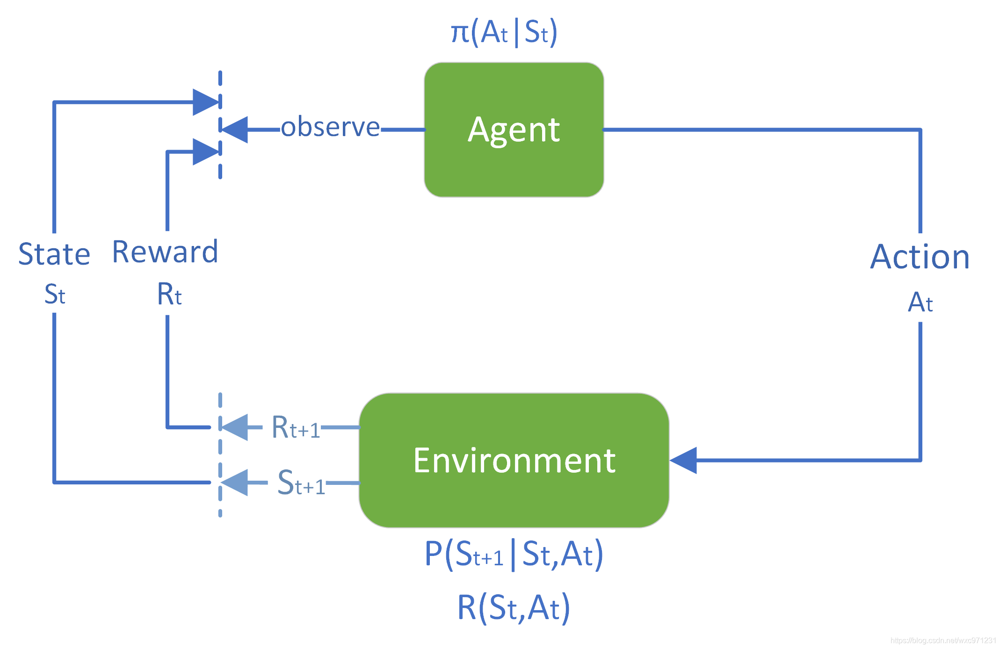
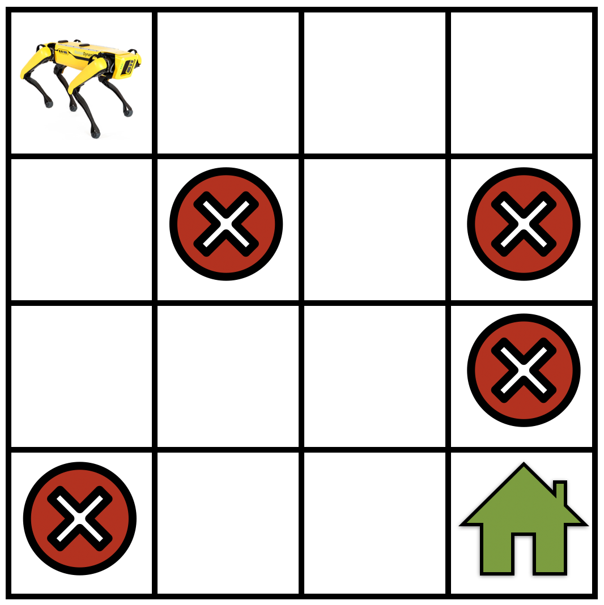

<!--
 * @version:
 * @Author:  StevenJokess（蔡舒起） https://github.com/StevenJokess
 * @Date: 2023-02-22 16:18:59
 * @LastEditors:  StevenJokess（蔡舒起） https://github.com/StevenJokess
 * @LastEditTime: 2023-10-20 21:53:30
 * @Description:
 * @Help me: make friends by a867907127@gmail.com and help me get some “foreign” things or service I need in life; 如有帮助，请资助，失业3年了。
 * @TODO::
 * @Reference:
-->

# 强化学习

## 背景导入（Background）

2018年的围棋AlphaGo战胜李世石使RL（强化学习）大为闻名，证明了这种强化模型能有超人类的表现，故我们才关注它。对于下围棋这一任务，即使是专家也很难给出“正确”的动作，二是获取大量数据的成本往往比较高。对于下棋强化学习我们很难知道每一步的“正确”动作，但是其最后的结果（即赢输）却很容易判断。因此，如果可以通过大量的模拟数据，通过最后的结果（奖励）来倒推每一步棋的好坏，从而学习出“最佳”的下棋策略，这就是强化学习。

这种在复杂、不确定的环境中交互时不断做出选择（sequential decision making）边学习的行为，我们其实早就在进行了。当一个婴儿玩耍，挥动手臂或环顾四周时，他没有明确的老师，但他确实通过直接的感觉与环境联系。他可以通过这种联系获得大量关于因果关系、动作的结果以及如何实现目标的信息。 在我们的生活中，这种交互无疑是环境和自身知识的主要来源。无论我们是学习驾驶汽车还是进行交谈，我们都敏锐地意识到我们的环境如何响应我们的行为，并且我们试图通过我们的行为来影响所发生的事情。

## 强化学习的概念（Concept）

**强化学习**（Reinforcement Learning，简称RL），也叫增强学习、再励学习、评价学习，是指一类**智能体**从与环境交互中不断学习以取得最大回报（Return）的问题以及解决这类问题的方法。可见，其是一门决策学科，而且解决的是序贯决策（Sequential Decision）问题。[81]

强化学习问题可以描述为一个智能体（Agent）从与环境（Environment）的不断交互，每次交互包括观察（Observate）当前的环境状态（State）、根据这个状态选择某个动作（Action）、并由此获得奖励（Award）或收益（Reward），我们把惩罚（punishment/penalty）处理成负收益形式，通过多次交互，智能体学习到了如何使得总体收益（Return）最大化。其中，强化是增加行为的意思，即当某个行为在从环境中获得正奖励后就会倾向去增加这种行为。[1]

可见强化学习主要基于这样的”奖励假设”：所有问题解决的目标都可以被描述成最大化累积奖励。[86]

## 强化学习的历史（History）

- 1950-1960：康奈尔大学的康奈尔Aeronautical Laboratory (CAL) 开展了早期的多智能体强化学习研究，研究目标是训练机器人进行学习和决策。
- 1970-1980：学习理论的发展奠定了强化学习的基础。Richard Sutton(他是大名鼎鼎的强化学习奠基人) 和Christopher Watkins等人提出了自适应动态规划（Adaptive Dynamic Programming）和Q-learning等基本方法。
- 1990-2000：Christopher Watkins提出了基于差分学习的Q-learning算法，这被认为是现代强化学习的重要里程碑。Ronald J. Williams引入了基于梯度的强化学习算法，即策略梯度方法，这为后来的进一步发展奠定了基础。
- 2010-2020：通过深度神经网络的引入，强化学习得到了重大的推动和突破。Deep Q-Network (DQN) 是由DeepMind提出的一种结合深度神经网络和Q-learning的算法，首次实现了在Atari游戏中超越人类水平的表现。Deep Deterministic Policy Gradient (DDPG)、Proximal Policy Optimization (PPO)、A3C (Asynchronous Advantage Actor-Critic)
- 2020至今：深度强化学习继续得到广泛关注和研究。研究者们致力于解决深度强化学习中的一些挑战，如样本效率、探索与利用的平衡、通用性和可解释性等问题。在这一时期，强化学习也在现实世界中的应用领域取得了显着的进展，包括机器人控制、自动驾驶、资源管理、游戏智能等。[56]
- 2022年重要进展：ChatGPT一个你必须体验的智能AI机器人、MIT强化学习新算法EIPO、FinRL生态系统，一种使用强化学习进行自动化交易的实践，文章登顶NeurIPS 2022得到众多研究者关注、DeepMind成功使用"深度强化学习"技术完美控制"核聚变反应堆"！[12]

关于强化学习的更多相关历史，可见[2]

## 强化学习的基本框架

上图形式化的描述了强化学习的框架，智能体 (Agent) 与环境 (Environment) 交互的过程: 在 $t$ 时刻，智能体在当前状态 $S_t$ 采取动作 $A_t$ 。在下一时刻 $t+1$ ，智能体接收到环境反馈的对于动作 $A_t$ 的奖励 $R_{t+1}$ ， 以及该时刻状态 $S_{t+1}$ 。从而，MDP和智能体共同给出一个轨迹[52]，所谓轨迹可类比于上面从原点到终点（当步有限时，才有终点；步无限，就是一直走下去）的一条路径[65]：

$$
S_0, A_0, R_1, S_1, A_1, R_2, S_2, A_2, R_3, S_3, A_3, \ldots
$$

特定的一条轨迹：$\tau=\left(s_0, a_0, r_1, s_1, a_1, r_2, s_2, a_2, r_3, \ldots\right)$

> 强化学习（RL）和规划（Planning）的不同：
> - 强化学习看到的世界是一个黑箱子，状态如何转移、边的权制是多少、甚至有哪些状态都需要自己探索、发现。最后输出的是模型（任意一个状态，该如何决策。任一节点都能告诉我从这个节点到目标去应该怎么走。）
> - 对于规划而言，这个世界却是很清楚的。比如我们的最短路径，所有的节点、便点、权重点都是已知的。最后输出的是单一路径解。[83]

## 强化学习的相关应用

- 股市预测：首先，这是一个序列决策，要做出很多的决策，每做一个决策动作都要看当前的股市的状态如何，动作可以是买、卖，和观望。然后它是RL问题，因为决策改变了环境。在股市交易时，**成交的那一刻会决定股价是多少**，这相当于**决策改变了环境**。有时可能很少的交易，也会引起其他投资人对股市的预期，从而影响股市的走势。
- 商品推荐：推荐系统会在网页上放置推荐展品，而用户的购买行为和推荐行为是有关系的。对于推荐的展品，即使比较普通也可以收到很多客户浏览，而优秀的商品如果没有被推荐出来则可能无人问津。总的来说，决策会影响整个系统。
- 自然语言处理：把一个句子输出的词或知识库里面的操作，作为强化学习的动作，这样通过强化学习一些方法的可微分性纳入整个可微分学习系统中来。

## 算法间的比较

### 决策相关的其他算法

- **规则类算法**（Rule-Based） : 通过人类知识设计行为规则，无需trial-error试错而是直接根据设定的规则做决策。规则类算法关注如何设计在不同情况下的行为模式。规则类算法需要人为根据经验设计策略并且需要涵盖大部分可能的情况（状态states）。该方法不需要搜索和学习的过程因此推断速度快，但需要大量的人类经验并且无法知识转移。
- **启发式算法**（Heuristic Search） : 启发式（搜索）算法通过使用启发函数来估计当前状态到目标状态的距离并相对应的移动目前的搜索方向来提升搜索效率。启发式算法致力于相比传统方法更加快速高效地提供一个可行解（非最优）。启发式算法通过设计启发函数来指导智能体的探索，并通过不断的探索来学习策略。现阶段，启发式算法以仿自然体算法为主，主要有蚁群算法、模拟退火法、神经网络等。[36]

### 强化学习和机器学习相关算法的比较

#### 监督学习、无监督学习、强化学习之间的区别[3]

|      | 监督学习  | 无监督学习  | 强化学习 |
| ---- | ---------------- | ------------- | ------ |
| 朴素定义 |老师教一部分例子，包括正确答案，学生通过例子归纳出原理，再通过原理去举一反三，泛化推广以解决之前没有遇到的问题，即模仿学习 | 没有老师，学生通过自学摸索出原理，再通过原理解决问题 | 老师在学生做出某个动作之后，只反馈结果怎样，如打分，而不是去教学生该如何去做[47]的|
| 输入数据 | 一次性给定（即数据一旦给定，则一般不变，除了预处理时的数据augmentation[77]）的supervisor提供正确且严格的标签  | 没有标签  | 没有标签、supervisor，属于semi-supervised learning。在智能体与环境交互的过程中得到评价反馈，叫做奖励，其起到一点的指导作用，但是又不同于标签，因为它又不是最终的目的。这些反馈是时间序列数据（sequential data），这些序列性的数据，是跟其他机器学习最大的不同它们不断被收集，用来去自校正。[62]（即在线学习[66]） 如果智能体不采取某个决策动作，那么该动作对应的数据就永远无法被观测到，所以当前智能体的训练数据来自之前智能体的决策结果。|
| 输入要求 | 独立同分布(i.i.d.), 为了消除数据之间的相关性。    | 独立同分布(i.i.d.)   | 归一化的占用度量（occupancy measure）用于衡量在一个智能体决策与一个动态环境的交互过程中，采样到一个具体的状态动作对（state-action pair）的概率分布。|
| 动作 | exploitation | exploitation | Trial-and-error，即存在exploration和exploitation的平衡 (不一定按照已知的最优做法去做)|
| 驱动 | 任务驱动，模型是单纯被动地获得样本并被教育(instruct)[34] | 数据驱动  | Active learning，自驱的，有目标，从错误中学习[4]，这个错误是模型与目标的距离，通过奖励函数定量判断[5] |
| 过程中的反馈 | 开环[83]，数据到模型到预测，可时刻反馈出会比较预测与实际差，即loss，如果将loss看作reward的话，监督学习就是没有delayed reward[69]，也无法再进行干预，即迭代往往是单轮。[76]  | 无反馈 | 闭环[83]，，但可能无即时反馈，反馈是稀疏且延迟的奖励, 用结果的总reward用来判断这个行为是好是坏，不会明确告诉什么是正确的action（若强化信号r与Agent产生的动作A有明确的函数形式描述，可得到梯度信息r/A则可直接可以使用监督学习算法。正因为强化信号r与Agent产生的动作A没有明确的函数形式描述，所以Agent在可能动作空间中进行多轮搜索并发现正确的动作。[6]  |
| 输出的模型 | 建立新输入对应原标签的预测模型 | 自学习映射关系，以此为模型，来揭示发现的隐藏在未标记数据集合中的结构[82] | 学习到从环境状态到行为的映射即决策（决策往往会带来“后果”，因此决策者需要为未来负责，在未来的时间点做出进一步的决策。），使得智能体选择的该行为能够获得环境最大的奖励reward|
| 优化目标公式 | $\text {最优预测模型} =\arg \min _{\text {模型}} \mathbb{E}_{(\text {特征, 标签}) \sim \text {数据分布}}[\text {损失函数 (标签, 模型（特征）)]}$ | $p(\boldsymbol{x})$ 或带隐变量 $\boldsymbol{z}$ 的 $p(\boldsymbol{x} \mid \boldsymbol{z})$ [21]| $\text {最优策略} =\arg \max _{\text {策略}} \mathbb{E}_{(\text {状态, 动作}) \sim \text {策略的占用度量}}[\text {奖励函数 (状态, 动作)]}$|
| 解释损失函数 | 目的是使预测值和真实值之间的差距尽可能小 | 最小重构错误[21]| 目的是使总奖励的期望尽可能大|
| 任务 | 预测仅仅产生一个针对输入数据的信号，并期望它和未来可观测到的信号一致，这不会使未来情况发生任何改变。预测任务总是单轮的独立任务。| 基于数据结构的假设，去学习数据的分布模式[29] | 而决策往往会带来“后果”，因此决策者需要为未来负责，在未来的时间点做出进一步的决策。决策任务往往涉及多轮交互，即序贯决策[7]（sequential decision making）[78] |
| 环境被影响与否 | 假设模型不会影响环境[41]，如二级市场的散户 | 假设模型不会影响环境 | 假设模型的决策会影响环境，如二级市场的投资机构影响股价、Zillow影响房地产成交价、推荐算法改变用户兴趣点|
| 是否需要探索 | 只拟合，是被动学习，安于现状，好比当地不穿鞋就不推销，如重复推荐兴趣点；也可以做探索。比如试验设计 (Experimental Design)、贝叶斯优化 (Baysian Optimization) 研究的问题就是“在什么地方探索”| 不需要 | 会开发，是主动学习，会创新，好比不穿鞋就可开发潜在客户 |
| 只关注眼前与否 | 是，如人脸识别  | 是，如聚类  | 否，为了要最大化一段时间内的奖励，需要关注更加长远的性能。可以将奖励函数视为正确目标的一个稀疏、延迟形式。[79]如，象棋吃马，可能不利于赢这局棋；打车软件，“热”/“冷”目标，等待时间和收入不同，目标最大化总收入；挖掘兴趣点，是为了最大化用户总的观看时长 |
| 适用情况 | 图像分类、目标检测、语音识别、股价预测等 | 聚类、降维、关联规则挖掘 [8] | “多序列决策问题”，或者说是对应的模型未知，需要通过学习逐渐逼近真实模型的问题。并且当前的动作会影响环境的状态，即具有马尔可夫性的问题。同时应满足所有状态是可重复到达的条件，即满足**可学习条件**。 [5]如机器人运动控制（locomotion）[37] |
| 通俗理解 | 记忆任务，考试 |  找规律  | 频繁测验得分，但不给正确答案。更符合现实决策 |
| 上限（upper bound） | 传统的机器学习算法依赖人工标注好的数据，从中训练好的模型的性能上限是产生数据的模型（人类）的上限 | 可超人类 | 不受人类先验知识所限，表现可超人类 |
| 难点 | 标注数据的准备和标注、数据的分布和泛化能力、算法的复杂度和解释性 | 模型选择、初始化和假设、评估指标和标准 | 贡献分配（credit assignment）、稳定性（stability）、探索（exploration）|
| Ben Recht类比[46]： 商业分析 | 预测分析（SL）：基于历史数据对当前数据进行预测；环境都是静态的、不变的。 | 描述分析（UL）：对已有的数据进行总结，从而获得更鲁棒和清晰的表示；环境都是静态的、不变的。 | 指导分析（RL）：天然目标就是价值最大化指导分析则被用来处理环境动态变化的问题，甚至还要考虑到与其他对手的合作或竞争，与人类面临的大多数实际问题更相似。 |

#### 机器学习、深度学习、强化学习、深度强化学习之间的区别与关联

**区别：**

| 分类 | 描述 | 应用领域 | 模拟 |
| ---- | ---- | -------- |
| 机器学习 | 通过计算机程序自动改进算法的一种方法，使用数学模型发现数据之间的模式和关系 | 自然语言处理、图像识别、推荐系统 | 模拟的是人类学习方式 |
| 深度学习 | 一种使用多层神经网络学习数据中表示的机器学习方法，通过学习抽象特征有效地处理大量复杂数据 | 计算机视觉、语音识别、自然语言处理 | 模拟大脑结构（神经网络） |
| 强化学习 | 通过与环境交互来学习如何最大化累积奖励的方法，目标是通过试错来学习决策，达到最优结果 | 游戏、机器人控制、自动驾驶 | 模拟人的成长过程[80] |
| 深度强化学习 | 结合了深度学习和强化学习的方法，使用深度神经网络作为函数逼近器，从状态到行为的映射中学习，并在最大化长期回报的过程中改进策略 | 游戏、机器人控制、自动驾驶 | 用神经网络模拟环境状态和策略以不断成长 |

**关联**： 深度学习和强化学习仍然是机器学习的分支，但深度强化学习在它们之间建立了一个桥梁。

> 机器学习算法包含三个部分，模型、损失函数和优化方法。
>
> 1. 模型：模型是用来表示输入和输出之间关系。模型的选择通常基于具体的问题和数据集。例如，线性回归模型可以用来拟合线性关系，神经网络模型可以用来处理非线性关系。
> 1. 损失函数： 损失函数是一种衡量模型输出与真实值之间差异的指标。损失函数可以用来评估模型的准确性和性能，并用于调整模型的参数。损失函数的设计通常依赖于具体的任务和目标。例如，均方误差（MSE）损失函数可以用来衡量回归问题中预测值和真实值之间的差异，交叉熵损失函数可以用来评估分类问题中预测值和真实值之间的差异。
> 1. 优化方法：优化方法是指用来更新模型参数以最小化损失函数的具体算法。常见的优化方法包括随机梯度下降（SGD）、Adam、Adagrad等。这些优化方法通常需要选择合适的学习率、动量和正则化等超参数。优化方法的选择和调整可以影响模型的训练效果和速度。
>
> 内容的特殊化：
>
> - 对于深度学习：
>   - 模型：模型通常是由多个神经网络层组成的。深度学习模型通常被称为深度神经网络（DNN）。这些模型可以处理大量的输入数据，并通过多层抽象表示来捕捉数据中的特征。
> - 对于强化学习：
>   - 模型：模型通常是指智能体（Agent）与环境之间的交互。强化学习的数学模型通常由状态空间、动作空间和奖励函数组成。智能体通过学习奖励函数的最优策略来最大化累积奖励。
>   - 损失函数：奖励函数
> - 对于深度强化学习：
>   - 模型：强化学习模型+用深度神经网络来捕捉状态空间中的特征。
>   - 损失函数：奖励函数

## 强化学习对其他机器学习任务的作用：

- 在图像分类任务中强化学习可以决策图像哪块区域值得注意，然后对该区域更精细地加工，来提升分类效果。
- 在机器翻译中，可用强化学习方法来进行序列性的预测，产生目标语言词语。[64]

## 基本概念

### 任务

强化学习中的“任务”通常被定义为智能体在一个环境中学习和执行的目标或问题。

#### 任务分类

按照任务是否具结束条件：

- 回合/阶段制任务（episodic/terminating task）：对于回合制任务，有明确的开始状态和终止状态（Terminal State or Termination）[21]。当到达终止状态时，一个智能体和环境的交互过程就结束了，这一轮交互的过程称为一个回合（Episode）或试验（Trial）。很多环境都是回合制的，如围棋（序贯的 sequential，短期行为可能会产生长期影响。[42]）等棋类、回合游戏。
- 连续性任务（continuing/non-terminating[32] task）：对于连续性任务，没有明确的结束条件。即 $T=\infty$。例如买卖股票，市场是一值存在的，所以不存在一个截止点，智能体需要一直学下去。

### 两实体

RL实体，包括智能体和环境

### 智能体与环境的区分

- 智能体与环境的区分在于，分割可直接控制的部分（可决定动作和感知，以及了解奖励）和不可直接控制的部分。
- 如工作时，
  - 我的决策部分和学习部分就是智能体。我可以决定自己要做什么，并且能感知到获得的奖励。
  - 同时，我的健康状况、困倦程度、饥饿状况则是我不能控制的部分，这部分则应当视作环境。
- 我可以根据我的健康状况、困倦程度和饥饿状况来进行决策。

#### 智能体 (Agent)

智能体 (Agent)：强化学习系统中的决策者和学习者，它可以接受观测信号、做出决策和接受奖励信号，我们并不需要对智能体本身进行建模，只需了解它在不同环境下可以做出的动作，并接受奖励信号。我们并不需要对智能体本身进行建模，只需要了解它在不同环境下可以做出的动作，并接受奖励信号。

一般来说智能体应该是机器人里面的那个决策单元（和任务有关），或者叫控制器。

#### 智能体的组成

通常将智能体分为两个部分：决策者和学习者。

1. 决策者是指智能体的决策部分，其任务是根据当前状态和学习者更新得到的价值函数或策略，选择一个最优的动作（decision），以对环境产生影响并获取奖励。决策者可以采用不同的方法来选择动作，例如ε-greedy、Softmax等。
1. 学习者是指智能体的学习部分，其任务是根据环境的反馈信息和自身的经验，*更新*自己的价值函数或策略，以最大化累积奖励。学习者可以采用不同的算法来实现策略或价值函数的更新，例如Q-learning、SARSA、Actor-Critic等。

决策者和学习者在智能体的训练和使用过程中起着不同的作用。决策者则负责在实际运行时根据当前状态和策略选择最优的动作，对环境进行影响和控制。学习者通过不断地学习和更新，提高智能体的性能和适应性。

需要注意的是，在某些情况下，学习者和决策者可能合并成一个整体，称为直接策略搜索（Direct Policy Search）或基于模型的强化学习（Model-Based Reinforcement Learning）。在这种情况下，智能体通过直接搜索或建模策略或环境，实现学习和决策的统一。

### 其分类

按智能体数量分类：

- 单智能体（single agent）：只有一个决策者，它能得到所有可以观察到的观测，并能感知全局的奖励值；对应得单智能体强化学习（SARL）
- 多智能体（multi-agent）：多智能体中有多个决策者，它们*只能知道自己的观测*，感受到环境给它的奖励。当然，在有需要的情况下，多个智能体间可以交换信息，如王者荣耀里5v5时，能互相知道彼此的观测。在多智能体任务中，不同智能体奖励函数的不同会导致它们有不同的学习目标（甚至是互相对抗的）。对应的多智能体强化学习（MARL）
- 下面直到多智能体章节，在没有特别说明的情况下，一般都是单智能体。

#### 环境 (Environment）

- 环境（Environment）：强化学习系统中除智能体以外的所有事物，它是智能体交互的对象。交互的每一步会接收智能体的动作，发出状态和奖励。[30]
- 环境可以是已知的，也可以是未知的，因此可以对环境建模，也可以不对环境建模。[9]
- 环境的模型是指一个预测状态转换和奖励的函数。[11]状态和奖励后面介绍。

##### 环境分类

按智能体和环境的交互方式：

- 离散时间环境（discrete time environment）：如果智能体和环境的交互是分步进行的，那么就是离散时间环境。
- 连续时间环境（continuous time environment）：如果智能体和环境的交互是在连续的时间中进行的，那么就是连续时间环境。[10]

按照在智能体思考时环境是否发生变化：

- 静态的（static）：如果环境在智能体思考时没发生变化，我们就说该智能体的环境是静态的。静态环境很容易处理，因为智能体在决定某个操作时不需要一直关注世界，也不需要担心时间的流逝。例如，填字游戏。
- 动态的（dynamic）：如果环境在智能体思考时发生了变化，我们就说该智能体的环境是动态的。动态环境会不断地询问智能体想要采取什么行动，如果它还没有决定，那就等同于什么都不做。例如，驾驶出租车，因为驾驶算法在计划下一步该做什么时，其他车辆和出租车本身在不断移动。
- 半动态的（semidynamic）：如果环境本身不会随着时间的推移而改变，但智能体的性能分数会改变。例如，在用时钟计时的情况下国际象棋。

按照环境是否具有随机性：

- 确定性环境（deterministic environment）：环境不具有随机性，往往取决于环境状态和智能代理最近一次的行为。例如，对于机器人走固定的某个迷宫的问题，只要机器人确定了移动方案，那么结果就总是一成不变的。这样的环境就是确定性的。
- 非确定性环境（stochastic environment）：环境具有随机性，在相同的环境状态下，同样的行为得到的奖励和导致的状态也存在一定程度的不确定性。[72]例，如果迷宫会时刻随机变化，那么机器人面对的环境就是非确定性的。一般，在完全可观测的确定性环境中，智能体不需要担心不确定性。然而，如果环境是部分可观测的，那么它可能是非确定性的。

### 优化/学习/训练

#### 优化目标(Optimization goal)

为了最大化智能体的累积（折扣）奖励[53]，也就是期望回报(expected return)的最大化，选择一种策略（下面会介绍）。

而要谈论期望回报，我们首先必须谈论轨迹上的概率分布。

假设环境转换和策略都是随机的。在这种情况下， T 步轨迹的概率等于按策略的最后一步的概率：

$$
P(\tau \mid \pi_\theta)= P_\theta(s_{T-1},a_{T-1}\mid \pi_\theta)= P\left(s_0\right) \prod_{t=0}^{T-1} P\left(s_{t+1} \mid s_t, a_t\right) \pi_\theta \left(a_t \mid s_t\right)
$$

由 $J(\pi_\theta)$ 表示的预期回报 (无论哪种衡量标准) 是[54]:
$$
J(\pi_\theta) = \int P(\tau \mid \pi_\theta) R(\tau) d\tau = \underset{\tau \sim \pi_\theta}{\mathrm{E}}[R(\tau)]
$$

> 有时为了凸显期望下标显示联合概率分布含义，也写作 $$J(\pi_\theta) = E_{s_0,a_0,s_1\cdots s_{T}}\sum_{t=0}^{T-1}r(s_t,a_t)= \sum_{t=0}^{T-1}E_{(s_t,a_t)\sim p_\theta(s_t,a_t)}r(s_t,a_t)$$
> 第二个等号，是因为，期望的和等于和的期望。

并试图使其最大，

$$
max J(\pi_\theta)=max \underset{\tau \sim \pi_\theta}{\mathrm{E}}[R(\tau)]
$$

则，RL 中的中心优化问题可以表示为
$$
\pi_\theta^* = \argmax_\pi J(\pi_\theta) = \argmax_\pi \int P(\tau \mid \pi_\theta) R(\tau) d\tau
$$
其中，$\pi_\theta^*$ 是最优策略。

#### 优化方式：

- **被动学习**（offline learning）：智能体在训练过程中不与环境直接交互，而是通过观察之前与环境交互所得到的数据集来学习最优策略。这种学习方式称为被动学习（offline learning）。
- **主动学习**（online learning）：智能体在训练过程中直接与环境交互，通过不断试错探索和利用，来学习最优策略。

### 智能体与环境的整体交互：

### 试验（trial）

试验（trial）是指对一个智能体在一个环境中执行一次完整的交互的过程。这个过程通常包括以下几个步骤：

1. 环境初始化：初始化智能体的状态和环境状态。
1. 智能体与环境交互：智能体根据当前状态采取一个动作，环境根据这个动作返回一个奖励和下一个状态。
1. 状态更新：智能体更新自己的状态估计，例如状态值或动作值函数。
1. 判断是否结束：如果满足某个停止条件，例如达到预定的步数或目标状态，则结束试验，否则继续执行步骤2。

试验（trial）是强化学习中的一个重要概念，因为它是学习的基本单位。通过执行多个试验，智能体可以逐步改善自己的策略和价值估计，以实现更好的性能。试验的次数越多，智能体的性能就越好，但同时也需要注意防止过拟合。

> 注意区别：
>
> 预演（rollout）是一种模拟智能体在**当前策略**下进行一系列动作的过程。预演的目的是为了评估当前策略的效果，以便对其进行改进。在预演中，智能体会在当前策略下选择一个动作并执行，然后根据环境的反馈信息（例如奖励信号）更新自己的状态和价值估计。然后，智能体会基于更新后的状态选择下一个动作并执行，重复这个过程直到达到预定的终止条件。预演通常被用于评估当前策略的表现，例如计算状态值或动作值函数。它也可以被用于生成训练数据，例如在蒙特卡罗树搜索中，预演可以用于生成候选动作序列，以便选择最优的动作。预演还可以被用于生成演示数据，例如在逆强化学习中，预演可以用于生成人类专家的行为轨迹，以便训练一个智能体来模仿人类行为。

#### 交互通道的三个概念

交互通道包括动作、奖励和观察。

(s, a, R(s), s')

以火星探寻车作为例子（Mars Rover Example）[57]：

- 状态（State）：探测器所处状态。特殊状态：沉寂状态（不向其他状态转移的状态）[75]
- 动作（Action）：探测器要采取的动作，即向左走还是向右走
- 奖励（Reward）：每到达一个新状态获得的奖励。值得注意的是，奖励是由用户（创建强化学习算法的人）根据目标设计的。[61]

#### 他们的集合=》某某空间

- 智能体观察状态 $S_t \in \mathcal{S}$ 的环境, 得到观测 $O_t \in \mathcal{O}$, 其中 $\mathcal{S}$ 是**状态空间** (state space), 表示状态取值的综合; $\mathcal{O}$ 是**观测空间** (observation space), 表示观测取值的集合。
- 智能体根据观测决定做出动作 $A_i \in \mathcal{A}$, 其中 $\mathcal{A}$ 是**动作集合**。
- 环境根据智能体的动作, 给予智能体奖励 $R_{t+1} \in \mathcal{R}$, 并进人下一步的状态 $S_{t+1} \in \mathcal{S}$ 。其 中 $\mathcal{R}$ 是奖励空间（reward space），表示奖励取值的集合，它是实数集 $\mathbb{R}$ 的子集。

#### 奖励的设计

再以网格世界导航任务作为例子（gridworld navigation task example）：

机器人的网格世界导航任务，其中机器人不仅要找到其到达目标位置的路（如绿色所示），还必须避开陷阱位置（如红十字标志所示）。

可把奖励如此设计：

- 正奖励：能到目标位置的途中
- 负奖励：陷阱位置触发，走弯路因为其会导致时间和能力浪费

## 用时间指标去建模

绝大多数的强化学习问题是按时间顺序或因果顺序发生的问题。这类问题的特点是具 有先后顺序, 并且先前的状态和动作会影响后续的状态等。例如, 在玩电脑游戏时, 游戏 随着时间不断进行, 之前玩家的每个动作都可能会影响后续的局势。对于这样的问题, 我 们可以引人时间指标 $t$, 记 $t$ 时刻的状态为 $S_t$, 观测为 $O_t$, 动作为 $A_t$, 奖励为 $R_t$ 。

> 注意: 用智能体 / 环境接口建模的问题并不一定要建模成和时间有关的问题。有些问题一共只需要和环境交互一次, 就没有必要引入时间指标。例如, 以不同的方式投掷一个给定的骰子并以点数作为奖励，就没有必要引入时间指标。智能体/环境接口问题也不一定能时间上离散化 有些问题在时间上是连续的，需要使用偏微分方程来建模环境 连续时间的问题也可 以近似为离散时间的问题

在很多任务中, 智能体和环境是在离散的时间步骤上交互的, 这样的问题可以将 时间指标离散化, 建模为离散时间智能体/环境接口。具体而言, 假设交互的时间为 $t=0,1,2,3, \ldots$ 。在时刻 $t$, 依次发生以下事情：

- 智能体观察环境的状态 $S_t$ 得到观测 $O_t$;
- 智能体根据观测决定做出动作 $A_t$;
- 环境根据智能体的动作, 给予智能体奖励 $R_{t+1}$ 并进人下一步的状态 $S_{t+1}$ 。

下面即将展开介绍整个过程以及状态、动作和奖励的具体定义。[71]

### 先、（状态通过"观测"成为）观察（Observation）/状态（State）

#### 状态

**状态** $S_{t}$ （State）: $t$ 时刻关于这个世界的完整描述。这个世界除了状态以外没有别的信息。状态更新$S_{t}=f\left(H_{t}\right)$。完整的环境信息，包括所有可见和不可见的变量和参数。以汽车举例，状态是：引擎是否开启，车辆是否正在行驶等。

状态默认指**智能体状态**，包括环境状态和智能体的状态。
  - 智能体状态是智能体自身的一个描述，它反映了智能体的**内部和外部**环境的特征。智能体状态的更新$S_{t}^{a}=f^{a}\left(H_{t}\right)$
  - 环境状态 $S_{t}^{e}$ (Environment State)：指智能体外部的状态，包括智能体所处的环境的所有特征，如周围的物体、声音、光线、温度、风向等等。环境的状态是智能体的感知输入，即智能体通过感知获取到的外部信息。环境状态的更新$S_{t}^{e}=f^{e}\left(H_{t}\right)$
  - 智能体的状态 $S_{t}^{a}$ (Agent State)： 指智能体当前的内部状态，包括其知识、信念、意图、规划等等，以及可能的外部状态，比如其位置、速度、姿态等等。

> 常用特例——信息状态（Information State）也可以称之为信息状态（Markov state）包含了history所有有用的信息。当且仅当：$P\left[S_{t+1} \mid S_{t}\right]=P\left[S_{t+1} \mid S_{1}, \ldots, S_{t}\right]$， $S_{t}$ 是马尔科夫状态。如果马尔科夫状态已知，那么所有历史信息都可以丢掉，只要 $t$时刻的状态即可。
>
> 历史 (History):是在截止某刻之前的所有时刻的一序列的观察、行动、奖励。
> $H_{t}=A_{1}, O_{1}, R_{1}, \ldots A_{t}, O_{t}, R_{t_{0}}$。
> 其长度取决于任务环境和任务要求。

注意：有时用符号 $s$ 代表状态，有些地方也会写作观测符号 $o$。 尤其是，当智能体在决定采取什么动作的时候，**符号上**的表示按理动作是基于状态的， 但实际上，动作是基于**观测**的，因为智能体并不能知道状态（只能通过观测了解状态）。[11]

一个示例：

有如下三个针对老鼠的事件序列，其中前两个最后的事件分别是老鼠遭电击和获得一块奶酪，现在请分析比较这三个事件序列的特点，分析第三个事件序列中，老鼠是获得电击还是奶酪？
- 假如agent状态 = 序列中的后三个事件（不包括电击、获得奶酪，下同），事件序列3的结果会是什么？（答案是：电击）
- 假如agent状态 = 亮灯、响铃和拉电闸各自事件发生的次数，那么事件序列3的结果又是什么？（奶酪）
- 假如agent状态 = 完整的事件序列，那结果又是什么？（未知）

可见，接下来会发生什么事情，取决于状态表示方法。状态表示在某种程度上决定了未来会发生什么。我们可以使用各种各样不同的方式来表征我们的状态。

#### 观察

**观察** $O_{t}$ （Observation）：$t$ 时刻对环境的观察，它是对于一个状态的部分描述，只包括智能体可以观测到的环境信息，可能漏掉一些信息。以汽车举例，观察则是看到汽车在行驶，听到汽车的发动机声音等。常用 $o$ 代表具体观测。

空间上，观测当前是否全面：

- 全观测环境（Full Observability or Full Observed Environment）：当能观测当前所有环境，即观察即是状态，agent对环境的观测=agent state=environment state。用符号表示为 $O_{t}=S_{t}^{a}=S_{t}^{e}$，如国际象棋和围棋。
- 部分观测环境（Partial Oservability or Partial Observed Environment）：不能观测当前所有环境。用符号表示为$S_{t}^{e}$。如扑克、RTS（星际争霸）。还有，定位问题，如一个可拍照的机器人agent，并不确切地知道自己在哪里，它只能通过摄像头来辨别出它到底在房间的什么位置，它需要自己进行定位；自动驾驶同理，也需要定位。这时应用 partially observable Markov decision process (POMDP)。[85]
  - 部分可观测马尔可夫决策过程（partially observable Markov decision process，POMDP）：即马尔可夫决策过程的泛化。部分可观测马尔可夫决策过程依然具有马尔可夫性质，但是其假设智能体无法感知环境的状态，只能知道部分观测值。[87]

时间上，观测未来是否全面：

- 有限视野（Finite Horizon）：智能体在每个时间步只能观察到交互过程的一部分的环境状态，而无法观察到整个交互过程的环境状态。
- 无限视野（Infinite Horizon）：智能体在每个时间步可以观察到整个交互过程的环境状态，而无需进行状态推断。

### 再、（智能体内：策略通过"决策“成为）行动(Action)

行动(Action):$A_{t}, t$ 时刻采取的行动。常用 $a$ 表示具体行动。

动作空间(Action Spaces)：动作空间是所有给定环境中智能体可以执行的所有可能的有效动作的**集合**。

- 离散动作空间（discrete action space）: 有些环境，比如说 Atari 游戏和围棋，属于 离散动作空间，这种情况下智能体只能采取有限的动作。
- 连续动作空间（continuous action space）: 其他的一些环境，比如智能体在物理世界中控制机器人，属于 连续动作空间。在连续动作空间中，动作是实数向量。

这种区别对于深度强化学习来说，影响深远。有些种类的算法只能一种情况下直接使用，而在另一种情况下则必须进行大量修改。

$s, a$ ：可以称之为一步。智能体的行为可以描述为一系列步。强化学习里 $agent$ 的行为可以用 $DP$（决策过程）表示，$s$ 是 $DP$ 里的节点状态，$a$ 是状态之间的转移路径[38]

### 后、得到环境的即时反馈值（evaluative feedback），即奖励（Reward）

- **奖励** $r$ （Reward）：它是由环境给的一种标量的反馈信号（scalar feedback signal）。在每个时间步骤（time step），环境向强化学习个体发送的单个数字称为 奖励。$r_{t}$ 是 $t$ 时刻的奖励。注意，在常用语境, 有益智能体的是奖励, 有害的是惩罚；而奖励在强化学习里包括有益智能体和有害智能体的。在生物系统中，我们可能会认为奖励类似于快乐或痛苦的经历。
- **奖励的意义**：奖励信号是个体所面临的问题的直接和明确的特征。奖励信号定义了强化学习问题的目标，个体的唯一目标是最大化其长期收到的总奖励。通过引入奖励机制, 这样就可以衡量任意序列的优劣, 即对序列决策进行评价。[29]奖励信号是改变智能体动作的主要依据，如果选择的动作之后是低奖励，则将来在该情况下选择其他动作。 [33]
- **奖励** $R$（Reward）：
  - $S \times S \mapsto \mathbb{R}$, 其中 $R\left(S_t, S_{t+1}\right)$ 描述了从第 $t$ 步状态转移到第 $t+1$ 步状态所获得奖励。在一个序列决策过程中, 不同状态之间的转移产生了一系列的奖励 $\left(R_1, R_2, \cdots\right)$, 注意了 **$R_{t+1}$** 为 $R\left(S_t, S_{t+1}\right)$ 的简便记法。
  - 关于其下标，我的理解是，该奖励是下一时间步中观察到的分离出来的特殊一部分而已，所以是用 $R_{t+1}$ 而非 $R_t$。
  - 它的值由当前状态、已经执行的动作和下一步的状态，这三个参数的奖励函数 $R$ 决定。$R_{t+1} = R(S_t, A_t, S_{t+1})$
  - 有时候这个公式会被改成只依赖当前的状态 $R_{t+1} = R(s_t)$，或者状态动作对 $r_{t+1} = R(S_t,A_t)$ 。
- **奖励函数** $r$（Reward Functions）：
  - 1、 $r(s)=E\left[R_t \mid s_t=s\right]$ 其中， $r(s)$ 表示某状态 $s$ 的奖励， $E\left[R_t \mid s_t=s\right]$ 指的是转移到 $s_t$ 这个状态时获得的奖励的期望。
    - 注: 为什么用期望 $E\left[R_t\right]$ 表示该状态的奖励而不是直接用 $R_t$ 表示? 因为对于一个相同的状态，如果采取的动作不同，那么获得的奖励可能不同，所以为了尽可能地准确的衡量一个状态的奖励就需要用期望的形式表示。
  - 2、 $r(s, a)=E\left[R_t \mid s_t=s, a_t=a\right]$ 其中， $r(s, a)$ 表示某状态 $s$ 下采取动作 $a$ 的奖励， $E\left[R_t \mid s_t=s, a_t=a\right]$ 指的是转移到 状态 $s_t$ 并且采取动作 $a_t$ 时获得的奖励的期望。
    - 注: 为什么这里已经确定动作了，其奖励还用期望的形式表示? 因为对于一个相同的状态即 使采取相同的动作，其下一个状态也有可能不同（状态转移概率），所以获取的奖励也有可能不同。[59]

#### 不断到下一时间步 t+=1，环境和智能体的状态随之更新，循环前二到四步（，直到结束）

到达下一个时间步 t+=1，环境和智能体的状态随之更新，即二者的模型参数更新，循环前二到四步，即观察状态、得到反馈、不断地选择动作获取奖励。回合制是，直到结束。

##### 相关术语（Terminologies）:

环境的状态更新：

- 环境的状态转移（state transition）指的是环境从某一时间 $t$ 的状态 $s_t$ 到 另一时间 $t+1$ 的状态 $s_{t+1}$ 。它是由环境的自然法则确定的，并且只依赖于最近的动作 $a_t$ 。它们可以是确定性的：$s_{t+1} = f(s_t, a_t)$ 也可以是随机的：$s_{t+1} \sim P(\cdot|s_t, a_t)$

智能体的状态更新：

- 智能体的学习者的参数更新方式，包括回合更新和单步更新。
  - 回合更新: 在一个回合(episode)后才进行参数的更新。如:原始版Policy Gradients ， Monte-Carlo Learning
  - 单步更新: 不需要等回合结束，可以综合利用现有的信息和现有的估计进行更新学习。如:Temporal-Difference, Q-learning ，Sarsa ， 进阶版Policy Gradients
- **学习率**$\alpha$（alpha）是指模型在更新参数时所使用的步长。如果学习率设置过大，可能会导致模型在更新过程中出现不稳定的情况。因此，调整学习率可以帮助模型稳定地更新参数。

智能体的行动的相关序列：

- 行动轨迹 $\tau$(Trajectory) 是，$t$ 时刻前一系列观测和动作的序列，$\tau = (s_0, a_0, s_1, a_1, ..., s_t, a_t).$
  - 第一个状态 $s_0$ 是从 **开始状态分布** 中随机采样的，有时候表示为 $\rho_0$:$s_0 \sim \rho_0(\cdot).$
- 历史 $H$ (History)是$t$时刻前一系列观测、动作、奖励的序列：$H_t = (o_0, a_0, r_1, o_1, a_1, r_2, ..., o_t, a_t, r_{t+1}).$
- 我们认为，未来会发生什么取决于历史。[84]正式地说，用来确定接下来发生什么的信息被称为状态。因为它取决于到该时间步长的历史，所以可以表示为:
$$
S_t=f\left(H_t\right) \text {, }
$$
- 最优控制线（optimal control line）是，在强化学习中，用于表示在每个状态下采取的最优动作序列的一条线。这条线可以帮助我们找到最优策略（后面介绍），即在每个状态下采取的最优动作序列。

##### 长期总奖励——回报（Return）

回报 $U$：指在一次行动轨迹中，从第 0 时刻状态开始，直到终止状态时，所有奖励的某种方式之和称为回报（Return）

计算回报公式(formulations of return):

奖励包括两部分
- **即时奖励**（immediate / instantaneous [28] reward），即当前 $t$ 时刻发生$a_t$后的奖励 $r_{t+1}$ 或 $r(s_t,a_t)$ 。注意：有的资料的 $r$ 用下标可能是 $t$ 代表发生 $a_t$ 后的奖励，但本项目一律采用 $t+1$ 代表发生 $a_t$ 后的奖励。（有遗漏或错写，请帮忙纠正）
- **远期奖励**（long-term / future reward），又叫延迟奖励（delayed reward），是指在一次行动后在一定时间$k$后（或者是一系列动作后）才获得回报。这种回报可能是一次, 也可能是多次。通常智能体无法完全肯定地预测未来的奖励怎么样，它必须依赖于预测和估算，我们用奖励函数（后面会介绍）来估算奖励值。单个时间步的奖励 $r_{t+k}$ 或 $r(s_{t+k}, a_{t+k})$ 可用奖励函数 $R(s_{t+k}, a_{t+k})$算得。
  - 其中 $\mathrm{r}_1, \mathrm{r}_2, \ldots, \mathrm{r}_{\mathrm{T}-1}$ 都可能为 0 ，只有到最后一刻达成目标与否，才知道 $\mathrm{r}_{\mathrm{T}}$，这样称为delayed reward。
  - 如何分配这个delayed reward归功到（state,action) 上也是十分重要的。
- 注：实际奖励用 $r$ ，而后面的奖励函数用 $R$ 。

不同的回报公式可以用来计算在不同任务环境中的回报值:

- 回报 $U$，即**累积奖励**（cumulative reward），是指在一次行动轨迹中所有奖励值的直接相加之和。（即从第 $0$ 时刻状态开始，到最后T时刻或无穷的所有奖励值）公式是 $G(\tau) = \sum_{t=0}^T r_{t+1}$ 或 $G(\tau) = \sum_{t=0}^\infty r_{t+1}$
- 时间 $t$ 的回报，即从 $t+1$ 时刻的累积奖励，从第 $t$ 时刻动作发生后，产生 $t+1$ 时刻的奖励，直到终止状态时，所有奖励的某种方式之和称为回报（Return）。用$G(t)$表示。公式是 $G(t) = \sum_{t=t}^T r_{t+1}$ 或 $G(\tau) = \sum_{t=0}^\infty r_{t+1}$
- 

##### 利用折扣因子，来表示远期奖励通常不如即时奖励

在实际问题中，智能体可能会面临如下的困境：选择一些立即的奖励可能会影响未来获得的奖励，而放弃即时回报可能会带来更多的长期奖励。所以通常存在着即时奖励和远期奖励之间的权衡。使用折扣因子能去平衡即时奖励和远期奖励，具体处理见下：
- **折扣累积奖励**是指在一次行动轨迹中所有奖励值按时间折扣（或，衰减）的总和。
  - **折扣因子**（Discount Factor）是一个用来平衡未来奖励的价值衰减因子，表示在未来的每个时刻，奖励会以一定的比例进行衰减。使用时间折扣是为了使强化学习智能体更好地处理长期决策问题，同时能够适应不同的环境和任务。
  - 折扣因子通常表示为 $\gamma$ （gamma），其中 $0 \leq \gamma \leq 1$ 。
  - 如果每个智能体的行为都碰巧只影响当前收益，而不是未来的回报，那么目光短浅的智能体可以通过单独最大化每个当前收益来最大化累计回报。但一般来说，最大化当前收益会减少未来的收益，以至于实际上的收益变少了。
  - 由于 $\gamma \leq 1$ ，因未来的奖励价值会以指数级别的速度进行衰减，这表达出了我们更加关注立即可获得的奖励，而不怎么关注远期可能获得的奖励。毕竟常言道，如远水解不了近渴。它避免了智能体太过于远视。[68]
  - $\gamma$ 越接近1，越接近原累计奖励公式，也就越远视，即未来奖励对当前选择动作的影响越大，一般选择0.99或者0.995[49]，更会去探索，更容易找到最佳的策略；越接近0，越短视。
  - 分幕式任务、持续性任务都有，有限时域/视野模型(Infinite Horizon Model)：在任何给定的时间点，智能代理都不能看到整个搜索空间。智能代理通过搜索，获得最大奖励后停止，智能代理不关心第T步之后的步骤。从当前时间步$t$开始到未来有限时域/视野 $T$ 的所有时间步的累积奖励可以表示为：$$G_t = r_{t+1} + \gamma r_{t+2} + \gamma^2 r_{t+2} + \cdots = \sum_{k=0}^{T} \gamma^k r_{t+1+k}$$
  - 持续性任务才有无限时域/视野模型(Infinite Horizon Model) 时，则是$$G_t = r_{t+1} + \gamma r_{t+2} + \gamma^2 r_{t+3} + \cdots = \sum_{k=0}^{\infty} \gamma^k r_{t+1+k}$$
  - 其中，$r_{t+1}$ 表示在时间步 $t$ 发生$a_t$后获得的奖励，$\gamma$ 是时间折扣因子，$G_t$ 表示从时间步 $t$ 开始的累积奖励。[12]

 **试图统一分幕式任务和持续性任务**，即把幕的终止当作一个特殊的吸收状态的入口，它只会转移到自己并且只产生零收益。例如，考虑状态转移图：
  - 可得综合写法：$$G_t=\sum_{k=t+1}^T \gamma^{k-t-1} r_k$$ 其包括 $\mathrm{T}=\infty$ 或 $\gamma=1$ (但不是二者同时) 的可能性。[50]

> 还有一种，叫平均奖励模型（Average Reward Model）。在这种情况下，智能代理根据最大化步骤的平均奖励来取搜索空间。这是无限时域模型的一种有限情况，它更不容易在过程中陷入极端情况。[73]

### 智能体的有趣的类比

智能体从木筏到训练有素的轮船。[63]

- 一开始，最傻的智能体就像一个木筏在水中随波逐流，不知去往何处，不知往哪里走。
- +有学习能力：能改善自己的能力。
  - +有记忆力：利用过去的学习的经验，知道来过的水域有无宝藏或危险。
- +策略：决定船往哪里开的船长，有决策能力，即一套任何情况能做出何种动作。（在某种情况下决定方向、速度等动作。）
- +观测得到环境模型里可能的奖励：看清水域有宝藏或危险的观测员。
- +回报里还包含累计未来奖励：相当于利用望远镜，看到将到达的更远的水域有宝藏或危险。
  - +折扣：未来总没现在那么重要。

### 细说智能体内部的定义（后面才会具体涉及）

后面各种算法要用到提前了解下，我们把智能体分为两部分：学习者（learner）和决策者（decision maker）。

- 学习者是指智能体用于学习和改进策略的部分。学习者的目标是在与环境交互的过程中收集经验，分析和处理这些经验数据，以便调整策略并优化性能。学习者通常包括一系列算法和模型，例如价值函数估计器、策略优化器等。
- 决策者是指智能体用于实际决策的部分。决策者的目标是在给定状态下选择最优动作，以获得最大化的奖励。决策者通常基于学习者提供的策略或模型来做出决策，例如基于价值函数的贪心策略、基于概率分布的随机策略等。

其学习者的常见结构[17]：

- 价值（Value）：描述当前状态到下一个状态过程中的奖励预测值，即期望奖励；优势值（Advantage）：去描述预测该状态相对其他状态有多好。
- TODO: 价值函数（Value Functions）、优势函数（Advantage Functions）
- > 对比：奖励（Reward）：描述当前状态到下一个状态过程中的奖励实际值
- 决策（Decision）、决策（Policy）
  - 策略函数（Policy Functions）：其输入是当前状态，输出是将发生的动作；
  - 策略分布律函数（离散动作）、策略概率密度函数（连续动作）：其输入是当前状态，输出是将发生的动作概率；
  - 注意：确定性策略的策略函数（Policy Functions）和随机性策略的分布律函数和概率密度函数，都统一简称为策略（Policy）
- 环境的动态模型（Model）：智能体对环境的表征（representation），动作到状态的状态转移函数、状态转移概率和由状态-动作对为输入的奖励函数（Reward Functions），都是已知的。
- 注意：这三部分不是必须同时存在的。[85]

其决策者选择动作的方式：

- 有时候会收敛到非最优策略。与环境的轨迹是固定的，过程中没有得到任何有关目标的信息
  - 外力：缺乏推动智能主体改变策略的外在因素[48]
  - 内因：智能主体缺乏从内部改变策略的动力
- 所以需要改变策略[45]，使得其具有创新精神，以找到最优策略，才有可能超越人类，诞生那个AlphaGo。
- 要以试探-误差[71]的探索（trial-and-error exploration）的方式选择动作去获取奖励的过程。
  - 利用（exploitation）：有的翻译为开发。[87]利用指采取已知的可以获得最多奖励的动作，重复执行这个动作，因为我们知道这样做可以获得一定的奖励。如果智能体过于偏向于利用已知的最优策略，那么它可能会错过更好的策略，从而无法获得更高的累计奖励。这种现象被称为“局部最优”（local optimum）。
  - 探索（exploration）：指尝试一些未知状态和未知动作，以获取更多信息或奖励的过程。这可能使我们得到更多的奖励，也有可能使我们严重地降低奖励甚至“一无所有”，因为智能体实际上可能会忘记它之前学的知识了。[74]如果智能体过于偏向于探索新的动作，那么它可能会花费大量的时间和资源在次优的策略上，从而导致学习过程的效率低下。
- 事实上，“探索”和“利用”两者是矛盾的，因为尝试次数有限，加强了一方则会自然削弱另一方，这就是所面临的探索-利用窘境（Exploration-Exploitation dilemma），是**强化学习三大问题之一**。
- 举例：一个淘金者发现了一个每天能提供两克黄金的金矿，同时他也知道最大的金矿可以每天提供五克黄金。但是如果他花费时间去找更大的金矿，就需要停下挖掘当
前的金矿，这样的话如果找不到更大的金矿，那么在找矿耗费的时间中就没有任何收获。基于这位淘金者的经验，去探索新的金矿会有很大的风险，淘金者于是决定继续挖掘当前的金矿来最大化他的奖励（这个例子中奖励是黄金的数量），他放弃了探索而选择了利用。[67]
- 决策者的具体决策方式：之后会以多臂老虎机N-Armed Bandit (N = 10)问题为例介绍几种具体决策方式，如 $\epsilon-greedy$算法、UCB算法，见[下一章：多臂老虎机](MAB.md)

下面将展开讲解学习者的常见结构。

#### 价值（Value）

**价值（Value）** : 价值 $V$ 是对未来折扣累积奖励的预测值，是估计该状态的期望回报（即从这个状态出发的未来累积奖励的期望）[18]。

##### 价值函数(Value Functions)

所有状态的价值就组成了**价值函数（Value Functions）**，简称值函数。价值函数，是一个将状态或状态-行动对映射到预期的未来的**累计折扣奖励**的函数。价值函数的值是对未来累计折扣奖励的预测，我们用它来评估状态的好坏。

价值函数通常有两种形式：

- **状态价值函数 $V$**（state value function）表示在某个状态下之后每一步行动都按照策略 $\pi$ 执行后每个状态的价值函数。下面公式中，只由一个状态s确定V，是由于此时是[马尔可夫决策过程 MDP](MDP.md)。
  $$
  V_{\pi}(s) = \mathbb{E}_{\pi} \left[ G_t | S_t = s \right] = \mathbb{E}_{\pi}\left[R_{t+1}+\gamma R_{t+2}+\gamma^{2} R_{t+3}+\ldots \mid S_{t}=s\right]
  $$
  其中，$V_{\pi}$ 是在状态 $s$ 下，根据策略 $\pi$ （具体介绍见后）执行后的预期累积奖励，$G_t$ 是从时刻 $t$ 开始的累积奖励（可分有限视野 $\sum_{k=0}^{T} \gamma^k R_{t+k+1}$ 和无限视野 $\sum_{k=0}^{\infty} \gamma^k R_{t+k+1}$），$\mathbb{E}_\pi$ 是在策略 $\pi$ 下的期望。第二个等式成立，是由于预测下一个即时的奖励: $\mathbf{R}_{}= \mathbb{E}_{\pi}\left[R_{t+1} \mid S_{t}=s, A_{t}=a\right]$。
- **动作-状态价值函数**（state-action value function），简称**动作价值函数**（action value function）表示从某个状态开始，先随便执行一个行动 $a$ (有可能不是按照策略走的），之后每一步都按照固定的策略 $\pi$ 执行后的每个状态-行为对下的价值函数，又叫Q函数。[11]下面公式，只由一个状态s和一个动作a确定V，是由于此时是[马尔可夫决策过程 MDP](../chapter_MDP/MDP.md)。
$$Q_{\pi}(s, a) = \mathbb{E}_{\pi} \left[ G_t \mid S_t = s, A_t = a \right] = \mathbb{E}_{\pi}\left[R_{t+1}+\gamma R_{t+2}+\gamma^{2} R_{t+3}+\ldots \mid S_t = s, A_t = a \right]$$ 其中，$Q_{\pi}$ 是在状态 $s$ 下执行动作 $a$，根据策略 $\pi$ 执行后的预期累积奖励。$G_t$ 是从时刻 $t$ 开始的累积奖励（可分有限视野 $\sum_{k=0}^{T} \gamma^k R_{t+k+1}$ 和无限视野 $\sum_{k=0}^{\infty} \gamma^k R_{t+k+1}$ ） 是在策略 $\pi$ 下的期望。
- 从 $t$ 开始的累计奖励，也在直观上也比较容易理解：因为在执行这个动作之前发生的事情是与执行这个动作是没有关系的，所以在执行这个动作之前得到的奖励都不能算是这个动作的贡献。我们把执行这个动作以后发生的所有奖励加起来，才是这个动作真正的贡献。[60]
- 注意，动作价值函数 $Q^\pi(s, a)$ 是状态 $s$ 和动作 $a$ 的函数。可以通过 Q 函数得到进入某个状态要采取的最优动作。
- 由二者的定义得，
  - $V^\pi(s)=\mathbb{E}_{a \sim \pi}\left[Q^\pi(s, a)\right]=\sum_{a \in A} \pi(a_s)Q^\pi(s,a)$,[43] 其中$\pi(a_s)$为策略，后面会介绍。
  - $Q^\pi(s, a)=R_s^a+\gamma \sum_{s^{\prime}} P_{s s^{\prime}}^a V^\pi\left(s^{\prime}\right)$【当我们选择A，并转移到新的状态时，就能获得奖励，我们必须把这个奖励也算上！】，其中 $P_{s s^{\prime}}^a$ 为状态转移概率，后面也会介绍。

> 注：不管策略如何，某个状态的价值是不变的，因为在算期望的时候已经就考虑了所有情况的奖励。策略变了，R是变了，但期望是所有的可能轨迹去平均或者怎样，所以跟策略无关，确定性策略只是去选择一条轨迹。 (？X)

**最优价值函数**：

- **最优值函数**（最优状态价值函数 Optimal State-Value Function）：表示在某个状态下之后每一步行动都按照最优策略 $\pi_*$ 执行后每个状态的价值函数。（$V_*\left(s_t\right)$ 是 $V_{\pi_*}\left(s_t\right)$ 的简写）
  - $$V_{*}(s) = \max_{\pi} V_\pi\left(S_t = s\right) = \max_{\pi} \left[ G_t | S_t = s \right] = \max_{\pi}\left[R_{t+1}+\gamma R_{t+2}+\gamma^{2} R_{t+3}+\ldots \mid S_{t}=s\right]$$
- **最优动作-值函数**（最优策略动作价值函数 Optimal Action-Value Function）：表示从某个状态开始，先随便执行一个行动 $a$ (有可能不是按照策略走的），之后每一步都按照*最优策略* $\pi_*$ 执行后的每个状态-行为对下的价值函数。（$Q_*\left(s, a)$ 是 $Q_{\pi_*}\left(s, a)$ 的简写）
  - $$Q_{*}(s, a) = \max_{*} \left[ G_t \mid S_t = s, A_t = a \right] = \max_{*}\left[R_{t+1}+\gamma R_{t+2}+\gamma^{2} R_{t+3}+\ldots \mid S_t = s, A_t = a \right]$$
- 二者关系：由二者的定义得，$$V_{*}(s) = \max_{a}Q_{*}(s, a)$$

##### 优势函数（Advantage Functions）

强化学习中，有些时候我们不需要描述一个行动的绝对好坏，而只需要知道它相对于平均水平的优势。也就是说，我们只想知道一个行动的相对优势 。这就是优势函数的概念。[11]

一个服从策略 $\pi$ 的优势函数，描述的是它在状态 $s$ 下采取行为 $a$ 比随机选择一个行为好多少（假设之后一直服从策略 $\pi$ ）。数学角度上，优势函数的定义为：[11]

$$A^\pi(s, a) = Q^\pi(s, a) - V^\pi(s, a)$$

> 我们之后会继续谈论优势函数，它对于策略梯度方法和Dueling DQN非常重要。

#### 策略（Policy）

##### 决策（Decison）

所谓决策，就是确定系统过程发展的方案。决策的实质是关于状态的选择，是决策者从给定阶段状态出发对下一阶段状态作出的选择。

用以描述决策变化的量称之决策变量，和状态变量一样，决策变量可以用一个数，一组数或一向量来描述，也可以是状态变量的函数，记以 $u_k=u_k(s_k)$ ,表示于阶段k状态 $s_k$ 时的决策变量决策变量的取值往往也有一定的允许范围，称之允许决策集合。

决策变量 $u,(S)$ 的允许决策集用 $U(S)$ 表示， $(S)∈U(S)$ 允许决策集合实际是决策的约束条件。

##### 策略（Policy）：

策略（Policy）：也叫决策序列。[55]常用字母$\pi$表示。描述智能体怎么根据状态选择动作的过程，state—policy—>action，即a=π(s)。它对应于心理学中所谓的一组刺激-反应的规则，即反射（reflex）。策略是强化学习个体的核心。

- 不利用动作价值函数时：观察（Observation）到 行动（Action）的一个映射   或 全观察情况下的状态（fully observated State) [23] 到 行动（Action） 的一个映射。    。以雅达利的Pong 游戏为例子，策略函数的输入就是游戏的任一帧，它的输出决定智能体向左移动或者向右移动。强化学习通过学习来改进策略来最大化总奖励。
- 利用动作价值函数时：动作价值函数Q 到 行动（Action）的一个映射。

根据是否确定选择动作：

- **随机性策略**（stochastic policy），是指在给定观察下，智能体选择一个从概率分布采样[28]得到的动作，这个输出为特定观察下的行动的概率，离散动作是概率分布率函数，连续动作是概率密度函数（probability density function），统称为策略函数，常简称为策略。用$\pi$表示，$\pi(a \mid s) \equiv p(a \mid s) = P\left[A_{t}=a \mid S_{t}=s\right]$）其中，$\Sigma \pi(a \mid s)=1$ 为使记法没那么复杂（less cumbersome），我们会经常用 $\pi(s)$ 代替 $\pi(a \mid s)$ 。 动作从概率分布去采样：$a\sim \pi\left(a \mid s\right)$
  - 注意：*因为$\pi$能表示一种特定的观察到行动的映射关系，很多中文的相关资料也就把$\pi$说是策略。而从严谨来说，从概率分布随机采样得到动作 $a\sim \pi\left(a \mid s\right)$这个整体才是策略*
  - 通常情况下，强化学习*一般使用随机性策略*，随机性策略有很多优点。比如，在学习时可以通过引入一定的随机性来更好地探索环境； 随机性策略的动作具有多样性，这一点在多个智能体博弈时非常重要。采用确定性策略的智能体总是对同样的状态采取相同的动作，这会导致它的策略很容易被对手预测。[19]
- 定义中给出的是概率而不是具体的动作，是为了给智能体的行为引入随机性。确定性策略是概率性的一个特例，只需要将指定动作的概率设置成1就可以了。[75]
- **确定性策略**（deterministic policy） [21]，是指在给定观察下，直接输出一个确定的动作的策略。输出唯一是动作，所以是策略函数（Policy Functions），常简称为策略，即观察（Observation）到 行动（Action）的一个映射。通常这个动作是最有可能（最大概率）的动作，那此时确定性策略用符号表示为$\mu(s)= a^* =\underset{a}{\arg \max } \pi(a \mid s)$。确定性策略通常用于解决连续动作空间中的问题，以得到平滑的动作轨迹。

##### 探索和随机性策略的关系

- 探索策略通常会涉及到随机性，因为在未知情况下，随机性是智能体获取信息的一种有效方式。智能体通过随机选择行动，可以探索未知的状态和行为，进而优化其策略和行动选择。
- 然而，随机性策略并不一定意味着探索，因为智能体也可能会按照一定的规律或经验选择行动，而不是随机选择。随机性策略在行动选择上没有考虑先前学习到的知识和经验，而只是按照一定的概率分布随机选择行动，所以随机性策略可能会导致不必要的探索行为，从而降低智能体的性能。

强化学习的策略在训练中会不断更新，其对应的数据分布（即占用度量）也会相应地改变。这导致智能体在学习过程中需要不断适应新的数据分布，这是强化学习中一个重要的挑战。

##### 预测（Prediction） VS 控制（Control）

预测和控制是强化学习三大问题之二。

我们经常需要先解决关于预测（prediction）的问题，而后在此基础上解决关于控制（Control）的问题。

- 预测（Prediction）：给定一个决策，求这个决策能得多少奖励，这是一个预估未来的过程。可以看成是求解在给定策略下的**价值函数**（value function）的过程。[85]包括MC,TD,n-step TD,TD($\lambda$)。
- 控制（Control）：确定众多决策中，哪一个决策能够得到最多的回报[35][58]，此时的策略称为**最优策略**。包括MC control,SARSA,Q-learning,double Q-learning,SARSA(A)and Q(A),Dyna-Q,trajectory sampling。

举一个例子来说明预测和控制的区别。[85]

- 预测：现在给出了从A到A’的奖励以及从B到B’的奖励，在“随机选择4个方向进行移动”的策略下，如何得知每一个位置的价值。
- 控制：同样的条件，在所有可能的策略下最优的价值函数是什么？最优策略是什么？[86]

##### 最优策略（Optimal policies）

- 最优确定性策略：$\pi^*(s)=\underset{a \in \mathcal{A}}{\operatorname{argmax}}\left[r(s, a)+\gamma \sum_{s^{\prime} \in \mathcal{S}} P\left(s^{\prime} \mid s, a\right) V^*\left(s^{\prime}\right)\right]$
- 最优随机性策略：其能达到最大平均回报 $\pi^* = \underset{\pi}{\operatorname{argmax}} V^\pi\left(s_0\right)$ 。
- 记此时最优策略的价值函数和动作价值函数 $V^* \equiv V^{\pi^*}$ 和 $Q^* \equiv Q^{\pi^*}$

#### 环境的动态模型（Model）

环境动力学（dynamics）的转移模型（transition model），常常直接简称为模型。这个模型特指对环境的模拟，或者更一般地说，它对环境的行为做出推断。例如，给定状态和动作，模型可以预测结果的下一状态和下一个奖励。

模型常常用于规划，规划是指在实际行动前对未来进行预判。[33]

##### 学习与规划（Learning and Planning）

学习和规划，是强化学习三大问题之三。
- 学习：环境初始时是未知的，agent不知道环境如何工作，agent通过与环境进行交互，不断地进行尝试，他们不断地进行学习，最终在那个环境中找到最好的方式来采取行动。
- 规划: 环境如何工作对于agent是已知或近似已知的，agent并不与环境发生实际的交互，而是利用其构建的模型进行计算，在此基础上改善其行为策略。看上去像是提前规划好了一样。
    一个常用的强化学习问题解决思路是，先学习环境如何工作，也就是了解环境工作的方式，即学习得到一个模型，然后利用这个模型进行规划。

#### 状态转移的四概念

用以描述智能体述与环境交互时状态改变的四个概念：

- **状态转移**（state transition）：描述当前状态下执行某个动作后转移到下一个状态的过程。
- 我们试图用这样一个函数形式去描述当前状态下执行某个动作后转移到下一个状态的过程。它就是**状态转移函数**（state transition function）：其输入是当前状态、执行的动作、下一特定状态，而输出是一个数。而在[马尔可夫过程 MDP](MDP.md)，由于下一步的状态只取决于当前的状态以及当前采取的动作，故可以将状态转移函数 T ，用概率的形式表示，即 $T(s,a,s') = P(s'|s,a)$，其中，s是当前状态，a是采取的行动，s'是下一个状态，$P(s'|s,a)$表示在状态s下采取行动a转移到状态s'的概率，将这个概率定义为状态转移概率。
- **状态转移概率**（State Transition Probability）是指当前状态到下一个特定状态的概率，即 $p_{s s^{\prime}}=p\left(s_{t+1}=s^{\prime} \mid s_t=s \right)$。状态转移概率的作用是用于计算值函数或策略的期望收益。
- **状态转移矩阵**（state transition matrix）。状态转移矩阵 $\mathcal{P}$ 定义了所有状态对之间的转移概率。假设一共有 $n$ 个状态， 此时 $\mathcal{S}=\left\{s_1, s_2, \ldots, s_n\right\}$ ，那么

$$
\mathcal{P}=\left[\begin{array}{ccc}
P\left(s_1 \mid s_1\right) & \cdots & P\left(s_n \mid s_1\right) \\
\vdots & \ddots & \vdots \\
P\left(s_1 \mid s_n\right) & \cdots & P\left(s_n \mid s_n\right)
\end{array}\right]
$$

#### 奖励函数

用以描述每一步奖励的一个概念：

- 奖励函数是指我们在当前状态采取了*某个动作*，可以得到多大的奖励，输入是状态动作对，输出是奖励值。即 $R(s, a)=\mathbb{E}\left[r_{t+1} \mid s_t=s, a_t=a\right]$[27]

所以当我们说模型时，意味着状态转移概率和奖励函数都已知了。

#### 细说智能体面对的不确定性

当智能体站在结果发生回后看，是一条确定的路径。但如果智能体在还没发生行动时往前看，就并不是一条路径，而是充满了各种“不确定性”。这种不确定性有两方面：

1. 智能体的行动选择（策略）：智能体需要找到能获得最大奖励的。
2. 环境的不确定性（状态转移）：智能体无法控制的。

启示：虽然我不能控制环境的随机性，但我能控制我的选择，让我避免高风险的低回报的情况出现。如，等红灯、好好读书[44]。

## 度量强化学习算法的性能

收敛到最优越慢越差：与快速收敛到90%最优行为的智能代理相比，慢速学习并最终收敛到最优状态（在此状态下行为步骤获得最大奖励）的智能代理比较不受青睐。

那该如何**度量收敛到最优的速度**？

- 由于最优状态是不确定的，收敛速度需要是一个相对的、主观的测度，是一个全局最优或近似最优的微分函数。
- 我们还可以在**给定的时间或行为步骤之后度量性能水平**。通常会有一段时间不会发生错误，因此需要在智能代理运行的环境上下文中仔细选择最短的给定时间。
- 有时，如果智能代理在环境中运行的时间较长，那么它就成为了不合适的度量。
- 智能代理也有可能在整个学习期间付出很高的代价。对于快速收敛到性能和精度阈值的模型，可以选择这个度量。[73]

## 总结：概念表和元素关系

- 本章介绍了为什么RL很特殊以及它与监督学习和非监督学习之间的关系。
- 然后介绍了RL的基本形式以及它们之间交互要素的概念
- 再之后介绍了奖励、远期奖励、回报即累计（折扣）奖励、优化目标即最大化期望回报
- 最后介绍了价值函数（Value Function）、策略（Policy）、动态模型（Model）以及基于他们三个的RL算法分类

## 问题测验

1. 什么是强化学习？
1. 强化学习和监督学习、无监督学习的区别是什么？
1. 强化学习适合解决什么样子的问题？即其使用场景有哪些
1. 强化学习的损失函数（loss function）是什么？和深度学习的损失函数有何关系？[70]

## 附录——问题答案

- 前两题可参考本节之前的内容。
- 第三题的答：7个字总结就是“多序列决策问题”，或者说是对应的模型未知，需要通过学习逐渐逼近真实模型的问题。并且当前的动作会影响环境的状态，即具有马尔可夫性的问题。同时应满足所有状态是可重复到达的条件，即满足可学习条件。[87]
- 第四题的答：在强化学习中，用“回报函数”（reward function）。智能体的目标是最大化未来累积奖励或最大化价值函数的估计值。与深度学习的损失函数不同，强化学习的损失函数通常不是在监督学习的设置下定义的，而是根据智能体的行动和环境的反馈来设计的。与深度学习的损失函数相比，强化学习的损失函数更加复杂，因为它通常涉及到与环境互动的序列数据和延迟奖励。在深度学习中，损失函数通常用于监督学习或无监督学习任务，例如分类、回归或生成任务，而且通常是针对单个数据点或数据批次的。在深度学习中，损失函数的目标是最小化模型的预测与真实标签之间的差异。（参考ChatGPT）

## 附录——RL里程碑：AlphaGo

阿尔法围棋（AlphaGo）是第一个击败人类职业围棋选手、第一个战胜围棋世界冠军的人工智能机器人，由谷歌（Google）旗下DeepMind公司戴密斯·哈萨比斯领衔的团队开发。其主要工作原理是“深度强化学习”。

### 历史：

- 2016年3月，阿尔法围棋与围棋世界冠军、职业九段棋手李世石进行围棋人机大战，以4比1的总比分获胜；
- 2016年末2017年初，该程序在中国棋类网站上以“大师”（Master）为注册账号与中日韩数十位围棋高手进行快棋对决，连续60局无一败绩；
- 2017年5月，在中国乌镇围棋峰会上，它与排名世界第一的世界围棋冠军柯洁对战，以3比0的总比分获胜。围棋界公认阿尔法围棋的棋力已经超过人类职业围棋顶尖水平，在GoRatings网站公布的世界职业围棋排名中，其等级分曾超过排名人类第一的棋手柯洁。

机器同样是使用强大的算力以数倍、数十倍、数百倍的训练时间去击败人类（通常人类训练十年的时间，机器可以模拟训练几百年），为什么Alpha Go的取胜这么重要、这么引人关注（世界各地媒体疯狂报道，一股狂潮如炒作一般）呢？

原因有两个：

1. AlphaGo解决的围棋问题比之前的都要复杂，西洋双陆棋只有 $10^20$ 种不同的“棋位”空间配置，深蓝打败人类的国际象棋有 $10^43$ 种不同的“棋位”空间配置，而围棋却有 $10^170$ 种不同的“棋位”空间配置，这种量级的数字人类已经无法处理（意思是对于这么多种不同的状态，就是目前算力最强的计算机也无能为力）。举个例子，$10^170$ 这个数字比宇宙中存在的原子数还多。为什么AlphaGo可以在围棋上击败人类就如此重要呢？因为机器如果可以解决这个大的状态空间的问题，那么在机器学习也应该能解决很复杂的现实世界中的问题。这意味着机器真正融入我们的劳动力市场，为我们的日常生活提供便利的日子已经不远啦（真的吗？）！
1. AlphaGo解决的围棋问题不可能通过纯粹的、暴力计算的方式来学习出很好的模型，这就需要为AlphaGo设计一个更加“智能、聪明”的算法。AlphaGo引起热潮的另一个原因就是，其训练算法是一个通用算法，而不是一个专门为解决某项任务特别设计的算法，这与97年IBM的深蓝计算机程序完全不同，因为深蓝只能用于学习下国际象棋，在中国象棋中就不适于训练。此前，AlphaGo的前身已经能够在Atari 49个不同规则、不同游戏模式中使用相同的通用训练算法训练出比人类还厉害的模型，AlphaGo的成功意味着不仅在虚拟环境可以使用这一套学习方法训练模型，而且可以在不同的现实世界问题中使用这一套学习方法、代码结构。

有能力解决状态空间非常大的问题和通用学习算法是使AlphaGo红极一时的两个主要原因，这也解释了为什么这场比赛在媒体上引起了轰动。有些人认为李世石的失败是机器占据人类劳动力市场的先兆，也有些人认为这预示着人工智能迎来了黄金时代，实际上我们距离真正的人工智能还有很长的路要走，就算机器可以在某项非常复杂的任务中超过人类的表现能力，其也没有真正的思维方式，不会进行思考，说到底也只是曲线的拟合罢了，但是，只有基础做好了，才能向上研究人工智能。

构建AlphaGo和其前身（应用于Atari游戏）的学习算法的设计思路、计算架构在一系列论文和视频中都可以获得，而没有被Google（收购了英国公司DeepMind）私藏。为什么他不私藏呢？这么厉害的代码、设计思路没必要公开出来嘛，因为Google想把自己打造为基于云的机器学习和大数据的领导者，而它在2016年是全球第三大云服务提供商，排在微软和亚马逊之后，它需要把客户从其他平台引流到自己的平台上。由此可见，大公司们之间的竞争反而可以使我们平民获益。

## 附录：任务环境 PEAS

任务环境的描述，用PEAS来表示：

- Performance measure（性能度量）：用于描述任务中智能体行为成功的客观指标。人工智能里通常坚持一种称为结果主义（consequentialism）的概念，我们通过结果来评估智能体的行为，对应的是实际回报（Return）的做法是根据一个人在环境中真正想要实现的目标，而不是根据一个人认为智能体应该如何表现来设计性能度量。[42]
- Environment（狭义的环境）：机器人外部环境
- Actuators（执行器）：去作用于外部环境，即将动作（定义见后）的输出传递给环境。[25]像人类智能体：手，腿和其他身体部分是执行器；像机器智能体：各种马达
- Sensors（感知器）：去感知和观测环境，即接受输入为观察。像人类智能体：眼睛、耳朵和其他感觉器官是传感器；像机器智能体：摄像头和红外测距仪作为传感器

**例如**：

Atari Breakout（横杆接小球）游戏的四大要素：

- 性能度量：分数；使其最大化，即优化目标
- 环境：Atari Breakout
- 执行器：鼠标
- 传感器：人的眼睛

自动出租车智能体PEAS 的四大要素是：

- 性能度量：安全、快速、合法、舒适、利润；使他们最大化，即优化目标
- 环境：道路、其他交通工具、行人、顾客
- 执行器：方向盘、油门、刹车、信号、喇叭
- 传感器：摄像机、激光雷达、超声波传感器（检测其他车辆和障碍物的距离）、声纳传感器（识别水中）、测速仪（速度表：免超速罚单，加速度表：为了正确控制车辆（特别是在弯道上））、GPS（不迷路、里程表、发动机、燃油和电气系统的传感器常规阵列（确定车辆的机械状态）、触摸屏（键盘：文字输入，麦克风：语音输入）

## 参考文献

[1]: https://zh.wikipedia.org/wiki/%E6%93%8D%E4%BD%9C%E5%88%B6%E7%B4%84
[2]: https://blog.sciencenet.cn/blog-2374-1351757.html
[3]: https://github.com/NLP-LOVE/ML-NLP/tree/master/Deep%20Learning/14.%20Reinforcement%20Learning
[4]: https://leovan.me/cn/2020/05/introduction-of-reinforcement-learning/
[5]: https://www.cnblogs.com/kailugaji/p/16140474.html
[6]: https://baike.baidu.com/item/%E5%BC%BA%E5%8C%96%E5%AD%A6%E4%B9%A0/2971075
[7]: https://hrl.boyuai.com/chapter/1/%E5%88%9D%E6%8E%A2%E5%BC%BA%E5%8C%96%E5%AD%A6%E4%B9%A0
[8]: https://baike.baidu.com/item/%E6%97%A0%E7%9B%91%E7%9D%A3%E5%AD%A6%E4%B9%A0/810193?fromModule=lemma_search-box
[9]: https://easyai.tech/ai-definition/reinforcement-learning/
[10]: https://www.huoban.com/news/post/2237.html
[11]: https://spinningup.qiwihui.com/zh_CN/latest/spinningup/rl_intro.html
[12]: https://zhuanlan.zhihu.com/p/140427486#%E6%9C%BA%E5%99%A8%E5%AD%A6%E4%B9%A0%E7%AE%97%E6%B3%95%E7%B1%BB%E5%9E%8B
[13]: https://baike.baidu.com/item/%E9%A9%AC%E5%B0%94%E5%8F%AF%E5%A4%AB%E9%93%BE/6171383?fromModule=search-result_lemma-recommend
[13]: https://echenshe.com/class/ml-intro/4-02-RL-methods.html
[14]: https://anesck.github.io/M-D-R_learning_notes/RLTPI/notes_html/1.chapter_one.html
[15]: https://blog.csdn.net/Hansry/article/details/80808097
[16]: https://opendilab.github.io/DI-engine/02_algo/model_based_rl_zh.html
[17]: https://cloud.tencent.com/developer/article/1692318
[18]: https://hrl.boyuai.com/chapter/1/%E9%A9%AC%E5%B0%94%E5%8F%AF%E5%A4%AB%E5%86%B3%E7%AD%96%E8%BF%87%E7%A8%8B
[19]: https://datawhalechina.github.io/easy-rl/#/chapter1/chapter1?id=_123-%e5%ba%8f%e5%88%97%e5%86%b3%e7%ad%96
[20]: https://www.cnblogs.com/kailugaji/p/16140474.html
[21]: https://www.cnblogs.com/kailugaji/p/15354491.html#_lab2_0_7
[22]: http://www.c-s-a.org.cn/html/2020/12/7701.html#outline_anchor_19
[23]: http://rail.eecs.berkeley.edu/deeprlcourse/static/slides/lec-2.pdf
[24]: https://spinningup.readthedocs.io/zh_CN/latest/spinningup/rl_intro2.html
[25]: https://www.zhihu.com/question/574829510/answer/2891438632
[26]: https://blog.csdn.net/qq_40990057/article/details/125750328
[27]: https://zhuanlan.zhihu.com/p/493257376
[28]: https://www.d2l.ai/chapter_reinforcement-learning/value-iter.html#value-function
[29]: https://aistudio.baidu.com/aistudio/education/preview/3103363
[30]: https://www.youtube.com/watch?v=QDzM8r3WgBw&list=PLrAXtmErZgOeiKm4sgNOknGvNjby9efdf
[31]: https://www.jiqizhixin.com/graph/technologies/ee1a8f69-3170-4ddf-b2b6-47d91c844425
[32]: https://www.bilibili.com/video/BV1UT411a7d6?p=35&vd_source=bca0a3605754a98491958094024e5fe3
[33]: https://github.com/qiwihui/reinforcement-learning-an-introduction-chinese/blob/master/source/chapter1/introduction.rst
[34]: https://zhuanlan.zhihu.com/p/52727881
[35]: https://zhuanlan.zhihu.com/p/361104667#9.Planning%E5%92%8Clearning
[36]: http://www.jidiai.cn/algorithm#rule_title
[37]: https://www.bilibili.com/video/BV1E8411W7mB?p=13&vd_source=bca0a3605754a98491958094024e5fe3
[38]: https://thinkwee.top/2019/09/23/easyrl/
[39]: https://www.leiphone.com/category/ai/NlTc7oObBqh116Z5.html
[41]: https://www.math.pku.edu.cn/teachers/zhzhang/drl_v1.pdf
[42]: https://ticket-assets.baai.ac.cn/uploads/%E3%80%8A%E4%BA%BA%E5%B7%A5%E6%99%BA%E8%83%BD%EF%BC%9A%E7%8E%B0%E4%BB%A3%E6%96%B9%E6%B3%95%EF%BC%88%E7%AC%AC4%E7%89%88%EF%BC%89%E3%80%8B%E6%A0%B7%E7%AB%A0.pdf
[43]: https://zhuanlan.zhihu.com/p/109498587#%E4%BB%8EV%E5%88%B0Q
[44]: https://zhuanlan.zhihu.com/p/109217883
[45]: https://zhuanlan.zhihu.com/p/109755443
[46]: https://picture.iczhiku.com/weixin/message1600948045742.html
[47]: http://pg.jrj.com.cn/acc/Res/CN_RES/INDUS/2017/10/20/bff2daa6-042b-41f8-837c-4b8575431726.pdf
[48]: https://www.youtube.com/watch?v=d0p6MyB86Os
[49]: https://zhuanlan.zhihu.com/p/474672251
[50]: https://www.cs.sjtu.edu.cn/~linghe.kong/%E4%BA%BA%E5%B7%A5%E6%99%BA%E8%83%BD%E8%AE%B2%E4%B9%89%E5%86%AF%E7%BF%94.pdf
[51]: https://blog.csdn.net/Solo95/article/details/100133088
[52]: https://paddlepedia.readthedocs.io/en/latest/tutorials/reinforcement_learning/markov_decision_process.html
[53]: https://spinningup.openai.com/en/latest/spinningup/rl_intro.html#policies
[54]: https://blog.csdn.net/qq_33302004/article/details/115027798
[55]: https://mooc1.xueyinonline.com/nodedetailcontroller/visitnodedetail?courseId=233015706&knowledgeId=720084467&enc=
[56]: https://redian.news/wxnews/401139
[57]: https://www.zhihu.com/zvideo/1651586565607591937
[58]: https://www.zhihu.com/zvideo/1651630658035363840
[59]: https://zhuanlan.zhihu.com/p/636382873
[60]: https://my.oschina.net/u/4939618/blog/10097837
[61]: https://d2l.ai/chapter_reinforcement-learning/mdp.html
[62]: http://preview.d2l.ai/d2l-en/master/chapter_reinforcement-learning/qlearning.html#the-self-correcting-property-of-q-learning
[63]: https://zhuanlan.zhihu.com/p/549582056
[64]: https://www.zhihu.com/column/c_125238795
[65]: https://zhuanlan.zhihu.com/p/82890241
[66]: https://developer.aliyun.com/article/1280826?spm=a2c6h.14164896.0.0.743a47c54FghY1
[67]: https://deepreinforcementlearningbook.org/assets/pdfs/ch2.pdf
[68]: https://blog.csdn.net/weixin_43236007/article/details/89292596
[69]: https://blog.csdn.net/weixin_40056577/article/details/104109073
[70]: http://www.deeprlhub.com/d/376-196
[71]: https://weread.qq.com/web/reader/02a32bb072021a2e02aba33k8e232ec02198e296a067180
[72]: https://weread.qq.com/web/reader/5dc32d00723973a95dcfacc
[73]: https://weread.qq.com/web/reader/5dc32d00723973a95dcfaccke2e329c0261e2ef524fbf75
[74]: https://weread.qq.com/web/reader/e68320b07265a6e9e688e51k45c322601945c48cce2e120
[75]: https://weread.qq.com/web/reader/e68320b07265a6e9e688e51k65132ca01b6512bd43d90e3
[76]: https://zhuanlan.zhihu.com/p/655383536
[77]: https://blog.csdn.net/kuweicai/article/details/106590031
[78]: https://zhuanlan.zhihu.com/p/594161566
[79]: https://blog.csdn.net/qq_40145095/article/details/126337455
[80]: https://www.zhihu.com/people/dr-mei-shi-er-yang-yang/posts
[81]: https://blog.csdn.net/qq_45832958/article/details/123188899?spm=1001.2014.3001.5501
[82]: https://codeantenna.com/a/9pj8izjfeA
[83]: https://codeantenna.com/a/Tirg25cKpL
[84]: https://blog.51cto.com/u_15699099/5421157#_112
[85]: https://blog.csdn.net/weixin_37904412/article/details/81000144
[86]: https://zhuanlan.zhihu.com/p/28084904
[87]: https://mdnice.com/writing/44f662bc5fb84a9ca36e160ae89b4194

其上很多涉及到的网站已被Markdown渲染，这些网站也被参考到了，但在文章的哪个具体位置忘了：

> https://spinningup.readthedocs.io/zh_CN/latest/spinningup/rl_intro.html#bellman-equations
> https://weread.qq.com/web/reader/62332d007190b92f62371aek92c3210025c92cc22753209
> http://rail.eecs.berkeley.edu/deeprlcourse/static/slides/lec-1.pdf
> https://zhuanlan.zhihu.com/p/316339517
> https://rl.qiwihui.com/zh_CN/latest/chapter1/introduction.html#id4
> https://github.com/applenob/rl_learn/blob/master/class_note.ipynb
> https://blog.csdn.net/weixin_40056577/article/details/104109073
> https://tianshou.readthedocs.io/zh/latest/docs/2-impl.html#id31
> https://nndl.github.io/ 的ch14
> https://echenshe.com/class/ml-intro/4-02-RL-methods.html
> https://blog.csdn.net/weixin_42022175/article/details/99676753
> http://www.deeprlhub.com/d/722/42
> https://baike.baidu.com/item/%E5%BC%BA%E5%8C%96%E5%AD%A6%E4%B9%A0/2971075
> https://baike.baidu.com/item/%E6%97%A0%E7%9B%91%E7%9D%A3%E5%AD%A6%E4%B9%A0/810193?fromModule=lemma_search-box
> https://blog.sciencenet.cn/blog-3189881-1122463.html
> https://blog.csdn.net/qq_38962621/article/details/103951014
> https://ai.stackexchange.com/questions/21628/is-there-any-difference-between-reward-and-return-in-reinforcement-learning
> https://chat.openai.com/chat ; Prompt:机器学习、深度学习、强化学习之间的区别; 给我一个markdown表格总结下; 给我原markdown格式谢谢; 所以说机器学习包括深度学习与强化学习; 深度强化学习里用到了深度学习; 也帮我放进markdown表格里; 给我原markdown格式; 给我画个韦恩图; 还得包括深度强化学习
> https://chat.openai.com/chat ; Prompt:有策略了还用试错探索吗; 那策略与试错探索的关系是怎样的？
> https://chat.openai.com/chat ; Prompt:什么叫做智能体在学习阶段不与环境交互
> https://chat.openai.com/chat ; Prompt:我们把智能体分为两部分学习者和决策者
> https://chat.openai.com/chat ; Prompt:价值和效用的区别
> https://yiyan.baidu.com/; Prompt:机器学习 模拟的是什么
