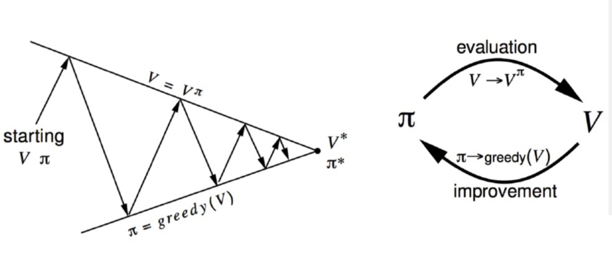
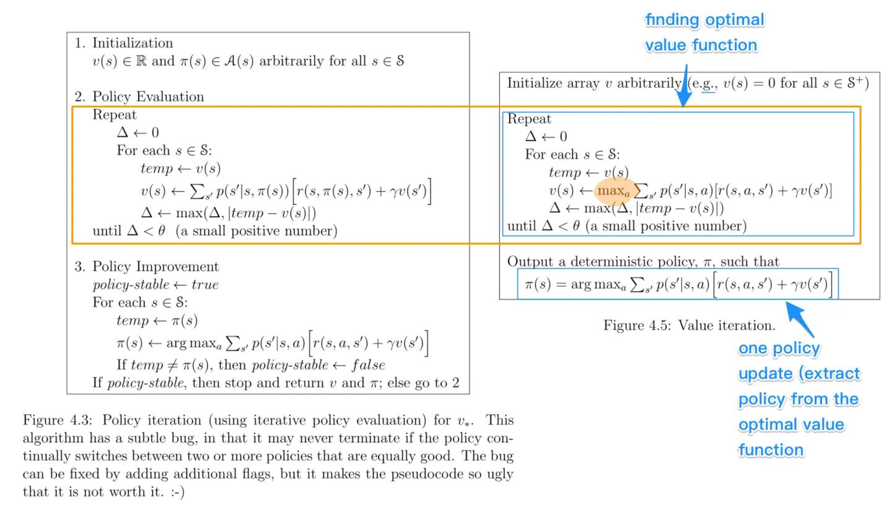
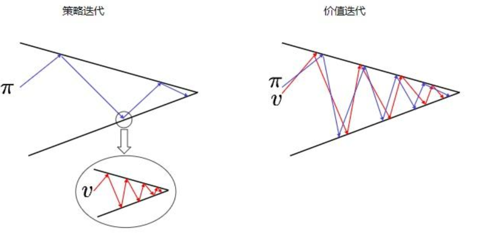
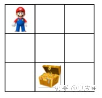

<!--
 * @version:
 * @Author:  StevenJokess（蔡舒起） https://github.com/StevenJokess
 * @Date: 2023-02-26 03:18:27
 * @LastEditors:  StevenJokess（蔡舒起） https://github.com/StevenJokess
 * @LastEditTime: 2023-05-26 22:44:51
 * @Description:
 * @Help me: 如有帮助，请赞助，失业3年了。
 * @TODO::
 * @Reference:
-->

# 动态规划算法

## 简介

**动态规划**（dynamic programming）是程序设计算法中非常重要的内容[1]，能够高效解决一些经典问题，例如背包问题和最短路径规划。动态规划的基本思想是将复杂的待求解问题分解成若干个子问题，先求解子问题，然后从这些子问题的解得到目标问题的解。动态规划会保存已解决的子问题的答案，在求解目标问题的过程中，需要这些子问题答案时就可以直接利用，避免重复计算。这些能被动态规划求解的问题的特点是，其问题的最优解是由数个小问题的最优解构成，可以通过寻找子问题的最优解来得到复杂问题的最优解；而子问题再复杂问题内重复出现，使得子问题的姐可以被储存起来重复利用。MDP具有上述两个特点，Bellman方程把问题递归为求解子问题，价值函数就相当于存储了一些子问题的解，可以复用。[2]因此可以使用动态规划来求解MDP。本章介绍如何用动态规划的思想来求解在马尔可夫决策过程中的最优策略。动态规划假设知道MDP的全部参数，如已知状态转移概率和奖励[3]。

基于动态规划的强化学习算法主要有两种：

1. **策略迭代**（policy iteration），用于预测，即给定一个MDP和策略 $\pi$，要求输出当前策略 $\pi$ 的价值函数。它由两部分组成：**策略评估**（policy evaluation）和**策略提升**（policy improvement）。具体来说，策略迭代中的策略评估使用贝尔曼期望方程来得到一个策略的状态价值函数，这是一个动态规划的过程。
1. **价值迭代**（value iteration），用于控制， 即给定一个MDP，要求确定最优价值函数和最优策略。具体来说，是直接使用贝尔曼最优方程来进行动态规划，得到最终的最优状态价值和最优策略。

不同于 3.5 节介绍的蒙特卡洛方法和第 5 章将要介绍的时序差分算法，基于动态规划的这两种强化学习算法要求事先知道环境的状态转移函数和奖励函数，也就是需要知道整个马尔可夫决策过程。在这样一个**白盒环境**中，不需要通过智能体和环境的大量交互来学习，可以直接用动态规划求解状态价值函数。但是，现实中的白盒环境很少，这也是动态规划算法的局限之处，我们无法将其运用到很多实际场景中。另外，策略迭代和价值迭代通常*只适用于有限马尔可夫决策过程*，即状态空间和动作空间是离散且有限的。

## 悬崖漫步环境

本节使用策略迭代和价值迭代来求解悬崖漫步（Cliff Walking）这个环境中的最优策略。接下来先简单介绍一下该环境。

悬崖漫步是一个非常经典的强化学习环境，它要求一个智能体从起点出发，避开悬崖行走，最终到达目标位置。如图 4-1 所示，有一个 4×12 的网格世界，每一个网格表示一个状态。智能体的起点是左下角的状态，目标是右下角的状态，智能体在每一个状态都可以采取 4 种动作：上、下、左、右。如果智能体采取动作后触碰到边界墙壁则状态不发生改变，否则就会相应到达下一个状态。环境中有一段悬崖，智能体掉入悬崖或到达目标状态都会结束动作并回到起点，也就是说掉入悬崖或者达到目标状态是终止状态。智能体每走一步的奖励是 −1，掉入悬崖的奖励是 −100。

接下来一起来看一看 Cliff Walking 环境的代码吧。

code

## 策略迭代（Policy Iteration）

为了求解最优策略 $\pi^*$，一种思路是：从一个任意的策略开始，首先计算该策略下价值函数（或动作-价值函数），然后根据价值函数调整改进策略使其更优，不断迭代这个过程直到策略收敛。通过策略计算价值函数的过程叫做策略评估（policy evaluation），通过价值函数优化策略的过程叫做策略优化（policy improvement），策略评估和策略优化交替进行的强化学习求解方法叫做通用策略迭代（Generalized Policy Iteration，GPI）。

步骤：

- 第一步 策略评估 (Policy Evaluation)
- 第二步 策略提升 (Policy Improvement)
- 不停的重复策略评估和策略提升，直到策略不再变化为止

### 策略评估（policy evaluation）

#### 思路：

策略评估（policy evaluation）：计算当前策略下，每个状态的值函数。策略评估可以通过贝尔曼方程进行迭代计算 $V_\pi（s)$ 。如果状态数有限时，也可以通过直接求解Bellman方程来得到得到 $V_\pi（s)$ 。

#### 伪代码（policy_evaluation_part）：

- 随机初始化 $V(s)\in \mathbf{R}$，如 $V(s)=0$，for all $s \in \mathcal{S}$
- $\Delta \leftarrow float("inf")$
- $\theta \leftarrow 0.0001$（a small positive number）
- while $\Delta>\theta$ do :（直到 $V_\pi$ 收敛）
  - For each $s \in \mathcal{S}$：
    - $temp \leftarrow V(s)$
    - 策略评估：$V_\pi(s) \leftarrow \sum_{a \in A} \pi (s, a ) Q_\pi(s, a) = \sum_{a \in A} \pi (s, a ) { \sum _ { s ^ { \prime } \in S } \operatorname { P r } ( s ^ { \prime } | s , a ) [ R ( s , a , s ^ { \prime } ) + \gamma V _ { \pi } ( s ^ { \prime } ) }] .$
- end while

#### 例如：

更新 $V_\pi\left(s_1\right)$ 的值:

$$
\begin{gathered}
Q_\pi\left(s_1, \text { 上 }\right)=1 \times(0+0.99 \times 0.3)+0 \times(0+0.99 \times 0.4) \\
+\ldots=0.297 \\
V_\pi\left(s_1\right)=1 \times q_\pi\left(s_1, \text { 上 }\right)+0 \times q_\pi\left(s_1 \text {, 右 }\right)=0.297
\end{gathered}
$$

缺点：

1. 智能主体需要事先知道状态转移概率;
2. 无法处理状态集合大小无限的情况

### 策略优化/改进（policy improvement）

策略优化/改进（policy improvement）：根据值函数来计算当前状态的最好Action，来更新策略，公式是$\pi(s) =argmax_{a} \sum_{s', r} (r + \gamma V(s'))$

#### 思路：

在讨论如何优化策略之前, 首先需要明确什么是“更好”的策略。分别给出 $\pi$ 和 $\pi^{\prime}$ 两个策略, 如果对于任意状态 $s \in S$, 有 $V_\pi(s) \leq V_{\pi^{\prime}}(s)$, 那么可以 认为策略 $\pi^{\prime}$ 不比策略 $\pi$ 差, 可见“更优”策略是一个偏序关系。

**策略优化定理**：

对于确定的策略 $\pi$ 和 $\pi^{\prime}$, 如果对于任意状态 $s \in S$
$$
Q_\pi\left(s, \pi^{\prime}(s)\right) \geq Q_\pi(s, \pi(s))
$$
那么对于任意状态 $s \in S$, 有
$$
V_{\pi^{\prime}}(s) \geq V_\pi(s)
$$
即策略 $\pi^{\prime}$ 不比 $\pi$ 差

**其证明**：

$$
\begin{gathered}
V_\pi(s) \leq Q_\pi\left(s, \pi^{\prime}(s)\right)=\mathbb{E}\left[R_{t+1}+\gamma V^\pi\left(S_{t+1}\right) \mid S_t=s, A_t=\pi^{\prime}(s)\right] \\
=\mathbb{E}_{\pi^{\prime}}\left[R_{t+1}+\gamma V^\pi\left(S_{t+1}\right) \mid S_t=s\right] \\
\leq \mathbb{E}_{\pi^{\prime}}\left[R_{t+1}+\gamma Q^\pi\left(S_{t+1}\right) \mid S_t=s\right] \\
=\mathbb{E}_{\pi^{\prime}}\left[R_{t+1}+\gamma R_{t+2}+\gamma^2 V^\pi\left(S_{t+2}\right) \mid S_t=s\right] \\
\quad \cdots \\
\leq \mathbb{E}_{\pi^{\prime}}\left[R_{t+1}+\gamma R_{t+2}+\gamma^2 R_{t+3}+\ldots \mid S_t=s\right] \\
=V_\pi(s)
\end{gathered}
$$

那么只需要不断寻找更好的策略就能实现策略的优化。

那如何找呢？根据V(s)用下面的贝尔曼期望方程找到更好的策略$\pi(s)$

$$
V_\pi(s)=\mathbb{E}_{a \sim \pi(s, \cdot)} \mathbb{E}_{s^{\prime} \sim P(\cdot \mid s, a)}\left[R\left(s, a, s^{\prime}\right)+\gamma V_\pi\left(s^{\prime}\right)\right]
$$

#### 伪代码（policy_improvement_part）

- policy-stable $\leftarrow$ true
- For each $s \in \mathcal{S}$ :
  - $temp \leftarrow \pi(s)$
  - $\pi(s) \leftarrow \arg \max _a \sum_{s^{\prime}} p\left(s^{\prime} \mid s, a\right)\left[r\left(s, a, s^{\prime}\right)+\gamma v\left(s^{\prime}\right)\right]$
- If $temp \neq \pi(s)$, then $policy-stable \leftarrow false$
- If $policy-stable$（策略稳定说明已经最优）, then stop and return（停下返回） （最优值函数）$v$ and （最优策略） $\pi$; else go to policy_evaluation_part（在策略不稳定的情况下不停评估策略，计算V(s)）

其收敛性可证明（TODO:），每一次对策略的更新都不会使当前的策略的价值下降。并且可以证明策略的提升有传递性，所以上文算法是可以收敛到最优策略的。[8]

#### 策略迭代的适用场景

使用价值迭代求解MDP问题时，需要满足以下条件：[5]

- Action对State的影响和回报 $P(State', Reward | State, Action)$ 是已知的，然而绝大多数实际问题中 $P(State', Reward | State, Action)$ 是未知的
- State和Action都是离散取值，无法应对Action或者State是连续取值的
- State和Action都是低维度离散取值，因为计算复杂度是随着维度的升高而迅速变大的—— $O(|State| x |Action| x |State|)$

策略迭代中的策略评估和策略改进是交替轮流进行，其中策略评估也是通过一个内部迭代来进行计算，其计算量比较大。

事实上，我们不需要每次计算出每次策略对应的精确的值函数，也就是说内部迭代不需要执行到完全收敛。

## 价值迭代（Value Iteration）

从上面的代码运行结果中我们能发现，策略迭代中的策略评估需要进行很多轮才能收敛得到某一策略的状态函数，这需要很大的计算量，尤其是在状态和动作空间比较大的情况下。我们是否必须要完全等到策略评估完成后再进行策略提升呢？试想一下，可能出现这样的情况：虽然状态价值函数还没有收敛，但是不论接下来怎么更新状态价值，策略提升得到的都是同一个策略。如果只在策略评估中进行一轮价值更新，然后直接根据更新后的价值进行策略提升，这样是否可以呢？答案是肯定的，这其实就是本节将要讲解的价值迭代算法。

### 思路：

它是一种策略评估只进行了一轮更新的策略迭代算法。需要注意的是，价值迭代中不存在显式的策略，我们只维护一个状态价值函数。

确切来说，价值迭代可以看成一种动态规划过程，它利用的是贝尔曼最优方程：

$$
V^*(s)=\max _{a \in \mathcal{A}}\left\{r(s, a)+\gamma \sum_{s^{\prime} \in \mathcal{S}} P\left(s^{\prime} \mid s, a\right) V^*\left(s^{\prime}\right)\right\}
$$

将其写成迭代更新的方式为

$$
V^{k+1}(s)=\max _{a \in \mathcal{A}}\left\{r(s, a)+\gamma \sum_{s^{\prime} \in \mathcal{S}} P\left(s^{\prime} \mid s, a\right) V^k\left(s^{\prime}\right)\right\}
$$

价值迭代便是按照以上更新方式进行的。等到 $V^{k+1}$ 和 $V^k$ 相同（下面伪算法中的|temp-V(s)| 无限接近于 0） 时，它就是贝尔曼最优方程的不动点，此时对应着最优状态价值函数 $V^{*}$ 。

然后我们利用 $\pi(s) = \arg \max _a\left\{r(s, a)+\gamma \sum_{s^{\prime}} p\left(s^{\prime} \mid s, a\right) V^{k+1}\left(s^{\prime}\right)\right\}$ ，从中恢复出最优策略即可。

### 伪代码：

价值迭代算法流程如下:[5]

- 随机初始化 $V(s)\in \mathbf{R}$，如 $V(s)=0$，for all $s \in \mathcal{S}$
- $\Delta \leftarrow float("inf")$
- $\theta \leftarrow 0.0001$（a small positive number）
- while $\Delta>\theta$ do :
  - $\Delta \leftarrow 0$
  - For each $s \in \mathcal{S}$ :
    - $temp \leftarrow V(s)$
    - $ V(s) \leftarrow \max _a \left[r(s, a)+\gamma \sum_{s^{\prime}} P\left(s^{\prime} \mid s, a\right) V\left(s^{\prime}\right)\right]$
    - $\Delta \leftarrow \max (\Delta,|temp-V(s)|)$
- end while
- 输出最优策略 $\pi(s) = \arg \max _a\left\{r(s, a)+\gamma \sum_{s^{\prime}} p\left(s^{\prime} \mid s, a\right) V^{k+1}\left(s^{\prime}\right)\right\}$

### 代码：

我们现在来编写价值迭代的代码。

code

可以看到，解决同样的训练任务，价值迭代总共进行了数十轮，而策略迭代中的策略评估总共进行了数百轮，价值迭代中的循环次数**远少于**策略迭代。

### 价值迭代的适用场景

使用价值迭代求解MDP问题时，需要满足以下条件：[5]

- Action对State的影响和回报 $P(State', Reward | State, Action)$ 是已知的，然而绝大多数实际问题中 $P(State', Reward | State, Action)$ 是未知的
- State和Action都是离散取值，无法应对Action或者State是连续取值的
- State和Action都是低维度离散取值，因为计算复杂度是随着维度的升高而迅速变大的—— $O(|State| x |Action| x |State|)$

## 冰湖环境

除了悬崖漫步环境，本章还准备了另一个环境——**冰湖**（Frozen Lake）。冰湖环境的状态空间和动作空间是有限的，我们在该环境中也尝试一下策略迭代算法和价值迭代算法，以便更好地理解这两个算法。

冰湖是 OpenAI Gym 库中的一个环境。OpenAI Gym 库中包含了很多有名的环境，例如 Atari 和 MuJoCo，并且支持我们定制自己的环境。在之后的章节中，我们还会使用到更多来自 OpenAI Gym 库的环境。如图 4-2 所示，冰湖环境和悬崖漫步环境相似，也是一个网格世界，大小为。每一个方格是一个状态，智能体起点状态在左上角，目标状态在右下角，中间还有若干冰洞 $H$。在每一个状态都可以采取上、下、左、右 4 个动作。由于智能体在冰面行走，因此每次行走都有一定的概率滑行到附近的其它状态，并且到达冰洞或目标状态时行走会提前结束。每一步行走的奖励是 0，到达目标的奖励是 1。

我们先创建 OpenAI Gym 中的 FrozenLake-v0 环境，并简单查看环境信息，然后找出冰洞和目标状态。

code

首先，我们发现冰洞的索引是 $\set{5, 7, 11, 12}$（集合 set 的索引是无序的），起点状态（索引为 0）在左上角，和悬崖漫步环境一样。其次，根据第 15 个状态（即目标左边一格，数组下标索引为 14）的信息，我们可以看到每个动作都会等概率“滑行”到 3 种可能的结果，这一点和悬崖漫步环境是不一样的。我们接下来先在冰湖环境中尝试一下策略迭代算法。

code

这个最优策略很看上去比较反直觉，其原因是这是一个智能体会随机滑向其他状态的冰冻湖面。例如，在目标左边一格的状态，采取向右的动作时，它有可能会滑到目标左上角的位置，从该位置再次到达目标会更加困难，所以此时采取向下的动作是更为保险的，并且有一定概率能够滑到目标。我们再来尝试一下价值迭代算法。

code

可以发现价值迭代算法的结果和策略迭代算法的结果完全一致，这也互相验证了各自的结果。

## 策略迭代 VS 价值迭代

借用Stackoverflow的一张图，我们把价值迭代和策略迭代放在一起看：[6]

在策略迭代（Policy Iteration）中

- 第一步 Policy Eval：一直迭代至收敛，获得准确的V(s)；第二步 Policy Improvement：根据准确的V(s)，求解最好的Action；即价值函数和策略函数的收敛是**串行的**；是不断优化策略以求最优策略：根据贝尔曼方程来更新值函数，并根据当前的值函数来改进策略。
- 每次迭代的时间复杂度最大为 $O(|S|^3|A|^3)$，最大迭代次数为 $|A|^{|S|}$；即策略迭代的收敛速度相对较快，适用于状态空间较少的场景。

对比之下，在价值迭代（Value Iteration）中

- 第一步 Policy Eval：迭代只做一步，获得不太准确的V(s)；第二步 Policy Improvement：根据不太准确的V(s)，求解最好的Action；即价值函数和策略函数的收敛是**并行的**；是通过求最优的值函数去求最优策略：直接使用贝尔曼最优方程 $
v_{k+1}(s)=\max _{a \in A}\left(R_s^a+\gamma \sum_{s^{\prime} \in S} P_{s s^{\prime}}^a v_k\left(s^{\prime}\right)\right)$ 来更新值函数，收敛时的值函数就是最优的值函数，此时即最优策略。
- 每次迭代的时间复杂度最大为 $O(|S|^{2}|A|)$，但迭代次数要比策略迭代算法更多；即价值迭代适用于状态空间相对偏大的环境，因为其计算量相对更小。

相同点：

- 值迭代和策略迭代都需要经过非常多的迭代次数才能完全收敛。在实际应用中，可以不必等到完全收敛，如阈值$\theta \leftarrow 0.0001$。这样，当状态和动作数量有限时，经过有限次迭代就可以能收敛到近似最优策略。[4]
- 本质上，Policy Iteration和Value Iteration都属于Model-based方法，这种方法假设我们知道Action带来的Reward和新状态，即P(s', r | s, a)。最明显的特点是，不用玩迷宫游戏，便能根据转移矩阵计算出最优策略。

### 广义策略迭代

策略迭代算法和值迭代算法可以利用广义策略迭代方法进行统一描述。

## 小结

本章讲解了强化学习中两个经典的动态规划算法：策略迭代算法和价值迭代算法，它们都能用于求解最优价值和最优策略。动态规划的主要思想是利用贝尔曼方程对所有状态进行更新。需要注意的是，在利用贝尔曼方程进行状态更新时，我们会用到马尔可夫决策过程中的奖励函数和状态转移函数。

如果智能体无法事先得知奖励函数和状态转移函数，就只能通过和环境进行交互来采样（状态-动作-奖励-下一状态）这样的数据，我们将在之后的章节中讲解如何求解这种情况下的最优策略，即Model-free方法。

## 相关例子

假设我们有一个3 x 3的棋盘[7]：

- 有一个单元格是超级玛丽，每回合可以往上、下、左、右四个方向移动
- 有一个单元格是宝藏，超级玛丽找到宝藏则游戏结束，目标是让超级玛丽以最快的速度找到宝藏
- 假设游戏开始时，宝藏的位置一定是(1, 2)

### 这是MDP吗？

这是一个标准的马尔科夫决策过程(MDP)：

- **状态空间State**：超级玛丽当前的坐标
- **决策空间Action**: 上、下、左、右四个动作
- **Action对State的影响和回报 P(State', Reward | State, Action)**：本文认为该关系是已知的
  - 超级玛丽每移动一步，reward = -1
  - 超级玛丽得到宝箱，reward = 0并且游戏结束

### 利用Value Iteration解决：

结合上图可以非常简单的理解价值迭代：

初始化：所有state的价值V(s) = 0

第一轮迭代：

- 对于每个state，逐一尝试上、下、左、右四个Action
- 记录Action带来的Reward、以及新状态 V(s')
- 选择最优的Action，更新V(s) = Reward + V(s')
  - 对于宝箱周围的State，最优的Action是一步到达宝箱，V(s) = Reward + V(s') = -1 + 0
- 第一轮结束后，宝箱周围的State的价值都有V(s) = -1，即从当前位置出发走一步获得Reward=-1

第二轮迭代：

- 对于每个state，逐一尝试上、下、左、右四个Action
- 记录Action带来的Reward、以及新状态 V(s')
- 选择最优的Action，更新V(s) = Reward + V(s')
  - 对于宝箱周围的State，最优的Action是一步到达宝箱，V(s) = Reward + V(s') = -1 + 0
  - 对于其他State，所有的Action都是一样的，V(s) = Reward + V(s') = -1 + -1
- 第二轮结束后，宝箱周围的State的价值保持不变 V(s) = -1，出现其他State的价值 V(s) = -2

第三轮迭代：

- 对于每个state，逐一尝试上、下、左、右四个Action
- 记录Action带来的Reward、以及新状态 V(s')
- 选择最优的Action，更新V(s) = Reward + V(s')
  - 对于宝箱周围的State，最优的Action是一步到达宝箱，V(s) = Reward + V(s') = -1 + 0
  - 对于离宝箱两步距离的State，最优的Action是先一步到达宝箱周边的State，V(s) = Reward + V(s') = -1 + -1
  - 对于离宝箱三步距离的State，所有Action都是一样的，V(s) = Reward + V(s') = -1 + -2
- 第三轮结束后，宝箱周围的State保持不变和对于离宝箱两步距离的State的价值保持不变，分别为V(s) = -1、V(s) = -2，出现对于离宝箱三步距离的State的价值 V(s) = -3

第四轮迭代：

- 对于每个state，逐一尝试上、下、左、右四个Action
- 记录Action带来的Reward、以及新状态 V(s')
- 选择最优的Action，更新V(s) = Reward + V(s')
  - 对于宝箱周围的State，最优的Action是一步到达宝箱，V(s) = Reward + V(s') = -1 + 0
  - 对于离宝箱两步距离的State，最优的Action是先一步到达宝箱周边的State，V(s) = Reward + V(s') = -1 + -1
  - 对于离宝箱三步距离的State，最优的Action是所有Action都是一样的，V(s) = Reward + V(s') = -1 + -2
- 在第四轮迭代中，所有V(s)更新前后都没有任何变化，价值迭代已经找到了最优策略

需要注意的是，对于Value Iteration来说，在每一轮迭代中，我们都对每一个状态尝试了所有他可能可以尝试的动作，并对这个状态的价值函数进行更新，直到价值函数不再发生变化。

## 利用Policy Iteration解决：

- 初始化：无论超级玛丽在哪个位置，策略默认为向下走
  - 策略评估: 计算 $\mathrm{V}(\mathrm{s})$
    - 如果宝藏恰好在正下方，则期望价值等于到达宝藏的距离 $(-2$ 或者-1)
    - 如果宝藏不在正下方，则永远也不可能找到宝藏，期望价值为负无穷
  - 策略提升: 根据 $\mathrm{V}(\mathrm{s})$ 找到更好的策略
    - 如果宝藏恰好在正下方，则策略已经最优，保持不变
    - 如果宝藏不在正下方, 根据 $\operatorname{argmax}_a \sum_{s^{\prime}, r}\left(r+\gamma V\left(s^{\prime}\right)\right)$ 可以得出最优策略为横 向移动一步

- 第一轮迭代：通过上一轮的策略提升，这一轮的策略变成了横向移动或者向下移动（如图 所示)
  - 策略评估：计算 $\mathrm{V}(\mathrm{s})$
    - 如果宝藏恰好在正下方，则期望价值等于到达宝藏的距离 $(-2$ 或者-1)
    - 如果宝藏不在正下方，当前策略会选择横向移动，期望价值为 $-3,-2,-1$
  - 策略提开: 根据 $V(s)$ 找到更好的策略
    - 如果宝藏恰好在正下方，则策略已经最优，保持不变
    - 如果宝藏不在正下方，根据 $\operatorname{argmax}_a \sum_{s^{\prime}, r}\left(r+\gamma V\left(s^{\prime}\right)\right)$ 可以得出当前策略已经 最优，保持不变

## 相关Demo

https://cs.stanford.edu/people/karpathy/reinforcejs/gridworld_dp.html

[1]: https://hrl.boyuai.com/chapter/1/%E5%8A%A8%E6%80%81%E8%A7%84%E5%88%92%E7%AE%97%E6%B3%95
[2]: https://www.bilibili.com/video/BV1UT411a7d6?p=34&vd_source=bca0a3605754a98491958094024e5fe3
[3]: https://www.bilibili.com/video/BV1UT411a7d6?p=35&vd_source=bca0a3605754a98491958094024e5fe3
[4]: https://coladrill.github.io/2018/12/02/%E5%BC%BA%E5%8C%96%E5%AD%A6%E4%B9%A0%E6%80%BB%E8%A7%88/
[5]: https://zhuanlan.zhihu.com/p/33229439
[6]: https://zhuanlan.zhihu.com/p/34006925
[7]: https://www.zhihu.com/column/c_1359967856373874688
[8]: https://www.zhihu.com/column/c_1356366236041924609
