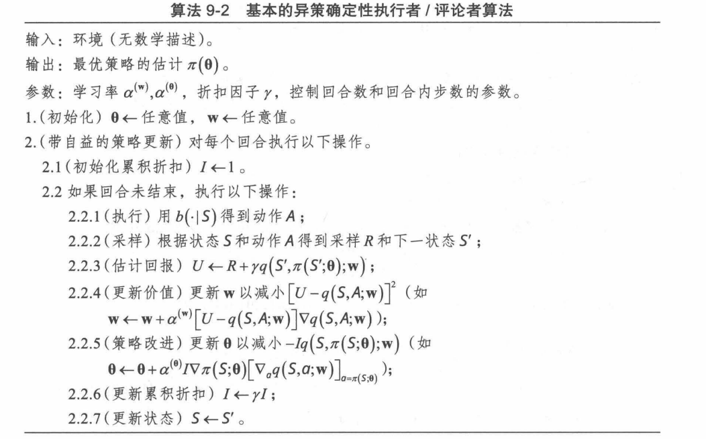

# 异策确定性算法

执行者 / 评论者算法也可以利用行为策略得到其异策版本。不过, 对于确定性算法, 行 为策略并不对目标策略绝对连续, 不再简单适用重采样。
回顾非确定性版本的异策执行者 / 评论者算法, 其策略的梯度为

$$
\mathrm{E}_b\left[\sum_{t=0}^{+\infty} \gamma^t \frac{\pi\left(A_t \mid S_t ; \boldsymbol{\theta}\right)}{b\left(A_t \mid S_t\right)} \Psi_t \nabla \ln \pi\left(A_t \mid S_t ; \boldsymbol{\theta}\right)\right]=\mathrm{E}_{\rho_b}\left[q_{\pi(\theta)}(S, A) \nabla \pi(A \mid S ; \boldsymbol{\theta})\right]
$$

从这个角度看, 可以通过最大化目标 $\mathrm{E}_{\rho_b}\left[q_{\pi(\theta)}(S, A) \pi(A \mid S ; \boldsymbol{\theta})\right]$ 实现迭代。确定性版本的异策执行者/评论者算法从这个角度出发, 试图最大化 $\mathrm{E}_{\rho_b}\left[q_{\pi(\theta)}(S, \pi(S ; \boldsymbol{\theta}))\right]$ 。可以知道, 其梯度为

$$
\nabla \mathrm{E}_{\rho_b}\left[q_{\pi(\boldsymbol{\theta})}(S, \pi(S ; \boldsymbol{\theta}))\right]=\mathrm{E}_{\rho_b}\left[\nabla \pi(S ; \boldsymbol{\theta})\left[\nabla_a q_{\pi(\boldsymbol{\theta})}(S, a)\right]_{a=\pi(S ; \boldsymbol{\theta})}\right]
$$

这个表达式与同策的情形相比，期望运算针对的表达式相同，但是期望针对的分布不同。 所以, 异策确定性算法与同策确定性算法有着相同形式的迭代式, 并且这个迭代式不含行 为策略 $b(*)$ 。但是, 这个行为策略并非没有作用。这个行为策略确定了轨迹的分布, 它体 现在了期望上。由于行为策略能够促进探索，所以异策算法有时会比同策算法性能好。

## 基本的异策确定性执行者 / 评论者算法

基于上述分析, 我们可以得到异策确定性执行者/评论者算法 (Off-Policy Deterministic Actor-Critic, OPDAC), 见算法 9-2。值得一提的是, 虽然异策算法和同策算法有相同形式 的迭代式, 但是在算法结构上并不完全相同。在同策算法迭代更新时, 目标策略的动作可 以在运行过程中直接得到; 但是在异策算法迭代更新策略参数时, 对环境使用的是行为策 略决定的动作, 而不是目标策略决定的动作, 所以需要额外计算目标策略的动作。在更新 价值函数时, 采用的是 $\mathrm{Q}$ 学习, 依然需要计算目标策略的动作。

