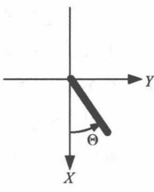

<!--
 * @version:
 * @Author:  StevenJokess（蔡舒起） https://github.com/StevenJokess
 * @Date: 2023-04-09 18:08:59
 * @LastEditors:  StevenJokess（蔡舒起） https://github.com/StevenJokess
 * @LastEditTime: 2023-09-20 16:34:35
 * @Description:
 * @Help me: make friends by a867907127@gmail.com and help me get some “foreign” things or service I need in life; 如有帮助，请赞助，失业3年了。
 * @TODO::
 * @Reference:
-->
# Pendulum-v0

本节考虑 Gym 库中的倒立摆的控制问题 (Pendulum-v0) 。

观测值为棍子活动端的坐标 $\left(X_t, Y_t\right)=\left(\cos \Theta_t, \sin \Theta_t\right), \Theta_t \in[-\pi, \pi)$ $\left(X_t, Y_t\right)=\left(\cos \Theta_t, \sin \Theta_t\right), \Theta_t \in[-\pi, \pi)$ 和角速度 $\dot{\Theta}_t \in[-8,+8] \dot{\Theta}_t \in[-8,+8]$ ；动作为连续值，是一个施加在活动端的力矩 $A_t \in[-2,+2] A_t \in[-2,+2]$ ；奖励值 也是一个和状态与动作有关的连续值 $R_{t+1} \in\left[-\pi^2-6.404,0\right]$
$R_{t+1} \in\left[-\pi^2-6.404,0\right]$ ； 任务是在给定的时间内 (200 步) 总收益越大越好，即相 当于尽可能的保持木棍静止直立。其他更详细的数据可参阅源代码。

该问题的状态空间、动作空间、奖励空间都是连续的空间，问题整体的空间变得相当大；而且最大的力矩也无法将倒立摆从单边直接推至直立状态，因此智能体需要学会利用重力将倒立摆荡上至直立位置。

这个问题是这样的: 如图所示, 在二维垂直面上有根长为 1 的棍。棍子的一端固定在原点 $(0,0)$, 另一端在垂直面上（注意：二 维垂直面的 $X$ 轴是垂直**向下**的, $Y$ 轴是水平向右的)。在任一时刻 $t$ $(t=0,1,2, \ldots)$, 可以观测到棍子活动端的坐标 $\left(X_t, Y_t\right)=\left(\cos \Theta_t, \sin \Theta_t\right)$ $\left(\Theta_t \in[-\pi,+\pi)\right)$ 和角速度 $\dot{\Theta}_t\left(\dot{\Theta}_t \in[-8,+8]\right)$ (注意角速度的字母上有个点)。这时, 可以在活动端上施加一个力矩 $A_t\left(A_t \in[-2,+2]\right)$, 得到收益 $R_{t+1}$ 和下一观测 $\left(\cos \Theta_{t+1}, \sin \Theta_{t+1}, \dot{\Theta}\right)$ 。

我们希望在给定的时间内 (200 步) 总收益越大越好，即相当于尽可能的保持木棍静止直立。

这个问题的动作空间和奖励空间都比第 8 章双节倒立摆任务中的空间大（比较见表 9-1）。 该问题的状态空间、动作空间、奖励空间都是连续的空间，问题整体的空间变得相当大；而且最大的力矩也无法将倒立摆从单边直接推至直立状态，因此智能体需要学会利用重力将倒立摆荡上至直立位置。

双节倒立摆任务和倒立摆任务的空间比较：

|  | 双节倒立摆 (Acrobot-v1) | 倒立摆 (Pendulum-v0) |
| :---: | :--- | :--- |
| 状态空间 $\mathcal{S}$ | $[-\pi, \pi)^2 \times[-4 \pi, 4 \pi] \times[-9 \pi, 9 \pi]$ | $[-\pi, \pi) \times[-4 \pi, 4 \pi] \times[-9 \pi, 9 \pi]$ |
| 观测空间 $\mathcal{O}$ | $[-1,1]^4 \times[-4 \pi, 4 \pi] \times[-9 \pi, 9 \pi]$ | $[-1,1]^2 \times[-4 \pi, 4 \pi] \times[-9 \pi, 9 \pi]$ |
| 动作空间 $\mathcal{A}$ | $\{0,1,2\}$ | $[-2,2]$ |
| 奖励空间 $\mathcal{R}$ | $\{-1,0\}$ | $\left[-\pi^2-6.404,0\right]$ |

这个问题没有规定一个回合收益的阈值, 所以没有连续 100 回合平均回合收益达到某个数值就认为问题解决这样的说法。

实际上, 在 $t$ 时刻, 环境的状态由 $\left(\Theta_t, \dot{\Theta}_t\right)$ 决定。环境的起始状态 $\left(\Theta_0, \dot{\Theta}_0\right)$ 是在 $[-\pi,+\pi) \times[-1,1]$ 里均匀抽取, 而由 $t$ 时刻的状态 $\left(\Theta_t, \dot{\Theta}_t\right)$ 与动作 $A_t$ 决定的奖励 $R_{t+1}$ 和下一状态 $\left(\Theta_{t+1}, \dot{\Theta}_{t+1}\right)$ 满足以下关系:

$$
\begin{aligned}
& R_{t+1} \leftarrow-\left(\Theta_t^2+0.1 \dot{\Theta}_t^2+0.001 A_t^2\right) \\
& \Theta_{t+1} \leftarrow \Theta_t+0.05\left(\dot{\Theta}-0.75 \sin \Theta-0.15 A_t\right) \text { 在 }[-\pi,+\pi) \text { 的主值区间 } \\
& \dot{\Theta}_{t+1} \leftarrow \operatorname{clip}\left(\dot{\Theta}_t-0.75 \sin \Theta_t-0.15 A_t,-8,+8\right)
\end{aligned}
$$

智能体并不知道动力的数学表达式。由于在 $X_t$ 较大时收益往往较大, 并且角速度绝对 值 $|\dot{\Theta}|$ 和动作绝对值 $|A|$ 较小时收益较大, 所以最好让木棍能够静止直立。这个问题因此被称为倒立摆问题。

由于动作空间是一个连续的空间, 可以采用本章中介绍的连续动作空间的确定性算法。

---

代码中类 OrnsteinUhlenbeckProcess 实现了 Ornstein Uhlenbeck 过程; 智能体类 DDPG 实现了深度确定性策略梯度智能体类，以及智能体类 TD3 实现了双重延迟深度确定性策 略梯度智能体类；前两者代码与书中基本一致，后者稍作修改，减少了一些代码量，但 实现逻辑不变，此处不再展示。

[1]: https://anesck.github.io/M-D-R_learning_notes/RLTPI/notes_html/9.chapter_nine.html
[2]: https://github.com/openai/gym/blob/master/gym/envs/classic_control/pendulum.py
[3]: E:/BaiduNetdiskDownload/%E3%80%8A%E5%BC%BA%E5%8C%96%E5%AD%A6%E4%B9%A0%E5%8E%9F%E7%90%86%E4%B8%8Epython%E5%AE%9E%E7%8E%B0%E3%80%8BPDF+%E6%BA%90%E4%BB%A3%E7%A0%81/%E3%80%8A%E5%BC%BA%E5%8C%96%E5%AD%A6%E4%B9%A0%E5%8E%9F%E7%90%86%E4%B8%8Epython%E5%AE%9E%E7%8E%B0%E3%80%8BPDF+%E6%BA%90%E4%BB%A3%E7%A0%81/%E3%80%8A%E5%BC%BA%E5%8C%96%E5%AD%A6%E4%B9%A0%E5%8E%9F%E7%90%86%E4%B8%8Epython%E5%AE%9E%E7%8E%B0%E3%80%8BPDF+%E6%BA%90%E4%BB%A3%E7%A0%81/%E3%80%8A%E5%BC%BA%E5%8C%96%E5%AD%A6%E4%B9%A0%E5%8E%9F%E7%90%86%E4%B8%8Epython%E5%AE%9E%E7%8E%B0%E3%80%8B.pdf
