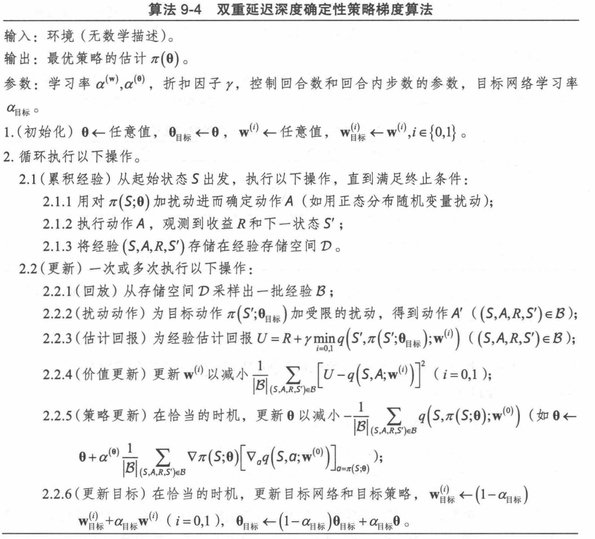
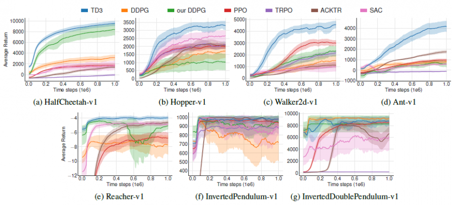

<!--
 * @version:
 * @Author:  StevenJokess（蔡舒起） https://github.com/StevenJokess
 * @Date: 2023-06-04 00:45:09
 * @LastEditors:  StevenJokess（蔡舒起） https://github.com/StevenJokess
 * @LastEditTime: 2023-09-14 21:25:02
 * @Description:
 * @Help me: make friends by a867907127@gmail.com and help me get some “foreign” things or service I need in life; 如有帮助，请资助，失业3年了。
 * @TODO::
 * @Reference:
-->

# 双延迟深度确定性策略梯度 TD3

## 背景

虽然 DDPG 有时表现很好，但它对于超参数和其他类型的调整方面经常很敏感。DDPG常见的问题是已经学习好的 Q 函数开始显著地高估 Q 值，然后导致策略被破坏，因为它利用了 Q 函数中的误差。

双延迟确定性策略梯度算法TD3 (Twin Delayed Deep Deterministic policy gradient)通过使用两个 critic 网络（Double DQN）和延迟的策略更新，提高了训练稳定性和效果。

S. Fujimoto 等人在文章《 Addressing function approximation error in actor-critic methods》 中给出了双重延迟深度确定性策略梯度算法 (Twin Delay Deep Deterministic Policy Gradient,连续动作空间的确定性策略TD3 ), 结合了深度确定性策略梯度算法和双重 $\mathrm{Q}$ 学习。
回顾前文, 双重 $\mathrm{Q}$ 学习可以消除最大偏差。基于查找表的双重 $\mathrm{Q}$ 学习用了两套动作价 值函数 $q^{(0)}(s, a)$ 和 $q^{(1)}(s, a)(s \in \mathcal{S}, a \in \mathcal{A})$, 其中一套动作价值函数用来计算最优动作（如 $A^{\prime}=\arg \max _a q^{(0)}\left(S^{\prime}, a\right)$ ), 另外一套价值函数用来估计回报（如 $\left.q^{(1)}\left(S^{\prime}, A^{\prime}\right)\right)$; 双重 $\mathrm{Q}$ 网络则考 但是对于确定性策略梯度算法, 动作已经由含参策略 $\pi(\boldsymbol{\theta})$ 决定了 (如 $\pi\left(S^{\prime} ; \boldsymbol{\theta}\right)$ ), 双重网络 则要由双重延迟深度确定性策略梯度算法维护两份学习过程的价值网络参数 $\mathbf{w}^{(i)}$ 和目标网 络参数 $\mathbf{w}_{\text {目标 }}^{(i)}(i=0,1)$ 。在估计目标时, 选取两个目标网络得到的结果中较小的那个, 即 $\min _{i=0,1} q\left(\cdot, ; \mathbf{w}_{\text {目标 }}^{(i)}\right)$ 。[3]

## 关键特点

- **截断的双Critic结构(clipped double Q-learning)**： TD3 使用两个（因此名字中有 “twin"）独立训练的 critic 网络（Q函数 $Q_{\phi_1}$ 和 $Q_{\phi_2}$）来估计状态-动作对的 Q 值，取两者的较小值被作为如下的 $Q_{\phi i, \operatorname{targ}}$，来用于值函数的更新，从而降低了过度估计的风险。
  $$
  y\left(r, s^{\prime}, d\right)=r+\gamma(1-d) \min _{i=1,2} Q_{\phi i, \operatorname{targ}}\left(s^{\prime}, a_{\mathrm{TD} 3}\left(s^{\prime}\right)\right)
  $$
- 延迟策略更新 (delayed policy updates)： 在 TD3 中，策略更新（Actor网络更新）比值函数更新（Critic网络更新）慢一些。这是基于策略梯度方法通常对值函数估计的准确性更敏感的观察。这种延迟更新有助于稳定训练过程。
- 目标策略噪声正则化： TD3 在计算下一个状态的目标动作时，添加了噪声。这使得策略在探索时更加稳健，因为噪声使得策略不会过度依赖可能存在的函数近似误差。

1. **截断的双 Q 学习 (clipped dobule Q-learning) **。TD3学习两个Q函数)。TD3通过最小化均方 差来同时学习两个Q函数: $Q_{\phi_1}$ 和 $Q_{\phi_2}$ 。两个Q函数都使用 一个目标，两个Q函数中给出的较小的值会被作为如下的 Qtarget:

1. **延迟的策略更新 (delayed policy updates)** 。相关实验结果表明，同步训练动作网络和评价网络，却不使用目标网 络，会导致训练过程不稳定；但是仅固定动作网络时，评 价网络往往能够收敛到正确的结果。因此 TD3算法以较低的 频率更新动作网络，以较高的频率更新评价网络，通常每 更新两次评价网络就更新一次策略。
2. **目标策略平滑 (target policy smoothing)**。TD3引入了平滑化 (smoothing) 思想。TD3在目标动作中加入噪声，通过平滑 $\mathrm{Q}$ 沿动作的变化，使策略更难利用 $\mathrm{Q}$ 函数的误差。

这 3 个技巧加在一起，使得性能相比基线 DDPG 有了大幅的提升。

## 目标函数与损失函数

对于 Critic，TD3 使用了两个独立的 Q 函数网络，我们记为 Q1 和 Q2。每个 Critic 的目标函数都是尽可能准确地估计当前策略下的累积回报。因此，Critic 的损失函数可以表示为 $(y - Q(s, a))^2$，其中 y 是目标值，由下一状态的最优动作和对应的 Q 值决定：$y = r + γ * min(Q_{target_1}(s', a'), Q_{target_2}(s', a'))$。

对于 Actor，目标是找到能最大化预期累积回报的策略，这通过最大化 Q 值来实现。因此，Actor 的损失函数可以表示为 $-Q_1(s, a)$，其中 a 是 Actor 网络对当前状态 s 输出的动作。

我们可以使用实际的 Q 值与Q网络输出的 Q 值进行对比。实际的 Q 值可以用蒙特卡洛来算。根据当前的策略采样 1000 条轨迹，得到 G 后取平均值，进而得到实际的 Q 值。

双延迟深度确定性策略梯度（twin delayed DDPG，TD3）通过引入3个关键技巧来解决这个问题。

目标策略平滑化的工作原理如下:

$$
a_{\text {TD3 }}\left(s^{\prime}\right)=\operatorname{clip}\left(\mu_{\theta, \operatorname{targ}}\left(s^{\prime}\right)+\operatorname{clip}(\epsilon,-c, c), a_{\text {low }}, a_{\text {high }}\right)
$$

其中 $\epsilon$ 本质上是一个噪声，是从正态分布中取样得到的，即 $\epsilon \sim$ $N(0, \sigma)$ 。目标策略平滑化是一种正则化方法。

如图 12.10 所示，我们可以将 TD3 算法与其他算法进行对比。TD3算法的作者自己实现的 深度确定性策略梯度（图中为our DDPG）和官方实现的 DDPG 的表现不一样，这说明 DDPG 对初始化和调参非常敏感。TD3对参数不是这么敏感。在TD3的论文中，TD3的性能比**软演员-评论员（soft actor-critic，SAC）**高。软演员-评论员又被译作软动作评价。但在SAC的论文中， SAC 的性能比TD3 高，这是因为强化学习的很多算法估计对参数和初始条件敏感。

TD3的作者给出了其对应[PyTorch的实现](https://github.com/sfujim/TD3/)，代码写得很棒，我们可以将其作为一个强化学习的标准库来学习。TD3以异策略的方式训练确定性策略。由于该策略是确定性的，因此如果智能体要探索策略，则一开始它可能不会尝试采取足够广泛的动作来找到有用的学习信号。为了使TD3策略更好地探索，我们在训练时在它们的动作中添加了噪声，通常是不相关的均值为0的高斯噪声。为了便于获取高质量的训练数据，我们可以在训练过程中减小噪声的大小。 在测试时，为了查看策略对所学知识的利用程度，我们不会在动作中增加噪声。[6]

TODO：https://spinningup.openai.com/en/latest/algorithms/td3.html

## TD3 的优缺点

优点：总结来说TD3中一共使用了三个技巧来消除AC方法中的偏差问题：

1. Clipped Double-Q Learning：使用两个Q函数进行学习，并在更新参数时使用其中最小的一个来避免value的过高估计。
2. Delayed Policy Updates：对Target以及policy都进行延时更新，避免更新过程中的累积误差。
3. Target Policy Smoothing：对target action增加噪音，对Q函数进行平滑操作，减少policy的误差。[2]

缺点：暂无。

[6]: https://datawhalechina.github.io/easy-rl/#/chapter12/chapter12
[2]: https://mayi1996.top/2020/08/07/Addressing-Function-Approximation-Error-in-Actor-Critic-Methods/#
[3]: E:/BaiduNetdiskDownload/%E3%80%8A%E5%BC%BA%E5%8C%96%E5%AD%A6%E4%B9%A0%E5%8E%9F%E7%90%86%E4%B8%8Epython%E5%AE%9E%E7%8E%B0%E3%80%8BPDF+%E6%BA%90%E4%BB%A3%E7%A0%81/%E3%80%8A%E5%BC%BA%E5%8C%96%E5%AD%A6%E4%B9%A0%E5%8E%9F%E7%90%86%E4%B8%8Epython%E5%AE%9E%E7%8E%B0%E3%80%8BPDF+%E6%BA%90%E4%BB%A3%E7%A0%81/%E3%80%8A%E5%BC%BA%E5%8C%96%E5%AD%A6%E4%B9%A0%E5%8E%9F%E7%90%86%E4%B8%8Epython%E5%AE%9E%E7%8E%B0%E3%80%8BPDF+%E6%BA%90%E4%BB%A3%E7%A0%81/%E3%80%8A%E5%BC%BA%E5%8C%96%E5%AD%A6%E4%B9%A0%E5%8E%9F%E7%90%86%E4%B8%8Epython%E5%AE%9E%E7%8E%B0%E3%80%8B.pdf
