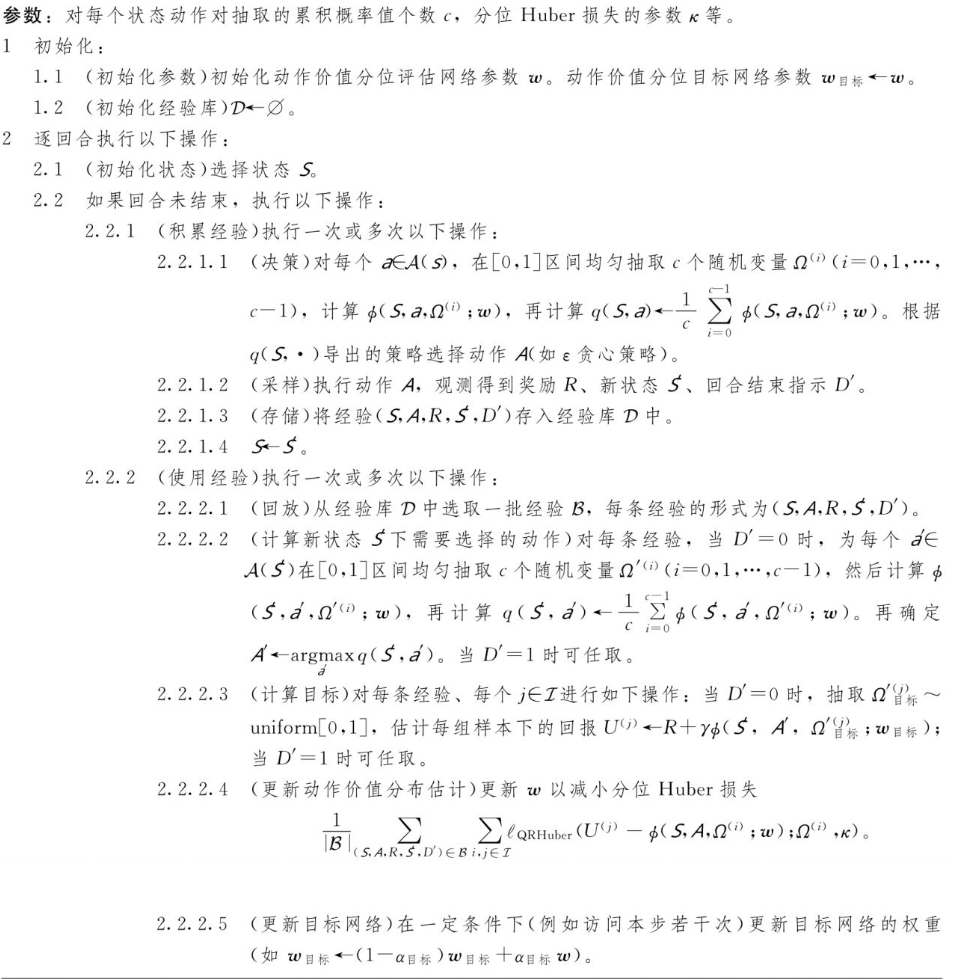

<!--
 * @version:
 * @Author:  StevenJokess（蔡舒起） https://github.com/StevenJokess
 * @Date: 2023-10-06 21:48:57
 * @LastEditors:  StevenJokess（蔡舒起） https://github.com/StevenJokess
 * @LastEditTime: 2023-10-06 21:53:37
 * @Description:
 * @Help me: make friends by a867907127@gmail.com and help me get some “foreign” things or service I need in life; 如有帮助，请资助，失业3年了。
 * @TODO::
 * @Reference:
-->

# 含蓄分位网络算法

本节介绍含蓄分位网络(Implicit Quantile Networks，IQN)算法。它是在分位数 回归深度 $Q$ 网络算法的基础上修改而来。含蓄分位网络算法的原理如下：考虑最大 化回报期望的情况。为了估计给定状态动作对 $(s, a)$ 的动作价值随机变量 $Q(s, a)$ 的期 望 $\mathrm{E}[Q(s, a)]=\mathrm{E} \Omega \sim$ uniform $[0,1][\phi Q(s, a)(\Omega)]$ ，在单位均匀分布 uniform $[0,1]$ 抽取 $c$ 个随机样本 $\omega^{(I)}(i=0,1, \ldots, c-1)$ 作为累积概率值，然后用分位络 $\phi$ 得到在这些累积概 率值下的分位值 $\phi\left(s ， a ， \omega^{(l)}\right.$ ； w)，并且用它们的平均 $\frac{1}{c} \sum_{i=0}^{-1} \phi\left(s, a, \omega^{(i)} ; w\right)$ 作为动作价 值的估计。算法12-4给出了具体的算法。

