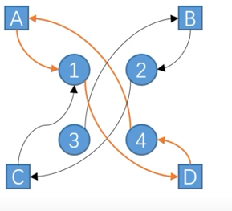
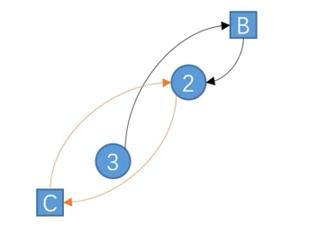

# 博弈规则的设计

博弈策略求解是博弈问题中的一个重要内容，另外一个重要的内容是博弈规则的设计：

也就是说，假设博弈的参与者都是足够理性的，如何设计一个博弈规则能确保公正性或者达到设计者的最大利益。主要的难点是：规则复杂，计算量大。

主要应用于：

- 拍卖竞价：互联网广告投放、车牌竞价
- 供需匹配：污染权、学校录取
- 公正选举：选举制度、表决制度、议席分配

## 匹配理论

匹配理论作为新兴的经济学分支，最早被两位美国数学家戴维·盖尔（David Gale）和沙普利(Shapley)提出并应用于大学录取与婚姻匹配问题，它是对市场双边匹配功能进行系统化研究而得出的，如工人和企业、学校和学生的匹配等，其中“双边”指的是市场中的参与者始终只属于两个互不相交的集合之一，“匹配”指的是市场双边交换的本质，即各自“敏感性偏好清单”。根据双边匹配理论的匹配稳定存在性可将其分为三种类型：一对一、多对一、多对多的双边匹配理论。沙普利采用合作博弈理论，在比较了不同匹配方法的基础上，用“Gale-Shapley 算法”来保证总能获得稳定的匹配，这一算法还可对各方试图操纵匹配过程的做法加以限制。

罗斯是最早明确公开提出双边匹配概念的，他认为双边就是指事先被指定好的两个互不相交的集合，而双边匹配是指在这些市场中双边代理人的匹配。他不仅明确地界定了“双边”和“双边匹配”的概念，而且发现稳定是市场机制运行成功的关键因素并将匹配理论应用到市场设计实践之中，设计了一系列市场的匹配机制，如医疗市场清算中心、公立学校选择及肾交换市场等使匹配更有效率。这些实际应用对人类福利产生了广泛而重大的影响。

沙普利设计的Gale-Shapley算法和最大交易圈子算法完美地解决了稳定匹配问题。罗斯在其算法的基础上，研究能够改善市场绩效的机制，阐明了稳定性与激励兼容的重要性，为原有的配对方法加入具体环境与伦理道德等限制条件，结出了市场设计的“硕果”。沙普利和罗斯两位寞基者的研究尽管是各自独立完成的，但却是一种“绝配”，堪称理论与实践完美结合的典范，因此他们共同获得了2012年度诺贝尔经济学奖。[1]

### Gale-Shapley 算法

 在规则设计里面有不同的算法，比方说有GS算法：

- 在生活中，人们通常会碰到与资源匹配相关的决策问题(如求职就业、报考录取等)，这些需要双向选择的情况被称为是双边匹配问题。在双边匹配问题中，需要双方互相满足对方的需求才会达成匹配。
- 稳定匹配问题（stable matching）：匹配的稳定是指没有任何人能从偏离稳定状态中获益。如果将匹配问题看做是一种合作博弈的话，稳定状态解就是纳什均衡解。[7]
- 1962年，美国数学家大卫·盖尔和博弈论学家沙普利提出了针对双边稳定匹配问题的解决算法，并将其应用于稳定婚姻问题的求解。
- 稳定婚姻问题(stable marriage problem)是指在给定成员偏好的条件下，分两组成员寻找稳定匹配。由于这种匹配并不是简单地价高者得，所以匹配解法应考虑双方意愿。
- 稳定婚姻问题的稳定解是指不存在未达成匹配的两个人都更倾向于选择对方胜过自己当前的匹配对象。[9]


#### 应用：稳定婚姻问题（stable marriage problem）

​假设有n个男女，每个人都对异性有一个喜欢程度的排名，怎么样为这群单身男女牵线搭桥能让最后匹配的婚姻都是稳定的？

原理：

1. 所有男性按照好感的高低向对应女性求婚
1. 每个女性在所有的向她发出求婚的男性和其丈夫（如果暂无丈夫则不做比较）选择一个最喜欢的，如果这个最喜欢的是当前的丈夫，则婚姻关系不变，否则与当前丈夫离婚，并与向她发出求婚请求的男性结婚
1. 在每个女性处理完后，统计是否还有男性单身（被离婚的将加入单身行列），如果有，则重复上述过程，否则结束

注意：每个单身男性会依次按照其对每个女性的好感的从大到小向对应女性求婚，如果求婚过该女性，无论是否当前求婚被接受，后续都将不再向该女性求婚。

由于每个男生最多向每个女生求婚一次，因此最多 n^2 次后，算法将完成，其中 n 是男生和女生的数量。时间复杂度：O(n^2)[3]

视频[2]

##### 代码

抄自[4]

```py
from collections import deque
def find_free_partner(boys, girls, sort_boy_to_girl, sort_girl_to_boy):
    # 当前选择的舞伴
    current_boys = dict(zip(boys, [None]*len(boys)))
    current_girls = dict(zip(girls, [None]*len(girls)))
    # current_boys = {boys[0]:None, boys[1]:None, boys[2]:None, boys[3]:None}
    # current_girls = {girls[0]:None, girls[1]:None, girls[2]:None, boys[3]:None}
    count = len(boys)

    # 建立队列，男孩下一次选择的女孩
    next_select = dict(zip(boys, [None]*len(boys)))
    for i in range(count):
        temp = [girls[m-1] for m in sort_boy_to_girl[i]]
        next_select[boys[i]] = deque(temp)

    # 女孩选择男孩字典
    sort_girl = dict(zip(girls, [None]*len(boys)))
    for i in range(count):
        # 通过题目给出的sort_girl_to_boy字典,排在前面的名字好感度比较高
        temp = [[boys[m-1], 4-ind] for ind, m in enumerate(sort_girl_to_boy[i])]
        name, love = [], []
        for t in temp:
            name.append(t[0])
            love.append(t[1])
        sort_girl[girls[i]] = dict(zip(name, love))

    while None in current_boys.values():
        for i in range(count):
            bid = boys[i]
            if current_boys[bid]:
                # 男孩有对象，跳过
                continue
            else:
                # 优先选择的女孩
                select = next_select[bid][0]
                if current_girls[select] == None:
                    # 女孩没对象，两者结合
                    current_boys[bid] = select
                    current_girls[select] = bid
                    next_select[bid].popleft()
                else:
                    # 和女孩的对象好感度对比,如果对现任的好感度,大于第三者,不动
                    if sort_girl[select][current_girls[select]] > sort_girl[select][bid]:
                        next_select[bid].popleft()
                    # 如果与上面相反
                    # 现任男孩失恋,第三者男孩选择了当前女孩,当前女孩选择了第三者男孩
                    # 第三者男孩失去对当前女孩的追求权(本算法不能对同一女士追求两次)
                    else:
                        current_boys[current_girls[select]] = None
                        current_boys[bid] = select
                        current_girls[select] = bid
                        next_select[bid].popleft()
    return current_boys

## 初始化
boys = ["Alex", "David", "Bob", "Chris"]
girls = ["Ada", "Becky", "Cindy", "Diana"]

# 偏爱列表
sort_boy_to_girl = [[1, 4, 3, 2], [3, 1, 2, 4],
                    [1, 2, 3, 4], [2, 4, 3, 1]]
sort_girl_to_boy = [[4, 1, 3, 2], [1, 2, 4, 3],
                    [3, 2, 4, 1], [2, 3, 1, 4]]

print(find_free_partner(boys, girls, sort_boy_to_girl, sort_girl_to_boy))
```

##### 坏处：

因为很多人都有意无意的将这个搞对象的方法在现实中进行实践。但其中绝大部分人在实践过程中都透出了浓浓的渣味。好好的算法却活脱脱的变成渣男、渣女养成准则，估计盖尔和沙普利的棺材板快压不住了吧。[5]

##### 分析：

当存在多个稳定匹配时，只要邀约的发出方不滥发邀约（一轮只邀约一个人），匹配的结果对**邀约的发出方有利。**如果滥发邀约（例如每轮邀约所有可接受者），则相当于角色对调，结果对邀约的接收方有利。[6]

如果不允许延迟选择，必须当即拍板，则问题转化为秘书问题。 TODO:

### 最大交易圈算法(Top-Trading Cycle algorithm)

- 在匹配问题中，还有一类交换不可分的标的物的匹配问题，被称为单边匹配问题，如远古时期以物易物、或者宿舍的床位分配·1974年，沙普利和斯卡夫提出了针对单边匹配问题的稳定匹配算法：最大交易圈算法(TTC)，[8]
- 算法过程如下：
  1. 首先每个交易者连接一条指向他最喜欢的标的物的边，并从每一个标的物连接到其占有者或是具有高优先权的交易者。
  2. 此时形成一张有向图，且必存在交易圈，对于交易圈中的交易者，将每人指向节点所代表的标的物赋予其，同时交易者放弃原先占有的标的物，占有者和匹配成功的标的物离开匹配市场。
  3. 接着从剩余的交易者和标的物之间重复进行交易圈匹配，知道无法形成交易圈，算法停止。

#### 应用：室友匹配问题

假设某寝室有A、B、C、D四位同学和1、2、3、4四个床位，当前给A、B、C、D四位同学随机分配4、3、2、1四个床位

已知四位同学对床位偏好如下：

| 同学 | 偏好 |
| ---- | ---- |
| A | 1>2>3>4 |
| B | 2>1>4>3 |
| C | 1>2>4>3 |
| D | 4>3>1>2 |

解：

第一轮：依照算法步骤可得如下匹配图：



可以看出：

- 1）A和D之间构成一个交易圈，可达成交易，所以A得到床位1，D得到床位4；
- 2）A和D以及1和4从匹配图中移除

第二轮：依照算法步骤可得匹配图：



- 可以看出，B和C都希望得到床位2，无法再构成交易圈，但是由于C是床位的本身拥有者，所以C仍然得到床位2，B只能选择床位3。

- 最后交易结果A1,B→3，C→2，D→4。

[1]: https://books.google.co.jp/books?id=IqdWEAAAQBAJ&pg=PT46&lpg=PT46&dq=Gale-+Shapley+%E7%AE%97%E6%B3%95&source=bl&ots=jWbRpi7WJm&sig=ACfU3U2jJiSLwHcYLqRjFxVEXHFDRLOvOA&hl=en&sa=X&ved=2ahUKEwjd4NPTmvD-AhWuplYBHbwhCecQ6AF6BQjtARAD#v=onepage&q=Gale-%20Shapley%20%E7%AE%97%E6%B3%95&f=false
[2]: https://www.bilibili.com/video/BV1uq4y177Hc/
[3]: https://blog.csdn.net/weixin_43900869/article/details/127352998
[4]: https://www.bilibili.com/read/cv13023598
[5]: https://www.zytec.cn/blog/1/post/zhihuixiaoyuan-63
[6]: https://note.xianqiao.wang/post/gale-shapley-suan-fa
[7]: https://www.youtube.com/watch?v=4KqYUNJ0JtE&list=PLx6Ogsi0q01nDl_jI48aw5a2qSFabHtlq&index=19
[8]: https://www.youtube.com/watch?v=4KqYUNJ0JtE&list=PLx6Ogsi0q01nDl_jI48aw5a2qSFabHtlq&index=19
[9]: https://aijishu.com/a/1060000000089469
