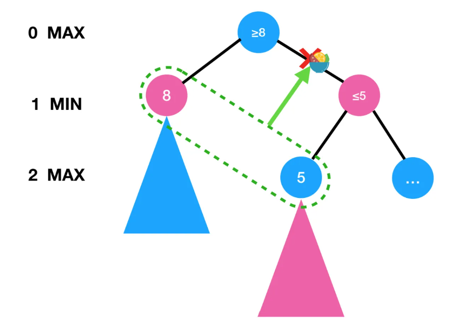

<!--
 * @version:
 * @Author:  StevenJokess（蔡舒起） https://github.com/StevenJokess
 * @Date: 2023-03-21 22:38:59
 * @LastEditors:  StevenJokess（蔡舒起） https://github.com/StevenJokess
 * @LastEditTime: 2023-09-04 22:05:48
 * @Description:
 * @Help me: 如有帮助，请赞助，失业3年了。
 * @TODO::
 * @Reference:
-->

# 完美信息的机器博弈

## 机器博弈

博弈行为是多个带有相互竞争性质的智能体，为达到各自目标和利益，采取的带有对抗性质的行为，即“两害相权取其轻，两利相权取其重”。博弈是健壮人工智能所需内在秉性。

## 本节讨论的博弈论——组合博弈论（Combinatorial game theory）

本节的“博弈”是两人对弈的完美信息博弈[15]，即专指博弈论专家们称为**有完整信息** （perfect information，它包括过去的、现在的状态 和 已经用过的、将可用招数全都可知）的、确定性的、轮流行动的、两个游戏者的零和游戏（如国际象棋）。这一般被叫做组合博弈论（Combinatorial game theory）[27]。

术语中，这是指在确定的、完全可观察的环境中两个 Agent必须**轮流**行动，在游戏结束时效用值总是相等并且符号相反。例如下国际象棋，一个棋手赢了，则对手一定是输了。正是 Agent 之间效用函数的对立导致了环境是对抗的。

## 常用于棋牌类

对于人工智能研究人员来说，博弈的抽象特性使得博弈成为感兴趣的研究对象。博弈游戏中的状态很容易表示，Agent 的行动数目通常受限，而行动的输出都有严谨的规则来定义。体育游戏如台球和冰球，则有复杂得多的描述，有更大范围的可能行动，也有不够严谨的规则来定义行动的合法性。所以除了足球机器人，体育游戏目前并没有吸引人工智能领域的很大兴趣。

博弈因为难于求解而更加令人感兴趣。例如国际象棋的平均分支因子大约是 35，一盘棋一般每个棋手走 50 步，所以搜索树大约有 $35^{100}$ 或者 $10^{154}$ 个结点（尽管搜索图“只可能”有大约 $10^{40}$ 个不同的结点）。如同现实世界，博弈要求具备在无法计算出最优决策的情况下也要给出某种决策的能力。博弈对于低效率有严厉的惩罚。在其他条件相同的情况下，只有一半效率的 A*搜索意味着运行两倍长的时间，于是只能以一半效率利用可用时间的国际象棋程序就很可能被击败。所以，博弈在如何尽可能地利用好时间上产生了一些有趣的研究结果。

## 井字棋（Tic-Tac-Toe）

下面讨论两人参与的井字棋（Tic-Tac-Toe）[5]，井字棋是一种在3 * 3格子上进行的连珠游戏，和五子棋类似，分别代表O和X的两个游戏者轮流在格子里留下标记（一般来说先手者为X），任意三个标记形成一条直线，则为获胜。[6]

可见：它是完美信息、确定性、零和博弈、每个代理交替行动的零和博弈的一种游戏。[23]（可见：[AI中的游戏类型](../chapter_appendix-applications-for-deep-reinforcement-learning/game.md)和[博弈的分类](game_theory_intro.md)）

玩家分别是MAX 和 MIN，马上就会讨论玩家这样命名的原因。

MAX 先行，两人轮流出招，直到游戏结束。游戏结束时给优胜者加分，给失败者罚分。游戏可以形式化成含有下列组成部分的一类搜索问题。

- $S_0$：初始状态，规范游戏开始时的情况。
- $PLAYER(s)$：定义此时该谁行动。
- $ACTIONS(s)$：返回此状态下的合法移动集合。
- $RESULT(s,a)$：转移模型，定义行动的结果。
- $TERMINAL-TEST(s)$：终止测试，游戏结束返回真，否则返回假。游戏结束的状态称为终止状态。
- $UTILITY(s,p)$：效用函数（也可称为目标函数或收益函数），定义游戏者 p 在终止状态 s 下的数值。在国际象棋中，结果是赢、输或平，分别赋予数值+1，0，或 1/2。有些游戏可能有更多的结果，例如 双陆棋的结果是从 0 到+192。零和博弈是指在同样的棋局实例中所有棋手的总收益**都一样**的情况。国际象棋是零和博弈，棋局的收益是 0+1，1+0 或1/2 + 1/2。“常量和”可能是更好的术语，但称为零和更传统，可以将这看成是下棋前每个棋手都被收了 1/2 的入场费。

### 博弈树及

博弈树（game tree），又称游戏树、竞赛树。[26] 定义：它是来表达一个博弈中各种后续可能性的树。

博弈树的每个节点都代表一个状态，其下一个状态的集合构成了状态的子节点，比如任意一个棋盘局面就是一个状态，该局面下所有可能落子的情况形成的新局面集合，构成了该状态的子节点。[17]

初始状态、ACTIONS 函数和 RESULT 函数定义了游戏的**博弈树**——其中结点是状态，边是移动。图 5.1 给出了井字棋的部分博弈树。顺嘴一提，井字棋会有26,830个叶节点。[28]

在初始状态 MAX 有九种可能的棋招。游戏轮流进行，MAX 下 X，MIN 下 O，直到到达了树的终止状态即一位棋手的标志占领一行、一列、一对角线或所有方格都被填满。

### 玩家为何如此命名

叶结点上的数字是该终止状态对于 MAX 来说的**效用值**；值越高对 MAX 越有利，而对 MIN 则越不利。


最上面的结点是初始状态，MAX 先走棋，放置一个 X 在空位上。图显示了博弈树的一部分搜索，给出 MIN 和 MAX 的轮流走棋过程，直到到达终止状态，所有终止状态都按照游戏规则被赋予了效用值。

而在中间过程，为了计算机处理，也有那么一个先行方的效用估计值（来对应到强化学习里是状态的价值[14]），来先去估计局面对先行方的有利程度并将其量化。

所谓理性是指，尽量想办法使得自己获得更大的赢面。那么自己理性，且悲观[4]地认为对方也总是理性的情况下，各方总是选择对自己最有利的节点作为自己的走步，即都执行最优策略。因为是相互对抗的，对自己最有利，总是对对方最不利。

**具体来说**：
  - 先行方，总想使其效用估计值尽量大，故总是选择具有极大值的节点作为自己的走步，故可叫MAX。
  - 后行方，试图反制先行方，总想使其其效用估计值最小，故总是选择具有极小值的节点作为自己的走步，故可叫MIN。

MAX、MIN交替走步过程的图示如下，


其中，极大、极小节点的值则是从叶节点到根节点这样的逆向运算所得，然后才按红色路径（理性情况）发生实际动作过程。

## 博弈中的优化决策

在一般搜索问题中，最优解是到达目标状态的一系列行动——终止状态即为取胜。在对抗搜索中，MIN 在博弈中也有发言权。因此 MAX 必须找到应急策略，制定出 MAX 初始状态下应该采取的行动，接着是 MIN 行棋，MAX 再行棋时要考虑到 MIN 的每种可能的回应，依此类推。这有些类似于 AND-OR 搜索算法（图 4.11），MAX 类似于 OR 结点，MIN 类似于 AND 结点。[29]粗略地说，当对手不犯错误时最优策略能够得到至少不比任何其他策略差的结果。我们将从寻找最优策略开始。

即使是井字棋这样简单的游戏，也很难在一页画出它的整个博弈树，所以讨论如图 5.2所示的更简单游戏。在根结点 MAX 的可能行棋为 a1，a2和 a3。对于 a1，MIN 可能的对策有 b1，b2和 b3，等等。这个特别的游戏在 MAX 和 MIN 各走一步后结束（按照博弈的说法，这棵博弈树的深度是一步，这包括两个单方招数，每个单方招数称为一层）。终止状态的效用值范围是从 2 到 14。

给定一棵博弈树，最优策略可以通过检查每个结点的极小极大值来决定， 记为Minimax(n)。假设两个游戏者始终按照最优策略行棋，那么结点的极小极大值就是对应状态的效用值（对于 MAX 而言）。显然地，终止状态的极小极大值就是它的效用值自身。更进一步，对于给定的选择，MAX 喜欢移动到有极大值的状态，而 MIN 喜欢移动到有极小值的状态。所以得到如下公式：

对 MAX 的最挂行棋进行求解时做了 MIN 也按最佳行棋的假设——尽可能最大化MAX 的最坏情况。如果 MIN 不按最佳行棋行动怎么办？这种情况下显然（习题 5.7）MAX可以做得更好。可能有一些策略在对付非最优化对手方面做得比极小极大策略好，但是用这些策略对付最优化对手则会得到更差的结果。

##  最小最大树搜索（Minimax Tree Search）

![Minimax 树搜索的棋盘[8]](../../img/minimax_tree_search.png)

假设局面是否有利可以用一个分值表示，可把它记录在树结点上，大于0的分值表示对甲方有利，而小于0的分值表示对乙方有利，等于0则表示双方势均力敌，是一个双方都可以接受的局面。[11]

> 那分值具体来说是如何得到的？
>
> - 对于tic-tac-toe，状态空间小、只需最多几秒就能搜索一个动作、只用最后的游戏结果去回溯得到价值是可行的（feasible）[14]
> - 而对于复杂游戏value function其实是很难构建的（handcraft）。
> - 以五子棋（Gobang/Gomoku）为例，15*15的棋盘大小。规则要五子连起来，更复杂。用最后的游戏结果去回溯得到价值是不可行的（impractical）。人工定义（human-defined）价值：五子定为100，四字定位80，双三90，...
> - 再比如，国际象棋的深蓝，据其研发者介绍说，他们聘请了好几位国际象棋大师帮助他们整理知识，用于估算分值。但是基本思想并不复杂，大概就是根据甲乙双方剩余棋子进行加权求和，比如一个皇后算10分，一个车算7分，一个马算4分等。然后还要考虑棋子是否具有保护，比如两个相互保护的马，分数会更高一些，其他棋子也是大体如此。然后再考虑各种残局等，按照残局的结果进行估分。当然，这里我们给出的各个棋子的分数只是大概而已。最后甲方得分减去乙方得分就是该棋局的分值。[12]
> - 而对于围棋，19*19的棋盘大小，规则超复杂，用最后的游戏结果去回溯得到价值是不可行的（impractical）。人工定义价值，可用人类专家棋谱的监督学习，但历史棋谱也只占所有可能的很小部分。解决方法：用人类专家棋谱去训练价值函数 + 用蒙特卡洛数搜索去只搜索较小的空间。详见[AlphaGo](../chapter_appendix-applications-for-deep-reinforcement-learning/AlphaGo.md)


如果树的层数比较浅，我们可以**穷举**计算每个节点输赢的概率，那么可以使用一种最简单的策略，叫做Minimax算法。

### Minimax算法

Minimax算法是一种递归或回溯算法，用于决策和博弈论。它为玩家提供了一个最佳的动作，以应对博弈中最不利的情况，即假设的对手是最佳状态的。[22]

Minimax算法的基本思路是这样的，从树的叶子结点开始看，如果是本方回合就选择Max的，如果是对方回合就选择Min的（实际上这也是假设对方是聪明的也会使用Minimax算法）。

可以这么认为，每次我都需要从对手给我选择的最差（Min）局面中选出最好（Max）的一个，这就是这个算法名称 Minimax 的意义。[19]

> Minimax算法到最后会到达一个博弈论里的*纳什均衡点*（附录有相关定理）。因此，我们可以推出著名的几个理论比如井字棋是必定和棋，五子棋在8*8以下的棋盘是和棋，以上的则是先手必胜。


#### 伪代码[20]


```pseudocode
Func Minimax(node, ):
  if node is a terminal node
    return value of the node
  if node is a "MIN" node
    bestV = +infinity
    for all child node:
      bestV = min(bestV, Minimax(childnode))
  else:
    bestV = -infinity
    for all child node:
      bestV = max(bestV, Minimax(childnode))
  return bestV
```

#### Python代码[19]

```py
def mini_max(node):
    if node.child is None:
        return node.value

    if not node.is_max: # 不是“MAX”层的节点，即是“MAX”层的节点！
        best_value = float('inf')
        for c in node.child:
            best_value = min(best_value, mini_max(c))
    else:
        best_value = -float('inf')
        for c in node.child:
            best_value = max(best_value, mini_max(c))
    return best_value
```

### Negamax

只比MAX值，原MIN层是单次的负，MAX是双次的负。

#### 伪代码[20]

```pseudocode
Func Negamax(node, ):
  if node is a terminal node
    return -value of the node

    bestV = -infinity
    for all child node:
      bestV = max(bestV, -Negamax(childnode))
```

#### Python代码[19]

```py
def negative_max(node):
    if node.child is None:
        return -node.value

    best_value = -float('inf')
    for c in node.child:
        best_value = -max(best_value, negative_max(c))
    return best_value
```

#### minimax算法的性质和优缺点

优点：

- 简单有效地体现了对抗手段。
- 具备完备性（complete），只要决策树有限，且其数量用计算机的算力能处理。
- 具备最优性（optimal），当对手是理性（尽力而为）的。

时空复杂度：

- 对于一个树的有b分支树，其树的最大深度为m，
- 时间复杂度：执行DFS时，MiniMax算法的时间复杂度为O(b^m)
- 空间复杂度：类似于DFS，即O(bm)。[23]

缺点：

- 由时间复杂度的指数级得，如果每一层的搜索空间都很大，这种方法就极其得低效率了也不太可能穷举出所有的可能性。[10]
- 当决策树过多时，如国际象棋和围棋就很难处理了。下面将具体展开讨论：

##### 围棋：不可行

以围棋为例，我们把围棋的每一步所有可能选择都作为树的节点，第零层只有1个根节点，第1层就有361种下子可能和节点，第2层有360种下子可能和节点，这是一颗非常大的树。

> - 游戏-树尺寸（Game-tree Size）：$361! ≈ 10^768$
> - 游戏-树复杂度（Game-tree Size）Complexity）：$250^150 ≈ 10^360$；对比，Tic-Tac-Toe：$10^5$，Chess：$10^123$，用质子去填满全宇宙，需要：$10^122$个

如果我们只有有限次评价次数，对于围棋，Minimax方法就是不可行的（往往只能跑2-3层，太浅了）[3]

##### 国际象棋：可改进

以下国际象棋的深蓝（Deep Blue）为例，基本上要搜索12步，搜索树的节点数在 $10^{18}$ 量级，据估算，即便在深蓝这样的专用计算机上，完成一次搜索也需要大概17年的时间，[11]

好在，深蓝还告诉我们，可以通过 Alpha-Beta 算法对这个搜索树剪枝成部分的博弈树（partial game tree），来提高搜索效率。所谓

> 相关历史：
>
> - Alpha-Beta 算法：它是著名人工智能学者、图灵奖获得者约翰·麦卡锡在50年代就开始从事计算机下棋方面的研究工作[10]
> - 深蓝：1996年，正值人工智能诞生40周年之际，一场举世瞩目的国际象棋大战在深蓝与卡斯帕罗夫之间举行，可惜当时的深蓝功夫欠佳，以2:4的比分败下阵来。1997年，经过改进的深蓝再战卡斯帕罗夫，这次深蓝不负众望，终于以3.5:2.5的比分战胜卡斯帕罗夫，可以说是人工智能发展史上的一个里程碑事件。

## Alpha-Beta 剪枝（Alpha-Beta Pruning）

### 剪枝概念介绍

- 剪枝：搜索常用的优化手段，把指数级的复杂度，优化到近似多项式的复杂度。
- 把不佳的动作，或没必要的动作“剔除”掉，例如自杀。[28]
- 剪枝的关键：什么枝该剪、在什么地方剪。
- 剪枝分为BFS剪枝和DFS剪枝。[18]

### Alpha-Beta 剪枝

Alpha-Beta 剪枝，是DFS剪枝的一种形式，用于排除等效冗余的搜索，从而提高搜索算法的效率。（自己想的，也经过ChatGPT确认了。）

Alpha-Beta 剪枝通过省去探索没必要的节点，来提高搜索效率。

具体来说，

1. Alpha-Beta剪枝通过维护搜索窗口（search window）[α, β]的两个值，即Alpha和Beta，来对搜索进行剪枝。
  其中，
  - Alpha表示MAX节点在搜索路径上已找到的最好（最大）值。那么显然，Alpha 的值初始化应设置为 $-\infty$；如果n是MIN节点，如果n的一个后续节点可提供的收益小于a，则n及其后续节点可被剪枝。
  - Beta表示MIN节点在搜索路径上已找到的最好（最小）值。那么显然，Beta 的值初始化为 $+\infty$；如果n是MAX节点，如果n的一个后续节点可获得收益大于B,则n及其后续节点可被剪枝。
2. 如果出现了某个节点的值 Beta_new <= Alpha 或 Alpha_new >= Beta 的情况，则不用搜索该节点的其他子树了，该部分将被忽略，即被剪枝。[19]
3. 这样就避免了对等效的搜索节点进行重复搜索，减少了搜索的计算量，提高了搜索效率。
4. 注意：搜索的顺序一般是从左向右，或者是从右向左，而不是自上而下。

### 应用

1958 年，Newell，Shaw 和 Simon 第一次在国际象棋程序中使用 Alpha-Beta 剪枝搜索算法.Alpha-beta 剪枝算法是min-max 搜索算法的改进，通过剪掉明显次优的子树分支，该算法极大地降低了搜索空间.  该算法最初由McCarthy 在1956 年提出。[25]

#### 例子

##### 例一（最简单）：



如果在下层的MAX节点发现得到的值为5，那么意味着上层的MIN节点的数值一定不大于5。而如果本层的MAX节点的值已经至少为8（比如因为下层的MIN节点为8），那么就可以剪掉右边的分支（即右边的分支不必继续探索）。[16]

如果用Alpha、Beta值来规范化描述算法的具体过程：

1. 1步Min节点：左 Beta=8 -> 0步Max节点：下界Alpha=8 -> 1步Min节点：右 下界Alpha=8
2. 2步Max节点的5值 -> 1步Min节点：右 上界Beta_new =5 -> 出现了 Beta_new <= Alpha 的情况 -> 不用搜索1步Min节点：右的其他子树，即剪枝“...”的节点。

##### 例二（较复杂）：


1. 剪枝一：由于Rival会选择最小化奖励，不会选择 $>=6$ 这个状态，所以不需要再去搜索$>=6$这个状态后的另一状态。
2. 剪枝二：由于Agent会选择最大化奖励，不会选择 $<=3$ 这个状态，所以不需要再去搜索$<=3$ 这个状态后的状态。

注意：下棋每一步都是树搜索，这与强化学习的策略不同。

##### 例三（很复杂）：


- 蓝色符号代表处理顺序，处理顺序是1按中序遍历[13]的变体（$L -> V_0 -> R_1 -> V_1 -> R_2 -> V_2-...$），
  - 其中，
  - $L$ 代表左子节点， $V$ 代表父节点，$R_i$代表左子节点右侧的第i节点，
  - $L -> V_0$ 代表从左子节点回到父节点尝试分值的更新过程。
  - $R_i -> V_i$ 代表从左子节点右侧的第i节点再回到父节点尝试分值的更新过程。
- 绿色不等式是父节点根据已有的子节点得到的分值范围，绿色不等式的右侧值是分值更新需比较的条件
- 红色不等式代表更新失败，紫色不等式代表更新成功。
- 红色框是被剪枝的内容，可知剪枝发生在第9、15、36步。

## 最好情况的复杂度

由例一得，如果我们运气很好（实际中依赖估值函数预先猜几个），直接搜到了最好的情况， Alpha-Beta可以剪去大部分分支。在这种情况下，复杂度可以约化为 $\sqrt{b^d}$ ，也就是 $b^{\frac{d}{2}}$ (证明 略）。这是很有趣的事情：虽然Alpha-Beta剪枝优化的是分支因子 $b$ ，但是在算法的实际运行中，效果反而类似于优化了深度 $d$ 。良好的Alpha-Beta剪枝可以使得算力相同时搜索深度增大一倍，而能看远一倍的对手是非常可怕的。[16]

#### Alpha-Beta剪枝 Minimax的伪代码[20]

```pseudocode
Func ABMinimax(node, alpha, beta):
  if node is a terminal node
    return value of the node

  if node is a "MIN" node
    bestV = +infinity
    for all child node:
      value = ABMinimax(childnode, alpha, beta)
      bestV = min(bestV, value)
      beta = min(beta, bestV)
      if alpha >= beta break
  else:
    bestV = -infinity
    for all child node:
      value = ABMinimax(childnode, alpha, beta)
      bestV = max(bestV, value)
      alpha = max(alpha, bestV)
      if alpha >= beta break
  return bestV
```

#### Alpha-Beta剪枝 Minimax的Python代码[19]

```py
def alpha_beta(node, alpha, beta):
    # alpha表示己方,要提高到最大利益,beta表示敌方,要降到最小利益
    # alpha大于beta的时候就可以开始剪枝了,因为己方收益已经可以保证大于敌方收益了
    # min层修改beta(最小化敌方收益),max层修改alpha(最大化己方收益)
    if node.child is None:
        return node.value
    if not node.is_max:
        # 该层为min层,要最小化敌方收益,所以best_value取越小越好(初始一个无穷大)
        best_value = float('inf')
        for c in node.child:
            value = alpha_beta(c, alpha, beta)
            best_value = min(best_value, value)
            beta = min(beta, best_value)
            if alpha >= beta:
                break
    else:
        # 该层为max层,要最大化己方收益,所以best_value取越大越好(初始一个无穷小)
        best_value = -float('inf')
        for c in node.child:
            value = alpha_beta(c, alpha, beta)
            best_value = max(best_value, value)
            alpha = max(alpha, best_value)
            if alpha >= beta:
                break
    return best_value
```


#### Alpha-Beta剪枝 Negamax的伪代码[20]

```pseudocode
Func ABNegamax(node, alpha, beta):
  if node is a terminal node
    return - value of the node

  bestV = -infinity
  for all child node:
    value = ABMinimax(childnode, alpha, beta)
    bestV = min(bestV, value)
    beta = min(alpha, bestV)
    if alpha >= beta break
  return bestV
```


#### Alpha-Beta剪枝 Negamax的Python代码[19]

TODO

### Alpha-Beta剪枝的优缺点

优点：

- 剪枝本身不影响算法输出结果
- 虽然，节点先后次序会影响剪枝效率。但，如果节点次序“恰到好处”，alpha-beta剪枝是时间复杂度为 $O(b^m/2)$ 而，最大最小搜索时间复杂度为 $O(b^m)$ 。[30]

缺点：

- 即使加上一些剪枝和规则判断的过程，Minimax搜索的过程效率还是不高的。[15]
- 并且Minimax搜索也不能应用到一些非完全信息博弈游戏（如扑克，桥牌）和非确定性的游戏（如大富翁，双陆棋）上。直到了2007年的时候，一种新的树搜索方法被发明和应用到游戏中：[蒙特卡洛树搜索Monte Carlo Tree Search(MCTS)](../chapter_model-based-algs/MCTS.md)，并取得了极大的成功。蒙特卡洛树搜索通过采样而非穷举方法来实现搜索。显然，这三种以及下面提到的改进算法，都属于博弈搜索（Game Rearch）的对抗搜索（Adversarial Search）。[30]


### Alpha-Beta剪枝的其他改进

- 渴望搜索是在 Alpha-Beta 搜索算法基础上，缩小搜索范围的改进算法。渴望搜索从一开始就使用小的窗口，从而在搜索之初，就可以进行大量的剪枝。通常，渴望搜索与遍历深化技术结合使用，以提高搜索性能。
- MTD(f)搜索[58]：MTD(f)算法实际上就是不断应用零窗口的 Alpha-Beta 搜索，缩小上界和下界，并移
动初始值使其接近最优着法。MTD(f)算法简单高效，在国际象棋、国际跳棋等博弈程序里，MTD(f)算法平
均表现出色。
- 此外，还有各种在 Alpha-Beta 搜索基础上优化的算法，例如，有学者提出在博弈树同层结点中，用广
度优先搜索，接力式空窗探测，平均搜索效率高于 MTD  (f)搜索。通常，裁剪算法需要与置换表技术相结
合，以减少博弈树的规模，提高搜索效率。[24]


## 总结

- 前向 Forward：起始状态（根节点）一直搜索状态到最终状态（叶节点）
- 反向 Back up：把各最终状态（叶节点）的价值反向传播到之前状态直到起始状态（根节点），其间可通过Alpha-Beta对搜索树剪枝来减少需要搜索的最终状态来提高搜索效率。

## 附录：纳什均衡点

纳什均衡（英语：Nash equilibrium，或称纳什均衡点）是指在包含两个或以上参与者的非合作博弈（Non-cooperative game）中，假设每个参与者都知道其他参与者的均衡策略的情况下，没有参与者可以透过改变自身策略使自身受益时的一个概念解。[9]

在Maximin和Minimax策略相同的情况下，我们可以得到一个稳定的策略，这就是所谓的**纳什均衡**。在纳什均衡下，每个玩家都无法通过单方面改变自己的策略来获得更多的收益。

## 附录：极小极大值定理（Minimax theorem）

冯·诺伊曼的极小极大值定理是说，具有有限多个纯策略的两人零和博弈在Maximin（最大化自己的最小收益）和Minimax策略（最小化对手的最大收益）情况下**有解**，即存在纳什均衡。这可以保证玩家在最坏的情况下最小化可能的损失。[1]

令 $X \subset \mathbb{R}^n$ 和 $Y \subset \mathbb{R}^m$ 是紧凸集，如果 $f: X \times Y \rightarrow \mathbb{R}$ 是一个连续的凸凹（convex-concave）函数，即：

$f(\cdot, y): X \rightarrow \mathbb{R}$ 对于固定的 y 是凸的，且：

$f(x, \cdot): Y \rightarrow \mathbb{R}$ 对于固定的 x 是凹的.

那么我们有

$\min_{x \in X} \max_{y \in Y} f(x, y) = \max_{y \in Y} \min_{x \in X} f(x, y).$

这个定理说的是对于一类特殊的函数，该函数沿着一个变量变化的方向是凸的，沿着另一个变量变化的方向是凹的（这可以视为一个马鞍面），那么在鞍点的时候，上式成立。[2]

[1]: https://zh.wikipedia.org/wiki/%E6%9C%80%E5%B0%8F%E6%9C%80%E5%A4%A7%E5%80%BC%E5%AE%9A%E7%90%86
[2]: https://www.zhihu.com/question/51080557/answer/671522746
[3]: https://zhuanlan.zhihu.com/p/520638488
[4]: https://www.cnblogs.com/lqblala/p/15302959.html
[5]: https://zh.wikipedia.org/zh-sg/%E4%BA%95%E5%AD%97%E6%A3%8B
[6]: https://www.cnblogs.com/royalflush/p/12460242.html
[7]: https://www.zhihu.com/question/30163532/answer/2356671861
[8]: https://www.bilibili.com/video/BV1464y127i7/?spm_id_from=333.999.0.0&vd_source=bca0a3605754a98491958094024e5fe3
[9]: https://zh.wikipedia.org/wiki/%E7%BA%B3%E4%BB%80%E5%9D%87%E8%A1%A1
[10]: https://www.bilibili.com/read/cv15543561?spm_id_from=333.999.0.0
[11]: https://www.bilibili.com/read/cv15573179?spm_id_from=333.999.0.0
[12]: https://www.bilibili.com/read/cv15584294?spm_id_from=333.999.0.0
[13]: https://zhuanlan.zhihu.com/p/56895993#:~:text=%E4%BA%8C%E5%8F%89%E6%A0%91%E7%9A%84%E9%81%8D%E5%8E%86%E6%96%B9%E5%BC%8F%E4%B8%BB%E8%A6%81,%E8%8A%82%E7%82%B9%EF%BC%8C%E5%B0%B1%E6%98%AF%E5%90%8E%E5%BA%8F%E9%81%8D%E5%8E%86%E3%80%82
[14]: https://www.bilibili.com/video/BV1Yz411e7cp/?spm_id_from=333.337.search-card.all.click&vd_source=bca0a3605754a98491958094024e5fe3
[15]: https://cloud.tencent.com/developer/news/257574
[16]: https://zhuanlan.zhihu.com/p/31809930#Rollout
[17]: https://www.bilibili.com/video/BV1hV4y1Q7TR/?spm_id_from=333.337.search-card.all.click&vd_source=bca0a3605754a98491958094024e5fe3
[18]: https://www.bilibili.com/video/BV1Aj411c7SS/?spm_id_from=333.999.0.0&vd_source=bca0a3605754a98491958094024e5fe3
[19]: https://juejin.cn/post/6844903575999479815
[20]: https://blog.csdn.net/weixin_38878828/article/details/123654601
[21]: https://www.bilibili.com/video/BV1bT4y1C7P5/?spm_id_from=333.337.search-card.all.click&vd_source=bca0a3605754a98491958094024e5fe3
[22]: https://www.yiibai.com/artificial-intelligence-tutorial/mini-max-algorithm-in-ai.html#article-start
[23]: https://www.yiibai.com/artificial-intelligence-tutorial/ai-adversarial-search.html
[24]: https://www.cs.sjtu.edu.cn/~linghe.kong/%E4%BA%BA%E5%B7%A5%E6%99%BA%E8%83%BD%E8%AE%B2%E4%B9%89%E5%86%AF%E7%BF%94.pdf
[25]: http://cjc.ict.ac.cn/online/onlinepaper/zl-202297212302.pdf
[26]: https://www.zwbk2009.com/zwbk.php?mymos=&zh=n&title=%E5%8D%9A%E5%BC%88%E6%A0%91
[27]: https://wiki.swarma.org/index.php/%E7%BB%84%E5%90%88%E5%8D%9A%E5%BC%88%E8%AE%BA
[28]: https://zh.wikipedia.org/zh-sg/%E7%AB%B6%E8%B3%BD%E6%A8%B9
[29]: https://en.wikipedia.org/wiki/And%E2%80%93or_tree
[30]: https://blog.csdn.net/qq_39297053/article/details/112130921


## 更多参考：

> 1.https://jwc.gdufe.edu.cn/_upload/article/files/68/96/872c060340f68ed6f57bd9450b2f/c651f566-3867-4bae-a585-68fe17cec17b.pdf
> 1. https://chat.openai.com ; Prompt：在Maximin和Minimax策略相同的情况下，我们可以得到一个稳定的策略，这就是所谓的纳什均衡。在纳什均衡下，每个玩家都无法通过单方面改变自己的策略来获得更多的收益。
> 1. https://zhuanlan.zhihu.com/p/58472297
> 1. https://zhuanlan.zhihu.com/p/427303297
