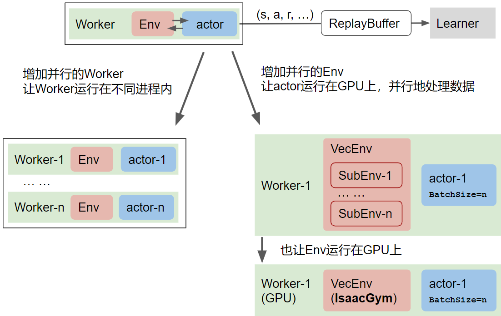
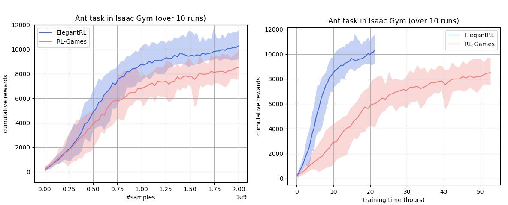

<!--
 * @version:
 * @Author:  StevenJokess（蔡舒起） https://github.com/StevenJokess
 * @Date: 2023-10-09 23:28:39
 * @LastEditors:  StevenJokess（蔡舒起） https://github.com/StevenJokess
 * @LastEditTime: 2023-10-09 23:29:33
 * @Description:
 * @Help me: make friends by a867907127@gmail.com and help me get some “foreign” things or service I need in life; 如有帮助，请资助，失业3年了。
 * @TODO::
 * @Reference:
-->
# Isaac Gym

## 加速

仿真环境Q的采样速度慢，是强化学习的一个瓶颈。例如，论文中常用的MuJoCo环境，台式机或服务器的CPU上运行仿真环境，一小时大概采集十万或百万步(1e5或16步)；训川练一个智能体（收敛后）需要十多个小时。

加快仿真环境的采样速度，通常有以下方法：

- 增加并行的Worker数(Multiple workers)
- 增加并行的Env数(Vectorized Env)

## Isaac Gym

NVIDIA 的 Isaac Gym（上图中右下角），用单块 GPU 一小时内可以采集一亿步（1e8 步）。也就是说，GPU 上的并行仿真环境，采样 速度快了两个量级! 下图是我们的一组测试结果
> Isaac Gym 的命名根据 Isaac Newton 艾萨克 · 牛顿

左图以采样数 \#samples 为横坐标，右图以训练时间 (hours) 为横坐标。上图中可以看到，GPU 并行仿真环境在一天内就达到 1e9 步

[1]: https://blog.csdn.net/sinat_39620217/article/details/131724602
