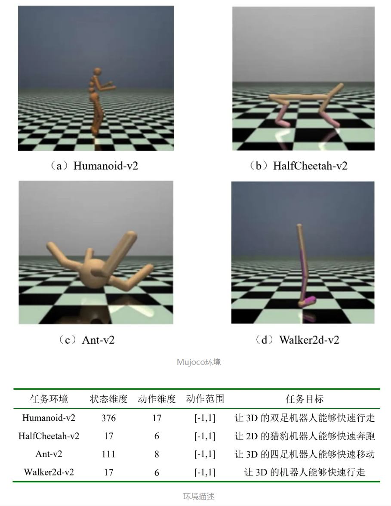

# Mujoco

## 简介

MuJoCo 是一个通用的物理引擎，全称是 Multi-Joint dynamics with Contact。 最初由 Roboti LLC 开发，在2021年10月份被 DeepMind 收购，2022年5月开源。

- 官网: https://mujoco.org/
- GitHub仓库: https://github.com/deepmind/mujoco
- 官方文档: https://mujoco.readthedocs.io/en/stable/overview.html
- 原 Roboti LLC: https://www.roboti.us/index.html

物理引擎传统上分为两类。机器人和生物力学引擎在广义或关节坐标中使用高效且准确的递归算法。然而，它们要么忽略了接触动力学，要么依赖于早期的弹簧阻尼器方法。此类引擎需要非常小的仿真步长。 游戏引擎使用更现代的方法，通过解决优化问题来找到接触力。然而，它们经常采用笛卡尔坐标系，通过数值的方法描述关节约束，当涉及复杂的运动结构时，会导致不准确和不稳定。 MuJoCo 是第一个将两者结合起来的通用物理引擎，广义坐标模拟 + 基于优化的接触动力学。

## 安装

安装：https://blog.csdn.net/qq_47997583/article/details/125400418?spm=1001.2014.3001.5502

安装mujoco

1、首先mujoco 21年10月份就开源了，也就是说不需要申请密钥就能直接使用，但是，新版本spinning up教程里不支持。。。所以我们要安装老版本的，这里我下载的mujoco200

mujoco旧版下载
​www.roboti.us/download.html
2、还有密钥license，现在开源后不需要用邮箱申请了，直接页面就能下载，并且使用期到2031年。

License
​www.roboti.us/license.html
3、在home文件夹下创建隐藏文件.mujoco

mkdir ~/.mujoco
4、然后去下载文件夹找到下载好的mujoco压缩包并解压到home下的.mujoco里面，这里注意以下，此时在隐藏文件夹.mujoco里有解压好的文件mujoco200_linux，这里一定要把这个文件夹的名字改成mujoco200，删掉后面的linux，不然后面安装mujoco-py时识别不了。

接着把下载好的密钥mjkey.txt分别复制到.mujoco和mujoco200/bin里

cp mjkey.txt ~/.mujoco
cp mjkey.txt ~/.mujoco/mujoco200/bin
5、添加环境变量，这里我添加的条数比其他教程上的要多，是我经过反复试验比较才确定的这种添加最后才不会报错。

打开bashrc文本

gedit ~/.bashrc
在.bashrc文本里添加：

export LD_LIBRARY_PATH=~/.mujoco/mujoco200/bin${LD_LIBRARY_PATH:+:${LD_LIBRARY_PATH}}
export MUJOCO_KEY_PATH=~/.mujoco${MUJOCO_KEY_PATH}
export LD_LIBRARY_PATH=$LD_LIBRARY_PATH:/usr/lib/nvidia
export PATH="$LD_LIBRARY_PATH:$PATH"
export LD_PRELOAD=/usr/lib/x86_64-linux-gnu/libGLEW.so

保存文件ctrl+s并退出文本，接着激活一下

source ~/.bashrc
6、测试mujoco200是否安装成功

cd ~/.mujoco/mujoco200/bin
./simulate ../model/humanoid.xml
如果出现下图则安装成功

三、安装mujoco-py

1、进入第一部分创建好的conda环境，环境名称spinningup（名称按照自己设定的写）

conda activate spinningup
或者
source activate spinningup
2、运行下面代码

sudo apt update
sudo apt-get install patchelf
sudo apt-get install python3-dev build-essential libssl-dev libffi-dev libxml2-dev
sudo apt-get install libxslt1-dev zlib1g-dev libglew1.5 libglew-dev python3-pip
3、下载mujoco-py安装包，这里我们直接用git克隆过来

sudo apt install git
cd ~/.mujoco
git clone https://github.com/openai/mujoco-py
cd mujoco-py
pip install -r requirements.txt
pip install -r requirements.dev.txt
python setup.py install
如果上边pip安装的很慢，可以考虑换源，我用的是清华源，换源后再进行上边操作就快多了

pypi | 镜像站使用帮助 | 清华大学开源软件镜像站 | Tsinghua Open Source Mirror
​mirrors.tuna.tsinghua.edu.cn/help/pypi/

4、重启电脑

5、进入环境并输入如下命令

conda activate spinningup
sudo apt install libosmesa6-dev libgl1-mesa-glx libglfw3
我参考的教程[1]在这里是用的pip3 install -U 'mujoco-py<2.2,>=2.1'，由于我安装的是旧版本的mujoco，试了后安装失败，后来知道，要安装旧版本的mujoco-py对应才行[2]

pip install mujoco_py==2.0.2.8
6、测试

cd ~/.mujoco/mujoco-py/examples
python3 setting_state.py
如果出现下图则安装成功

至此，mujoco200和mujoco-py安装成功

四、安装spinning up教程里与mujoco对应的gym

如果说之前的安装还算顺利，那么这一步就是全场最难的了，教程上直接简单一句命令pip install gym[mujoco,robotics] 就完事了，可是你绝对会报错，因为不管是安装最新版的mujoco210还是老版的mujoco200到这一步都会报错，因为教程只支持mujoco150。。。可是150我还装不上，不知道是不是我系统太新了。。。直到我找到了另外一个教程[3]，需要排除gym对mujoco_py依赖，输入下边命令完美解决。

pip install gym[all] --no-deps mujoco_py
然后输入教程的测试代码

python -m spinup.run ppo --hid "[32,32]" --env Walker2d-v2 --exp_name mujocotest
安装成功后会开始训练，时间不长

观看一下刚才训练的过程动画

python -m spinup.run test_policy /home/hxh/spinningup/data/mujocotest/mujocotest_s0

至此，教程的整个安装过程结束。

参考
^https://www.youtube.com/watch?v=Wnb_fiStFb8&t=789s
^https://zhuanlan.zhihu.com/p/352304615
^https://blog.csdn.net/hehedadaq/article/details/109012048

[1]: https://zhuanlan.zhihu.com/p/472290066
[2]: https://www.zhihu.com/question/548351237/answer/2897588735
