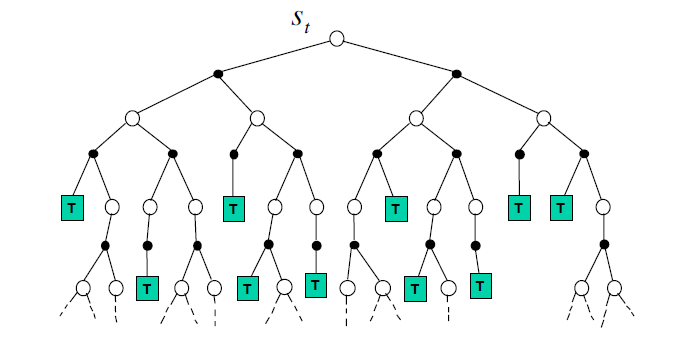
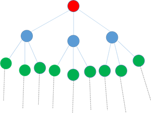
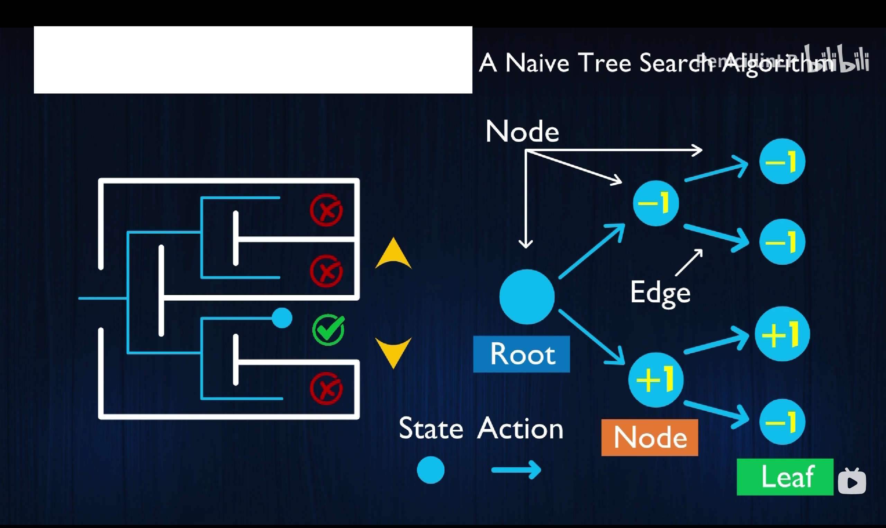
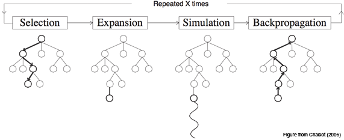
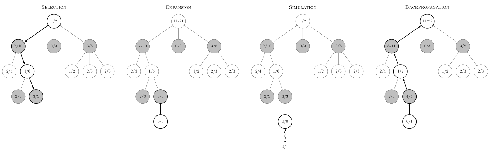
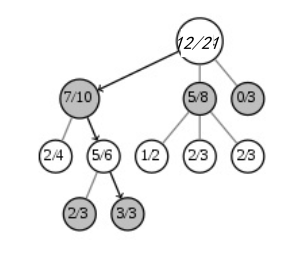

<!--
 * @version:
 * @Author:  StevenJokess（蔡舒起） https://github.com/StevenJokess
 * @Date: 2023-03-12 21:27:17
 * @LastEditors:  StevenJokess（蔡舒起） https://github.com/StevenJokess
 * @LastEditTime: 2023-04-09 01:35:21
 * @Description:
 * @Help me: 如有帮助，请赞助，失业3年了。
 * @TODO::
 * @Reference:
-->
# 蒙特卡洛树搜索算法（MCTS）

全称 Monte Carlo Tree Search，是一种人工智能问题中做出最优决策的方法，一般是在组合博弈中的行动（move）规划形式。它结合了随机模拟的一般性和树搜索的准确性。

将UCB用于强化学习算法中，最成功的例子莫过于蒙特卡洛树搜索算法，该算法在计算机围棋中取得极大成功，如今强化学习技术如此火热也是因为加持了深度神经网络的蒙特卡罗树搜索成功地战胜了人类顶级棋手，晋级为“围棋上帝”。很多学强化学习的人常常会问，蒙特卡罗树搜索跟经典的强化学习算法有什么区别和联系？这一讲，我会从强化学习的视角讲述蒙特卡罗树搜索算法。

## 在线强化学习算法

**先给一个结论：蒙特卡罗树搜索可以看成是一种在线强化学习算法。**下面，我们将这句话分成几个关键词进行解释。

### 1. 蒙特卡罗树搜索是在线强化学习

第一个概念就是在线强化学习，英文名online reinforcement learning. 跟在线强化学习对应的是离线强化学习，即offline reinforcement learning. 在线强化学习是从当前状态开始，利用强化学习算法得到最优马尔科夫决策过程。而离线强化学习是在每个状态处都得到一个最优的策略。两者的区别非常明显：

1. 它们的目标不同。离线强化学习的目标非常有野心，它要求解在每个状态处的最优策略，它要求一个全局解；在线强化学习的目标则很局部，它只求从当前状态开始的最优策略是什么。
2. 在线强化学习的计算复杂度和难度远远低于离线强化学习。为什么呢？因为在线强化学习只关心从当前状态出发的最优策略，因此它的搜索空间远远小于离线强化学习。

蒙特卡罗树搜索是一个在线的算法，因为蒙特卡罗树搜索的目的是找到**当前状态下最优的策略**，比如在面对当前棋盘时，应该下哪个子（最优策略）。

### 2. 蒙特卡罗树搜索是一种强化学习算法

蒙特卡罗树搜索是，除Dyna外另一种集合基于模型与不基于模型的强化学习方法：基于模拟的搜索(Simulation Based Search）。

> 什么是基于模拟的搜索呢? 当然主要是两个点: 一个是模拟，一个是搜索。

> - 模拟是基于强化学习模型进行采样，得到样本数据。但是这是数据不是基于和环境交互获得的真实数据，所以是“模拟”。
> - 搜索是为了利用模拟的样本结果来帮我们计算到底应该采用什么样的动作，以实现我们的长期受益最大化。

那么为什么要进行基于模拟的搜索呢? 在这之前我们先看看最简单的前向搜索（forward search）。前向搜索算法 从当前我们考虑的状态节点 $S_t$ 开始考虑，怎么考虑呢? 对该状态节点所有可能的动作进行扩展，建立一颗以 $S_t$ 为根节点的搜索树，这个搜索树也是一个MDP，只是它是以当前状态为根节点，而不是以起始状态为根节点，所以也叫做subMDP。我们求解这个sub-MDP问题，然后得到 $S_t$ 状态最应该采用的动作 $A_t$ 。前向搜索的sub-MDP如下图：



前向搜索建立了一个sub-MDP来求解，这很精确，而且这在状态动作数量都很少的时候没有问题，但是只要稍微状态动作数量多一点，每个状态的选择就都特别慢了，因此不太实用，此时基于模拟的搜索就是一种比较好的折哀。

广义的强化学习算法包括策略评估和策略改善，蒙特卡罗树在构建和使用的过程中同样包括这两个过程，所以蒙特卡罗树也是一种强化学习算法。我已经讲过，基于值函数的方法包括动态规划方法，蒙特卡罗模拟方法和时间差分方法。这三种方法的唯一不同点在于值函数的评估方法不同，动态规划方法通过模型来评估值函数，蒙特卡罗模拟的方法通过随机模拟，并求解经验平均来估计，时间差分方法则通过一步或多步bootstrap方法来评估值函数，而蒙特卡罗树搜索呢？

具体通过构造蒙特卡罗树来估计动作值函数。

## 蒙特卡罗树搜索概念

蒙特卡罗树搜索如何通过构造蒙特卡罗树来估计值函数呢？这就需要了解蒙特卡罗树搜索到底是什么了。

### 1. 首先蒙特卡罗树搜索是一种基于树的搜索方法

**树结构**：树结构定义了一个可行解的解空间，每一个叶子节点到根节点的路径都对应了一个解（solution），解空间的大小为$2^N$（N等于决策次数，即树深度）

基于树的搜索算法历史悠长，可以追溯到计算机的诞生，并且基于树的搜索算法得到了广泛的应用，可以说当今文明的背后都是一个个基于树的搜索算法在起作用。比如最早的击败顶级人类国际象棋选手的“深蓝”用的是基于树的搜索算法；在机器人学中最常用的路径规划算法 $A^*$ 算法，也是基于树的搜索算法。

有人可能会问，为什么不能用深蓝的搜索技术来下围棋？

原因是“深蓝”的搜索算法用的是全宽度树搜索，而围棋的状态空间非常巨大，利用全宽度树进行搜索，计算时间，存储空间都不可行。



如图2.2 为全宽度树（Full Width Tree）的示意图。所谓全宽度树是每个节点都需要进行扩展，



构建全宽度树的代码：

```py
class TreeNode:
    def __init__(self, val=None, left=None, right=None):
        self.val = val
        self.left = left
        self.right = right

def full_width_tree(root):
    if not root:
        return []

    queue = [root]  # 用队列来进行层次遍历
    result = []
    while queue:
        level = []  # 用来存储当前层级的节点值
        level_size = len(queue)  # 记录当前层级的节点数量
        for _ in range(level_size):
            node = queue.pop(0)  # 弹出队首节点
            level.append(node.val)  # 将节点值加入到当前层级列表中

            # 将节点的左右子节点加入队列，以便继续遍历下一层级
            if node.left:
                queue.append(node.left)
            if node.right:
                queue.append(node.right)

        result.append(level)  # 将当前层级的节点值列表加入到结果列表中

    return result
```

测试样例：构建一棵树

```py
"""
       1
     /   \
    2     3
   / \   /  \
  4   5 6   7
"""

root = TreeNode(1)
root.left = TreeNode(2)
root.right = TreeNode(3)
root.left.left = TreeNode(4)
root.left.right = TreeNode(5)
root.right.left = TreeNode(6)
root.right.right = TreeNode(7)

# 输出全宽度树
result = full_width_tree(root)
print(result)
# 输出：[[1], [2, 3], [4, 5, 6, 7]]
```

所需搜索的节点的数目跟深度的关系 $2^D-1$ 成指数增长，因此全宽度树对于大尺度空间的搜索几乎不可行。既然全宽度树无法解决问题，那么能不能构造一种非全宽度树呢？

### 2. 蒙特卡罗树搜索是一种非对称树搜索

全宽度树是在每个结点考虑了所有可能的动作以及所有**可能**的后继状态。我们已经说过，这种构造树的方法对于大尺度空间和多步决策不可行。

蒙特卡罗树搜索是采用了两个技巧来构造非对称树。**非对称的好处**：算法会更频繁地访问更加有可能导致成功的节点，并聚焦其搜索时间在更加相关的树的部分。这使得 MCTS 更加适合那些有着更大的分支搜索空间的博弈游戏，比如说 19X19 的围棋。这么大的组合空间会给标准的基于深度或者宽度的搜索方法带来问题。但是 MCTS 会有选择地朝某些方向进行深度搜索，同时**选择性地放弃**其他显然不可能的方向。[5]

> MCTS搜索的策略分为两个阶段：第一个是树内策略(tree policy)：为当模拟采样得到的状态存在于当前的MCTS时使用的策略。树内策略可以使ϵ−贪婪策略，随着模拟的进行策略可以得到持续改善，还可以使用上限置信区间算法UCT，这在棋类游戏中很普遍；第二个是默认策略(default policy)：如果当前状态不在MCTS内，使用默认策略来完成整个状态序列的采样，并把当前状态纳入到搜索树中。默认策略可以使随机策略或基于目标价值函数的策略。[6]

第一个技巧：**引入树策略（tree policy）**, 所谓树策略是指在树中进行搜索的时候，当前节点应该如何选择下一个节点。如图2.3为蒙特卡罗树示意图。常用的树策略为贪婪策略，即采样当前值函数最大的动作。通过这种策略，可以将搜索的资源都**集中在那些很有潜力的子结点**上，因此构成了一种非对称树。

跟全宽度树相比，利用树策略进行采样可以消减搜索树的宽度，极大地减小了树的节点数。

第二个技巧：**引入蒙特卡罗方法评估叶节点**，如图2.3，当树搜索到叶节点的时候，蒙特卡罗树搜索不会继续一直不停地往深处扩展，而是通过蒙特卡罗方法评估该叶节点处的值函数。

这里再啰嗦下，蒙特卡罗评估方法其实就是利用随机策略进行多次模拟，以随机方式来决定下一步棋子，并记录每个模拟过程的胜负情况，最终通过统计模拟结果去求经验平均来估算每个可能的下法的胜率。

这里的随机策略又称为rollout policy或者默认策略。即，在蒙特卡罗模拟时，每步所采用的策略为rollout policy。为什么叫rollout policy？从使用上来看，该策略在模拟阶段使用，并且使用到出现一个结果（对于围棋来说，结果为输，赢，和局），因此这个策略可称为rollout 策略或者默认策略。

## 原理介绍

基本的 MCTS 算法非常简单：根据模拟，在节点上保存状态对应的历史胜利次数与所有经过该状态的次数比，在每条边上保存采样的动作，这样构造搜索树。

蒙特卡罗树搜索大概可以被分成四步：选择(Selection)，拓展(Expansion)，模拟(Simulation)，反向传播(Back Propagation)。



在开始阶段，搜索树只有一个节点，也就是我们需要决策的局面。搜索树中的每一个节点包含了三个基本信息：代表的局面，被访问的次数，累计评分。

### 一、选择(Selection)

在选择阶段，需要从根节点，也就是要做决策的局面R出发向下选择出一个最急迫需要被拓展的节点N，局面R是是每一次迭代中第一个被检查的节点；对于被检查的局面而言，他可能有三种可能：

1. 该节点所有可行动作都已经被拓展过
1. 该节点有可行动作还未被拓展过
1. 这个节点游戏已经结束了(例如已经连成五子的五子棋局面)

对于这三种可能：

1. 如果所有可行动作都已经被拓展过了，那么我们将使用UCB公式计算该节点所有子节点的UCB值，并找到值最大的一个子节点继续检查。反复向下迭代。
1. 如果被检查的局面依然存在没有被拓展的子节点(例如说某节点有20个可行动作，但是在搜索树中才创建了19个子节点)，那么我们认为这个节点就是本次迭代的的目标节点N，并找出N还未被拓展的动作A。执行步骤二
1. 如果被检查到的节点是一个游戏已经结束的节点。那么从该节点直接执行步骤四。

每一个被检查的节点的被访问次数在这个阶段都会自增。在反复的迭代之后，我们将在搜索树的底端找到一个节点，来继续后面的步骤。

### 二、拓展(Expansion)

在选择阶段结束时候，我们查找到了一个最迫切被拓展的节点N，以及他一个尚未拓展的动作A。在搜索树中创建一个新的节点 $N_n$作为N的一个新子节点。Nn的局面就是节点N在执行了动作A之后的局面。

### 三、模拟(Simulation)

为了让 $N_n$ 得到一个初始的评分。我们从 $N_n$ 开始，让游戏随机进行，直到得到一个游戏结局，这个结局将作为 $N_n$ 的初始评分。一般使用胜利/失败来作为评分，只有1或者0。

### 四、回溯(Backpropagation)

在 $N_n$ 的模拟结束之后，它的父节点N以及从根节点到N的路径上的所有节点都会根据本次模拟的结果来添加自己的累计评分。如果在[1]的选择中直接发现了一个游戏结局的话，根据该结局来更新评分。每一次迭代都会拓展搜索树，随着迭代次数的增加，搜索树的规模也不断增加。当到了一定的迭代次数或者时间之后结束，选择根节点下最好的子节点作为本次决策的结果。

### 结合例子

根据模拟，在节点上保存状态对应的历史胜利次数与所有经过该状态的次数比，在每条边上保存采样的动作，这样构造搜索树。如下图（图来自维基百科[7]，请注意，此图不遵循下面描述的 UCT 算法。）：



- 一、选择(Selection)：这一步会从根节点开始，每次都选一个“最值得搜索的子节点”，一般使用UCT选择分数最高的节点，直到来到一个“存在未扩展的子节点”的节点，如图中的 3/3 节点。之所以叫做“存在未扩展的子节点”，是因为这个局面存在未走过的后续着法，也就是MCTS中没有后续的动作可以参考了。这时我们进入第二步。
- 二、扩展(Expansion)：在这个搜索到的存在未扩展的子节点，加上一个0/0的子节点，表示没有历史记录参考。这时我们进入第三步。
- 三、仿真(Simulation)：从上面这个没有试过的着法开始，用一个简单策略比如快速走子策略（Rollout policy）走到底，得到一个胜负结果。快速走子策略一般适合选择走子很快可能不是很精确的策略。因为如果这个策略走得慢，结果虽然会更准确，但由于耗时多了，在单位时间内的模拟次数就少了，所以不一定会棋力更强，有可能会更弱。这也是为什么我们一般只模拟一次，因为如果模拟多次，虽然更准确，但更慢。
- 四、回溯(Backpropagation)：将我们最后得到的胜负结果回溯加到MCTS树结构上。注意除了之前的MCTS树要回溯外，新加入的节点也要加上一次胜负历史记录，如上图最右边所示。[6]

### MCTS 总结

以上就是MCTS搜索的整个过程。这4步一般是通用的，但是MCTS树结构上保存的内容而一般根据要解决的问题和建模的复杂度而不同。

### 代码（TODO：）

```python
class MCTS(object):
    """An implementation of Monte Carlo Tree Search."""

    def __init__(self, policy_value_fn, c_puct=5, n_playout=10000):
        """
        policy_value_fn: a function that takes in a board state and outputs
            a list of (action, probability) tuples and also a score in [-1, 1]
            (i.e. the expected value of the end game score from the current
            player's perspective) for the current player.
        c_puct: a number in (0, inf) that controls how quickly exploration
            converges to the maximum-value policy. A higher value means
            relying on the prior more.
        """
        self._root = TreeNode(None, 1.0)
        self._policy = policy_value_fn
        self._c_puct = c_puct
        self._n_playout = n_playout

    def _playout(self, state):
        """Run a single playout from the root to the leaf, getting a value at
        the leaf and propagating it back through its parents.
        State is modified in-place, so a copy must be provided.
        """
        node = self._root
        while(1):
            if node.is_leaf():
                break
            # Greedily select next move.
            action, node = node.select(self._c_puct)
            state.do_move(action)

        # Evaluate the leaf using a network which outputs a list of
        # (action, probability) tuples p and also a score v in [-1, 1]
        # for the current player.
        action_probs, leaf_value = self._policy(state)
        # Check for end of game.
        end, winner = state.game_end()
        if not end:
            node.expand(action_probs)
        else:
            # for end state，return the "true" leaf_value
            if winner == -1:  # tie
                leaf_value = 0.0
            else:
                leaf_value = (
                    1.0 if winner == state.get_current_player() else -1.0
                )

        # Update value and visit count of nodes in this traversal.
        node.update_recursive(-leaf_value)

    def get_move_probs(self, state, temp=1e-3):
        """Run all playouts sequentially and return the available actions and
        their corresponding probabilities.
        state: the current game state
        temp: temperature parameter in (0, 1] controls the level of exploration
        """
        for n in range(self._n_playout):
            state_copy = copy.deepcopy(state)
            self._playout(state_copy)

        # calc the move probabilities based on visit counts at the root node
        act_visits = [(act, node._n_visits)
                      for act, node in self._root._children.items()]
        acts, visits = zip(*act_visits)
        act_probs = softmax(1.0/temp * np.log(np.array(visits) + 1e-10))

        return acts, act_probs

    def update_with_move(self, last_move):
        """Step forward in the tree, keeping everything we already know
        about the subtree.
        """
        if last_move in self._root._children:
            self._root = self._root._children[last_move]
            self._root._parent = None
        else:
            self._root = TreeNode(None, 1.0)

    def __str__(self):
        return "MCTS"
```

## 结合UCB的蒙特卡罗树搜索--UCT

蒙特卡罗树搜索真正强大起来，还需要结合UCB的算法。

2006年是神奇的一年，在这一年，Hinton等人在science发表论文，开启了深度学习的研究热潮。同年，在强化学习领域，来自不同国家的科学家将UCB引入到蒙特卡罗树算法中， 如Kocsis等将UCB结合蒙特卡罗树提出UCT算法, Gelly等将UCB引入到围棋中，开发了强大的围棋程序MoGo。UCB的引入以及多臂赌博机的进一步发展最终促进了围棋上帝AlphaGo Zero的出现。

### UCB用于蒙特卡罗树搜索中

在蒙特卡罗树的选择阶段，利用UCB策略来替换树策略即可。这个想法是这样来的：每个结点有很多子结点，在进行树搜索时，你需要从很多子结点中一个节点进行搜索，这个选择的过程十分类似多臂赌博机，在多臂赌博机中你需要面对的是有很多臂，你需要选择哪一个，而在蒙特卡罗树搜索中，在树结点处，你需要选择的是哪个子结点。

当UCB策略作为树策略时，每个结点既考虑了利用也考虑了探索，实现了利用和探索的平衡。**因为探索的存在，使得构造出的蒙特卡罗树不会遗漏最优的策略，因为利用的存在使得蒙特卡罗树不会过于庞大，因此UCB的引入极大地提升了蒙特卡罗树搜索算法的能力。*

### UCT

我们先熟悉下上限置信区间算法(Upper Confidence Bound Applied to Trees, 以下简称UCT)。它是一种策略算法，我们之前最常用的是ϵ−贪婪策略。但是在棋类问题中，UCT更常使用。

在棋类游戏中，经常有这样的问题，我们发现在某种棋的状态下，有2个可选动作，第一个动作历史棋局中是0胜1负，第二个动作历史棋局中是8胜10负，那么我们应该选择哪个动作好呢？如果按ϵ−贪婪策略，则第二个动作非常容易被选择到。但是其实虽然第一个动作胜利0%，但是很可能是因为这个动作的历史棋局少，数据不够导致的，很可能该动作也是一个不错的动作。（次数小，胜率并不置信[8]）那么我们如何在最优策略和探索度达到一个选择平衡呢？ϵ−贪婪策略可以用，但是UCT是一个更不错的选择。

UCT 基于 Auer、Cesa-Bianchi 和 Fischer 导出的 UCB1 公式[7]。UCT首先计算每一个可选动作节点对应的分数，这个分数考虑了历史最优策略和探索度，避免了胜率高置信度低的问题。[8]

一个常用的公式如下：

$$
\text { score }=\frac{w_i}{n_i}+c \sqrt{\frac{\ln N_i}{n_i}}
$$

其中，
- 前部分是已有胜率：$w_i$ 是 $i$ 节点的胜利次数， $n_i$ 是 $i$ 节点的模拟次数，可见$w_i/n_i$ 是 $i$ 节点的胜率。
- 根号部分考虑探索性：$N_i$ 是所有模拟次数，，可见UCT更倾向于选择还没被统计过的节点。
- $\mathrm{c}$ 是**探索常数**，理论值为 $\sqrt{2}$ ， 可根据经验调整，c 越大就越偏向于广度搜索，c 越小就越偏向于深度搜索。最后我们选择分数最高的动作节点。

每次都选择UCT值最高的节点进行搜索，重复多次后，访问次数最高的节点就是最佳节点。[8]

### 结合例子

比如对于下面的棋局，对于根节点来说，有 3 个选择，第一个选择 7 胜 3 负，第二个选择 5 胜 3 负，第三个选择 0 胜 3 负。



如果我们就取 $\sqrt{2}$,则第一个节点的分数为：

$$
\operatorname{score}(7,10)=7 / 10+C \cdot \sqrt{\frac{\ln (21)}{10}} \approx 0.99
$$

第二个节点的分数为：

$$
\operatorname{score}(5,8)=5 / 8+C \cdot \sqrt{\frac{\ln (21)}{8}} \approx 1.50
$$

第三个节点的分数为：

$$
\operatorname{score}(0,3)=0 / 3+C \cdot \sqrt{\frac{\ln (21)}{3}} \approx 1.42
$$

可见，

- 由于我们把探索率c设置的比较适中，第二个节点是被UCT选中要执行的动作节点。
- 如果探索率c设置的比较大，可能去选第三个节点
- 如果探索率c设置的比较小，可能去选第一个节点

### 代码

TODO:

### AlphaGo上的应用

蒙特卡罗树搜索算法一经提出，便在很多领域得到广泛应用。当然，围棋从2006年的UCT算法到2017年的[AlphaGo Zero](..\chapter_appendix-applications-for-deep-reinforcement-learning\AlphaGo_Zero.md)，又经过十多年无数科学家的研究。这个技术如何演化的也是一个很有意思的课题，如果大家感兴趣可以找相关的论文来看。

最容易想到的就是枚举之后的每一种下法，然后计算每步赢棋的概率，选择概率最高的就好了。但是，对于围棋而言，状态空间实在是太大了，没有办法完全枚举。这个时候就需要蒙特卡洛树搜索进行启发式地搜索，这里所谓的启发式搜索，就是一种小范围尝试性探索的优化思路，随机朝一个方向前进，如果效果好就继续，如果效果不好就退回来。

- 在当前状态（每一步棋）的基础上，选择一个备选动作/状态（下一步棋），即一次采样；
- 从备选动作/状态开始，「走两步」，不需要枚举后续所有状态，只要以一定的策略（如随机策略和 AlphaGo 中的快速走棋网络）一直模拟到游戏结束为止；
- 计算这次采样的回报；
- 重复几次，将几次回报求平均，获得该备选动作/状态的价值。

另外：

蒙特卡罗树适用的场合是：模型已知，可以进行模拟。每次模拟需要很短的时间。因此，蒙特卡罗树搜索可以看成是基于模型的强化学习算法。对于那些模型未知的场合，还得依靠时间差分，A3C，DDPG，PPO等无模型的强化学习算法。

那么这些无模型的强化学习算法是否也可以利用UCB呢？我们下次再更新，敬请期待！

[1]: https://zhuanlan.zhihu.com/p/33578829
[2]: https://github.com/junxiaosong/AlphaZero_Gomoku/blob/master/mcts_alphaZero.py
[3]: https://zhuanlan.zhihu.com/p/333348915
[4]: http://nooverfit.com/wp/%E8%92%99%E7%89%B9%E5%8D%A1%E6%B4%9B%E6%A0%91%E6%90%9C%E7%B4%A2-mcts-%E5%85%A5%E9%97%A8/
[5]: https://www.cnblogs.com/LittleHann/p/11608182.html
[6]: https://cloud.tencent.com/developer/article/1403975
[7]: https://en.wikipedia.org/wiki/Monte_Carlo_tree_search
[8]: https://www.bilibili.com/video/BV1hV4y1Q7TR/?spm_id_from=333.337.search-card.all.click&vd_source=bca0a3605754a98491958094024e5fe3

## 更多参考

> 1. https://chat.openai.com ; Prompt:Monta Carlo rollou；全宽度树（Full Width Tree）的python代码

TODO: https://www.cnblogs.com/pinard/p/10470571.html
