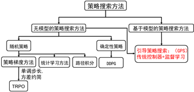

<!--
 * @version:
 * @Author:  StevenJokess（蔡舒起） https://github.com/StevenJokess
 * @Date: 2023-03-13 01:09:10
 * @LastEditors:  StevenJokess（蔡舒起） https://github.com/StevenJokess
 * @LastEditTime: 2023-10-08 01:51:35
 * @Description:
 * @Help me: 如有帮助，请赞助，失业3年了。
 * @TODO::
 * @Reference:
-->
# GPS（Guided policy search）

Guided policy search的中文表达为指导策略搜索。从字面意思来理解，GPS是个策略搜索算法，但它不是普通的策略搜索，而是有指导的策略搜索。

一个很自然的问题是：谁来指导它进行策略搜索呢？

答案是：基于模型的最优控制器。

## 如何指导？

在回答这个问题之前，我们先理解下什么是策略搜索。通读过本专栏入门和进阶课程的知友应该对策略搜索这个词很熟悉。上节也讲过无模型的强化学习算法分为基于值函数的强化学习算法和基于直接策略搜索的强化学习算法。所谓直接策略搜索是指将策略进行参数化表示，然后在参数空间进行搜索，得到最优的策略。无模型的策略搜索靠的实实在在的与环境的交互数据，然后利用随机梯度的方法进行搜索。而GPS呢？它对参数的搜索依靠的是最优控制器。

下面，开始回答GPS如何指导策略网络进行参数搜索（即参数优化），从以下几个方面进行理解。

如图1.3 为Guided Policy Search方法的结构图。从图中，我们很容易看出GPS分为两个模块：左边的模块为最优控制器模块，右边的模块为策略搜索模块。

可以说，GPS=最优控制器+监督学习。

先说最优控制器模块：

在该模块中，控制器会运行当前的控制策略，并产生数据，然后利用这些产生的数据利用机器学习的方法，如回归的方法拟合控制方法。有了控制方程就可以利用经典的最优控制的方法来求解当前的最优控制率。经典的最优控制的方法包括变分法、庞特里亚金最大值原理和动态规划的方法。在GPS中，最常用的是动态规划的方法，如：

1. LQR：即线性二次型调节器
1. LQG：即线性二次高斯调节器
1. iLQG：即迭代线性二次高斯调节器
1. DDP：即微分动态规划

CS229 学习笔记第十六章：LQR, DDP 和 LQG - 口仆的文章 - 知乎
https://zhuanlan.zhihu.com/p/149130180

在正式进入引导式策略搜索之前，我觉得有必要进行再次阐述与之类似的基于LQR和iLQR的轨迹优化。[2]

引导策略搜索方法（Guided
Policy Search）最早是2013年Sergey
Levine在斯坦福读博士的时候提出来的。强化学习算法大神Levine，博士毕业后便去了伯克利跟着Pieter Abbeel做博后，出站后留在了伯克利任教。如果查他的教育经历，会发现。Levine博士时候的老板不是搞机器人的，而是搞计算机图形学的。Levine读博士时，要解决的是计算机仿真中人物的逼真运动。通过模仿学习或机器学习来完成。

图9.1 策略搜索方法分类

如图9.1 为策略搜索方法的分类，从引导策略搜索提出到现在，引导策略搜索方法其实已经扩展到了有模型和无模型的情况。跟其他直接的策略搜索方法不同，GPS不会对策略进行直接搜索，而是将策略搜索方法分为两步：控制项和监督相。

第一个问题，引导策略搜索方法为什么这么做呢？

听我一一道来：

首先，我们先看看第七讲的TRPO方法和DDPG方法的局限性。从图9.1策略搜索方法的分类我们可以看到，这两种方法都是无模型的强化学习算法。无模型的强化学习算法有很多优点，可以不用对外界建模，尤其是当外界环境非常复杂，很难建模或根本无法建模时，该方法是唯一的方法。但是，无模型的强化学习算法也有其固有的缺点：因为没有模型，所以无模型的强化学习算法只能通过不断尝试来探索环境，这些算法只能处理参数最多数百个的策略网络，对于更大的策略网络，这些方法学习效率不高。仔细想想，原因很简单。当随机初始化数千个或上万个参数的网络时，随机尝试根本就产生不了好的数据。对于复杂的任务，随机探索几乎找不到成功的解或者好的解。没有成功的解或好的解，智能体就没办法从中学到好的动作，无法形成良性循环。也就是说，无模型的强化学习算法最大的缺点是数据效率低。

解决无模型随机探索问题的方法是利用模型进行探索。如何得到模型？或者从数据中学一个模型，或者人为地建立智能体探索环境的近似模型（建机器人模型是机器人学和机器人学家们一直乐于干的事情）。

有了模型，我们可以干哪些事呢?

第一， 利用模型和基于模型的优化算法，我们可以得到回报高的数据，也就是好的数据。有了好的数据，我们就可以对策略网络进行稳定的训练了。

第二， 有了模型，我们可以充分地利用示例（demonstration）学习。人的示例可以当成模型的初值。

所以Guided Policy Search方法将策略搜索方法分成两个相，控制相和监督相。其中控制相通过轨迹最优、传统控制器或随机最优控制产生好的数据。监督相，是利用从控制相产生的好数据进行监督学习。

我们从直观上对比下我们通常的强化学习方法和GPS的方法。如图9.2所示，之前我们讲过，强化学习是智能体通过与环境交互产生数据，从交互数据中学习如图9.2图A所示；而GPS是策略网络通过与控制相交互产生的数据，从控制相产生的数据中进行学习。换句话说，在无模型中，智能体（策略网络）在通过试错跟环境学习；而GPS的方法是跟逐渐迭代优化的控制器学习。

图9.2 强化学习原理图和GPS原理图

我们已经知道了GPS的基本原理，那么该如何用数学公式进而用代码来实现呢？

在进入这个问题之前，我们先看看自从GPS算法提出来以后，这些年如何发展的。可以从三个方面来看GPS的发展。

第一个方面：从问题的构建来看gps经历了基于重要性采样的gps(ISGPS)à基于变分推理的gps(vgps)à基于约束的gps(cgps)。这些发展是Levine在做博士时的发展思路。

第二个方面：从优化方法看gps的发展。基于约束的gps被构建以后，关于它的优化最开始是Dual gps即基于对偶梯度下降法（2014年）àBADMM方法即布雷格曼交叉方向乘子法（2015年）àmirror descent gps即镜像下降优化算法。

第三个方面：从控制相来看，gps从基于轨迹最优（微分动态规划DDP、线性二次规划LQR和线性二次高斯LQG）发展到了随机最优控制PI2 gps.

感兴趣的同学可以将这些论文下载下来好好研究。

下面，我们具体讲解基于约束的引导策略搜索方法。参考文献是2014年Levine在ICML上的论文《Learning complex neural network policies with trajectory
optimization》.讲解此论文是因为该论文用到了比较全面的数学技巧，将这些数学技巧交给大家，大家学会后便可以看懂gps系列的其他论文了。

基于约束的引导策略搜索方法可形式化为：

min_{\theta ,q}\ D_{KL}\left(q\left(\tau\right)||\rho\left(\tau\right)\right) \\ s.t.\ q\left(x_1\right)=p\left(x_1\right), \\ q\left(x_{t+1}|x_t,u_t\right)=p\left(x_{t+1}|x_t,u_t\right) \\\\ D_{KL}\left(q\left(x_t\right)\pi_{\theta}\left(u_t|x_t\right)||q\left(x_t,u_t\right)\right)=0 (9.1)

其中目标函数为\[ \min_{\theta ,q\left(\tau\right)}\ D_{KL}\left(q\left(\tau\right)||\rho\left(\tau\right)\right) \],\[ \rho\left(\tau\right)\propto\exp\left(l\left(\tau\right)\right) \].

（9.1）式给人的第一印象是好复杂。强化学习的目标为什么变成了一个KL散度？

首先，我们先定义KL散度：设\[ q\left(\tau\right),\rho\left(\tau\right) \]是两个分布，则两个分布之间的KL散度为：

\[ D_{KL}\left(q\left(\tau\right)||\rho\left(\tau\right)\right)=\int{q\left(\tau\right)\log\frac{q\left(\tau\right)}{\rho\left(\tau\right)}}d\tau \]

KL散度是衡量两个概率分布之间距离的度量。比如，当两个分布相等时，距离为0.

强化学习的目标，为什么可以表示成如（9.1）式的KL散度呢？

我们利用KL散度的公式将目标函数展开：

\[ D_{KL}\left(q\left(\tau\right)||\rho\left(\tau\right)\right)=\int{q\left(\tau\right)\log\frac{q\left(\tau\right)}{\rho\left(\tau\right)}}d\tau \\ =\int{q\left(\tau\right)\log q\left(\tau\right)d\tau -\int{q\left(\tau\right)}}\log\rho\left(\tau\right)d\tau \] （9.2）

将\[ \rho\left(\tau\right)\propto\exp\left(l\left(\tau\right)\right) \]带入（9.2）并忽略常数，可以得到：

\[ D_{KL}\left(q\left(\tau\right)||\rho\left(\tau\right)\right) \\ =-H\left(q\right)-E_q\left(l\left(\tau\right)\right)+const \]

第一项为分布q的熵，第二项为累积回报的期望。（9.1）最小化目标函数相当于最大化累积回报和最大化熵。这里熵是不确定性的度量，不确定越大，熵越大。这里最大化熵是为了保证最优控制分布是一个分布，而非是一个确定值。第二项是最大化累积回报，跟常用的强化学习目标保持一致。

将约束利用拉格朗日乘子带入目标函数，cGPS整个问题的拉格朗日函数为：

\[ L\left(\theta ,q,\lambda\right)=D_{KL}\left(q\left(\tau\right)||\rho\right)+\sum_{t=1}^T{\lambda_tD_{KL}\left(q\left(x_t\right)\pi_{\theta}\left(u_t|x_t\right)||q\left(x_t,u_t\right)\right)} \] （9.3）

其中轨迹优化相的优化问题为：

\[ L\left(q\right)=-\sum_{t=1}^T{E_{q\left(x_t,u_t\right)}\left[l\left(x_t,u_t\right)\right]-H\left(q\right)}+\lambda_tE_{q\left(x_t\right)}\left[D_{KL}\left(\pi_{\theta}\left(u_t|x_t\right)||q\left(u_t|x_t\right)\right)\right] \] （9.4）

监督相的优化问题为：

\[ L\left(\theta\right)=\sum_{t=1}^T{\lambda_t\sum_{i=1}^N{D_{KL}\left(\pi_{\theta}\left(u_t|x_{ti}\right)||q\left(u_t|x_{ti}\right)\right)}} \] （9.5）

对于轨迹最优相，也就是求解（9.4）时我们可以利用轨迹最优算法（DDP算法如第二讲强化学习入门 第二讲 基于模型的动态规划方法 - 知乎专栏，LQR算法如杨超同学的分享引导策略搜索方法（GPS）中的轨迹优化_LQR - 知乎专栏），要想利用轨迹最优算法，必须求出每一步的代价。如何从（9.4）中求出每步的代价呢？下面我们给出推导：

每个轨迹分布q(\tau )有均值\[ \hat{\tau}=\left(\hat{x}_{1..T},\hat{u}_{1..T}\right) \]，条件动作分布\[ q\left(u_t|x_t\right)=N\left(u_t+Kx_t,A_t\right) \]为了不失一般性，每个\[ \hat{x}_t,\hat{u}_t \]初值为0，策略网络\[ \pi\left(u_t|x_t\right)=N\left(\mu_{t}^{\pi}+\mu_{xt}^{\pi}x_t,\Sigma_{t}^{\pi}\right) \], S_t是相对于分布q(x_t)的协方差。

（9.4）中的第一项进行二阶泰勒展开：

\[ \sum_{t=1}^T{E_{q\left(x_t,u_t\right)}\left[l\left(x_t,u_t\right)\right]}=\sum_{t=1}^T{E_{q\left(x_t,u_t\right)}\left[l\left(0,0\right)+\left(\begin{array}{c} x_t\\ u_t\\ \end{array}\right)^Tl_{xut}+\frac{1}{2}\left(\begin{array}{c} x_t\\ u_t\\ \end{array}\right)^Tl_{xu,xut}\left(\begin{array}{c} x_t\\ u_t\\ \end{array}\right)\right]} \\ =\sum_{t=1}^T{\int{q\left(x_t,u_t\right)l\left(0,0\right)d\left(x_t,u_t\right)^T+\int{q\left(x_t,u_t\right)\left(\begin{array}{c} x_t\\ u_t\\ \end{array}\right)^Tl_{xut}d\left(x_t,u_t\right)^T}+\frac{1}{2}\int{q\left(x_t,u_t\right)\left(\begin{array}{c} x_t\\ u_t\\ \end{array}\right)^Tl_{xu,xut}\left(\begin{array}{c} x_t\\ u_t\\ \end{array}\right)d\left(x_t,u_t\right)^T}}} \]

忽略常数，（9.4）的第一项可写为：

\sum_{t=1}^T{E_{q\left(x_t,u_t\right)}\left[l\left(x_t,u_t\right)\right]}= \\ =\sum_{t=1}^T{\left(\begin{array}{c} \hat{x}_t\\ \hat{u}_t\\ \end{array}\right)^Tl_{xut}}+\frac{1}{2}\int{q\left(x_t,u_t\right)\left(\left(\begin{array}{c} x_t-\hat{x}_t\\ u_t-\hat{u}_t\\ \end{array}\right)^T+\left(\begin{array}{c} \hat{x}_t\\ \hat{u}_t\\ \end{array}\right)^T\right)l_{xu,xut}\left(\left(\begin{array}{c} x_t-\hat{x}_t\\ u_t-\hat{u}_t\\ \end{array}\right)+\left(\begin{array}{c} \hat{x}_t\\ \hat{u}_t\\ \end{array}\right)\right)d\left(x_t,u_t\right)^T}

\[ =\sum_{t=1}^T{\left(\left(\begin{array}{c} \hat{x}_t\\ \hat{u}_t\\ \end{array}\right)^Tl_{xut}+\frac{1}{2}\left(\begin{array}{c} \hat{x}_t\\ \hat{u}_t\\ \end{array}\right)^Tl_{xu,xut}\left(\begin{array}{c} \hat{x}_t\\ \hat{u}_t\\ \end{array}\right)+\frac{1}{2}\int{q\left(x_t,u_t\right)\left(\begin{array}{c} x_t-\hat{x}_t\\ u_t-\hat{u}_t\\ \end{array}\right)^Tl_{xu,xut}\left(\begin{array}{c} x_t-\hat{x}_t\\ u_t-\hat{u}_t\\ \end{array}\right)}\right)} \\ =\sum_{t=1}^T{\left(\left(\begin{array}{c} \hat{x}_t\\ \hat{u}_t\\ \end{array}\right)^Tl_{xut}+\frac{1}{2}\left(\begin{array}{c} \hat{x}_t\\ \hat{u}_t\\ \end{array}\right)^Tl_{xu,xut}\left(\begin{array}{c} \hat{x}_t\\ \hat{u}_t\\ \end{array}\right)\right)}+\frac{1}{2}T_r\left(\varSigma_tl_{xu,xut}\right) \](9.5)

（9.4）的第二项为：

\[ H\left(q\right)=-\int{q\log q} \\ =-\int{q\log\frac{1}{\left(2\pi\right)^{N/2}\left| A\right|^{1/2}}}\exp\left(-\frac{1}{2}\left(\left[u-\hat{u}\right]\right)^TA^{-1}\left(\left[u-\hat{u}\right]\right)\right) \\ =\frac{1}{2}\log\left| A\right|+const \] (9.6)

在给出第三项之前，先给出两个高斯分布的KL散度公式：

首先给出高斯分布的基本公式：

\[ \int{p\left(x\right)dx}=1 \\ \int{xp\left(x\right)dx=\mu} \\ \int{p\left(x\right)\left(x-\mu\right)^2dx=\sigma^2} \]

设\[ f\left(x\right)\sim N\left(\mu ,\varSigma\right),\ g\left(x\right) \sim N\left(\nu ,\varGamma\right) \],利用高斯分布的基本公式可以求得：

\[ D_{KL}\left(f||g\right)=\int{f\left(x\right)\log\frac{f\left(x\right)}{g\left(x\right)}dx} \\ =\int{f\left(x\right)\log f\left(x\right)dx-\int{f\left(x\right)\log g\left(x\right)}}dx \\ =\int{f\left(x\right)\log\left(\frac{1}{\left(2\pi\right)^{N/2}\left|\Sigma\right|^{1/2}}\exp\left(-\frac{1}{2}\left(\left[x-\mu\right]\right)^T\Sigma^{-1}\left(\left[x-\mu\right]\right)\right)\right)}dx \\ -\int{f\left(x\right)\log\left(\frac{1}{\left(2\pi\right)^{N/2}\left|\varGamma\right|^{1/2}}\exp\left(-\frac{1}{2}\left(\left[x-\mu+\mu-\nu\right]\right)^T\varGamma^{-1}\left(\left[x-\mu+\mu-\nu\right]\right)\right)\right)}dx \\ =\frac{1}{2}\left\{\log\frac{\left|\varGamma\right|}{\left|\varSigma\right|}+T_r\left(\Sigma\left(\varGamma^{-1}-\Sigma^{-1}\right)\right)+\left(\mu -\nu\right)^T\varGamma^{-1}\left(\mu -\nu\right)\right\} \] (9.7)

其中第三个等号一定要配方，这样才能利用高斯分布的方差定义进行计算。有了任意两个高斯分布的KL散度，再计算（9.4）的第三项，去掉常数项得到：

\[ E_{q\left(x_t\right)}\left[D_{KL}\left(\pi_{\theta}\left(u_t|x_t\right)||q\left(u_t|x_t\right)\right)\right] \\ =E_q\left[\frac{1}{2}\log\left| A_t\right|+\frac{1}{2}tr\left(A_{t}^{-1}\Sigma_{t}^{\pi}\right)+\left(\left(\mu_{t}^{\pi}+\mu_{xt}^{\pi}x_t\right)-\left(u_t+Kx_t\right)\right)^TA_{t}^{-1}\left(\left(\mu_{t}^{\pi}+\mu_{xt}^{\pi}x_t\right)-\left(u_t+Kx_t\right)\right)\right] \] (9.8)

其中（9.8）的第三项可以写为：（说明，为了让式子显得短，下式中的X代表前面的一串，即\[ X=\left(\left(\mu_{t}^{\pi}+\mu_{xt}^{\pi}\hat{x}+\mu_{xt}^{\pi}x-\mu_{xt}^{\pi}\hat{x}\right)-\left(u_t+K\hat{x}+Kx_t-K\hat{x}\right)\right) \]）：

\[ \int{q\left(x\right)}\left(\left(\mu_{t}^{\pi}+\mu_{xt}^{\pi}x_t\right)-\left(u_t+Kx_t\right)\right)^TA_{t}^{-1}\left(\left(\mu_{t}^{\pi}+\mu_{xt}^{\pi}x_t\right)-\left(u_t+Kx_t\right)\right)dx \\ =\int{q\left(x\right)\left[\left(\left(\mu_{t}^{\pi}+\mu_{xt}^{\pi}\hat{x}+\mu_{xt}^{\pi}x-\mu_{xt}^{\pi}\hat{x}\right)-\left(u_t+K\hat{x}+Kx_t-K\hat{x}\right)\right)^TA_{t}^{-1}X\right]}dx \\ =\int{q\left(x\right)\left[\left(\left(\mu_{t}^{\pi}\left(\hat{x}\right)-\hat{u}_t\right)+\left(\mu_{xt}^{\pi}-K\right)\left(x-\hat{x}\right)\right)^TA_{t}^{-1}X\right]dx} \]

\[ =\int{q\left(x\right)}\left[\left(\mu_{t}^{\pi}\left(\hat{x}\right)-\hat{u}_t\right)^TA_{t}^{-1}\left(\mu_{t}^{\pi}\left(\hat{x}\right)-\hat{u}_t\right)+\left(x-\hat{x}\right)^T\left(\mu_{xt}^{\pi}-K\right)^TA_{t}^{-1}\left(\mu_{xt}^{\pi}-K\right)\left(x-\hat{x}\right)\right]dx \\ =\left(\mu_{t}^{\pi}\left(\hat{x}\right)-\hat{u}_t\right)^TA_{t}^{-1}\left(\mu_{t}^{\pi}\left(\hat{x}\right)-\hat{u}_t\right)+Tr\left(S\left(\mu_{xt}^{\pi}-K\right)^TA_{t}^{-1}\left(\mu_{xt}^{\pi}-K\right)\right) \]

最后我们联合（9.5, 9.6，9.8）给出轨迹优化相的目标函数：

$$
\[ L\left(q\right)\approx\sum_{t=1}^T{-\frac{1}{2}\left(\begin{array}{c} \hat{x}_t\\ \hat{u}_t\\ \end{array}\right)^Tl_{xu,xut}\left(\begin{array}{c} \hat{x}_t\\ \hat{u}_t\\ \end{array}\right)-\left(\begin{array}{c} \hat{x}_t\\ \hat{u}_t\\ \end{array}\right)^Tl_{xut}-}\frac{1}{2}T_r\left(\varSigma_tl_{xu,xut}\right)-\frac{1}{2}\log\left| A\right| \\ +\lambda_t\left(\frac{1}{2}\log\left| A_t\right|+\frac{1}{2}tr\left(A_{t}^{-1}\Sigma_{t}^{\pi}\right)+\left(\mu_{t}^{\pi}\left(\hat{x}\right)-\hat{u}_t\right)^TA_{t}^{-1}\left(\mu_{t}^{\pi}\left(\hat{x}\right)-\hat{u}_t\right)+Tr\left(S\left(\mu_{xt}^{\pi}-K\right)^TA_{t}^{-1}\left(\mu_{xt}^{\pi}-K\right)\right)\right) \]（9.9）
$$

这时每步的代价函数为:

$$
\[ l=-\frac{1}{2}\left(\begin{array}{c} \hat{x}_t\\ \hat{u}_t\\ \end{array}\right)^Tl_{xu,xut}\left(\begin{array}{c} \hat{x}_t\\ \hat{u}_t\\ \end{array}\right)-\left(\begin{array}{c} \hat{x}_t\\ \hat{u}_t\\ \end{array}\right)^Tl_{xut}-\frac{1}{2}T_r\left(\varSigma_tl_{xu,xut}\right)-\frac{1}{2}\log\left| A\right| \\ +\lambda_t\left(\frac{1}{2}\log\left| A_t\right|+\frac{1}{2}tr\left(A_{t}^{-1}\Sigma_{t}^{\pi}\right)+\left(\mu_{t}^{\pi}\left(\hat{x}\right)-\hat{u}_t\right)^TA_{t}^{-1}\left(\mu_{t}^{\pi}\left(\hat{x}\right)-\hat{u}_t\right)+Tr\left(S\left(\mu_{xt}^{\pi}-K\right)^TA_{t}^{-1}\left(\mu_{xt}^{\pi}-K\right)\right)\right) \]
$$

然后利用轨迹最优方法，DDP算法如第二讲强化学习入门 第二讲 基于模型的动态规划方法 - 知乎专栏，LQR算法如杨超同学的分享引导策略搜索方法（GPS）中的轨迹优化_LQR - 知乎专栏便可以得到最优的q；

对于监督相，利用两个正态分布的KL散度公式（9.7）可以容易得到：

$$
\[ L\left(\theta\right)=\sum_{t=1}^T{\lambda_t}\sum_{i=1}^N{\frac{1}{2}}\left\{T_r\left(\Sigma_{t}^{\pi}A_{t}^{-1}\right)-\log\left|\Sigma^{\pi}\right|+\left(K_tx_t+k_t-\mu^{\pi}\left(x_t\right)\right)^TA_{t}^{-1}\left(K_tx_t+k_t-\mu^{\pi}\left(x_t\right)\right)\right\} \]（9.10）
$$

利用随机梯度下降或者LBFGS方法对神经网络进行训练。

最后更新\lambda 值。

$$
\[ \lambda_t\gets\lambda_t+\eta D_{KL}\left(q\left(x_t\right)\pi_{\theta}\left(u_t|x_t\right)||q\left(x_t,u_t\right)\right) \] （9.11）
$$

最后梳理一下，给出伪代码[3]：

[1]: https://zhuanlan.zhihu.com/p/31084371
[2]: https://zhuanlan.zhihu.com/p/26531882
[3]: https://zhuanlan.zhihu.com/p/26572176

https://www.meltycriss.com/2018/05/17/summary-gps/
