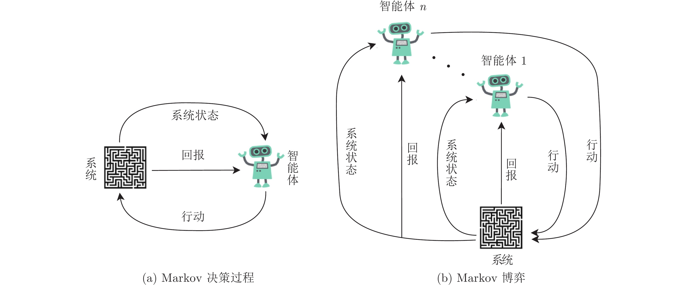

<!--
 * @version:
 * @Author:  StevenJokess（蔡舒起） https://github.com/StevenJokess
 * @Date: 2023-03-17 18:02:50
 * @LastEditors:  StevenJokess（蔡舒起） https://github.com/StevenJokess
 * @LastEditTime: 2023-05-28 22:46:11
 * @Description:
 * @Help me: 如有帮助，请赞助，失业3年了。
 * @TODO::
 * @Reference:
-->
# 多智能体强化学习

## MAL

多智能体学习（Multi­agent Learning，MAL）将机器学习技术引入多智能体系统领域，研究如何设计算法去创建动态环境下的自适应智能体。MAL 领域被广泛研究的技术是强化学习（Reinforcement Learning）。单智能体的强化学习通常在马尔科夫决策过程（Markov Decision Processes，MDP）的框架内就能被较好地描述。一些独立的强化学习算法（如Q­learning）在智能体所处环境满足马氏性且智能体能够尝试足够多行动的前提下会收敛至最优的策略。尽管MDP 为单智能体学习提供了可靠的数学框架，对多智能体学习却并非如此。在多个自适应智能体相互作用的情况下，一个智能体的收益通常依赖于其他个体的行动，学习环境已经不再是静态的了。此时每个智能体面临一个目标不断变化的问题——单个智能体需要学习的内容依赖于其他智能体学到的内容，并随之改变。因此，有必要对原有的MDP 框架作相应的扩展，这其中有马尔科夫博弈和联合行动学习机等[16, 48]。在这些扩展中，学习发生在不同智能体的状态集和行动集的积空间上。因而当智能体、状态或行动的数量太大时，这些扩展面临积空间过大的问题。此外，共享的联合行动空间也未必可用。比如在信息不完全的情况下，智能体未必能观察到其他智能体的行动。如何处理复杂的现实问题，如何高效地处理大量的状态、大量的智能体以及连续的策略空间已经成为目前MAL 研究的首要问题。

随着深度强化学习的兴起，上述问题的解决迎来了新的转机，多智能体强化学习（Multi­Agent Reinforcement Learning, MARL）乘势兴起。多智能体强化学习中，每个智能体都采用强化学习对自己的策略进行训练，其中智能体的策略利用深度网络来表示。[4]

## 多智能体强化学习的环境

首先, MARL的环境是以马尔可夫决策过程为基础的随机博弈框架, 它是这样一个元组 $\left\langle S, A_1, \cdots, A_n, R_1, \cdots, R_n\right.$, $P\rangle$ 。其中, $n$ 指多智能体的数量; $A$ 是所有智能体的联合动作 空间集, $A=A_1 \times \cdots \times A_n ; R_i$ 是每个智能体的奖励函数, $R_i$ : $S \times A \times S \rightarrow R ; P$ 是状态转移函数, $P: S \times A \times S \rightarrow[0,1]$ 。我 们假设奖励函数是有界的。

在多智能体情况下, 状态转换是所有智能体共同行动的 结果, 因此智能体的奖励也取决于联合策略。定义策略 $H$ 是智能体的联合策略 $H_i: S \times A \rightarrow H$, 相应地, 每个智能体的奖励为：

$$
R_i^H=E\left[R_{t+1} \mid S_t=s, A_{t, i}=a, H\right]
$$

其贝尔曼方程为：

$$
\begin{aligned}
& v_i^H(s)=E_i^H\left[R_{t+1}+\gamma V_i^H\left(S_{t+1}\right) \mid S_t=s\right] \\
& Q_i^H(s, a)=E_i^H\left[R_{t+1}+\gamma Q_i^H\left(S_{t+1}, A_{t+1}\right) \mid S_t=s, A_t=a\right]
\end{aligned}
$$

## 算法分类

在多智能体强化学习中，我们一般将强化学习算法分为三类[1]：TODO

- 完全合作
- 完全竞争
- 混合合作与竞争[3]

### 完全合作的任务

在完全合作的环境中，agents与环境进行交互与学习，在交互与学习的过程中，agents获得相同的reward信号，即如果它们合作做的很好，那么就告诉给它们正的reward，如果它们并没有合作，或者没有做的比较好的时候，就不给予reward，甚至给予负的reward（cost），更一般地说法：agent具有相同的奖励函数（如果有不同的reward，那么也可以将这些reward相加，那么就可以转化成这样同一个reward的性质了，目的就是最大化全局的reward）。

所以，在这类的环境中，学习目标当然是：最大化折扣累计回报了。即所有agent一起努力，将大家的reward最大化。因为agent之间的目标并不冲突，所以可以直接地将single agent的算法直接运用过来（注意一下，因为reward函数相同，所以这个思路很直接），那么用过来就会有一个建模的问题：我是应该single agent还是multiagent呢？

single agent就是将所有agent的action看成一个action的向量，所以这个single agent的学习目标是学习出一个policy能够在每个state下做出相应的action向量，让折扣累积收益最大。

multiagent的角度呢，就是将每个agent单独拿出来学习，每个agent决定一个action，从集中式的action向量拆分成一个个独立的action。这样的方法就是independent q-learning。

但是直接independent q-learning会带来一些效率与其他的问题，比如agent直接的action可能会相互影响，导致最终收敛到的policy并不是全局最优的policy。比如：最优的策略是所有agent采用相同的action，一旦有一个action不同就给予很大的惩罚，那么在学习探索的过程中，因为惩罚的存在，agent可能很难学到这个最优的policy。

之后这部分可能涉及的算法有：JAL，FMQ，Team-Q，Distributed-Q，OAL

### 完全竞争的任务

在完全竞争的环境中，可以很直观地理解为：每个agent都是只关心自己的reward，想要最大化自己的reward，并不考虑自己想要最大化自己的reward的action对于他人的影响。（有点像：我死后哪怕洪水滔天那种感觉）

一个比较常见的环境就是：两个agent在环境中交互，他们的reward互相为相反数，即$r_1 = - r2$。在这样的环境中，最大化自己的reward就是最效果对手的reward，所以agent间不能存在合作与竞争的可能，这样的环境很常见，很多双人的棋类的游戏的reward经常就这样进行设计，比如围棋，alphago的目的就是最大化自己的胜率，最小化对手的胜率。

在这种环境中做planing的话，一种很经典的做法就是冯诺伊曼的minimax的算法，这里就不展开来讲，但是我们可以把这个思想扩展到MARL中agent的学习过程，比如minimax Q-learning：

$$
Q_1 = max_{a_1}min_{a_2}Q(s, a_1, a_2)
$$

这个任务中，我们只会介绍minimax Q-learning，因为很多在混合着竞争与合作的任务中算法的思想是可以迁移到完全竞争的环境中的

### 混合着竞争与合作的任务

这是我觉得最有趣的实验环境，在这个环境中，agent依然是独立获得自己的reward，但是reward的设计非常有意思，当每个agent只考虑最大化自己的reward时，反而可能会使得自己的reward与另外agent的reward陷入更差的情况。以囚徒困境来讲：

|  | 合作 | 背叛 |
| :--- | :---: | :---: |
| 合作 | 3,3 | 0,5 |
| 背叛 | 5,0 | 1,1 |

当agent想要最大化自己的reward时，每个agent都会选择背叛-背叛，因为在这种情况下：当另外的agent选择合作时，我能获得5的reward，比3高；当另外的agent选择竞争时，我能获得1的reward，比0高，这也就是所谓的nash均衡。所以当两个agent都这么考虑的话，最终就是竞争-竞争，agent的reward都是1，但是其实我们观察局面，会发现可能存在一种更好的结果，那就是：合作-合作，这样的话，双方的reward都是3，3比1好，同时两个agent的total reward为6，比任意的情况都好。

但是很多情况下我们并不知道另外一个agent会是什么类型，环境的reward是什么类型，所以其实学习出Nash均衡的策略在这样的环境中是一种保守的选择，虽然没有合作-合作好，但是确保了自己的reward，从这个角度出发，有：Nash-Q。Nash-Q或许好，但是我们却希望能够在学习中尝试与对手合作，达成合作-合作的局面，如果不可以的话，最终再收敛到竞争-竞争的局面。

所以在这种情况下会有很多有趣的问题，我们也会介绍更多的算法：WoLF-IGA，WoLF-PHC，GIGA，GIGA-WoLF，CE-Q等等算法。

## 博弈论的引入

智能体间复杂的关系和智能体之间的影响让 MARL 变得极其复杂。这个时候，博弈论的引入就会让建模变得轻松很多，在这种情况下，我们可以把智能车看作不同的玩家，而此时 NE 则代表不同智能车之间的平衡点。具体来说，MARL 可以分成三种「游戏」：

1. 静态游戏 (static games)：静态游戏中，智能体无法知道其他智能体所做的决策，故而我们可以认为所有智能体的决策是同步，相互之间不受影响。
2. 动态游戏 (stage games)：动态游戏中有很多不同的阶段，每个阶段都是一个游戏（stage game），上面提到的囚徒困境就可以看作其中一个阶段的游戏。
3. 重复游戏 (repeated games)：如果一个 MARL 系统中各个阶段的游戏都很相似，那么就可以被称为重复游戏。

## “集中训练，分布式执行”的训练范式

智能体强化学习中，每个智能体都采用强化学习对自己的策略进行训练，其中智能体的策略利用深度网络来表示。为解决在同时训练的过程中每个智能体的外部环境都不是静态的问题，以及多智能体之间的收益分配问题，“集中训练，分布式执行”的训练范式[25, 50] 被提出，并成为后续工作中的一个基本训练范式。该训练范式的核心思路是在执行过程中每个智能体只能根据自己的观察做出决策，但在训练过程中对于每个决策的评价可以通过一个使用全局信息的模块来进行，这种全局模块可以是一个Critic 网络[50]，一个反事实遗憾值[25]，或者一个专门用来做收益分配的Mix 网络[67, 80, 90]。这样的设计在基于粒子的环境[50] 和基于StarCraft II 的一组合作任务[72] 上都取得了很好的效果。[4]

## 其他算法

Independent Learning(IL) : SARL算法在多智能体情况下的自然扩展。 IL将来自团队一侧的每个智能体视为不与其他人通信的独立实体。他们每个人都完全根据当地的观察做出决定。IL在完全可观察时易于实现且计算效率高，但在部分可观察下缺乏协作。示例算法包括：

- IQL : Independent Deep Q-Learning，DQN 的简单多智能体扩展。
- IA2C : Independent A2C，A2C 的简单多智能体扩展
- IPG : Independent Policy Gradient，PG 的简单多智能体扩展。
- IPPO : Independent Policy Gradient，PG 的简单多智能体扩展。

Centralised Critic (CC) : CC 专注于学习从集中状态到价值估计的批评网络映射。 具体来说，CC 通常包括一个集中式协调器，该协调器收集来自个人的局部观察并评估全局多智能体状态，每个智能体都在该状态下优化其执行。 CC 属于 Centralised-Training-Decentralised-Executing (CDTE)，一个必不可少的 MARL 框架。 示例算法包括：

- MATRPO : TRPO 与集中评论设置。
- MAPPO : PPO 与集中评论设置。
- MAA2C : A2C 与集中评论设置。
- COMA : 具有反事实多智能体策略梯度的 MAA2C。
- Value Decomposition (VD) : VD 是 CDTE 框架下的一种替代方法，它侧重于对个体的全局价值进行因式分解（或从个体价值函数构成全局价值）。 信用分配是其核心。 示例算法包括：
- VDN : IQL 的值分解变体。 VDN 将团队价值函数分解为智能体价值函数。
- QMIX : QMIX 采用了一个网络，该网络将联合动作值估计为仅以局部观察为条件的每个智能体值的复杂非线性组合。
- VDA2C : A2C 的价值分解变体。
- VDPPO : PPO 的价值分解变体。

## 应用

在当下的研究趋势中，研究者正在把MARL 应用到更为复杂和更大规模的多智能体学习任务上，诸如地面和空中交通管控、分布式监测、电子市场、机器人营救和机器人足球赛、智能电网等一系列实际应用场合。

## 环境分类

[1]: http://www.jidiai.cn/algorithm#marl_title
[2]: https://developer.aliyun.com/article/818419?spm=a2c6h.12873639.article-detail.55.7fa137a8RUrUg3
[3]: https://raw.githubusercontent.com/wwxFromTju/MARL-101/master/base/1-introduction-game-algorithm.md
[4]: https://personal.ntu.edu.sg/boan/Chinese/%E5%88%86%E5%B8%83%E5%BC%8F%E4%BA%BA%E5%B7%A5%E6%99%BA%E8%83%BD%E7%AE%80%E4%BB%8B.pdf

TODO:

https://opendilab.github.io/DI-engine/02_algo/multi_agent_cooperation_rl_zh.html
