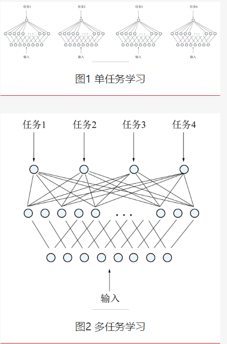

# 多任务强化学习

改进RL智能体效率的方向之一是通过基于多任务的学习。

## 多任务学习

多任务学习由R.卡鲁阿纳(Rich Caruana)于1993年首次提出。R.卡鲁阿纳指出“MTL是一种利用相关任务训练信号中包含的领域信息作为归纳偏差来提高归纳迁移的方法。它通过使用共享的低维表示来并行学习任务，从每个任务中学到的内容可以帮助我们更好地学习其他任务”。

复杂问题可以分解为简单且相互独立的子问题来单独解决（图1），然后再合并结果，得到最初复杂问题的结果。然而现实世界中很多问题不能分解为独立的子问题，即使可以分解，各个子问题之间也是相互关联的，通过一些共享因素或共享表示联系在一起。因此把现实问题当作一个个独立的单任务处理，忽略了问题之间所含的关联信息。多任务学习把多个相关任务放在一起学习（图2）。多个任务之间共享一些因素，它们可以在学习过程中共享它们所学到的信息，这是单任务学习所具备的。相关联的多任务学习比单任务学习能取得更好的泛化效果。

## 多任务学习，结合DRL

在多任务学习过程中，单智能体将借助DRL算法，如A3C，同时学习一组紧密相关的任务。（类似上学时的同学）

借此方法，将定期与全局网络共享这些单智能体中每个智能体的神经网络参数。 通过组合所有单智能体的学习参数，全局网络会导出一组新参数并将其与所有智能体共享，主要目标是通过在相同环境中运行的多个相关任务之间迁移学习（共享知识）来增强RL智能体的整体性能。

多任务学习的关键之一是RL智能体应开发一个常识库并学习可以在各种相关任务间共享和使用的一般技能。 另外，多任务间的竞争应该保持平衡。

## 阻碍多任务DRL发展的瓶颈

阻碍多任务DRL发展的瓶颈主要与多任务的有效系统资源管理和可伸缩性等因素有关[8]。 可伸缩性与RL算法的两个主要弱点密切相关。

首先，RL算法的训练通常花费大量时间，且需要更多的数据样本才能收敛到可接受的结果。 其次，经过特定任务训练的RL智能体服务于同一任务[9]。 通过考虑典型RL算法的上述两个缺点，与单任务学习相比，多任务DRL必须能够提供更好的训练结果，并维持有限资源下多任务资源需求间的适当平衡。

并行多任务学习是强化学习中最流行的多任务学习方法之一[10]。 其背后的核心思想是，DRL体系结构将单个学习者（critic）与不同的actor结合在一起。 每个actor都生成各自的学习轨迹（一组参数），并将它们同步或异步发送给学习者。 之后，每个actor都将在下一学习轨迹开始前从学习者那里获取最新的一组策略参数。这样一来，每个任务的学习将与其他任务共享，从而在内部提高了RL智能体整体学习动力。

本文贡献
介绍多任务强化学习的主要方法、挑战、稀疏的多任务强化学习[15]、（复杂环境）马尔可夫游戏中的多智能体强化学习[16]。

Deep Reinforcement Learning with Multi-Tasking
3.1. Transfer Learning Oriented Approach

在DL进入RL领域之前，有关RL中面向多任务算法开发的大部分早期研究工作都尝试使用迁移学习。 迁移学习的核心思想是在不同但相关的源任务和目标任务之间迁移知识，以提高用于学习目标任务的机器学习算法的性能。 在RL中的迁移主要集中在推导各种方法以将知识从一组源任务转移到目标任务。 当源任务和目标任务的相似度比较高时，基础学习算法可以很容易地使用所传递的知识有效解决目标任务，从而节省了很多数据样本。

也有一些研究尝试涉及扩展有关多智能体系统的相同方法[30]。 通常，多智能体系统基于智能体在源任务（培训任务）中学习的联合策略来制定目标任务中智能体的初始策略。

借助实例传输，表示传输或参数传输等多种传输方法，知识传输在源任务和目标任务间以不同的方式进行。 在每一种方法中，底层传输算法在解决相似源任务时都严重依赖于先验知识，并以此为参考以bias the learning process on any new task。

3.2. Learning Shared Representations for Value Functions

开发良好environmental abstraction的能力以及智能体在环境中的角色是该方法成功的关键因素[33]。 此方法核心思想是假设智能体学习的不同任务可能具有共享的结构和内置的冗余。 将这些共同因素抽象化将很有助于加快整个学习过程。 学习共享表示是一种通过学习鲁棒可迁移的environmental abstraction来实现上述目标的方法，其中的abstraction概括了智能体在环境中遇到的一系列任务[34]。

值函数是RL领域的关键思想之一，且主要与函数逼近器结合使用，以概括与智能体环境相关的大型状态动作空间[26]。 值函数表现出与状态空间和目标状态有关的组成结构[35]。 此外，早期研究表明，值函数可以捕获和表示超出其当前目标的知识，这些知识可被利用或重用于未来学习[36]。 通过利用智能体要处理的不同任务间共享公共结构的状态-动作值空间，我们可以学习最佳的值函数。 这可以通过将上述常见结构容纳到值迭代和策略迭代方法中来实现（整合后的方法分别为拟合Q迭代和近似策略迭代）。

3.3. Progressive Neural Networks

Progressive Neural Networks具有保护自己免受灾难性遗忘的能力，并且还可借助与先前学习的函数的横向连接来利用先验知识。Progressive Neural Networks是由DeepMind开发的一种利用神经网络[37]的横向特征迁移概念的多任务方法。 The idea of having a continuous chain of progressive neural networks is to facilitate the transfer of knowledge across a series of tasks

Progressive Neural Networks的设计目标如下：

•拥有一个能够在学习过程中将特征层次的每一层纳入先验知识的系统；

•开发对灾难性遗忘场景具有免疫力的系统。

这种方法的最大优点之一是能够在整个训练周期中保留一组预先训练的模型[37]。 此外，Progressive Neural Networks还可从预先训练的模型中学习横向联系，以提取新任务的有用特征。 这种具有渐进性质的方法带来了更丰富的组合性，并且还允许在feature hierarchy的每一层轻松集成先验知识。 这种类型的持续学习使智能体不仅能学习一系列依次经历的任务，而且同时具有从先前任务中迁移知识以提高收敛速度的能力[38]。Progressive Neural Networks将上述features集成到一个特殊的模型体系结构中，该结构通过为智能体的每个任务实例化新的神经网络（列）来防止灾难性遗忘。 通过横向连接先前学习的列中的features列表实现知识迁移[37]。 在任何时候，只要学习到新任务，模型都会以新神经网络单元的形式向现有框架中添加新的知识列，然后新单元将在后续任务的学习中被使用。

此方法的可能缺点是，由于随着学习的持续进行，模型计算可能会很昂贵。

3.4. PathNet

PathNet是一种旨在通过结合迁移学习，持续学习和多任务学习的各方面来实现artificial general intelligence (AGI)[38]的多任务强化学习方法。 它将多智能体嵌入神经网络中，每个智能体的目标是在学习新任务时确定要重用网络的哪些部分[7]。 智能体是神经网络内的路径（也称为genotypes），它决定了学习过程中使用的参数子集[39]。 这些用于正向传播的参数通常在PathNet算法的反向传播阶段被修改。 在学习过程中，tournament selection genetic algorithm将被用于通过神经网络选择路径。 智能体在神经网络内执行动作，并逐步建立关于如何有效将神经网络环境中现有参数重用于新动作（任务）的知识。 智能体通常与正在学习其他任务并共享参数以进行积极知识迁移的其他智能体并行工作； 否则，他们将更新导致消极知识迁移的不相交参数[39]。

PathNet体系结构由具有L层的DNN组成，每层有M个模块。来自每一层模块的集成输出将被传递到下一层的活动模块中。 神经网络中每个任务的最后一层是唯一的，不会与环境中任何其他任务共享。

PathNet的优点之一是神经网络可以非常有效地重用现有知识，而不必为每个任务从头开始学习，这在状态空间存在许多相互关联任务的场景中十分有用[39]。 实验中PathNet对于MNIST，CIFAR-100和SVHN数据集监督学习分类任务、以及Atari和Labyrinth强化学习任务的知识迁移展示了积极成果。

3.5. Policy Distillation and Actor-Mimic

策略提炼（PD）和Actor-Mimic（AM）是两种利用提炼概念实现多任务DRL的方法。

3.5.1. 策略提炼

Distillation是一种与最小化ensemble方法的计算成本有关的方法[40]。其关键思想是将复杂模型（通常是ensemble）学习到的features压缩为比例更小，速度更快的模型，其性能可与原始ensemble[41]媲美。 后来，相同方法被应用于神经网络领域[42]。

类似的，策略提炼可被视为用于提取强化学习智能体策略的技术。该策略将用于训练一个在专家级别上具有较小规模和较高效率的新网络[40]。 此外，我们可以扩展相同的方法以将多个特定于任务的策略合并为智能体的单个策略。 策略提炼的早期研究使用了DQN。 现在其技术已成功用于将多个active policies从深度Q网络迁移到未经训练的网络。

作为从教师模型T到学生模型S的知识迁移方法，distillation既可用于单任务级别（单游戏策略提炼），也可应用于多任务级别。在单任务策略提炼下，数据生成将由教师网络（受过训练的DQN智能体）完成，进一步的监督训练将由学生网络进行。

为实现多任务策略提炼，该方法分别训练n位基于DQN的不同单人游戏专家[40]。 此后，这些专家分别生成输入和目标，并将这些数据存储在不同的RAM中。 进一步地，蒸馏剂从这n个数据存储中顺序学习。

扫码关注公众号”黄含驰的机器学习与优化打怪路“

3.5.2. Actor-Mimic

智能体的关键之一是其能在多种环境中行动并将从过去经验中积累的知识迁移到新环境中的能力。 Actor-Mimic是主要集中于多任务和迁移学习的一种方法。它使智能体能够学习如何同时执行多个任务，然后将积累的知识推广到新领域[43]。 通常， Actor-Mimic可被视为通过使用一组相关源任务来训练单个深度策略网络的方法。 使用 Actor-Mimic训练的模型可在许多游戏中达到专家级的性能。

更重要的是，由于源任务和目标任务间具有显着相似性，因此在训练目标任务时， Actor-Mimic可以很好地将源任务训练过程中学习的features用于泛化[44]。

Actor-Mimic利用DRL和模型压缩技术来训练单个策略网络，目的是使网络在几位专家老师的指导下学习如何在一组不同的任务中行动。 进一步地，在没有专家事先指导的情况下，由该深层策略网络学习的表示可被用于概括新任务。

3.6. Asynchron ous Advantage Actor-Critic (A3C)

DeepMind提出了一种并行训练方法A3C——将多个智能体在同一环境的多个实例上并行执行[46]。 这些在并行环境中运行的多个智能体以异步方式更新全局值函数。 在训练期间的任何特定时间步长t，所有这些并行智能体都将经历各种不同的状态，这几乎使所有智能体的学习都变得unique。

由于这种uniqueness，A3C为智能体提供了对环境中整个状态空间的有效且高效的探索[47]。A3C在Actor-Critic基础上添加了parallelized和asynchronous架构：

多个actor-learners (critics)将被分派到环境的各个instantiations，其中这些instantiations中的每个都与环境交互并收集其各自的经验，最后将梯度更新异步推送到中央目标网络（全局网络） ）[46]。 在梯度累积及steps到达一定数量后，Update to this single global network, with which all other different and independent threads are linked, is often done。 通过同时训练不同任务实例，A3C为训练数据带来了稀缺性因素（？？？），并消除了memory replay的需求[31]。 图3描绘了A3C算法多任务执行模型的高级体系结构表示

3.7 其他

4.研究挑战
4.1 可伸缩性（Scalability）

通常，RL算法需要更多的训练数据样本以及相对长的训练时间才能收敛到可接受的结果[9]。

4.2 分散注意力的难题（Distraction Dilemma）

不同任务对有限的资源存在竞争，多任务学习需要建立多任务需求/资源分配的平衡。 不合理分配注意力将导致Distraction Dilemma。

分配多少注意力与不同任务的训练速度、对学习过程的重要程度、奖励密度/大小等因素相关。对这些因素把控不当将导致多任务强化学习（MTRL）经常忽略主要任务而专注于错误的任务。

4.3 部分可观察性

在许多实际场景中，RL智能体的观察可能只捕获了整个环境状态的一小部分[8]。 为使智能体仍针对每个状态采取最佳措施，智能体不仅要记住当前的观察结果，还要记住过去的观察结果，以便做出最佳决策。 当状态动作空间很大时，我们还将面临学习和记住包含环境最重要细节的紧凑环境表示的挑战。

4.4 有效的探索

4.5 灾难性遗忘

由于合并了与另一任务（当前任务B）相关的信息，DNN有可能（倾向性）突然丢失从先前任务（任务A）中学到的信息。 通常，在RL环境中按顺序在多任务上对智能体进行训练时，灾难性遗忘现象经常出现，关键原因是与任务A相关的网络参数（权重）被覆盖。 这种现象被认为是创建artificial general intelligence (AGI)的最大障碍，因为它会对持续学习的能力产生负面影响。 因此，多任务深度强化学习（MTDRL）智能体应避免灾难性遗忘，这一点非常重要。

4.6 负面知识迁移

从一组源样本到目标任务的知识迁移可能对智能体的整体学习进度和绩效产生负面影响，尤其当源任务和目标任务间存在显着差异时，这点可能会比较明显。

5.现有求解方案回顾
多任务深度强化学习（MTDRL）的研究工作主要由DeepMind和OpenAI主导。 经过这样的研究，已经设计了三种主要的MTDRL解决方案，即DISTRAL，IMPALA和PopArt。

5.1 DISTRAL(DIStill & TRAnsfer Learning)

DISTRAL希望建立一个通用框架，以提炼centroid policy，然后在多任务强化学习中迁移单个worker的常见行为。 DISTRAL的关键思想不是共享环境中各worker间的参数，而是共享一种可以捕获common behavior across tasks的精简策略。

图4 [22]显示了DISTRAL模型的体系结构。

推导出提炼的策略后，DISTRAL进一步利用Kullback-Leibler（KL）散度通过正规化（regularise）来指导特定任务的策略[43]。（获得共享策略后，每个worker将被单独训练，通过尽可能接近共享策略来解决自己的任务）

事实证明，DISTRAL方法大大优于使用共享神经网络参数进行多任务或迁移强化学习的传统方法[22]。

原因1：distillation plays a vital role in the optimization procedure when using KL divergences as a means to regularize the output of task models towards a distilled model deduced from the individual task policies~

原因2：提炼的模型本身可被用作调节器，用于训练环境中的各任务模型[22]。更重要的是，使用提炼模型作为正规化工具可使将单个work的网络正规化到更有意义的层面，如任务策略，而不是参数层面[53]。

5.2. IMPALA (Importance Weighted Actor-Learner Architecture)

使用单智能体实现多任务的主要挑战之一是智能体需要处理的数据量和训练时间增加。鉴于此，DeepMind提出了一个名为IMPALA（Importance Weighted Actor-Learner Architecture）的架构。在最基本的层面上，IMPALA是一个分布式智能体架构，它由一个具有单一参数集的智能体来develop。IMPALA能有效利用单机训练环境中的资源，同时可以扩展到多台机器而不牺牲数据效率或资源利用率。通过V-trace——一种新型off-policy修正方法，IMPALA可在高吞吐量的情况下，通过结合解耦acting和learning，实现相当稳定的学习。

通常，DRL模型的架构基于与多个actor结合的单个学习者（critic）。 在此生态系统中，每个actor都生成自己的学习周期参数（轨迹），然后通过队列将该知识发送给学习者（critic）。 学习者从环境中的所有其他actor收集相同类型的轨迹，并制定中心策略。 在下一学习周期（轨迹）之前，每个actor都从学习者（critic）检索更新的策略参数。 这与A3C算法非常接近，IMPALA的体系结构受到了该算法的极大启发。 IMPALA遵循多个actor的拓扑结构，学习者可以协作以积累知识。 [23]图5和图6分别显示了具有单学习者和多学习者配置的IMPALA生态系统架构。

IMPALA遵循actor-critic设置来学习策略π和名为Vπ的基线函数。其主要组件由一组不断产生经验轨迹的actor组成，此外，可能会有一或多个学习者使用从actor发送来的这些经验来off-policy学习π。 在每个轨迹的起点，actor将自己的本地策略µ更新为最新的学习者策略π[23]。 进一步地，actor将在其环境中将该策略运行n步。 在这n步的最后，actor将状态，动作和奖励的另一条轨迹以及相关策略分配发送给学习者。 以此方式，每次从环境中的actor收集轨迹信息时，学习者将不断更新其策略π[23]。 这样一来，IMPALA体系结构收集来自不同学习者的经验，然后将这些经验传递给中央学习者。 进一步地，该中央学习者计算梯度并生成具有独立actor和学习者的模型。

IMPALA体系结构的关键之一是actor不必出现在同一机器上，而是可以分布在许多机器上。

5.3. PopArt

多任务强化学习的主要挑战之一是在多项任务的需求之间建立平衡，抵抗分散注意力困境，并在掌握单任务和实现更好的泛化这一最终目标之间建立平衡。

为此，DeepMind提出了PopArt算法。 PopArt的核心目标是最大程度减少干扰，从而稳定学习过程，以促进对MTRL（多任务强化学习）技术的利用。PopArt模型是在原始IMPALA的基础上设计的，将多个卷积神经网络层与其他技术（如词嵌入与长短期记忆（LSTM）的递归神经网络）相结合。PopArt的工作原理是使每个单任务的贡献适应智能体的更新，确保所有智能体都将发挥各自的作用，从而对整体学习动力产生成比例的影响。 PopAr根据环境中所有任务的输出来修改神经网络权重。 在初始阶段，PopArt会估算最终目标的均值和分布，并使用这些估值在更新网络权重前将目标标准化，这使得PopArt的学习过程更加稳定和强大。 在Atari游戏中，PopArt展示了对其他多任务强化学习体系结构的改进。 实验中有关个人奖励规模的问题可通过奖励剪裁（Reward clipping）[31]解决。

Reward clipping是当不同环境之间使用的奖励系统存在差异时，将整个环境中所有设置的奖励标准化的方法。

5.4 现有解法的比较

（文章对PopArt花了比较多笔墨来赞赏）

6.总结
从DISTRAL (DIStill & TRAnsfer Learning), IMPALA(Importance Weighted Actor-Learner Architecture) 和 PopArt的基于多任务的体系结构中我们可以很明显地看出，大多数深MTDRL挑战（如可伸缩性，局部可观察性和有效探索）可在很大程度上得到解决。 不过，可能由多任务环境中各学习者共享梯度值引起的负面知识迁移，仍然是MTDRL中未得到很好解决的重要挑战。

（plus，IMPALA难以解决灾难性遗忘和分散注意力困境，PopArt通过将LSTM模块引入体系结构来解决这些问题。（不过我还是觉得这有待改进））

[1]: https://zhuanlan.zhihu.com/p/265750570#Deep%20Reinforcement%20Learning%20with%20Multi-Tasking
