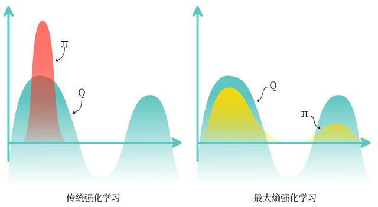
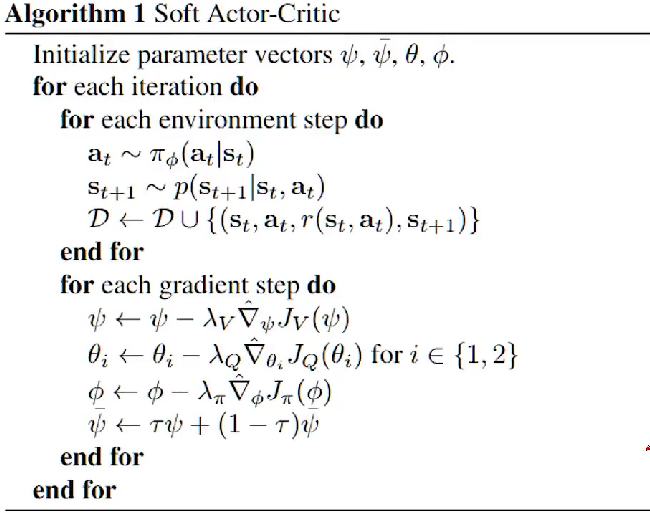
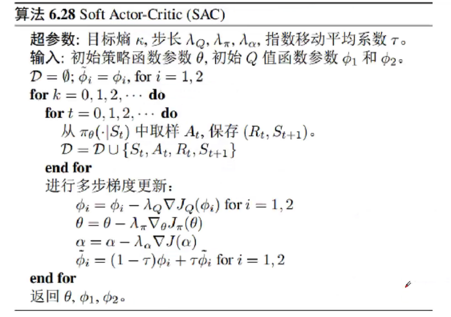

<!--
 * @version:
 * @Author:  StevenJokess（蔡舒起） https://github.com/StevenJokess
 * @Date: 2023-02-23 20:58:18
 * @LastEditors:  StevenJokess（蔡舒起） https://github.com/StevenJokess
 * @LastEditTime: 2023-03-29 05:07:42
 * @Description:
 * @Help me: 如有帮助，请赞助，失业3年了。
 * @TODO::
 * @Reference:
-->
# SAC算法

## 简介

之前的章节提到过在线策略算法的采样效率比较低，我们通常更倾向于使用离线策略算法。然而，虽然 DDPG 是离线策略算法，但是它的训练非常不稳定，收敛性较差，对超参数比较敏感，也难以适应不同的复杂环境。

2018 年，一个更加稳定的离线策略算法 —— 软演员评论员算法 Soft Actor-Critic（SAC）被提出。SAC 的前身是 *Soft Q-learning*，它们都属于最大熵强化学习的范畴。Soft Q-learning 不存在一个显式的策略函数，而是使用一个函数的波尔兹曼分布，在连续空间下求解非常麻烦。于是 SAC 提出使用一个 Actor 表示策略函数，从而解决这个问题。目前，在无模型的强化学习算法中，SAC 是一个非常高效的算法，它学习一个随机性策略，并利用熵正则化和一些其它技巧来稳定学习，在不少标准环境中取得了领先的成绩，如在 benchmarks 上获得比 DDPG 更高的分数。[1]

## 最大熵强化学习

### 熵

**熵** (entropy) 表示对一个随机变量的随机程度的度量。具体而言，如果 $X$ 是一个随机变量，且它的概率密度函数为 $p$ ，那么它的熵 $H$ 就被定义为

$$
H(X)=\mathbb{E}_{x \sim p}[-\log p(x)]
$$

在强化学习中，我们可以使用 $H(\pi(\cdot \mid s))$ 来表示策略 $\pi$ 在状态 $s$ 下的*随机程度*，即可表示*探索性*。

### 思想

**最大熵强化学习** (maximum entropy RL) 的思想就是除了要最大化累积奖励，还要使得*策略更加随机*，即输出的每一个action的概率尽可能相差不大。如此，强化学习的目标，不但要最大化累计（折扣）奖励，还要最大化一个**带正则项的熵**。

最优策略定义为

$$
\pi^*=\argmax _\pi \sum_t \mathbb{E}_\pi\left[ r\left(s_t, a_t\right)+\alpha H\left(\pi\left(\cdot \mid s_t\right)\right)\right]
$$

其中， $\alpha$ 是一个正则化的系数，用来控制熵的重要程度。（原版有问题，后参考了[5]）

熵正则化增加了强化学习算法的探索的程度， $\alpha$ 越大，*探索性*就越强，有助于加速后续的策略学习，并减少策略陷入较差的局部最优的可能性。传统强化学习和最大熵强化学习的区别如图 14-1 所示。

## Soft Q-Learning（SQL） 或 Soft策略迭代

在最大熵强化学习框架中，由于目标函数发生了变化，其他的一些定义也有相应的变化。

Soft 贝尔曼方程，是依据贝尔曼期望方程，得动作价值函数和状态价值函数的关系。

1. 用状态价值函数表示动作价值函数的贝尔曼等式：
$$
Q\left(s_t, a_t\right)=r\left(s_t, a_t\right)+\gamma \mathbb{E}_{s_{t+1}}\left[V\left(s_{t+1}\right)\right]
$$
2. 用动作价值函数表示状态价值函数的贝尔曼等式：
$$
V\left(s_t\right)=\mathbb{E}_{a_t \sim \pi}\left[Q\left(s_t, a_t\right)-\alpha \log \pi\left(a_t \mid s_t\right)\right]=\mathbb{E}_{a_t \sim \pi}\left[Q\left(s_t, a_t\right)\right]+\alpha H\left(\pi\left(\cdot \mid s_t\right)\right)
$$

根据用状态价值函数表示动作价值函数的贝尔曼等式，在有限的状态和动作空间情况下，Soft 策略评估可以收敛到策略 $\pi$ 的 Soft $Q$ 函数。

### 基于能量模型（Energy-Based Model,EBM）

基于能量模型（Energy-Based Model,EBM）的定义为$\tilde{p}(\mathbf{x})=\exp (-E(\mathbf{x}))$。

E(x)被称作是能量函数（energy function）。由于对所有的z，exp(z)都是正的。这保证了没有一个能量函数会使得概率小于等于0，这点与策略的非负性（必须）与非零性（探索性）相吻合。

当把能量函数定义为某种倍数的$\mathrm{Q}$ 函数的负数：

$$
E(X)=-\frac{1}{\alpha} Q_{s o f t}^\pi\left(s_{t^{\prime}} a_t\right)
$$

其中 $\alpha$ 为用于控制探索程度的参数，

此时说，策略 $\pi$ 是基于 基于能量模型（Energy-Based Model,EBM）的，表示为：

$$
\pi\left(a_t \mid s_t\right) \propto \exp \left(\frac{1}{\alpha} Q_{\text {soft }}^\pi\left(s_{t^{\prime}} a_t\right)\right)
$$

为了满足策略的总和为1的性质，故用配分函数 $Z^{\pi_\theta} \left(\mathbf{s}\right)$ 来归一化，则策略的具体表示: $\pi\left(a_t \mid s_t\right) = \frac{\exp \left(\frac{1}{\alpha} Q_{\text {soft }}^\pi\left(s_t, a\right)\right)}{Z^{\pi_\theta} \left(\mathbf{s, \cdot}\right)}$

- 离散动作时：$\pi\left(a_t \mid s_t\right) =\frac{\exp \left(\frac{1}{\alpha} Q_{\text {soft }}^\pi\left(s_t, a\right)\right)}{\sum \exp \left(\frac{1}{\alpha} Q_{s o f t}^\pi\left(s_t, a\right)\right) }$
- 连续动作时：$\pi\left(a_t \mid s_t\right) =\frac{\exp \left(\frac{1}{\alpha} Q_{\text {soft }}^\pi\left(s_t, a\right)\right)}{\int \exp \left(\frac{1}{\alpha} Q_{s o f t}^\pi\left(s_t, a\right)\right) d a}$

### 为什么叫Soft？

回想一下一般的RL每次都是选择 $Q$ 值最大的动作作为策略，而此处的策略的分母其实是SumExp的积分形式。

- 如果 $Q_{s o f t}\left(s_{t^{\prime}} a_t\right)$ 非常大，同时由于 $\exp ()$ 的存在 ，分母的值将主要取决于 $Q_{s o f t}\left(s_{t^{\prime}} a_t\right)$ 非常大时相对应的action，这时策略将以接近1的概率选择这个动作。
- 而当各个动作的 $Q_{s o f t}^\pi\left(s_{t^{\prime}} a_t\right)$ 都相似或者没有特别突出大的值的时候，策略就将趋向于对各个动作赋予相近的概率，即近于平均的概率，每个动作都有被选择的机会。这就非常soft ，即对当前局面的动作明确时，果断选择，而当动作不明确时候，随机探索。对比一般 Q-Learning的Hard max策略，这里可以说是**soft** max。

### 利用Q优化策略

Q函数的定义：

$$
\begin{aligned}
Q_{\text {soft }}^\pi\left(s_{t^{\prime}} a_t\right) & \triangleq r_t+E_\pi\left[\sum_{t=1}^{\infty} \gamma^t\left(r_{t+1}+\alpha \mathrm{H}\left(\pi\left(s_{t+1}\right)\right)\right)\right] \\
\text{TD(0)时：}&=r_t+\gamma\left(\alpha \mathrm{H}\left(\pi\left(s_{t+1}\right)\right)+E_\pi\left[Q_{s o f t}^\pi\left(s_{t+1}, a_{t+1}\right)\right]\right.
\end{aligned}
$$

之前求最优策略，从策略的优化目标（用Q代替r）：
$J(\pi)=\sum_t E_{\left(s_{t^{\prime}} a_t\right) \sim \pi}\left[Q_{\text {soft }}^\pi\left(s_{t^{\prime}} a_t\right)+\alpha \mathrm{H}\left(\pi\left(\cdot \mid s_t\right)\right)\right]$
，得最优策略：$\pi_{*}=\argmax_{\pi} J(\pi)$。这种方法，要求一步到位，实际运算中很难解。

还有一种求最优策略，即利用策略的优化方向是，使得策略尽可能逼近Q函数的分布。目的是Q函数来指导策略改进，从而使得策略更加优秀。当策略达到最优时，它将完全逼近Q函数的分布，从而实现最大化累积奖励的目标。（具体证明，见本章最后附录：为何可以用分布逼近Q函数去优化策略）

我们可以用KL散度来表示逼近程度，利用策略不断逼近Q函数的分布，得Soft 策略提升公式为

$$
\pi_{\text {new }}=\arg \min _{\pi^{\prime}} D_{K L}\left(\pi^{\prime}(\cdot \mid s), \frac{\exp \left(\frac{1}{\alpha} Q^{\pi_{\text {old }}}(s, \cdot)\right)}{Z^{\pi_{\text {old }}}(s, \cdot)}\right)
$$

利用 Soft 策略提升公式可以改进策略（具体策略改进定理见最后），不断得到 $\pi_{\text {new}}$：

重复交替使用 Soft 策略评估和 Soft 策略提升，最终策略可以收敛到最大熵强化学习目标中的最优策略。（是收敛性没有证明的！）

注意：该 Soft 策略迭代方法只适用于**表格型** (tabular) 设置的情况，即状态空间和动作空间是有限的情况。在连续空间下，我们需要通过参数化函数 $Q$ 和策略 $\pi$ 来近似这样的迭代。

## SAC

在 $S A C$ 算法中，我们为两个动作价值函数 $Q$ (参数分别为 $\omega_1$ 和 $\omega_2$ ) 和 一个策略函数 $\pi$ (参数为 $\theta$ ) 建模。

### Q 网络

基于 Double DQN 的思想， SAC 使用两个 $Q$ 网络，但每次用 $Q$ 网络时会挑选一个 **$Q$ 值小** 的网络，从而缓解 $Q$ 值过高估计的问题，即$\min _{j=1,2} Q_{\omega_j^{-}}\left(s_{t+1}, a_{t+1}\right)$

任意一个函数 $Q$ 的损失函数为:

$$
\begin{aligned}
L_Q(\omega) & =\mathbb{E}_{\left(s_t, a_t, r_t, s_{t+1}\right) \sim R}\left[\frac{1}{2}\left(Q_\omega\left(s_t, a_t\right)-\left(r_t+\gamma V_{\omega^{-}}\left(s_{t+1}\right)\right)\right)^2\right] \\
& =\mathbb{E}_{\left(s_t, a_t, r_t, s_{t+1}\right) \sim R, a_{t+1} \sim \pi_\theta\left(\cdot \mid s_{t+1}\right)}\left[\frac{1}{2}\left(Q_\omega\left(s_t, a_t\right)-\left(r_t+\gamma\left(\min _{j=1,2} Q_{\omega_j^{-}}\left(s_{t+1}, a_{t+1}\right)-\alpha \log \pi\left(a_{t+1} \mid s_{t+1}\right)\right)\right)\right)^2\right]
\end{aligned}
$$

其中， $R$ 是策略过去收集的数据，因为 $\mathrm{SAC}$ 是一种离线策略算法。为了让训练更加稳定，这里使用了目标 $Q$ 网络 $Q_{\omega^{-}}$，同样是两个目标 $Q$ 网络，与两个 $Q$ 网络一一对应。

SAC 中目标 $Q$ 网络的更新方式与 DDPG 中的更新方式一样。

### 策略 $\pi$的损失函数

策略 $\pi$ 的损失函数由 $\mathrm{KL}$ 散度得到，化简后为:

$$
L_\pi(\theta)=\mathbb{E}_{s_t \sim R, a_t \sim \pi_\theta}\left[\alpha \log \left(\pi_\theta\left(a_t \mid s_t\right)\right)-Q_\omega\left(s_t, a_t\right)\right]
$$

可以理解为最大化函数 $V$ ，因为有 $V\left(s_t\right)=\mathbb{E}_{a_t \sim \pi}\left[Q\left(s_t, a_t\right)-\alpha \log \pi\left(a_t \mid s_t\right)\right]$

#### 重参数化技巧

对连续动作空间的环境，SAC 算法的策略输出高斯分布的*均值和标准差*。

由于根据高斯分布来采样动作的过程是不可导的。因此，我们需要用到**重参数化技巧** (reparameterization trick) 。

重参数化的做法是先从一个单位高斯分布 $\mathcal{N}$ 采样，再把采样值*乘以标准差后加上均值*。这样就可以认为是从策略高斯分布采样，并且这样对于策略函数是可导的。

#### 重写策略 $\pi$ 的损失函数

我们把重参数化$a_t$后的动作表示为$\tilde{a}_t$，便使用函数 $f_θ()$ 将动作 $\tilde{a}_t$ 表示为一个噪声随机变量 $\epsilon_t$ 和状态 $s_t$ 的函数，即 $\tilde{a}_t = f_\theta\left(\epsilon_t ; s_t\right)$

考虑到两个函数 $Q$ ，重写策略 $\pi$ 的损失函数:

$$
\begin{aligned}
L_\pi(\theta) & =\mathbb{E}_{s_t \sim R, \epsilon_t \sim \mathcal{N}}\left[\alpha \log \left(\pi_\theta\left(\tilde{a}_t  \mid s_t\right)\right)-\min _{j=1,2} Q_{\omega_j}\left(s_t, \tilde{a}_t \right)\right] \\
& =\mathbb{E}_{s_t \sim R, \epsilon_t \sim \mathcal{N}}\left[\alpha \log \left(\pi_\theta\left(f_\theta\left(\epsilon_t ; s_t\right) \mid s_t\right)\right)-\min _{j=1,2} Q_{\omega_j}\left(s_t, f_\theta\left(\epsilon_t ; s_t\right) \right)\right]
\end{aligned}
$$

#### 自动调整熵正则项

在 SAC 算法中，如何选择熵正则项的系数非常重要，可以说是该工作的最大创新点。在不同的状态下需要不同大小的熵：在最优动作不确定的某个状态下，熵的取值应该大一点；而在某个最优动作比较确定的状态下，熵的取值可以小一点。为了*自动调整熵正则项*，SAC 将强化学习的目标改写为一个带约束的优化问题：

$$
\max _\pi \mathbb{E}_\pi\left[\sum_t r\left(s_t, a_t\right)\right] \quad \text { s.t. } \quad \mathbb{E}_{\left(s_t, a_t\right) \sim \rho_\pi}\left[-\log \left(\pi_t\left(a_t \mid s_t\right)\right)\right] \geq \mathcal{H}_0
$$

也就是最大化期望回报，同时约束熵的均值大于 $\mathcal{H}_0$ 。

通过一些数学技巧化简后，得到 $\alpha$ 的损失函数：

$$
L(\alpha)=\mathbb{E}_{s_t \sim R, a_t \sim \pi\left(\cdot \mid s_t\right)}\left[-\alpha \log \pi\left(a_t \mid s_t\right)-\alpha \mathcal{H}_0\right]
$$

其中 $\mathcal{H}_0 = -\operatorname{dim}(\mathrm{A})$ 。

- 当策略的熵低于目标值 $\mathcal{H}_0$ 时，训练目标 $L(\alpha)$ 会使 $\alpha$ 的值增大，进而在上述最小化损失函数 $L_\pi(\theta)$ 的过程中增加了策略熵对应项的重要性，即关注**增加策略的熵**，以促进更多的探索[2]；
- 当策略的熵高于目标值 $\mathcal{H}_0$ 时，训练目标 $L(\alpha)$ 会使 $\alpha$ 的值减小，进而使得策略训练时*更专注于价值提升*。

## 伪代码【并与数学算法对照】

- 用随机的网络参数 $\omega_1, \omega_2$ 和 $\theta$ 分别初始化 Critic 网络 $Q_{\omega_1}(s, a), Q_{\omega_2}(s, a)$ 和 Actor 网络 $Q_{\theta}(s, a)$
- 复制相同的参数 $\omega_1^{-} \leftarrow \omega_1 ， \omega_2^{-} \leftarrow \omega_2$ ，分别初始化目标网络 $Q_{\omega_1^{-}}$和 $Q_{\omega_1^{-}}$ ，初始化经验回放池 $R$【数学上，用集合表示：$\mathbb{D} = \emptyset$】
- **for** 序列 $e=0 \rightarrow E$ **do**【积累经验】
  - 获取环境初始状态 $s_0$
  - **for** 时间步 $t=0 \rightarrow T$ **do**
    - 根据当前策略选择动作 $a_t \sim \pi_\theta\left(\cdot \mid s_t\right)$
    - 执行动作 $a_t$ ，获得奖励 $r_t$ 或 $r(s_t, a_t)$ ，环境状态变为 $s_{t+1}$
    - 将 $\left(s_t, a_t, r_t, s_{t+1}\right)$ 存入回放池 $R$ 【数学上，用集合表示：$\mathbb{D} = \mathbb{D} \cup \{s_t, a_t, r_t, s_{t+1}\}$】
  - **end for**
  - for 训练轮数 $k=1 \rightarrow K$ do 【进行多步梯度更新，其中超参数：步长 $\lambda_Q, \lambda_\pi, \lambda_\alpha$，指数移动平均系数 $\tau$ 。】
       - 从 $R$ 中采样 $N$ 个元组 $\left\{\left(s_i, a_i, r_i, s_{i+1}\right)\right\}_{i=1, \ldots, N}$
       - 对每个元组，用目标网络计算 $y_i=r_i+\gamma \min _{j=1,2} Q_{\omega_j^{-}}\left(s_{i+1}, a_{i+1}\right)-\alpha \log \pi_\theta\left(a_{i+1} \mid s_{i+1}\right)$ ，其中 $a_{i+1} \sim \pi_\theta\left(\cdot \mid s_{i+1}\right)$
      - 用损失函数 $L_Q(\omega_j)$ 去更新两个 Critic 网络: 对 $j=1,2$ ，$\omega_j \leftarrow \omega_j - \nabla L_Q\left(\phi_i\right)$ ， 其中损失函数$L_Q(\omega_j)=\frac{1}{N} \sum_{i=1}^N\left(y_i-Q_{\omega_j}\left(s_i, a_i\right)\right)^2$
      - 用重参数化技巧采样动作 $\tilde{a}_i$ ，然后用损失函数 $L_\pi(\theta)$ 更新当前 Actor 网络 $\theta$，即 $\theta \leftarrow \theta-\lambda_\pi \nabla_\theta L_\pi(\theta)$，其中损失函数 $L_\pi(\theta)=\frac{1}{N} \sum_{i=1}^N\left(\alpha \log \pi_\theta\left(\tilde{a}_i \mid s_i\right)-\min _{j=1,2} Q_{\omega_j}\left(s_i, \tilde{a}_i\right)\right)$
      - 用损失函数 $L(\alpha)$ 更新熵正则项的系数 $\alpha$，即$\alpha  \leftarrow  \alpha-\lambda_\alpha \nabla L(\alpha)$，其中损失函数 $L(\alpha) = \mathbb{E}_{s_t \sim R, a_t \sim \pi\left(\cdot \mid s_t\right)}\left[-\alpha \log \pi\left(a_t \mid s_t\right)-\alpha \mathcal{H}_0\right]$，
      - 更新目标Critic网络： 对 $j=1,2$，$\omega_j^{-} \leftarrow \tau \omega_1+(1-\tau) \omega_j^{-}$ 。
  - **end for**
- **end for**
- 返回 $\theta, \omega_1^{-}, \omega_2^{-}$，得最优策略 $\pi_\theta$[5]。

## SAC代码实践

我们来看一下 SAC 的代码实现，首先在倒立摆环境下进行实验，然后再尝试将 SAC 应用到与离散动作交互的车杆环境。

首先我们导入需要用到的库。

接下来定义策略网络和价值网络。由于处理的是与连续动作交互的环境，策略网络输出一个高斯分布的均值和标准差来表示动作分布；而价值网络的输入是状态和动作的拼接向量，输出一个实数来表示动作价值。

然后我们来看一下 SAC 算法的主要代码。如 14.4 节所述，SAC 使用两个 Critic 网络和来使 Actor 的训练更稳定，而这两个 Critic 网络各 $Q_{\omega_1}$ 和 $Q_{\omega_2}$在训练时则各自需要一个目标价值网络。因此，SAC 算法一共用到 5 个网络，分别是一个策略网络、两个价值网络和两个目标价值网络。

接下来我们就在倒立摆环境上尝试一下 SAC 算法吧！

可以发现，SAC 在倒立摆环境中的表现非常出色。SAC 算法原本是针对连续动作交互的环境提出的，那一个比较自然的问题便是：SAC 能否处理与离散动作交互的环境呢？答案是肯定的，但是我们要做一些相应的修改。首先，策略网络和价值网络的网络结构将发生如下改变：

- 策略网络的输出修改为在离散动作空间上的 softmax 分布；
- 价值网络直接接收状态和离散动作空间的分布作为输入。

该策略网络输出一个离散的动作分布，所以在价值网络的学习过程中，不需要再对下一个动作 $a_{t+1}$ 进行采样，而是直接通过概率计算来得到下一个状态的价值。同理，在 $\alpha$ 的损失函数计算中，也不需要再对动作进行采样。

code

可以发现，SAC 在离散动作环境车杆下具有完美的收敛性能，并且其策略回报的曲线十分稳定，这体现出 SAC 可以在离散动作环境下平衡探索与利用的优秀性质。

## 小结

本章首先讲解了什么是最大熵强化学习，并通过控制策略所采取动作的熵来调整探索与利用的平衡，可以帮助读者加深对探索与利用的关系的理解；然后讲解了 SAC 算法，剖析了它背后的原理以及具体的流程，最后在连续的倒立摆环境以及离散的车杆环境中进行了 SAC 算法的代码实践。 由于有扎实的理论基础和优秀的实验性能，SAC 算法已经成为炙手可热的深度强化学习算法，很多新的研究基于 SAC 算法，第 17 章将要介绍的基于模型的强化学习算法 MBPO 和第 18 章将要介绍的离线强化学习算法 CQL 就是以 SAC 作为基本模块构建的。

## 附录：为何可以用分布逼近Q函数去优化策略

即证明：

$D_{K L}\left(\pi\left(\cdot \mid s_t\right) \| \exp \left(\frac{1}{\alpha} Q_{s o f t}\left(s_{t^{\prime}} a_t\right)-\log Z\left(s_t\right)\right)\right)$ 等价于最大化 $J(\pi)$

证明：

$$
\begin{aligned}
D_{K L}\left(\pi\left(\cdot \mid s_t\right) \| \exp \left(\frac{1}{\alpha} Q_{\text {soft }}^\pi\left(s_{t^{\prime}} a_t\right)-\log Z^\pi\left(s_t\right)\right)\right)
& =E_\pi\left[\log \log \pi\left(a_t \mid s_t\right)-\frac{1}{\alpha} Q_{s o f t}^\pi\left(s_{t^{\prime}} a_t\right)+\log Z^\pi\left(s_t\right)\right] \\
& =E_\pi\left[Q_{\text {soft }}^\pi\left(s_{t^{\prime}}, a_t\right)-\alpha \log \log \pi\left(s_t\right)-\log Z^\pi\left(s_t\right)\right] \\
& =E_\pi\left[Q_{\text {soft }}^\pi\left(s_{t^{\prime}} a_t\right)+\alpha \mathrm{H}\left(\pi\left(\cdot \mid s_t\right)\right)-\log Z^\pi\left(s_t\right)\right]
\end{aligned}
$$

推到这一步，我们发现，基于KL散度的优化方向实际上就是在优化最大熵RL的目标（$\log Z^\pi\left(s_t\right)$是仅和状态有关的常数，与优化目标无关）——使得每个状态的奖励和该状态下动作的熵最大化。
## 附录：策略改进定理

 TODO:

[1]: https://hrl.boyuai.com/chapter/2/sac%E7%AE%97%E6%B3%95
[2]: https://chat.openai.com/chat
[3]: https://github.com/StevenJokess/Hands-on-RL/blob/main/%E7%AC%AC14%E7%AB%A0-SAC%E7%AE%97%E6%B3%95.ipynb
[4]: https://zhuanlan.zhihu.com/p/557418338#6%E3%80%81SAC-%E7%A6%BB%E6%95%A3
[5]: https://github.com/Junfeng-Huang/Soft-Reinforcement-learning
