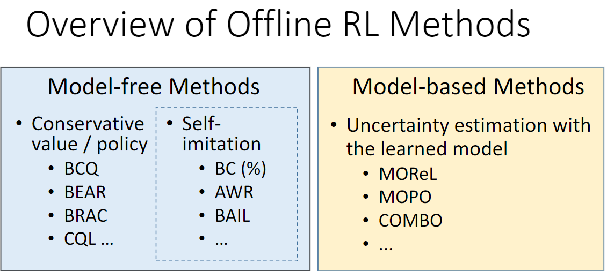

<!--
 * @version:
 * @Author:  StevenJokess（蔡舒起） https://github.com/StevenJokess
 * @Date: 2023-09-12 23:29:21
 * @LastEditors:  StevenJokess（蔡舒起） https://github.com/StevenJokess
 * @LastEditTime: 2023-10-02 16:39:09
 * @Description:
 * @Help me: make friends by a867907127@gmail.com and help me get some “foreign” things or service I need in life; 如有帮助，请资助，失业3年了。
 * @TODO::
 * @Reference:
-->

# 离线强化学习

## 简介

离线强化学习（offline reinforcement learning）的目标是，在智能体不和环境交互的情况下，仅从已经收集好的确定的数据集中，通过强化学习算法得到比较好的策略。离线强化学习和在线策略算法、离线策略算法的区别在现实生活中的许多场景下，让尚未学习好的智能体和环境交互可能会导致危险发生，或是造成巨大损失。例如，在训练自动驾驶的规控智能体时，如果让智能体从零开始和真实环境进行交互，那么在训练的最初阶段，它操控的汽车无疑会横冲直撞，造成各种事故。这是为什么需要离线强化学习。[1]

因此，**离线强化学习**（offline reinforcement learning）的目标是，在智能体不和环境交互的情况下，仅从已经收集好的确定的数据集中，通过强化学习算法得到比较好的策略。离线强化学习和在线策略算法、离线策略算法的区别如图 18-1 所示。

离线强化学习[2]：

## 离线强化学习的评价：优缺点和难点

离线强化学习的另一大难点是算法通常对超参数极为敏感，非常难调参。并且在实际复杂场景中通常不能像在模拟器中那样，每训练几轮就在环境中评估策略好坏，如何确定何时停止算法也是离线强化学习在实际应用中面临的一大挑战。此外，离线强化学习在现实场景中的落地还需要关注离散策略评估和选择、数据收集策略的保守性和数据缺失性等现实问题。不过无论如何，离线强化学习和模仿学习都是为了解决在现实中训练智能体的困难而提出的，也都是强化学习真正落地的重要途径。

https://arxiv.org/pdf/2005.01643.pdf

Talk | CMU博士胡亚飞 ：基于离线强化学习的机器人自主探索 - 将门创投的文章 - 知乎
https://zhuanlan.zhihu.com/p/635818135

[1]: https://hrl.boyuai.com/chapter/3/%E7%A6%BB%E7%BA%BF%E5%BC%BA%E5%8C%96%E5%AD%A6%E4%B9%A0/
[2]: https://boyuai.oss-cn-shanghai.aliyuncs.com/disk/%E5%8A%A8%E6%89%8B%E5%AD%A6%E7%B3%BB%E5%88%97/%E5%8A%A8%E6%89%8B%E5%AD%A6%E5%BC%BA%E5%8C%96%E5%AD%A6%E4%B9%A0/%E8%AF%BE%E4%BB%B6pdf/15-%E5%86%B3%E7%AD%96%E6%99%BA%E8%83%BD%E5%A4%A7%E6%A8%A1%E5%9E%8B.pdf
