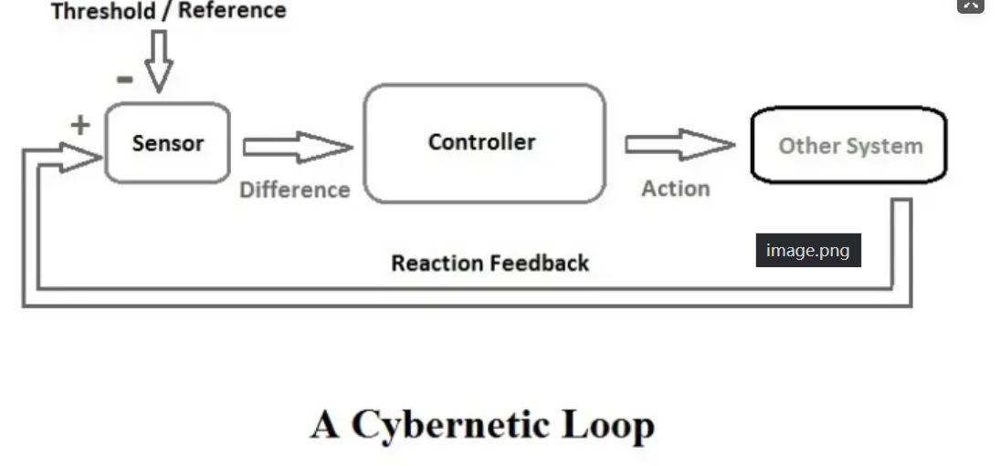
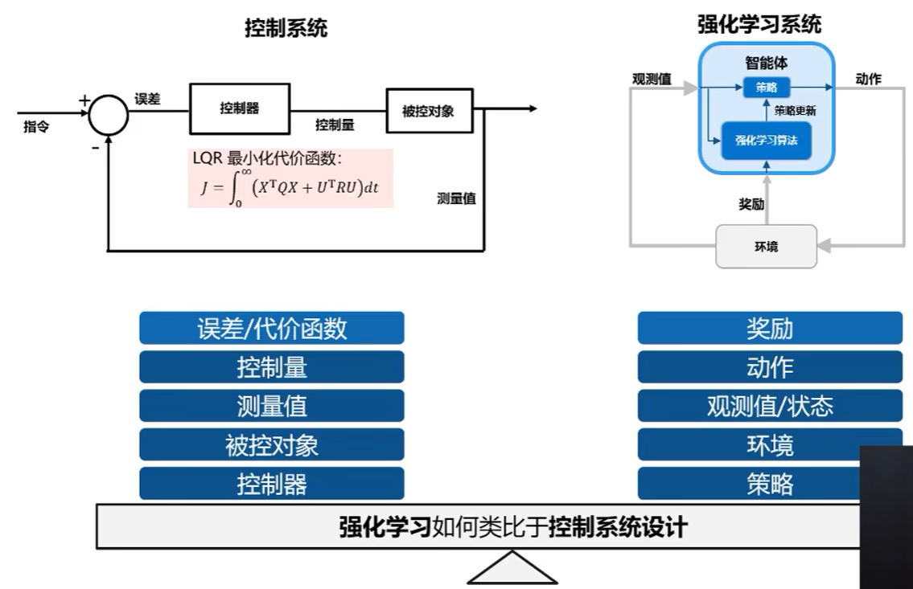

<!--
 * @version:
 * @Author:  StevenJokess（蔡舒起） https://github.com/StevenJokess
 * @Date: 2023-04-14 02:08:42
 * @LastEditors:  StevenJokess（蔡舒起） https://github.com/StevenJokess
 * @LastEditTime: 2023-04-14 02:09:13
 * @Description:
 * @Help me: make friends by a867907127@gmail.com and help me get some “foreign” things or service I need in life; 如有帮助，请赞助，失业3年了。
 * @TODO::
 * @Reference:
-->
# 控制论

控制论定义为“以机器中的控制与调节原理、以及将其类比到生物体或社会组织体后的控制原理为对象的科学研究。”

控制论包括控制器设计、系统建模、智能控制算法、系统识别和自适应控制等模块；

在我国，它被认为是现代资讯技术的理论基础，和系统论、信息论并称为“老三论”；

作为基础理论，控制论应用在许多领域，比如工业控制、机器人技术、交通控制和能源管理等。

## 控制论与RL的对比

[1]: https://developer.aliyun.com/article/1201435
