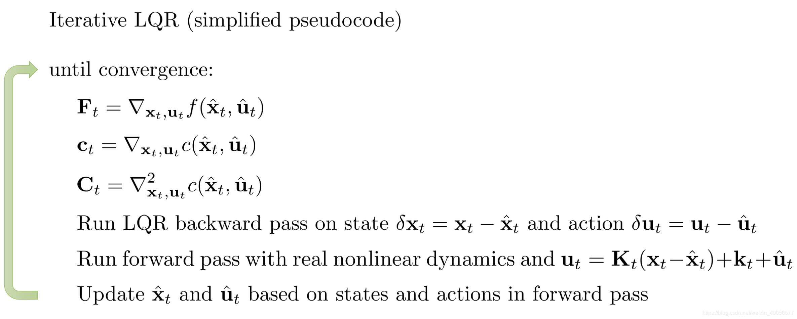

<!--
 * @version:
 * @Author:  StevenJokess（蔡舒起） https://github.com/StevenJokess
 * @Date: 2023-09-14 03:51:23
 * @LastEditors:  StevenJokess（蔡舒起） https://github.com/StevenJokess
 * @LastEditTime: 2023-09-21 20:05:19
 * @Description:
 * @Help me: make friends by a867907127@gmail.com and help me get some “foreign” things or service I need in life; 如有帮助，请资助，失业3年了。
 * @TODO::
 * @Reference:
-->
# iLQR

LQR的linear dynamics是deterministic的，这非常受限，对应RL中的 $\mathrm{s}^{\prime}=\mathrm{p}\left(\mathrm{s}^{\prime} \mid \mathrm{s}, \mathrm{a}\right)$ ，在当前state，选择一个action后，下一状态就确定了。为了应对复杂环境dynamics的stochastic，即 $\mathrm{s}^{\prime} \sim \mathrm{p}\left(\mathrm{s}^{\prime} \mid \mathrm{s}, \mathrm{a}\right)$ ，相当于说把LQR中假设linear dynamics拓展成了Non-linear dynamics，这时候需要采用iLQR，再叙述之前，先回顾一下以下两种优化算法，可参考以下专栏。

优化算法 (甩甩的知乎专栏)

## Newton Method

寻找参数 $\theta$ 最小化损失函数

$$
\operatorname{minL}(\theta)
$$

在参数空间初始化一个参数 $\hat{\theta}$ ，寻找一个增量 $\Delta \theta$ ，采用泰勒二阶近似:

$$
\mathrm{L}(\hat{\theta}+\Delta \theta) \approx \hat{\mathrm{L}}(\hat{\theta}+\Delta \theta)=\mathrm{L}(\hat{\theta})+\nabla \mathrm{L}(\hat{\theta})^{\mathrm{T}} \Delta \theta+\frac{1}{2}(\Delta \theta)^{\mathrm{T}} \nabla^2 \mathrm{~L}(\hat{\theta}) \Delta \theta
$$

寻找的增量 $\Delta \theta$ 使得 $\mathrm{L}(\hat{\theta}+\Delta \theta)$ 最小，即 $\mathrm{L}(\hat{\theta}+\Delta \theta) \leq \mathrm{L}(\hat{\theta})$ 且 $\nabla_{\Delta \theta} \mathrm{L}(\hat{\theta}+\Delta \theta)=0$ 所以有:

$$
\nabla_{\Delta \theta}\left(\mathrm{L}(\hat{\theta})+\nabla \mathrm{L}(\hat{\theta})^{\mathrm{T}} \Delta \theta+\frac{1}{2}(\Delta \theta)^{\mathrm{T}} \nabla^2 \mathrm{~L}(\hat{\theta}) \Delta \theta\right) \approx 0
$$

下面将符号稍微写繁琐一点，实际上 $\nabla \mathrm{L}(\hat{\theta})$ 为Jacobian矩阵 $\mathrm{J}(\hat{\theta}) ， \nabla^2 \mathrm{~L}(\hat{\theta})$ 为Hessian矩阵 $\mathrm{H}(\hat{\theta})$

$$
\begin{gathered}
\nabla_{\hat{\theta}} \mathrm{L}(\hat{\theta})+\nabla_{\hat{\theta}}^2 \mathrm{~L}(\hat{\theta}) \Delta \theta \approx 0 \\
\Delta \theta \approx-\left(\nabla_{\hat{\theta}}^2 \mathrm{~L}(\hat{\theta})\right)^{-1} \nabla_{\hat{\theta}} \mathrm{L}(\hat{\theta})=-\mathrm{H}(\hat{\theta})^{-1} \mathrm{~J}(\hat{\theta}) \\
\theta_{\mathrm{t}+1}=\theta_{\mathrm{t}}+\Delta \theta_{\mathrm{t}} \approx \theta_{\mathrm{t}}-\mathrm{H}_{\mathrm{t}}^{-1} \mathrm{~J}_{\mathrm{t}}
\end{gathered}
$$

所以Newton Method的更新策略为:

$$
\begin{aligned}
& \mathrm{J}_{\mathrm{t}}=\nabla \mathrm{L}\left(\theta_{\mathrm{t}}\right) \\
& \mathrm{H}_{\mathrm{t}}=\nabla^2 \mathrm{~L}\left(\theta_{\mathrm{t}}\right) \\
& \Delta_{\mathrm{t}}=-\mathrm{H}_{\mathrm{t}}^{-1} \mathrm{~J}_{\mathrm{t}} \\
& \alpha_{\mathrm{t}}=\underset{\alpha>0}{\arg \min } \mathrm{L}\left(\theta_{\mathrm{t}}+\alpha \Delta_{\mathrm{t}}\right) \quad \text { Line Search! } \\
&
\end{aligned}
$$

## iLQR算法

iLQR背景设定

- dynamics model

iLQR的特点是能处理non-linear，stochastic的dynamics model，其模型结构，可从LQR简化为:
$$
\text { LQR : } f\left(x_t, u_t\right)=F_t\left[\begin{array}{l}
x_t \\
u_t
\end{array}\right]+f_t
$$
$$
\text { iLQR }: f\left(x_t, u_t\right)=N\left(F_t\left[\begin{array}{l}
x_t \\
u_t
\end{array}\right]+f_t, \Sigma_t\right)
$$
- LQR
LQR的约束，是一个线性系统，可通过deterministic的dynamics model确定下一状态 $x_{t+1}$ 与当前状态 $x_t$ 、动作 $u_t$ 的关系， cost也可以由 $x_t, u_t$ 确定。
$$
\begin{aligned}
& \mathrm{f}\left(\mathrm{x}_{\mathrm{t}}, \mathrm{u}_{\mathrm{t}}\right)=\mathrm{F}_{\mathrm{t}}\left[\begin{array}{l}
\mathrm{x}_{\mathrm{t}} \\
\mathrm{u}_{\mathrm{t}}
\end{array}\right]+\mathrm{f}_{\mathrm{t}} \\
& \mathrm{c}\left(\mathrm{x}_{\mathrm{t}}, \mathrm{u}_{\mathrm{t}}\right)=\frac{1}{2}\left[\begin{array}{l}
\mathrm{x}_{\mathrm{t}} \\
\mathrm{u}_{\mathrm{t}}
\end{array}\right]^{\mathrm{T}} \mathrm{C}_{\mathrm{t}}\left[\begin{array}{l}
\mathrm{x}_{\mathrm{t}} \\
\mathrm{u}_{\mathrm{t}}
\end{array}\right]+\left[\begin{array}{l}
\mathrm{x}_{\mathrm{t}} \\
\mathrm{u}_{\mathrm{t}}
\end{array}\right]^{\mathrm{T}} \mathrm{c}_{\mathrm{t}}
\end{aligned}
$$
- iLQR
$$
\begin{aligned}
& \mathrm{f}\left(\mathrm{x}_{\mathrm{t}}, \mathrm{u}_{\mathrm{t}}\right) \approx \mathrm{f}\left(\hat{\mathrm{x}}_{\mathrm{t}}, \hat{\mathrm{u}}_{\mathrm{t}}\right)+\nabla_{\mathrm{x}_{\mathrm{t}}, \mathrm{u}_{\mathrm{t}}} \mathrm{f}\left(\hat{\mathrm{x}}_{\mathrm{t}}, \hat{\mathrm{u}}_{\mathrm{t}}\right)\left[\begin{array}{l}
\mathrm{x}_{\mathrm{t}}-\hat{\mathrm{x}}_{\mathrm{t}} \\
\mathrm{u}_{\mathrm{t}}-\hat{\mathrm{u}}_{\mathrm{t}}
\end{array}\right] \\
& \mathrm{c}\left(\mathrm{x}_{\mathrm{t}}, \mathrm{u}_{\mathrm{t}}\right) \approx \mathrm{c}\left(\hat{\mathrm{x}}_{\mathrm{t}}, \hat{\mathrm{u}}_{\mathrm{t}}\right)+\nabla_{\mathrm{x}_{\mathrm{t}}, \mathrm{u}_{\mathrm{t}}} \mathrm{c}\left(\hat{\mathrm{x}}_{\mathrm{t}}, \hat{\mathrm{u}}_{\mathrm{t}}\right)\left[\begin{array}{l}
\mathrm{x}_{\mathrm{t}}-\hat{\mathrm{x}}_{\mathrm{t}} \\
\mathrm{u}_{\mathrm{t}}-\hat{\mathrm{u}}_{\mathrm{t}}
\end{array}\right]+\frac{1}{2}\left[\begin{array}{l}
\mathrm{x}_{\mathrm{t}}-\hat{\mathrm{x}}_{\mathrm{t}} \\
\mathrm{u}_{\mathrm{t}}-\hat{\mathrm{u}}_{\mathrm{t}}
\end{array}\right]^{\mathrm{T}} \nabla_{\mathrm{x}_{\mathrm{t}}, \mathrm{ut}_{\mathrm{t}}}^2 \mathrm{c}\left(\hat{\mathrm{x}}_{\mathrm{t}}, \hat{\mathrm{u}}_{\mathrm{t}}\right)\left[\begin{array}{l}
\mathrm{x}_{\mathrm{t}}-\hat{\mathrm{x}}_{\mathrm{t}} \\
\mathrm{u}_{\mathrm{t}}-\hat{\mathrm{u}}_{\mathrm{t}}
\end{array}\right]
\end{aligned}
$$

iLQR流程
整理一下有:
$$
\begin{aligned}
& \mathrm{f}\left(\mathrm{x}_{\mathrm{t}}, \mathrm{u}_{\mathrm{t}}\right)-\mathrm{f}\left(\hat{\mathrm{x}}_{\mathrm{t}}, \hat{\mathrm{u}}_{\mathrm{t}}\right) \approx \nabla_{\mathrm{x}_{\mathrm{t}}, \mathrm{u}_{\mathrm{t}}} \mathrm{f}\left(\hat{\mathrm{x}}_{\mathrm{t}}, \hat{\mathrm{u}}_{\mathrm{t}}\right)\left[\begin{array}{l}
\mathrm{x}_{\mathrm{t}}-\hat{\mathrm{x}}_{\mathrm{t}} \\
\mathrm{u}_{\mathrm{t}}-\hat{\mathrm{u}}_{\mathrm{t}}
\end{array}\right] \\
& \mathrm{c}\left(\mathrm{x}_{\mathrm{t}}, \mathrm{u}_{\mathrm{t}}\right)-\mathrm{c}\left(\hat{\mathrm{x}}_{\mathrm{t}}, \hat{\mathrm{u}}_{\mathrm{t}}\right) \approx \nabla_{\mathrm{x}_{\mathrm{t}}, \mathrm{u}_{\mathrm{t}}} \mathrm{c}\left(\hat{\mathrm{x}}_{\mathrm{t}}, \hat{\mathrm{u}}_{\mathrm{t}}\right)\left[\begin{array}{l}
\mathrm{x}_{\mathrm{t}}-\hat{\mathrm{x}}_{\mathrm{t}} \\
\mathrm{u}_{\mathrm{t}}-\hat{\mathrm{u}}_{\mathrm{t}}
\end{array}\right]+\frac{1}{2}\left[\begin{array}{l}
\mathrm{x}_{\mathrm{t}}-\hat{\mathrm{x}}_{\mathrm{t}} \\
\mathrm{u}_{\mathrm{t}}-\hat{\mathrm{u}}_{\mathrm{t}}
\end{array}\right]^{\mathrm{T}} \nabla_{\mathrm{x}_{\mathrm{t}}, \mathrm{u}_{\mathrm{t}}}^2 \mathrm{c}\left(\hat{\mathrm{x}}_{\mathrm{t}}, \hat{\mathrm{u}}_{\mathrm{t}}\right)\left[\begin{array}{l}
\mathrm{x}_{\mathrm{t}}-\hat{\mathrm{x}}_{\mathrm{t}} \\
\mathrm{u}_{\mathrm{t}}-\hat{\mathrm{u}}_{\mathrm{t}}
\end{array}\right] \\
&
\end{aligned}
$$

更换一下表述 $\delta x_t=x_t-\hat{x}_t, \delta u_t=u_t-\hat{u}_t$ :

$$
\begin{aligned}
& =c_t\left[\begin{array}{l}
\delta x_t \\
\delta u_t
\end{array}\right]+\frac{1}{2}\left[\begin{array}{l}
\delta x_t \\
\delta u_t
\end{array}\right]^T C_t\left[\begin{array}{l}
\delta x_t \\
\delta u_t
\end{array}\right] \\
&
\end{aligned}
$$

可看作dynamics是 $\overline{\mathrm{f}}\left(\delta \mathrm{x}_{\mathrm{t}}, \delta \mathrm{u}_{\mathrm{t}}\right)$ ， cost是 $\overline{\mathrm{c}}\left(\delta \mathrm{x}_{\mathrm{t}}, \delta \mathrm{u}_{\mathrm{t}}\right)$ ，状态是 $\delta \mathrm{x}$ ，动作是 $\delta u$ 的 $LQR$ 。

## 伪代码

算法流程如下:

iLQR相当于对目标函数 $\min _{\mathrm{u}_1, \ldots \mathrm{u}_{\mathrm{T}}} \mathrm{c}\left(\mathrm{x}_1, \mathrm{u}_1\right)+\mathrm{c}\left(\mathrm{f}\left(\mathrm{x}_1, \mathrm{u}_1\right), \mathrm{u}_2\right)+\cdots+\mathrm{c}\left(\mathrm{f}\left(\mathrm{f}(\ldots() \ldots), \mathrm{u}_{\mathrm{T}}\right)\right.$ 中的dynamics model $\mathrm{f}\left(\mathrm{x}_{\mathrm{t}}, \mathrm{u}_{\mathrm{t}}\right)$ 与cost function$\mathrm{c}\left(\mathrm{x}_{\mathrm{t}}, \mathrm{u}_{\mathrm{t}}\right)$进行了泰勒近似，并采用Newton Method来迭代。[1]

[1]: https://blog.csdn.net/weixin_40056577/article/details/104270668
