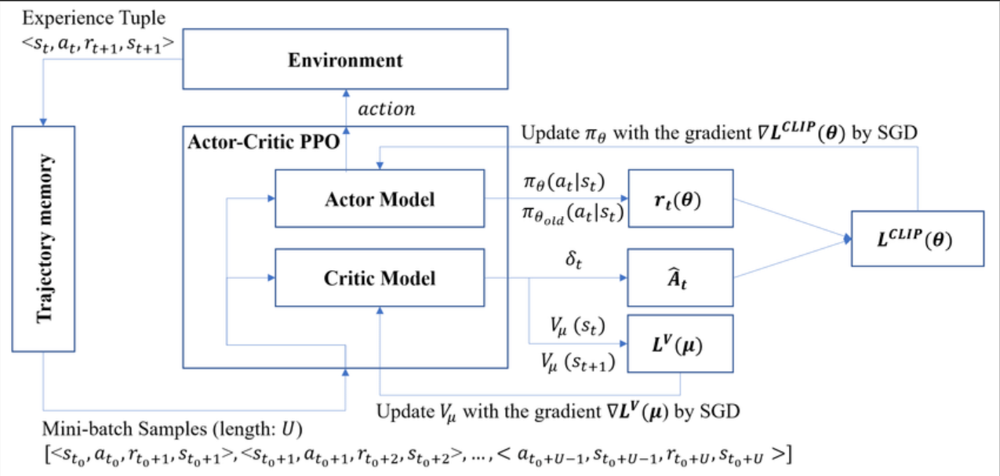
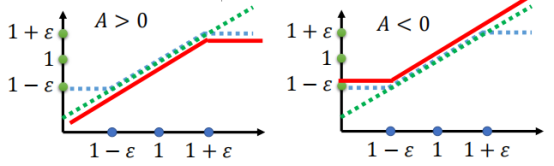

<!--
 * @version:
 * @Author:  StevenJokess（蔡舒起） https://github.com/StevenJokess
 * @Date: 2023-02-25 23:21:39
 * @LastEditors:  StevenJokess（蔡舒起） https://github.com/StevenJokess
 * @LastEditTime: 2023-10-02 22:50:50
 * @Description:
 * @Help me: 如有帮助，请赞助，失业3年了。
 * @TODO::
 * @Reference:
-->
# PPO 算法

近端策略优化算法(Proximal Policy Optimization Algorithms,PPO)和信任区域策略优化（trust region policy optimization，TRPO），都是为避免在使用重要性采样时由于在 $\theta$ 下的 $p_\theta\left(a_t \mid s_t\right)$ 与在 $\theta^{\prime}$ 下 的 $p_{\theta^{\prime}}\left(a_t \mid s_t\right)$ 相差太多，导致重要性采样结果偏差较大而采取的算法。TRPO 算法在很多场景上的应用都很成功，但是它的计算过程非常复杂，每一步更新的运算量非常大。于是，TRPO 算法的改进版—— 近端策略优化算法(Proximal Policy Optimization Algorithms,PPO) [3]算法在 2017 年被提出，PPO 基于 TRPO 的思想，但是其算法实现更加简单。并且大量的实验结果表明，与 TRPO 相比，PPO 能学习得一样好（甚至更快），这使得 PPO 成为非常流行的强化学习算法。如果我们想要尝试在一个新的环境中使用强化学习算法，那么 PPO 就属于可以首先尝试的算法。

## PPO的概念

近端策略优化 (proximal policy optimization，PPO)：为避免在使用重要性采样时由于在 $\theta$ 下的 $p_\theta\left(a_t \mid s_t\right)$ 与在 $\theta_\text {old}$ 下 的 $p_{\theta_\text {old}}\left(a_t \mid s_t\right)$ 相差太多，导致重要性采样结果偏差较大而采取的算法。具体来说就是在训练的过程中增加一个限制，这个限制对应 $\theta$ 和 $\theta_\text {old}$ 输出的动作的KL散度，来衡量 $p_\theta$ 与 $p_{\theta_\text {old}}$ 的相似程度。

## 比较 TRPO 与 PPO

***相同点***：

- 都要避免过度更新，要限制新旧策略这两者差异不能太大。所谓**过度更新**，是指在训练过程中，策略函数的更新幅度过大，可能会导致策略函数跳过当前的最优策略。这种情况下，智能体可能会采取一些不理想的行动，从而导致性能下降。[6]

***不同点***：

避免过度更新的方式上：

- TRPO通过添加新旧策略的KL约束项。
  - 回忆一下 TRPO：
    - 目标函数 [7]：$J^{CPI}(\theta)=\hat{\mathbb{E}}_t\left[\frac{\pi_\theta\left(a_t \mid s_t\right)}{\pi_{\theta_{\text {old}}}\left(a_t \mid s_t\right)} \hat{A}_t\right]=\hat{\mathbb{E}}_t\left[r_t(\theta) \hat{A}_t\right]$。上标 CPI 表示 conservative policy iteration，是一篇著名文章中提出来的策略迭代方法 ，以上的目标函数就是这篇文章所提出来的。注意，此时目标函数没有加上约束，可能会导致很大的梯度更新，导致策略梯度失去意义。
    - 代理目标函数 [3]：
$$
\begin{aligned}
\arg\max _\theta & \mathbb{E}_{s \sim \nu_{\theta_\text {old}}} \mathbb{E}_{a \sim \pi_{\theta_\text {old}}(\cdot \mid s)}\left[\frac{\pi_\theta(a \mid s)}{\pi_{\theta_\text {old}}(a \mid s)} A^{\pi_{\theta_\text {old}}}(s, a)\right] \\
\text { s.t. } & \mathbb{E}_{s \sim \nu^{\pi_\text {old}}}\left[D_{K L}\left(\pi_{\theta_\text {old}}(\cdot \mid s), \pi_\theta(\cdot \mid s)\right)\right] \leq \delta
\end{aligned}
$$
    - 然后使用泰勒展开近似对目标函数进行进行一阶近似，约束进行二阶近似。之后结合共轭梯度进行求解。
    - 实际上为 TRPO 提供保证的理论是**采用惩罚项**，而非约束项（这项理论应用在 Natural PG 中， TRPO 是对这项理论改造后的结果)，也就是优化无约束问题，代理目标函数为:
$$
\underset{\theta}{\operatorname{maximize}} \hat{\mathbb{E}}_t\left[\frac{\pi_\theta\left(a_t \mid s_t\right)}{\pi_{\theta_{\text {old }}}\left(a_t \mid s_t\right)} \hat{A}_t-\beta K L\left[\pi_{\theta_{\text {old }}}\left(\cdot \mid s_t\right), \pi_\theta\left(\cdot \mid s_t\right)\right]\right]
$$

其中 $\beta$ 可以看作惩罚因子，是一个超参数。实际上这种代理目标函数背后的理论是优化策略 $\pi$ 的下界，让每次策略更新后的新策略都能得到提升。但是 $\beta$ 的取值非常难以确定，即使在很简单的问题上，都没办法简单地找到 $\beta$ 值，甚至在同一个问题中， $\beta$ 的取值随着学习过程而改变。这就导致 TRPO 采用了**硬约束**的方式，而不是惩罚项。

- 所以现在的问题就是，如果我们想在学习过程中找到性能单调递增的策略，光靠简单地选择一个唖罚项系数和 SGD 是不够的，但是使用 TRPO 又太复杂，需要涉及二阶近似，*计算量太大*。这个时候 PPO 就出现了。
- PPO 用了一些相对简单的方法来求解。PPO是限制两者比率的变化范围，来降低策略更新前后的分布差异性。具体来说，PPO 有两种形式，一是 PPO-截断，二是 PPO-惩罚，，我们接下来对这两种形式进行介绍。[2]

## 一、PPO-截断

PPO 的第一种形式 PPO-截断（PPO-Clip）更加直接，它在目标函数中进行限制，以保证新策略的参数和旧策略的参数的差距不会太大。

其目标函数[5]：

$J^{CLIP}(\theta)=\hat{\mathbb{E}}_t\left[\min \left(r_t(\theta) \hat{A}_t, \operatorname{clip}\left(r_t(\theta), 1-\epsilon, 1+\epsilon\right) \hat{A}_t\right)\right]$

下面两张图横坐标为两个概率的比值，绿色为原曲线即min函数第一项，蓝色为修剪之后的曲线，即min第二项。在绿线和蓝线中选一个较小者。归根结底是调整权重值。

其中：

- $\theta$ 是策略参数
- $\hat{E}_t$ 表示时间步后的经验期望（empirical expectation）
- $r_t$ 是新旧策略的值的相对比例，即 $\frac{\pi_\theta(a \mid s)}{\pi_{\theta_\text {old}}(a \mid s)}$
- $\hat{A}_t$ 是$t$时刻的估计的优势（estimated advantage），更准确地说是旧策略$\pi_old$的估计优势 $A^{\pi_{\theta_\text {old}}}(s, a)$ 。
- $\operatorname{clip}(x, l, r):=\max (\min (x, r), l)$，把 $clip()$ 后的值能有效地限制在 $[l, r]$ 内，在上式即 $[1 - \varepsilon, 1 + \varepsilon]$，
  - 举例来说：
  - 如果 $\hat{A}_t>0$ ，说明这个动作的价值高于平均，$\frac{\pi_\theta(a \mid s)}{\pi_{\theta_\text {old}}(a \mid s)}$ 这个式子会大于1，但如果商过大，说明两分布的差异过大，则该奖励的置信度降低，所以设定一个上限防止更新的step太大[8]，这个上限不能离1太远，故取 $1+\epsilon$。
  - 反之，如果 $\hat{A}_t<0$ ，$\frac{\pi_\theta(a \mid s)}{\pi_{\theta_\text {old}}(a \mid s)}$ 这个式子会小于1；但如果商过小，说明两分布的差异过大，则该奖励的置信度降低，所以设定一个下限防止更新的step太大[8]，这个下限不能离1太远，故取 $1-\epsilon$ 。
- $\varepsilon$ 是个超参数，通常是 0.1 或 0.2，它表示进行截断 (clip) 的范围。

可以发现 $\min$ 函数中的第一项就是 $J^{CPI}$ ，第二项对 $r_t(\theta)$ 进行裁剪，超出 $[1-\epsilon, 1+\epsilon]$ 的部分直接抺去，最后对两项取最小值，确保 $J^{CLIP}$ 取得结果是 $J^{CPI}$ 的下界。

从而得到最优的策略参数：

$$
\underset{\theta}{\arg \max } \mathbb{E}_{s \sim \nu^{\pi_{\theta_\text {old}}}} \mathbb{E}_{a \sim \pi_{\theta_\text {old}}(\cdot \mid s)}\left[\min \left(\frac{\pi_\theta(a \mid s)}{\pi_{\theta_\text {old}}(a \mid s)} \hat{A}_t, \operatorname{clip}\left(\frac{\pi_\theta(a \mid s)}{\pi_{\theta_\text {old}}(a \mid s)}, 1-\epsilon, 1+\epsilon\right) \hat{A}_t\right)\right]
$$

如图 12-1 所示。

## 二、PPO-惩罚

PPO-惩罚（PPO-Penalty）用拉格朗日乘数法直接将 KL 散度的限制放进了目标函数中，这就变成了一个“有”约束的优化问题，在迭代的过程中不断更新 KL 散度前的系数。即：

$$
\underset{\theta}{\arg \max} \mathbb{E}_{s \sim \nu}{ }^{\pi_{\theta_\text {old}}} \mathbb{E}_{a \sim \pi_{\theta_\text {old}}(\cdot \mid s)}\left[\frac{\pi_\theta(a \mid s)}{\pi_{\theta_\text {old}}(a \mid s)} A^{\pi_{\theta_\text {old}}}(s, a)-\beta D_{K L}\left[\pi_{\theta_\text {old}}(\cdot \mid s), \pi_\theta(\cdot \mid s)\right]\right]
$$

除了第 3 节所说的截断代理目标函数的方法，本文还提出利用一个对 $KL$ 的自适应惩罚项系数来构建代理目标（surrogate objective），将新旧策略的 KL 散度值限定在一个目标 KL 散度值 $d_{\text {targ}}$ 附近。

文中说这种方法的效果不如截断代理目标函数的方法好，不过可以作为补充和 baseline。

![PPO伪代码[9]](../../img/PPO_algs.png)

实现过程如下:

- 首先利用 SGD 对带有惩罚项的代理目标函数 （等式 (2.5)） 进行几个 epochs 的优化:
$$
L^{K L P E N}=\hat{\mathbb{E}}_t\left[\frac{\pi_\theta\left(a_t \mid s_t\right)}{\pi_{\theta_{\text {old }}}\left(a_t \mid s_t\right)} \hat{A}_t-\beta K L\left[\pi_{\theta_{\text {old}}}\left(\cdot \mid s_t\right), \pi_\theta\left(\cdot \mid s_t\right)\right]\right]
$$
- 计算当前新旧策略的 $\mathrm{KL}$ 散度值: $\left.d=\hat{\mathbb{E}}_t K L\left[\pi_{\theta_{o l d}}\left(\cdot \mid s_t\right), \pi_\theta\left(\cdot \mid s_t\right)\right]\right]$

令 $d_\text {old}=D_{K L}^{\nu^{\pi_\text {old}}}\left(\pi_{\theta_\text {old}}, \pi_\theta\right) ， \beta$ 的更新规则如下:

1. 如果 $d_\text {old}<d_{\text {targ }} / 1.5$ ，那么 $\beta_{k+1} = \beta_\text {old} / 2$ (If $K L\left(\theta, \theta^k\right)<K L_{\min }$, decrease $\beta$；分布差异很小时，降低罚项防止，对学习过程造成不好的影响；含义就是现在两个agent差别太大，奖励值不具有参考性，由此带来的update幅度就会降低。)
2. 如果 $d_\text {old}>d_{\text {targ }} \times 1.5$ ，那么 $\beta_{k+1} = \beta_\text {old} \times 2$ (If $K L\left(\theta, \theta^k\right)>K L_{\max }$, increase $\beta$；当差异太大时，加大罚项以削弱旧数据的影响。)
3. 否则 $\beta_{k+1} = \beta_\text {old}$

其中：

- $d_{\text {targ }}$ 是一个超参数，用于限制学习策略和之前一轮策略的差距。
- 1.5 和 2 都是一个启发值，可以自己设定。文中说算法对这两个启发值不是很敏感。初始的 $\beta$ 也是一个超参数，但是不敏感，会随着算法持续自适应更新。

## PPO 伪代码

首先用 $N$ 个智能体并行收集 $T$ 步的数据，构成大小为 $NT$ 的数据集，然后使用 minibatch SGD （或 Adam）方法优化代理目标函数。[7]

- **for** iteration $=1,2, \ldots$ **do**
  - **for** actor $=1,2, \ldots, N$ **do**
    - Run policy $\pi_{\theta_{\text {old }}}$ in environment for $T$ timesteps
    - Compute advantage estimates $\hat{A}_1, \ldots, \hat{A}_T$
  - **end for**
  - Optimize surrogate $L$ wrt $\theta$, with $K$ epochs and minibatch size $M \leq N T$
  - $\theta_{\text {old }} \leftarrow \theta$
- **end for**

## PPO 代码实践

与 TRPO 相同，我们仍然在车杆和倒立摆两个环境中测试 PPO 算法。大量实验表明，PPO-截断总是比 PPO-惩罚表现得更好。因此下面我们专注于 PPO-截断的代码实现。

首先导入一些必要的库，并定义策略网络和价值网络。

接下来在车杆环境中训练 PPO 算法。

倒立摆是与连续动作交互的环境，同 TRPO 算法一样，我们做一些修改，让策略网络输出连续动作高斯分布（Gaussian distribution）的均值和标准差。后续的连续动作则在该高斯分布中采样得到

创建环境`Pendulum-v0`，并设定随机数种子以便重复实现。接下来我们在倒立摆环境中训练 PPO 算法。

大量实验表明，PPO-截断总是比 PPO-惩罚表现得更好。

## PPO的评价：优缺点

优点：

1. 良好的性能：PPO算法被认为是最先进的model-free深度强化学习算法之一，它在许多复杂任务中都能取得非常好的结果。
1. 更快的收敛：相比其他算法，PPO算法在训练模型时收敛速度更快。
1. 可解释性良好：为了保证策略函数的稳定性，PPO算法使用近似值函数来学习策略函数。
1. off-policy：可以自己边玩边学，也可以看别人玩并从中学到经验
1. 能支持连续行动场景：师承DDPG一脉。

缺点：

1. model-free的代价就是莽撞、缺乏想象力；
1. 单步更新：行动一次就更新参数，勇敢、效率高；缺乏长期记忆，无妨；；挺好，没啥缺点；[10]

## 总结

PPO 是 TRPO 的一种改进算法，它在实现上简化了 TRPO 中的**复杂计算**，并且它在实验中的性能大多数情况下会比 TRPO 更好，因此目前常被用作一种常用的基准算法。需要注意的是，TRPO 和 PPO 都属于在线策略学习算法，即使优化目标中包含重要性采样的过程，但其只是用到了上一轮策略的数据，而不是过去所有策略的数据。

PPO 是 TRPO 的第一作者 John Schulman 从加州大学伯克利分校博士毕业后在 OpenAI 公司研究出来的。通过对 TRPO 计算方式的改进，PPO 成为了最受关注的深度强化学习算法之一，并且其论文的引用量也超越了 TRPO。

[1]: https://hrl.boyuai.com/chapter/2/ppo%E7%AE%97%E6%B3%95
[2]: https://www.cnblogs.com/kailugaji/p/15401383.html#_lab2_0_1
[3]: https://www.cnblogs.com/kailugaji/p/15396437.html
[4]: http://rail.eecs.berkeley.edu/deeprlcourse/static/slides/lec-5.pdf
[5]: https://openai.com/research/openai-baselines-ppo
[6]: https://chat.openai.com/chat/
[7]: https://hjp-muser.github.io/2019/11/15/TRPO-PPO-%E8%AE%BA%E6%96%87%E7%AC%94%E8%AE%B0%EF%BC%88%E4%B8%8B%EF%BC%89/
[8]: https://blog.csdn.net/weixin_43522964/article/details/104239921
[9]: https://mofanpy.com/tutorials/machine-learning/reinforcement-learning/DPPO
[10]: https://zhuanlan.zhihu.com/p/587129005
TODO:https://www.huaxiaozhuan.com/%E6%B7%B1%E5%BA%A6%E5%AD%A6%E4%B9%A0/chapters/19_Deep_RL.html
