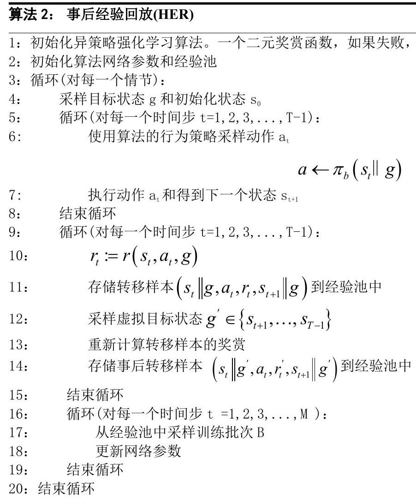

<!--
 * @version:
 * @Author:  StevenJokess（蔡舒起） https://github.com/StevenJokess
 * @Date: 2023-02-26 17:29:23
 * @LastEditors:  StevenJokess（蔡舒起） https://github.com/StevenJokess
 * @LastEditTime: 2023-09-20 01:07:04
 * @Description:
 * @Help me: 如有帮助，请赞助，失业3年了。
 * @TODO::
 * @Reference:
-->
# 目标导向的强化学习

## 简介

前文已经学习了 PPO、SAC 等经典的深度强化学习算法，大部分算法都能在各自的任务中取得比较好的效果，但是它们都局限在单个任务上，换句话说，对于训练完的算法，在使用时它们都只能完成一个特定的任务。如果面对较为复杂的复合任务，之前的强化学习算法往往不容易训练出有效的策略。本章将介绍**目标导向的强化学习**（goal-oriented reinforcement learning，GoRL）以及该类别下的一种经典算法 HER。GoRL 可以学习一个策略，使其可以在不同的目标（goal）作为条件下奏效，以此来解决较为复杂的决策任务。

## 问题定义

在介绍概念之前，先介绍一个目标导向的强化学习的实际场景。例如，策略 $\pi$ 要操控机械臂抓取桌子上的一个物体。值得注意的是，每一次任务开始，物体的位置可能是不同的，也就是说，智能体需要完成一系列相似并不同的任务。在使用传统的强化学习算法时，采用单一策略只能抓取同一个位置的物体。对于不同的目标位置，要训练多个策略。想象一下，在悬崖漫步环境中，若目标位置变成了右上角，便只能重新训练一个策略。同一个策略无法完成一系列不同的目标。

接下来讨论 GoRL 的数学形式。有别于一般的强化学习算法中定义的马尔可夫决 策过程，在目标导向的强化学习中，使用一个扩充过的元组 $\left\langle\mathcal{S}, \mathcal{A}, P, r_g, \mathcal{G}, \phi\right\rangle$ 来定义 MDP，其中， $\mathcal{S}$ 是状态空间， $\mathcal{A}$ 是动作空间， $P$ 是状态转移函数， $\mathcal{G}$ 是目 标空间， $\phi$ 是一个将状态 $s$ 从状态空间映射为目标空间内的一个目标 $g$ 的函数， $r_g$ 是奖励函数，与目标 $g$ 有关。接下来详细介绍目标导向的强化学习中与一般强化 学习不同的概念。

首先是补充的目标空间 $\mathcal{G}$ 和目标 $g$ 。在目标导向的强化学习中，任务是由目标定 义的，并且目标本身是和状态 $s$ 相关的，可以将一个状态 $s$ 使用映射函数 $\phi$ 映射为 目标 $\phi(s) \in \mathcal{G}$ 。继续使用之前机械臂抓取物体的任务作为例子：状态 $s$ 中包含了 机械臂的力矩、物体的位置等信息。因为任务是抓取物体，所以规定目标 $g$ 是物 体的位置，此时映射函数 $\phi$ 相当于一个从状态 $s$ 中提取物体位置的函数。

然后介绍奖励函数，奖励函数不仅与状态 $s$ 和动作 $a$ 相关，在目标导向强化学习 中，还与设定的目标相关，以下是其中一种常见的形式：

$$
r_g\left(s_t, a_t, s_{t+1}\right)= \begin{cases}0, & \left\|\phi\left(s_{t+1}\right)-g\right\|_2 \leq \delta_g \\ -1, & \text { otherwise }\end{cases}
$$

其中， $\delta_g$ 是一个比较小的值，表示到达目标附近就不会受到 -1 的惩罚。在目标 导向强化学习中，由于对于不同的目标，奖励函数是不同的，因此状态价值函数 $V(s, g)$ 也是基于目标的，动作状态价值函数 $Q(s, a, g)$ 同理。接下来介绍目标 导向的强化学习的优化目标。定义 $\nu_0$ 为环境中初始状态 $s_0$ 与目标 $g$ 的联合分布， 那么 GoRL 的目标为优化策略 $\pi(a \mid s, g)$ ，使以下目标函数最大化:

$$
\mathbb{E}_{\left(s_0, g\right) \sim \nu_0}\left[V^\pi\left(s_0, g\right)\right]
$$

## HER 算法

根据 19.2 节的定义，可以发现目标导向的强化学习的奖励往往是非常稀疏的。由于智能体在训练初期难以完成目标而只能得到 $-1$ 的奖励，从而使整个算法的训练速度较慢。那么，有没有一种方法能有效地利用这些“失败”的经验呢？从这个角度出发，**事后经验回放**（hindsight experience replay，HER）算法于 2017 年**神经信息处理系统**（Neural Information Processing Systems，NeurIPS）大会中被提出，成为 GoRL 的一大经典方法。

## 简介

事后经验回放技术则不需要任何领域来设计奖赏函数。在稀疏奖励的环境中, 如果智 能体观测序列  $s_1,s_2,…,s_T$ 且目标任务  $g≠s_1,s_2,…,s_T$ , 则智能体在该回合内的每一步的奖赏都为-1。

HER 的思想是用一个不同的目标重新检查这条轨迹一虽然这条轨迹可能不会帮 助智能体学习如何实现目标任务  $g$ , 但该轨迹在回放时肯定会告诉智能体学习一些如何实 现状态  $s_T$ 的信息。这些信息可以通过使用非策略 RL 算法和经验回放来获取, HER 技术将 经验池中的 $g$ 替换为 $s_T$
。智能体在经验回放时采样一个额外子目标 $g′$ 的集合来代替期望目标任务 $g$ , 并重新计算奖赏, 然后形成转移样本  $(s_t, ∥g′,a_t,r′,s_t+1∥g′)$ 放入经验池中。因此, 即使智能体没有实现目标任务 $g$ , 智能体也可以学习到关于实现虚拟目标任务 $g′$ 的信 息。在 HER 中, 采样虚拟目标任务 $g′$ 的方式如下:

1. Final-从与环境最终的状态对应的目标中采样虚拟目标 $g′$；
2. Future-从同一个回合的末来时间步中采样虚拟目标 $g'$;
3. Episode-从同一个回合中随机采样虚拟目标 $g'$;
4. Random-在整个训练过程中采样虚拟目标  $g′$ 。

事后经验回放(HER)技术通过使用已实现的目标 $ag$ 代替期望目标 $g$
 , 形成虚拟目标 $g′$ 。 使智能体在稀疏奖励环境中, 增强了探索。即使在没有成功的情况下, 智能体也可以得到一些信息。[2]

 ## 伪代码

HER 算法的伪代码如下所示。

在 HER 的实验中，future 方案给出了最好的效果，该方案也最直观。因此在代码实现中用的是 future 方案。

## HER 代码实践

接下来看看如何实现 HER 算法。首先定义一个简单二维平面上的环境。在一个二维网格世界上，每个维度的位置范围是 $[0,5]$ ，在每一个序列的初始，智能体都处于 $(0, 0)$ 的位置，环境将自动从$3.5 \leq x, y \leq 4.5$的矩形区域内生成一个目标。每个时刻智能体可以选择纵向和横向分别移动$[-1,1]$作为这一时刻的动作。当智能体距离目标足够近的时候，它将收到的 0 奖励并结束任务，否则奖励为 $-1$。每一条序列的最大长度为 50。环境示意图如图 19-1 所示。

图19-1 环境示意图

使用 Python 实现这个环境。导入一些需要用到的包，并且用代码来定义该环境。

接下来实现 DDPG 算法中用到的与 Actor 网络和 Critic 网络的网络结构相关的代码。

code

在定义好 Actor 和 Critic 的网络结构之后，来看一下 DDPG 算法的代码。这部分代码和 13.3 节中的代码基本一致，主要区别在于 13.3 节中的 DDPG 算法是在倒立摆环境中运行的，动作只有 1 维，而这里的环境中动作有 2 维，导致一小部分代码不同。读者可以先思考一下此时应该修改哪一部分代码，然后自行对比，就能找到不同之处。

code

接下来定义一个特殊的经验回放池，此时回放池内不再存储每一步的数据，而是存储一整条轨迹。这是 HER 算法中的核心部分，之后可以用 HER 算法从该经验回放池中构建新的数据来帮助策略训练。

code

最后，便可以开始在这个有目标的环境中运行采用了 HER 的 DDPG 算法，一起来看一下效果吧。

code

接下来尝试不采用 HER 重新构造数据，而是直接使用收集的数据训练一个策略，看看是什么效果。

code

通过实验对比，可以观察到使用 HER 算法后，效果有显著提升。这里 HER 算法的主要好处是通过重新对历史轨迹设置其目标（使用 future 方案）而使得奖励信号更加稠密，进而从原本失败的数据中学习到使“新任务”成功的经验，提升训练的稳定性和样本效率。

## 改进

目前对于事后经验回放算法的改进主要在于降低偏差、改进目标采样方式、适配在线策略算法等。Lanka等[41]认为HER修改目标引入的新数据带来了偏差，提出通过调整真实奖励和HER的奖励的权重来降低偏差。Manela等[42]指出，在目标物体未移动的情况下，采样的目标只与初始位置有关而与策略无关，这样的样本会给训练带来偏差，于是提出Filtered-HER，通过滤去该类型目标来缓解该问题。Rauber等[43]通过重要性采样将HER运用到策略梯度方法上，实验结果表明HER明显提高了策略梯度方法的样本利用效率。

## 小结

本章介绍了目标导向的强化学习（GoRL）的基本定义，以及一个解决 GoRL 的 有效的经典算法 HER。通过代码实践，HER 算法的效果得到了很好的呈现。我 们从 HER 的代码实践中还可以领会一种思维方式，即可以通过整条轨迹的信息 来改善每个转移片段带给智能体策略的学习价值。例如，在 HER 算法的 future 方案中，采样当前轨迹后续的状态作为目标，然后根据下一步状态是否离目标 足够近来修改当前步的奖励信号。此外，HER 算法只是一个经验回放的修改方 式，并没有对策略网络和价值网络的架构做出任何修改。而在后续的部分 GoRL 研究中，策略函数和动作价值函数会被显式建模成 $\pi(a \mid s, g)$ 和 $Q(s, a, g)$ ，即构 建较为复杂的策略架构，使其直接知晓当前状态和目标，并使用更大的网络容 量去完成目标。有兴趣的读者可以自行查阅相关的文献。

[1]: https://hrl.boyuai.com/chapter/3/%E7%9B%AE%E6%A0%87%E5%AF%BC%E5%90%91%E7%9A%84%E5%BC%BA%E5%8C%96%E5%AD%A6%E4%B9%A0
[2]:

[41]	LANKA S, WU Tianfu. ARCHER: aggressive rewards to counter bias in hindsight experience replay[EB/OL]. NC, USA: arXiv, 2018. [2019-12-3] https://arxiv.org/pdf/1809.02070. (1)
[42]	MANELA B, BIESS A. Bias-reduced hindsight experience replay with virtual goal prioritization[EB/OL]. BeerSheva, Israel: arXiv, 2019. [2019-12-3] https://arxiv.org/pdf/1905.05498.pdf. (1)
[43]	RAUBER P, UMMADISINGU A, MUTZ F, et al. Hindsight policy gradients[EB/OL]. London, UK: arXiv, 2017. [2019-11-2] https://arxiv.org/pdf/1711.06006.pdf. (1)
