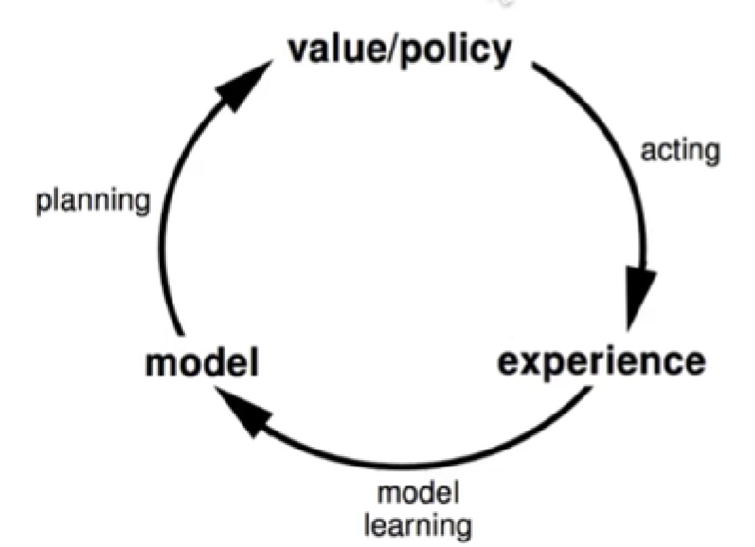

<!--
 * @version:
 * @Author:  StevenJokess（蔡舒起） https://github.com/StevenJokess
 * @Date: 2023-03-19 23:32:35
 * @LastEditors:  StevenJokess（蔡舒起） https://github.com/StevenJokess
 * @LastEditTime: 2023-03-20 01:50:16
 * @Description:
 * @Help me: 如有帮助，请赞助，失业3年了。
 * @TODO::
 * @Reference:
-->
# 模型（model）简介

## 学习与规划

- 学习：环境初始时是未知的，个体不知道环境如何工作，个体通过与环境进行交互，逐渐改善其行为策略。
- 规划：环境如何工作对于个体是已知或近似已知的，个体并不与环境发生实际的交互，而是利用其构建的模型进行计算，在此基础上改善其行为策路。
常用的强化学习问题解决思路：先学习环境如何工作，了解环境工作的方式，即学习得到一个模型，然后利用这个模型进行规划。

## 为什么要学习一个模型

- 优点：
  - 通过构建一个模型，个体具备了一定程度的独立思考能力，即在与环境发生实际交互之前思考各种可能的行为其对能带给环境及自身的改变。
  - 通过个体的思考以及联合其与环境的实际交互经验，个体在解决大规模MDP问题时可以取得更好的结果。
- 缺点：
  - 模型其实是一个个体对坏境运行机制的描述，不完全是真实的环境运行机劁，因出存在近似。当使用一近似的模型去进行价值函数或策略函数的学习时，又会引入一次近似。因此会带来双重的近似误差
- 本讲内容●如何从经历中直接学习模型，如何构健一个模型，如何基于模型来进行“规划”，在次基础上将学和“规划”整合起来形成Dyna算法。

## 基于模型的学习

循环：

1. 与现实交互，产生经脸
2. 学习经验，构建模型
3. 用模型，规划下步动作行为
4. 通过规划，优化现实动作

## 基于模型的规划

- 规划的过程相当于解决一个MDP的过程，求解最优值函数，最优策略。
- 实际规划过程中，利用模型来产生一个时间步长的*虚拟经历*，有了这些虚拟采样，随后使用不喜于模型的强化学习方法来学习得到价值或策略函数。这种虚拟采样方法通常很有效。

问题：不能有效探索

## 学匀与规划整合

整合考虑将把基于模型的学习和不基于模型的学习结合起来，形城一个整合的架构，利用两者的优点来解决复杂问题。

当构建了一个环境的模型后，个体可以有两种经历来源：

- 实际经历(Real experience)，从环境采样（Sampled from environment）（true MDP）：$\begin{aligned} s^{\prime} & \sim \mathcal{P}_{s, s^{\prime}}^a \\ r & =\mathcal{R}_s^a\end{aligned}$
- 模拟经历(Simulated experience)，从模型采样（Sampled from model）（approximate MDP） ：$\begin{array}{r}s^{\prime} \sim \mathcal{P}_\eta\left(s^{\prime} \mid s, a\right) \\ r=\mathcal{R}_\eta(r \mid s, a)\end{array}$

model-free learning:

- no model
- Learn value function (and/or policy)from real experience

model-based learning:

- Learn a model from real experience
- Plan value function (and/or policy)from simulated experience

- Learn a model from real experience
- Learn and plan value function (and/or policy)from real andsimulated experience

将不基于模型的真实经历和基于模型采样得到的模拟经历结合起来，提出一种新的架构 Dyna
[1]: https://www.bilibili.com/video/BV1HT411C78A?p=42&vd_source=bca0a3605754a98491958094024e5fe3
