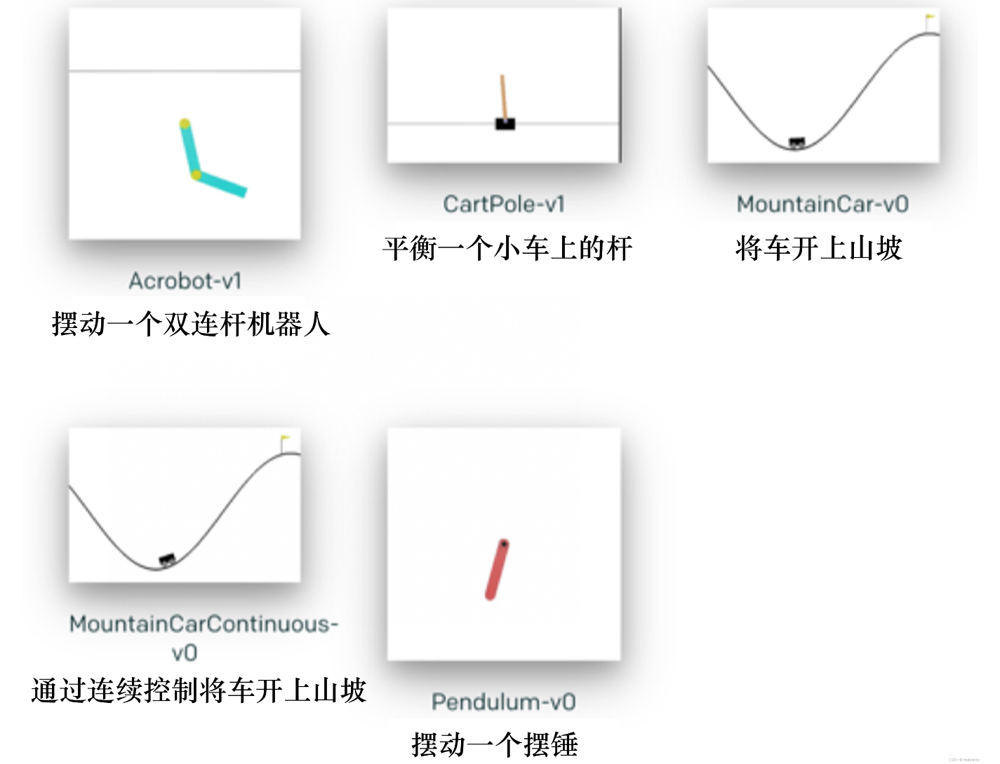

<!--
 * @version:
 * @Author:  StevenJokess（蔡舒起） https://github.com/StevenJokess
 * @Date: 2023-03-02 14:41:35
 * @LastEditors:  StevenJokess（蔡舒起） https://github.com/StevenJokess
 * @LastEditTime: 2023-09-14 04:00:45
 * @Description:
 * @Help me: 如有帮助，请赞助，失业3年了。
 * @TODO::
 * @Reference:
-->
# Gym库

OpenAI 的 Gym库是一个环境仿真库。[1]

它用Python语言实现了离散时间智能体/环境接口中的环境部分。除了依赖少量商业库外，整个项目是开源免费的。

算法环境：包括一些字符串处理等传统计算机算法的实验环境。

Gym库内置上百种实验环境，包括以下几类。
- 简单文本环境：包括几个用文本表示的简单游戏。
- 经典控制环境：包括一些简单几何体的运动，常用于经典强化学习算法的研究。 More: https://blog.csdn.net/weixin_40056577/article/details/106459867
- Atari游戏环境：包括数十个Atari 2600游戏，具有像素化的图形界面，希望玩家尽可能争夺高分。
- 二维方块（Box2D）环境：包括一些连续性控制的任务。
- MuJoCo环境：利用收费的MuJoCo运动引擎进行连续性控制任务。
- 机械控制环境：关于机械臂的抓取和控制等。[2]

Gym环境列表可参见网址https://gym.openai.com/envs/ 。

## 安装

本节我们将安装并使用Gym库，通过一个完整的实例来演示智能体与环境的交互。


## 进入环境

安装了Gym库，就可以直接调入Taxi-v3的环境。

初始化这个环境后，我们就可以进行交互了。

智能体得到某个观测后，它就会输出一个动作。这个动作会被环境拿去执行某个步骤 ，然后环境就会往前走一步，返回新的观测、奖励以及一个 flag 变量 done，done 决定这个游戏是不是结束了。我们通过几行代码就可实现强化学习的框架：

```python
import gym
env = gym.make("Taxi-v3")  #确定环境
observation = env.reset()  #观测
agent = load_agent()  #定义智能体
for step in range(100):
    action = agent(observation)  #根据观测采取动作
    observation, reward, done, info = env.step(action) #进一步
```

由于load_agent没有定义，所以上述只是一个框架，实现100步探索的框架。

Gym当中有很多小游戏等环境可以用。

MountainCar-v0 例子
选取**小车上山（MountainCar-v0）**作为例子。

## Spaces：观测空间和动作空间

Environment对象里有两个空间(Space)：状态空间(State Space)和行为空间(Action Space)，它们定义了所有可能的状态和行为。我们可以查看一些CartPole-v0的Space：

```python
import gym
env = gym.make('MountainCar-v0')
print('观测空间 = {}'.format(env.observation_space))
print('动作空间 = {}'.format(env.action_space))
print('观测范围 = {} ~ {}'.format(env.observation_space.low,
        env.observation_space.high))
print('动作数 = {}'.format(env.action_space.n))
```


输出：

```
观测空间 = Box(2,)
动作空间 = Discrete(3)
观测范围 = [-1.2  -0.07] ~ [0.6  0.07]
动作数 = 3
```

Box(2,)表示状态由2维向量表示，物理意义分别是TODO
Discrete(3)表示这个任务有三个选的Action,分别是TODO

小车上山环境有一个参考的回合奖励值 -110，如果连续 100 个回合的平均回合奖励大于 -110，则认为这个任务被解决了。BespokeAgent 类对应的策略的平均回合奖励就在 -110 左右。

测试智能体在 Gym 库中某个任务的性能时，学术界一般最关心 100 个回合的平均回合奖励。至于为什么是 100 个回合而不是其他回合数（比如 128 个回合），完全是习惯使然，没有什么特别的原因。对于有些任务，还会指定一个参考的回合奖励值，当连续 100 个回合的奖励大于指定的值时，就认为这个任务被解决了。但是，并不是所有的任务都指定了这样的值。对于没有指定值的任务，就无所谓任务被解决了或者没有被解决。


## Gym 库的用法总结

1. 使用 env=gym.make(环境名)取出环境
1. 使用 env.reset()初始化环境
1. 使用 env.step(动作)执行一步环境
1. 使用 env.render()显示环境
1. 使用 env.close()关闭环境


[1]: https://blog.csdn.net/qq_40990057/article/details/125750328
[2]: https://developer.aliyun.com/article/726171
