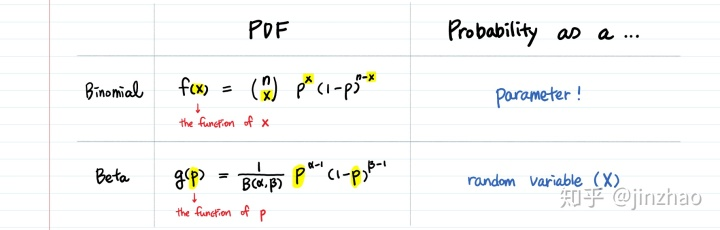

<!--
 * @version:
 * @Author:  StevenJokess https://github.com/StevenJokess
 * @Date: 2021-02-04 20:30:32
 * @LastEditors:  StevenJokess（蔡舒起） https://github.com/StevenJokess
 * @LastEditTime: 2023-03-21 23:20:32
 * @Description:
 * @Help me: 如有帮助，请赞助，失业3年了。
 * @TODO::
 * @Reference:
-->

# Beta分布详解

主要介绍了汤普森采样算法（多臂老虎机的策略之一）中用到的Beta分布的来源和其性质共轭性的证明与应用。

## 汤普森采样算法

[汤普森采样算法在最后的代码框](../实验/第2章_多臂老虎机问题.ipynb)

```py


class ThompsonSampling(Solver):
    """ 汤普森采样算法,继承Solver类 """
    def __init__(self, bandit):
        super(ThompsonSampling, self).__init__(bandit)
        self._a = np.ones(self.bandit.K)  # 列表,_a[]表示每根拉杆奖励为1的次数$m_1$
        self._b = np.ones(self.bandit.K)  # 列表,_b[]表示每根拉杆奖励为0的次数$m_2$

    def run_one_step(self):
        samples = np.random.beta(self._a, self._b)  # 按照Beta分布采样一组奖励样本
        k = np.argmax(samples)  # 选出采样奖励最大的拉杆
        r = self.bandit.step(k)

        # 下面加了新的试验数据，随机变量_a[k]和_b[k]仍服从beta分布，这点利用了beta分布的共轭性，详见beta分布.md
        self._a[k] += r  # 更新Beta分布的第一个参数，成功数，
        self._b[k] += (1 - r)  # 更新Beta分布的第二个参数，失败数，
        return k

np.random.seed(1)
thompson_sampling_solver = ThompsonSampling(bandit_10_arm)
thompson_sampling_solver.run(5000)
print('汤普森采样算法的累积懊悔为：', thompson_sampling_solver.regret)
plot_results([thompson_sampling_solver], ["ThompsonSampling"])

# 汤普森采样算法的累积懊悔为：57.19161964443925
```

## 其他相关分布

### 伯努利分布

伯努利分布（Bernoulli distribution）又名两点分布或0-1分布，介绍伯努利分布前首先需要引入伯努利试验（Bernoulli trial）。

伯努利试验是只有两种可能结果的单次随机试验，即对于一个随机变量X而言：

$$
P[X = 1] = p \\
P[X = 0] = 1-p
$$

则，X的概率分布（PMF）为 $p_{k} = P\{X = k\} = p^k (1-p)^k$

由二项分布定义，伯努利分布是二项分布在n=1时的特例

### 二项分布 $\operatorname{B}(n, p)$

如果 $X$ 是n重伯努利试验中事件A发生的次数，则

$$
X \mid p \sim \operatorname{B}(n, p)
$$

其中 $p = P(A)$

则， $X$ 的概率分布为 $p_{k} = P\{X = k\} = C^n_k p^k (1-p)^k$，其中$C^n_k = \frac{n!}{k!(n-k)!}$，$ k = 0, 1, 2, ...,n$, $ 0 < p < 1$

$$
X \mid p \sim \operatorname{B}(n, p)
$$

或，

二项分布名称的由来，是由于其概率质量函数中使用了二项系数$C^n_k$（中式组合n放下标，k放上标[11]；英式则相反[12]]）或 $\binom{N}{k}$ ，该系数是二项式定理中的系数，二项式定理由牛顿提出：$(x+y)^n=C_n^k x^k y^{n-k}$

二项分布的典型例子是扔硬币，硬币正面朝上概率为p, 重复扔n次硬币，k次为正面的概率即为一个二项分布概率。

---

## 赞助项目

>问：本项目是骗钱吗？
>
>1. 首先本项目由我自己与家里存款赞助我自己。我只是出于兴趣做的，是出于在实际生活中发现了我的不自由，并去寻找我不自由的原因和试图反抗不自由的作品。为了要反抗同人的真正活动和本质属性相背离相割裂的“资本”，为了我继续符合我本质的活动，顺便也帮更多人做出符合其自由的活动。钱目前是为了尽可能cover掉创造该项目时的我的生活成本，使我不用在该项目完成前被迫去从事一项短期能赚钱的劳动，目前当然没cover掉，当然能帮我实现项目完成后的自由就更好不过了。
>2. 再谈资本主义下的“收入”（我对货币的需要，正是由于所谓“占有”我所需要的物品对其的需要。越是持资本主义的观念的人，越会怼那些坚信共产主义的要追求美好生活、甚至仅仅维持生活的物质需要的钱的活动，仿佛必须要我们街头饿死才得逞，要知道我们的惨境正是这些观念所造成的，而我们要争取的也是你们的自由和幸福啊！），马上就要被赶出来了！"正如马克思所说，人们首先必须吃、喝、住、穿，然后才能从事政治、科学、艺术、宗教等等；"（：祝福共产主义快点实现！而由于物质的有限性，被资本控制了，
>3. 于是放上收款码，如果对你有任何帮助、或仅仅为了帮助我，请支持一二，在家"失业"三年，虽然包吃住但是全职被骂，也不好受。

- 如果愿意可以先交个朋友（＋QQ群（之前一个偏PM和共产主义的群：171097552），也可以邮箱发送你的联系方式：llgg8679@qq.com
- 当当代的恩格斯，自愿送点你的闲钱，可以慷慨赞助我但不要影响你自由的那种：）或者以其他方式（很多你认为是废品的东西，对我却是宝贝，欢迎邮寄）赞助我。
- 该项目收入我也会尽量公开，如果太多就不需要赞助了我会撤下收款码，目前0元收入。
- 

---

## Beta分布

### 二项分布与Beta分布概率密度函数的区别



从概率密度函数看：

- 二项分布对成功次数（x）进行建模
- Beta分布对成功次数的概率（p）进行建模[7]

### 二项分布与Beta分布的联系

Beta分布可以看做是分布之上的分布,更具体来说是在二项分布之上的分布(distribution over bionominals)。[8]

### Beta分布的概率密度函数的来源

如果随机变量 $X$ 服从参数为 $n$ 和 $q$ 的二项分布，那么它的概率由概率质量函数（对于连续随机 变量，则为概率密度函数) 为:

$$
p(x)=\left(\begin{array}{l}
n \\
x
\end{array}\right)q^x(1-q)^{n-x}
$$

把 上式 表示为变量 $q$ 的函数，即只有 $q$ 这一个变量，写成如下形式

$$
f(q) \propto q^a(1-q)^b
$$
其中 $a$ 和 $b$ 是常量， $q \in(0,1)$

为了把 上式 变成一个分布，可以给它乘上一个因子，使它对 $q$ 从0到1积分为1即可，即

$$
f(q)=k q^a(1-q)^b
$$

令其积分为 1

$$
\int_0^1 f(q) \mathbf{d} q=\int_0^1 k q^a(1-q)^b \mathbf{d} q=k \int_0^1 q^a(1-q)^b \mathbf{d} q=1
$$

则

$$
k=\frac{1}{\int_0^1 q^a(1-q)^b \mathbf{d} q}
$$

记 $B(a+1, b+1)=\int_0^1 q^a(1-q)^b \mathbf{d} q$ ，则 $k=B(a+1, b+1)^{-1}$ ，所以 那么规范化后的 (2) 就是一个分布了

$$
f(q ; a+1, b+1)=\frac{1}{B(a+1, b+1)} q^a(1-q)^b
$$

这就是Beta分布的概率密度函数的最原始的来源。

令 $\alpha = a + 1, \beta = b +1$，即可得下面的较为常见的Beta分布形式

### Beta分布的概率密度函数的常见形式

$$
\begin{aligned}
Beta(x;\alpha,\beta )
& =\frac{x^{\alpha-1}(1-x)^{\beta-1}}{\int_0^1 u^{\alpha-1}(1-u)^{\beta-1} d u} \\
& =\frac{\Gamma(\alpha+\beta)}{\Gamma(\alpha) \Gamma(\beta)} x^{\alpha-1}(1-x)^{\beta-1} \\
& =\frac{\Gamma(\alpha+\beta)}{\Gamma(\alpha) \Gamma(\beta)} x^{\alpha-1}(1-x)^{\beta-1} \\
& =\frac{1}{\mathrm{~B}(\alpha, \beta)} x^{\alpha-1}(1-x)^{\beta-1}
\end{aligned}
$$

其中：

- 伽马函数 $\Gamma(n)$ 定义为$ \Gamma(n) = (n-1)! $
- Beta函数 $B(\alpha, \beta)$ 定义为$ B(\alpha, \beta) = \frac{\Gamma(\alpha) \Gamma(\beta)}{\Gamma(\alpha + \beta)}$
- 二者关系略。

#### Beta分布的均值和方差

均值是:

$$
\frac{\alpha}{\alpha+\beta}
$$

方差是：

$$
\frac{\alpha \beta}{(\alpha+\beta)^2(\alpha+\beta+1)}
$$

特殊$Beta( , )$:

- 均匀分布（一无所知）：$Beta(1, 1)$
- 公平：$Beta(m, m)$
- 只有一种情况：$Beta(m, 1)$

#### Beta分布的性质——共轭性

##### 共轭性

共轭性：如果随机变量 $\theta$ 的先验分布是一个Beta分布，那么在给定观测数据（包括试验次数N，样本中观测到的成功次数k）为后，随机变量 $\theta$ 的后验分布也是一个Beta分布，具体公式如下：

$$\theta \mid X=k \sim \text{Beta}(\alpha+k,\beta+N-k)。$$

例如：$$\operatorname{Beta}(1,1)+(3,0) \Longrightarrow \operatorname{Beta}(4,1)$$

> **涉及相关概念**：
>
> - **条件概率**(Conditional probability)：事件X在事件Y发生的条件下发生的概率，P(X|Y)
> - **联合概率**(Joint probability)：表示两个事件X和Y共同发生的概率，P(X,Y)
>
> - 条件概率和联合概率的性质：$P(Y|X) = \frac{P(Y,X)}{P(X)} \quad P(X ) > 0$.
>   - 推广到 n 个事件，条件概率的链式法则：
> $$
> \begin{aligned} P\left(X_{1}, X_{2}, \ldots, X_{n}\right) &=P\left(X_{1} \mid X_{2}, \ldots, X_{n}\right) P\left(X_{2} \mid X_{3}, X_{4}, \ldots, X_{n}\right) \ldots P\left(X_{n-1} \mid X_{n}\right) P\left(X_{n}\right) \\ &=P\left(X_{n}\right) \prod_{i=1}^{n-1} P\left(X_{i} \mid X_{i+1}, \ldots, X_{n}\right) \end{aligned}
> $$
> - **先验概率**（Prior probability）：$P(A)$先验概率就是事情尚未发生前，我们对该事发生概率的估计。利用过去历史资料计算得到的先验概率，称为客观先验概率； 当历史资料无从取得或资料不完全时，凭人们的主观经验来判断而得到的先验概率，称为主观先验概率。例如抛一枚硬币头向上的概率为0.5，这就是主观先验概率。
> - **后验概率**（Posterior probability)：$P(A \mid B)$后验概率是指通过调查或其它方式获取新的附加信息，利用贝叶斯公式对先验概率进行修正，而后得到的概率。
> - 先验概率和后验概率的区别：先验概率不是根据有关自然状态的全部资料测定的，而只是利用现有的材料(主要是历史资料)计算的；后验概率使用了有关自然状态更加全面的资料，既有先验概率资料，也有补充资料。另外一种表述：先验概率是在缺乏某个事实的情况下描述一个变量；而后验概率（Probability of outcomes of an experiment after it has been performed and a certain event has occured.）是在考虑了一个事实之后的条件概率。[4]
> - 共轭分布(conjugacy)：后验概率分布函数与先验概率分布函数具有相同形式。
> - Beta分布的特殊之处：Beta分布是贝叶斯推断中伯努利，二项式，负二项式和几何分布(似乎是涉及成功与失败的分布)的共轭先验。这样的考虑是为了去利用共轭性的性质。
>   - 例如设随机变量 $X$ 服从二项分布 $B(N, \theta)$ ， 已知它有 $N$ 个试验，而 成功概率$\theta$ 未知，则 $\theta$ 的先验分布是参数为 $\alpha$ 和 $\beta$ 的Beta分布，那么给定观测数据和先验， $\theta$ 的后验分布也是一个Beta分布，具有更新的参数： $ \theta \mid X=k \sim \text{Beta}(\alpha+k,\beta+N-k) $
> - 分布族指某一类分布函数，例如正态分布族，指数分布族，其中分布族中分布函数的参数是不确定的，一旦确定下来，就是一个确定的分布函数。[16]

##### 共轭性的证明

共轭性的证明：假设参数$\theta$的先验分布为 Beta 分布 $Beta(\alpha, \beta)$，或者说 $P(\theta) = \frac{1}{B(\alpha,\beta)}\theta^{\alpha-1}(1-\theta)^{\beta-1}$ ，经过二项式 $B(n, \theta)$ 试验（该实验总次数为n，成功概率 $\theta$ ，设观察到的成功次数为k，以上n、$\theta$ 、k 不一定已知），求证，其后验分布仍为 Beta 分布，即 $P(\theta \mid X = k ) = Beta(\theta \mid \alpha + k,\beta + n - k)$。[12]

后验分布可用贝叶斯公式得

$$ P\left(\theta \mid X = k \right) =  \frac{P(\theta) \cdot P(X = k \mid \theta)}{P(X = k)} $$

> 相关概念
>
> 由条件概率定义：
>
> $$
> P(A \mid B)=\frac{P(A, B)}{P(B)}
> $$
>
> 可得贝叶斯定理：
>
> $$
> P(A \mid B)=\frac{P(A) P(B \mid A)}{P(B)}
> $$
>

下面将分别讨论这三个部分：

一、$P(\theta)$

由于题目假设参数 $\theta$ 的先验分布为 Beta 分布： $P(\theta) = \frac{1}{B(a, b)} \theta^{a-1}(1-\theta)^{b-1} $

二、 $P(x \mid \theta)$

由于原问题为多次抛硬币，分布为二项分布 $P(x \mid \theta) = C_n^x \theta^x(1-\theta)^{n-x}$

三、 $P(X = k)$

$$
\begin{aligned}
P(X = k) & = \int P(X = k, \theta) d\theta \\
& = \int P(X = k \mid \theta) P(\theta) d\theta \\
& = \int_{0}^{1} C_{n}^k \theta^k (1-\theta)^{n-k} \frac{1}{B(\alpha,b)}\theta^{\alpha-1}(1-\theta)^{\beta-1} d\theta \\
& = \frac{C_{n}^l}{B(\alpha,\beta)} \int_{0}^{1} \theta^{\alpha+k-1} (1-\theta)^{\beta+n-k-1} d\theta \\
& = C_{n}^k \frac{B(\alpha+x,\beta+n-k)}{(\alpha,b)} \int_{0}^{1} \frac{1}{B(\alpha+k,\beta+n-k)}\theta^{\alpha+k-1} (1-\theta)^{\alpha+n-k-1} d\theta\\
& = C_{n}^k \frac{B(\alpha+x,\beta+n-k)}{B(\alpha,b)} \int_{0}^{1} Beta(\alpha+k,\beta+n-k)d\theta \\
& = C_{n}^k \frac{B(\alpha+k,\beta+n-k)}{B(\alpha,\beta)}\end{aligned}
$$

> 下面按等式顺序解释：
>
> 1. 由一个连续性随机变量与另一个离散型随机变量的联合分布的边缘分布定义得不定积分，
> 1. 将联合分布拆成条件分布与一个分布的乘积
> 1. 由于$0 \leq \theta \leq 1$，所以积分的上限缩小为 1，而下限为0。再代入二项式的概率分布。再代入$P(\theta) = \frac{1}{B(\alpha,b)}\theta^{\alpha-1}(1-\theta)^{\beta-1}$
> 1. 提取常数项，合并同类项
> 1. 积分外乘以 $B(\alpha+x,\beta+n-x)$ ，积分内除以$B(\alpha+x,\beta+n-x)$
> 1. 积分里恰好是Beta分布的概率密度函数$Beta(\alpha+x,\beta+n-x)$
> 1. 积分值为1，只剩下常数项。

所以后验分布:

$$
\begin{aligned}
P(\theta \mid x) & = \frac{C_{n}^x \theta^x (1-\theta)^{n-x} \frac{1}{B(a,b)}\theta^{a-1}(1-\theta)^{b-1}}{C_{n}^x \frac{B(a+x,b+n-x)}{B(a,b)}}\\
& = \frac{1}{B(a+x,b+n-x)} \theta^{a+x-1}(1-\theta)^{n+b-x-1} \\
& = Beta(\theta \mid a+x,b+n-x)
\end{aligned}
$$

##### 共轭性的应用

共轭性的应用：假设参数$\theta$的先验分布为 Beta 分布 $Beta(\alpha, \beta)$，或者说 $P(\theta) = \frac{1}{B(\alpha,\beta)}\theta^{\alpha-1}(1-\theta)^{\beta-1}$ ，经过二项式 $B(n, \theta)$ 试验（已知该实验总次数为 $N$ 和 观察到的成功次数为$k$，而成功概率 $\theta$  未知）。给定常数 $a, b, 0 \leq a \lt b \leq 1$. 求解条件概率 $P(a \leq \theta \leq b \mid X = k)$

由共轭性可得：$P(\theta  \mid X = k) = \operatorname{Beta}(\theta \mid \alpha + k, \beta + N -k)$

由概率累计分布的函数定义得：当求 $P(a \leq \theta \leq b \mid X = k)$，即就求

$$
F(b \mid \alpha + k, \beta + N -k)) - F(a \mid \alpha + k, \beta + N -k))
$$

其中，$F(b \mid \alpha + k, \beta + N -k))$ 、$F(a \mid \alpha + k, \beta + N -k))$ 分别是Beta分布 $\operatorname{Beta}(\theta \mid \alpha + k, \beta + N -k)$ 的分布函数在 b 和 a 的值，可用正则不完全贝塔函数去求解。[13]

---

## 更多分布[14]

### **高斯分布**

高斯分布，又称正态分布(normal)，是实数中最常用的分布，由均值*μ*和标准差*σ*决定其分布，概率密度函数为：

$$
p(x) = \frac{1}{\sqrt{2 \pi}\sigma}e^{-\frac{(x-\mu)^2}{2 \sigma^2}}
$$

### **指数分布**

常用来表示独立随机事件发生的时间间隔，参数为λ>0的指数分布概率密度函数为：$p(x) = \lambda e^{-\lambda x} \quad x \geq 0$. 指数分布重要特征是无记忆性。

[1]: https://zh.wikipedia.org/wiki/%CE%92%E5%88%86%E5%B8%83
[2]: https://zh.wikipedia.org/wiki/%CE%92%E5%87%BD%E6%95%B0#%E4%B8%8D%E5%AE%8C%E5%85%A8%E8%B4%9D%E5%A1%94%E5%87%BD%E6%95%B0
[3]: https://www.zhihu.com/question/30269898/answer/445460286
[4]: https://blog.csdn.net/kingzone_2008/article/details/80584743
[5]: https://baike.baidu.com/item/%E8%B4%9D%E5%A1%94%E5%88%86%E5%B8%83/8994021
[6]: https://www.datalearner.com/blog/1051505532393058
[7]: https://zhuanlan.zhihu.com/p/149964631
[8]: https://www.cnblogs.com/sddai/p/9825000.html
[9]: https://zhuanlan.zhihu.com/p/496073353
[10]: https://baike.baidu.com/item/%E7%BB%84%E5%90%88/12004197#:~:text=%E7%BB%84%E5%90%88%EF%BC%88combination%EF%BC%89%E6%98%AF%E4%B8%80%E4%B8%AA%E6%95%B0%E5%AD%A6,%E9%97%AE%E9%A2%98%E5%8F%AB%E4%BD%9C%E7%BB%84%E5%90%88%E9%97%AE%E9%A2%98%E3%80%82
[11]: https://en.wikipedia.org/wiki/Combination
[12]: https://zhuanlan.zhihu.com/p/484275023
[13]: https://zh.wikipedia.org/zh-hans/%CE%92%E5%88%86%E5%B8%83
[14]: https://github.com/datawhalechina/unusual-deep-learning/edit/main/docs/02.%E6%95%B0%E5%AD%A6%E5%9F%BA%E7%A1%80.md
[15]: https://www.bilibili.com/video/BV1KZ4y167rA/?spm_id_from=333.788&vd_source=bca0a3605754a98491958094024e5fe3
[16]: https://www.zgbk.com/ecph/words?SiteID=1&ID=231681&SubID=59833#:~:text=%E5%88%86%E5%B8%83%E6%97%8F%E6%8C%87%E6%9F%90%E4%B8%80,%E4%B8%BA%20%EF%BC%8C%E5%85%B6%E4%B8%AD%20%E6%98%AF%E6%9C%AA%E7%9F%A5%E5%8F%82%E6%95%B0%E3%80%82
